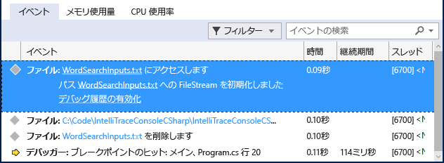

# <a name="view-events-with-intellitrace-in-visual-studio"></a>Visual Studio での IntelliTrace を使用したイベントの表示
IntelliTrace を使用して、特定のイベントまたはイベントのカテゴリに関する情報、またはイベントだけでなく、個々の関数呼び出しに関する情報を収集することができます。 この操作を実行する手順を次に示します。  
  
 IntelliTrace は Visual Studio Enterprise Edition で使用できますが、Professional Edition または Community Edition では使用できません。  
  
##  <a name="GettingStarted"></a> Intellitrace を構成します。  
 IntelliTrace イベントのみでデバッグを実行することができます。 IntelliTrace イベントは、デバッガー イベント、例外、.NET Framework イベント、およびその他のシステム イベントです。 デバッグを開始する前に、IntelliTrace が記録するイベントを制御するために、特定のイベントをオンまたはオフにする必要があります。 詳細については、次を参照してください。 [IntelliTrace 機能](../debugger/intellitrace-features.md)します。  
  
 - ファイル アクセスで IntelliTrace イベントをオンにします。 **[ツール] > [オプション] > [IntelliTrace] > [IntelliTrace イベント]** ページに移動して、**[ファイル]** カテゴリを展開します。 **[ファイル]** イベント カテゴリをチェックします。 これにより、すべてのファイル イベント (アクセス、閉じる、削除) がチェックされます。

## <a name="create-your-app"></a>アプリを作成する
  
1.  C# コンソール アプリケーションを作成します。 Program.cs ファイルで、次の `using` ステートメントを追加します。  
  
    ```csharp  
    using System.IO;  
    ```  
  
2.  Main メソッドで <xref:System.IO.FileStream> を作成し、読み取り、閉じ、ファイルを削除します。 ブレークポイントを設定する場所を確保するだけの別の行を追加します。  
  
    ```csharp  
    static void Main(string[] args)  
    {  
        FileStream fs = File.Create("WordSearchInputs.txt");  
        fs.ReadByte();  
        fs.Close();  
        File.Delete("WordSearchInputs.txt");  
  
        Console.WriteLine("done");  
    }  
    ```  
  
3.  `Console.WriteLine("done");` へのブレークポイントの設定  

## <a name="start-debugging-and-view-intellitrace-events"></a>デバッグを開始し、IntelliTrace イベントを表示
  
1.  通常どおりデバッグを開始します。 (**F5** キーを押すか、**[デバッグ] > [デバッグの開始]** をクリックします。  
  
    > [!TIP]
    >  これらのウィンドウに値を表示および記録するために、デバッグ中は **[ローカル]** ウィンドウおよび **[自動変数]** ウィンドウを開いたままにします。  
  
2.  ブレークポイントで実行が停止します。 **[診断ツール]** ウィンドウが表示されない場合は、**[デバッグ] > [Windows] > [IntelliTrace イベント]** の順にクリックします。  
  
     **[診断ツール]** ウィンドウで、 **[イベント]** タブを見つけます ( **[イベント]**、 **[メモリ使用量]**、および **[CPU 使用率]** の 3 つのタブが表示されます)。 **[イベント]** タブは、デバッガーが実行を中断する直前のイベントで終わる、イベントの時系列の一覧を示しています。 **Access WordSearchInputs.txt**という名前のイベントが表示されます。  
  
     次のスクリーン ショットは Visual Studio 2015 Update 1 のものです。  
  
       
  
3.  イベント選択して詳細を展開します。  
  
     次のスクリーン ショットは Visual Studio 2015 Update 1 のものです。  
  
       
  
     ファイルを開くには、パス名のリンクを選択します。 完全なパス名が使用できない場合、 **[ファイルを開く]** ダイアログ ボックスが表示されます。  
  
     **[デバッグの履歴の有効化]** をクリックします。ここで、デバッガーのコンテキストを、**[呼び出し履歴]**、**[ローカル]**、およびその他の参加しているデバッガーのウィンドウに履歴データを表示しながら、選択したイベントが収集された時刻に設定します。 ソース コードが使用可能な場合、Visual Studio によってポインターがソース ウィンドウ内の対応するコードに移動されるため、そのコードを調査できます。  
  
     次のスクリーン ショットは Visual Studio 2015 Update 1 のものです。  
  
       
  
4.  バグが見つからない場合は、バグが発生するまでの間に発生した他のイベントを確認します。 また、IntelliTrace で呼び出し情報を記録することで、関数呼び出しをステップ実行することもできます。 
  
## <a name="next-steps"></a>次の手順

デバッグ履歴では、いくつかの IntelliTrace の高度な機能を使用できます。

 - スナップショットを表示するを参照してください[IntelliTrace を使用して前のアプリ状態を調べる。](../debugger/view-historical-application-state.md)
 - 変数を検査して、コードを移動する方法については、次を参照してください[デバッグ履歴を使用してアプリを調べる。](../debugger/historical-debugging-inspect-app.md)