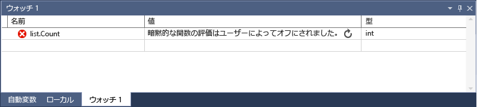

# <a name="set-a-watch-on-variables-using-the-watch-and-quickwatch-windows-in-visual-studio"></a>ウォッチおよび Visual Studio の [クイック ウォッチ] ウィンドウを使用して変数のウォッチを設定します。
デバッグ中に使用すること、**ウォッチ**と **[クイック ウォッチ]** 変数と式をウォッチする windows です。  この 2 つのウィンドウの違いは、 **ウォッチ** ウィンドウでは複数の変数を表示できますが、 **[クイック ウォッチ]** ウィンドウでは一度に 1 つの変数しか表示できないことです。 

ウィンドウはデバッグ セッション中にのみ使用できます。 開くには、**ウォッチ**ウィンドウで、選択**デバッグ > Windows > ウォッチ > ウォッチ (1、2、3、4)**)。 開くには、 **[クイック ウォッチ]** ウィンドウで、いずれかの変数を右クリックして、 **[クイック ウォッチ]** かを選択して**デバッグ > [クイック ウォッチ]** です。
  
## <a name="observing-a-single-variable-with-quickwatch"></a>[クイック ウォッチ] での 1 つの変数の観察  
 **[クイック ウォッチ]** ウィンドウでは、1 つの変数を観察できます。 たとえば、次のようなコードがあるとします。  
  
```csharp
static void Main(string[] args)  
{  
    int a, b;  
    a = 1;  
    b = 2;  
    for (int i = 0; i < 10; i++)  
    {  
        a = a + b;  
    }   
}  
```  
  
 次のように [クイック ウォッチ] ウィンドウで変数を確認することができます。  
  
1.  `a = a + b;` の行にブレークポイントを設定します。  
  
2.  デバッグを開始します。 ブレークポイントで実行が停止します。  
  
3.  開く、 **[クイック ウォッチ]** ウィンドウ (を右クリックして`a`、順に選択 **[クイック ウォッチ]**、または選択`a`とキーを押します**shift + f9**)。

    内の変数を参照する必要があります、**値**ウィンドウで、値は 1 です。

      

    変数を使用して式を評価する場合は、式の追加など、`a + b`を**式**ウィンドウをクリック**再評価**です。 
  
4.  変数の追加、**ウォッチ**からウィンドウ**クイック ウォッチ**  をクリックして**ウォッチ式の追加**です。 

    > [!NOTE]
    > **[クイック ウォッチ]** ウィンドウはモーダル ダイアログ ウィンドウが開いている限り、デバッグを続行することはできません。  
  
5.  **[クイック ウォッチ]** ウィンドウを閉じます。 これで、 **[ウォッチ]** ウィンドウを閉じます。  
  
## <a name="observing-variables-with-the-watch-window"></a>ウォッチ ウィンドウでの複数の変数の観察  
 **ウォッチ** ウィンドウでは、複数の変数を観察できます。 たとえば、次のようなコードがあるとします。  
  
```C++  
int main()
{
    int a, b, c;
    a = 1;
    b = 2;
    c = 0;

    for (int i = 0; i < 10; i++)
    {
        a++;
        b *= 2;
        c = a + b;
    }

    return 0;
}
  
```  
  
 次のように、ウォッチ ウィンドウに 3 つの変数の値を追加します。  
  
1.  `c = a + b;` の行にブレークポイントを設定します。  
  
2.  デバッグを開始します (**F5**)。 ブレークポイントで実行が停止します。  
  
3.  [ウォッチ] ウィンドウを開きます (**デバッグ > Windows > ウォッチ > ウォッチ 1**、または**CTRL + ALT + W、1**)。  
  
4.  最初の行に `a` 変数を追加し、2 番目の行に `b` 変数、3 番目の行に `c` 変数を追加します。

    変数を追加するには、空の行をクリックして、変数名を入力します。
  
5.  デバッグを続行 (キーを押して**F11**デバッガーを進める)。  
  
 `for` ループの反復処理に伴って、表示される変数の値が変わっていくはずです。  
  
 ネイティブ コードでプログラミングしている場合、変数名や変数名を含む式のコンテキストを修飾することが必要になる場合があります。 コンテキストとは、変数が配置される、関数、ソース ファイル、およびモジュールです。 コンテキストを修飾した場合は、コンテキスト演算子の構文を使用することができます。 詳細については、「 [Context Operator (C++)](../debugger/context-operator-cpp.md)」を参照してください。  
  
## <a name="observing-expressions-with-the-watch-window"></a>ウォッチ ウィンドウでの式の観察  
 今すぐ代わりに式を使用してみましょう。 デバッガーによって認識される有効な式であれば、どの式でも追加できます。  
  
 たとえば、前のセクションに記載したコードでは、次のようにして 3 つの値の平均を取得できます。  
  
   
  
 一般に、 **ウォッチ** ウィンドウで式を評価する場合の規則は、コーディング言語で式を評価する場合の規則と同じです。 式に構文エラーがある場合は、コード エディターで表示されるものと同じコンパイラ エラーを受け取るはずです。 次に例を示します。  
  
   
  
##  <a name="bkmk_refreshWatch"></a> 古いウォッチ値の更新  
 特定の状況では、更新アイコン (循環矢印) を参照して可能性がありますで式を評価するときに、**ウォッチ**ウィンドウです。  たとえば、プロパティの評価をオフになっている必要がある場合 (**ツール > オプション > デバッグ > プロパティの評価とその他の暗黙的な関数呼び出しを有効にする**)、次のコードを使用して。  
  
```csharp  
static void Main(string[] args)  
{  
    List<string> list = new List<string>();  
    list.Add("hello");  
    list.Add("goodbye");  
}  
  
```  
  
 このリストの `Count` プロパティにウォッチを設定すると、次のようなものが表示されます。  
  
   
  
 前の図は、エラーまたは古い値を示します。 通常はこのアイコンをクリックして値を更新できますが、状況によっては、値を更新したくない場合があるはずです。 まず、値が評価されなかった理由を知る必要があります。  
  
 このアイコンをポイントすると、式が評価されなかった理由がツールヒントに表示されます。  弧を描く矢印が表示された場合、式が評価されなかった理由は次のいずれかです。  
  
-   式の評価中にエラーが発生しました。 たとえば、タイムアウトが発生した場合や、変数がスコープ外になった場合などです。  
  
-   式には、アプリケーションに副作用を発生させることが、関数の呼び出しが含まれています (を参照してください[副作用と式](#bkmk_sideEffects))。  
  
-   プロパティと、デバッガーによって暗黙的な関数呼び出しの自動評価がオフ (**ツール > オプション > デバッグ > プロパティの評価とその他の暗黙的な関数呼び出しを有効にする**)、式をすることはできませんし、自動的に評価されます。  
  
 値を更新するには、更新アイコンをクリックするか、Space キーを押します。 デバッガーで、式の再評価が試行されます。 更新アイコンが表示されたは、自動プロパティの評価とその他の暗黙的な関数呼び出しがオフになっているため場合、式を評価できます。  
  
 スレッドを表す 2 本の波線を含む円のアイコンが表示された場合、式が評価されなかった理由は、スレッドの間に依存関係があるためです。 つまり、コードを評価するには、アプリケーションの他のスレッドを一時的に実行することが必要になります。 中断モードの場合、通常、アプリケーションのすべてのスレッドは停止されます。 他のスレッドを一時的に実行できるようにすると、プログラムの状態に予測できない影響を及ぼすことがあり、ブレークポイントやスレッドに対する例外のスローなどのイベントがデバッガーで無視される可能性があります。  
  
##  <a name="bkmk_sideEffects"></a> Side Effects and Expressions  
 式を評価すると、変数の値が変わる場合や、プログラムの状態に影響が及ぶ場合があります。 たとえば、次の式を評価すると、 `var1`の値が変わります。  
  
```  
var1 = var2  
```  
  
 このコードが発生することができます、[副作用](https://en.wikipedia.org/wiki/Side_effect_\(computer_science\))です。 副作用によってプログラムの動作方法が変わると、デバッグがさらに困難になります。  
  
 副作用があることがわかっている式は、最初に入力すると、1 回だけ評価されます。 以降の評価は無効になります。 値の横に表示される更新アイコンをクリックして、手動でこの動作をオーバーライドできます。  
  
 関数の自動評価をオフにするのには、すべての副作用を回避する方法の 1 つ (**ツール > オプション > デバッグ > プロパティの評価とその他の暗黙的な関数呼び出しを有効にする**)。  
  
 プロパティの評価または暗黙的な関数呼び出しがオフに設定されている場合でも、 **ac** 書式修飾子を使用して、強制的に評価できます (C# の場合のみ)。 「 [Format Specifiers in C#](../debugger/format-specifiers-in-csharp.md)」を参照してください。  
  
## <a name="bkmk_objectIds"></a> ウォッチ ウィンドウでのオブジェクト ID の使用 (C# および Visual Basic)  

 特定のオブジェクトの動作を確認する場合もあります。 たとえば、その変数がスコープ外になった後にローカル変数で参照するオブジェクトを追跡することができます。 C# と Visual Basic では、参照型の特定のインスタンスのオブジェクト ID を作成し、それらの ID をウォッチ ウィンドウやブレークポイントの条件で使用できます。 オブジェクト ID は、共通言語ランタイム (CLR) のデバッグ サービスで生成されて、オブジェクトに関連付けられます。  
  
> [!NOTE]
>  オブジェクト ID による参照は弱参照であり、これによって、オブジェクトがガベージ コレクションの対象から外れることはありません。 オブジェクト ID は、現在のデバッグ セッションでのみ有効です。  
  
 次のコードで 1 つのメソッドを作成、`Person`新機能を確認する必要が、ローカル変数を使用して、`Person`の名前が別のメソッドには。  
  
```csharp  
class Person  
{  
    public Person(string name)  
    {  
        Name = name;  
    }  
    public string Name { get; set; }  
}  
  
public class Program  
{  
    List<Person> _people = new List<Person>();  
    public static void Main(string[] args)  
    {  
        MakePerson();  
        DoSomething();  
    }  
  
    private static void MakePerson()  
    {  
        var p = new Person("Bob");  
        _people.Add(p);  
    }  
  
    private static void DoSomething()  
    {  
        // more processing  
         Console.WriteLine("done");  
    }  
}  
  
```  
  
 `Person` ウォッチ **ウィンドウでその** オブジェクトへの参照を追加するには、次のようにします。  
  
1.  コードで、オブジェクトが作成されてからしばらく経った時点にブレークポイントを設定します。  
  
2.  デバッグを開始し、ブレークポイントで実行が停止したら、 **[ローカル]** ウィンドウで対象の変数を見つけて右クリックし、 **[オブジェクト ID の作成]** を選択します。  
  
3.  参照する必要があります、 **$** 付いた番号、**ローカル**ウィンドウで、オブジェクト ID を表します。  
  
4.  このオブジェクト ID をウォッチ ウィンドウに追加します。  
  
5.  オブジェクトの動作を確認するブレークポイントを設定します。  上記のコードがで、`DoSomething()`メソッドです。  
  
6.  デバッグを続行します。 `DoSomething()` メソッドで実行が停止すると、 **ウォッチ** ウィンドウに `Person` オブジェクトが表示されます。  
  
> [!NOTE]
>  など、オブジェクトのプロパティを表示する`Person.Name`上記の例では、する必要がありますが有効になっているプロパティの評価します。  
  
## <a name="using-registers-in-the-watch-window-c-only"></a>ウォッチ ウィンドウでのレジスタの使用 (C++ のみ)  
 ネイティブ コードをデバッグする場合は、レジスタ名だけでなくを使用して変数の名前を追加することができます **$\<レジスタ名 >** または **@\<レジスタ名 >**.  詳細については、「 [Pseudovariables](../debugger/pseudovariables.md)」を参照してください。  
  
## <a name="dynamic-view-and-the-watch-window"></a>動的ビューとウォッチ ウィンドウ  
 一部のスクリプト言語 (JavaScript や Python など) を使用して動的または[ダック」と入力](https://en.wikipedia.org/wiki/Duck_typing)、.NET 言語 (バージョン 4.0 以降) ために通常のデバッグ ウィンドウを使用して観察が困難なオブジェクトをサポートして、ランタイム プロパティとメソッドを表示できない場合があります。  
  
 [ウォッチ] ウィンドウが実装する型から作成されたオブジェクトを表示するとき、 [IDynamicMetaObjectProvider インターフェイス](/dotnet/api/system.dynamic.idynamicmetaobjectprovider?view=netframework-4.7)、デバッガーは追加、特殊な**動的ビュー**ノードを **[自動変数]** を表示します。 このノードには動的オブジェクトの動的メンバーが表示されますが、そのメンバーの値を編集することはできません。  
  
 **動的ビュー** の任意の子を右クリックして **[ウォッチ式の追加]** を選択すると、デバッガーはオブジェクトを動的オブジェクトにキャストする新しいウォッチ変数を挿入します。 つまり、 **オブジェクト名** が **((動的) オブジェクト).名前**になります。  
  
 **動的ビュー** のメンバーを評価すると、副作用が発生する場合があります。 副作用の詳細については、「 [Side Effects and Expressions](#bkmk_sideEffects)」を参照してください。 C# の場合、コード行の新しいステップに移行したときに、 **動的ビュー** に表示される値をデバッガーが自動的に再評価することはありません。 Visual Basic の場合、 **動的ビュー** を通じて追加された式は自動的に最新の情報に更新されます。  
  
 動的ビューの値を更新する方法については、「 [古いウォッチ値の更新](#bkmk_refreshWatch)」を参照してください。  
  
 あるオブジェクトに対してのみ **動的ビュー** を表示するには、次のように **dynamic** 書式指定子を使用します。  
  
-   C#: **ObjectName, dynamic**  
  
-   Visual Basic:: **$dynamic, ObjectName**  
  
 **動的ビュー** は、COM オブジェクトのデバッグ機能も強化します。 デバッガーは **System.__ComObject**にラップされた COM オブジェクトを検出すると、そのオブジェクトの **動的ビュー** ノードを追加します。  
  
## <a name="see-also"></a>関連項目  
 [デバッガー ウィンドウ](../debugger/debugger-windows.md)
