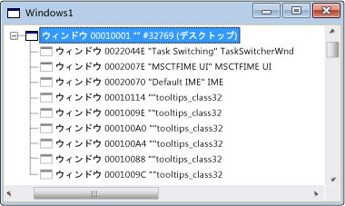

# ウィンドウ ビュー
最初 spy++ を開いたときに Windows のビューには、システム内のすべての windows とコントロールのツリーが表示されます。 ウィンドウ ハンドルとクラス名が表示されます。 現在のデスクトップ ウィンドウでは、ツリーの上部にあります。 その他のすべての windows は、デスクトップの子であるし、標準的なウィンドウの階層構造に従って一覧表示されます。 展開できる一覧にその親の下にインデントに兄弟ウィンドウが表示されます。  
  
 次の図は、最上位ノードの展開で一般的な spy++ ウィンドウ ビューを示します。  
  
   
Spy++ ウィンドウ ビュー  
  
 現在のデスクトップ ウィンドウでは、ツリーの上部にあります。 その他のすべての windows は、デスクトップの子であるし、Z オーダーでウィンドウで、標準ウィンドウ階層に従って一覧表示されます。 展開したりをクリックして、ツリーの任意の親ノードを折りたたむ、+ または - 記号、ノードの横にあります。  
  
 は、ファインダー ツールを使用することができますウィンドウ ビューにフォーカスがあるときに、[ウィンドウ検索 ダイアログ ボックス](../debugger/window-search-dialog-box.md)システムに開いている任意のウィンドウからの情報を表示します。  
  
## このセクションの内容  
 [方法: ファインダー ツールを使用する](../debugger/how-to-use-the-finder-tool.md)  
 このツールがウィンドウのプロパティまたはメッセージをスキャンする方法を示しています。  
  
 [方法: ウィンドウ ビューでウィンドウを検索する](../debugger/how-to-search-for-a-window-in-windows-view.md)  
 Windows の表示で特定のウィンドウを検索する方法について説明します。  
  
 [方法: ウィンドウのプロパティを表示](../debugger/how-to-display-window-properties.md)m  
 [ウィンドウ プロパティ] ダイアログ ボックスを開く手順を紹介します。  
  
## 関連項目  
 [Spy++ ビュー](../debugger/spy-increment-views.md)  
 Windows、メッセージ、プロセス、およびスレッドの spy++ ツリー ビューについて説明します。  
  
 [Spy++ の使用](../debugger/using-spy-increment.md)  
 Spy++ ツールを紹介し、使用方法について説明します。  
  
 [[ウィンドウ検索] ダイアログ ボックス](../debugger/find-window-dialog-box.md)  
 プロパティまたは特定のウィンドウからメッセージを表示するために使用します。  
  
 [[ウィンドウ検索] ダイアログ ボックス](../debugger/window-search-dialog-box.md)  
 Windows の表示で特定のウィンドウのノードを検索するために使用します。  
  
 [[ウィンドウ プロパティ] ダイアログ ボックス](../debugger/window-properties-dialog-box.md)  
 ウィンドウ ビューで選択したウィンドウのプロパティを表示するために使用します。  
  
 [Spy++ リファレンス](../debugger/spy-increment-reference.md)  
 各 spy++ メニューおよびダイアログ ボックスについて説明するセクションが含まれます。