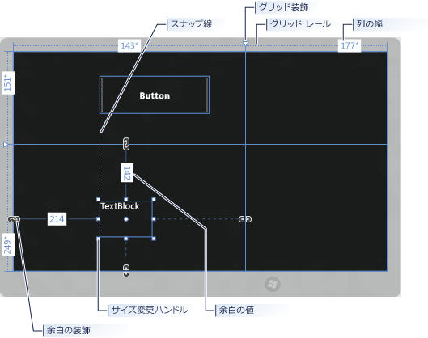
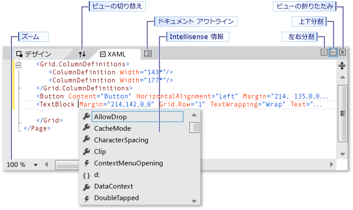
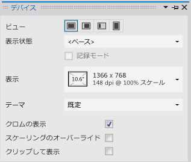

# Visual Studio での XAML デザイナーを使用した UI の作成
Visual Studio の XAML デザイナーは、XAML ベースの Windows および Web アプリをデザインする際に役立つビジュアル インターフェイスを提供します。 アプリのユーザー インターフェイスを作成するには、 **[ツールボックス]** からコントロールをドラッグし、 **[プロパティ]** ウィンドウでプロパティを設定します。 また、XAML ビューで直接、XAML を編集することもできます。

 アニメーションやビヘイビアーなどの高度な XAML デザイン タスクについては、 [Creating a UI by using Blend for Visual Studio](../designers/creating-a-ui-by-using-blend-for-visual-studio.md)を参照してください。 ツールの比較については、「[Visual Studio および Blend for Visual Studio での XAML の設計](../designers/designing-xaml-in-visual-studio.md)」を参照してください。

## XAML デザイナーのワークスペース
 XAML デザイナーのワークスペースは、いくつかのビジュアル インターフェイス要素で構成されています。 たとえば、アートボード、XAML エディター、[デバイス] ウィンドウ、[ドキュメント アウトライン] ウィンドウ、および [プロパティ] ウィンドウなどがあります。 XAML デザイナーを開くには、 **[ソリューション エクスプローラー]** で XAML ファイルを右クリックし、 **[デザイナーの表示]** を選択します。

## オーサリング ビュー
 XAML デザイナーは、アプリでレンダリングされる XAML マークアップの XAML ビューと、それに同期したデザイン ビューを提供します。 XAML ファイルを Visual Studio で開いた場合、デザイン ビューと XAML ビューを切り替えるには、 **[デザイン]** タブと **[XAML]** タブを使用します。 **[ペインの交換]** ボタンを使用すると、上側にアートボードと XAML エディターのどちらを表示するかを切り替えることができます。

 [デザイン] ビューでは、 *アートボード* を含むウィンドウがアクティブ ウィンドウになり、主要な作業画面として使用できます。 要素を追加または描画し、必要に応じて変更することにより、アプリのページを視覚的にデザインできます。 詳細については、「 [Working with elements in XAML Designer](../designers/working-with-elements-in-xaml-designer.md)」を参照してください。 次の図は、デザイン ビューに表示されるアートボードを示しています。

 

 アートボードで使用できる機能は次のとおりです。

 **スナップ ガイドライン** スナップ ガイドラインは、コントロールの端が揃ったとき、またはテキストのベースラインが揃ったときに表示される赤色の破線 (*位置揃えライン* ) です。 位置揃えラインは、 **[スナップ ガイドラインへのスナップ]** が有効に設定されている場合にのみ表示されます。

 **グリッド レール** `Grid` レールを使用して、[グリッド](http://msdn.microsoft.com/library/windows/apps/windows.ui.xaml.controls.grid.aspx) パネルの行と列を管理します。 行と列を作成/削除したり、行と列の相対的な幅と高さを調整したりできます。 アートボードの左側に表示される縦のグリッド レールは行のために使用し、上側に表示される横のグリッド レールは列のために使用します。

 **グリッド ガイド** `Grid` ガイドは、`Grid` レール上に、縦線または横線の付いた三角形として表示されます。 `Grid` ガイドをドラッグすると、マウスの移動に従って、隣接する列または行の幅または高さが更新されます。

 `Grid` ガイドを使用して、 `Grid`の行と列の幅と高さを制御します。 `Grid` レールをクリックすると、新しい列または行を追加できます。 複数の行または列のある `Grid` パネルに新しい行または列を追加すると、レールの外側にミニ ツール バーが表示され、幅と高さを明示的に設定できます。 ミニ ツール バーでは、 `Grid` の行と列のサイズ変更オプションを設定できます。

 **サイズ変更ハンドル** サイズ変更ハンドルは、選択したコントロールに表示され、これを使用してコントロールのサイズを変更できます。 コントロールのサイズを変更するときは、通常、幅と高さの値が表示され、サイズを決める参考にできます。 デザイン ビューのコントロールを操作する方法の詳細については、「 [Working with elements in XAML Designer](../designers/working-with-elements-in-xaml-designer.md)」を参照してください。

 **余白** 余白は、コントロールの端からそれを含むコンテナーの端までの固定された間隔です。 コントロールの余白は、[プロパティ] ウィンドウの [[レイアウト]](http://msdn.microsoft.com/library/windows/apps/windows.ui.xaml.frameworkelement.margin.aspx) の下にある **Margin** プロパティで設定できます。

 **余白ガイド** 余白ガイドを使用すると、レイアウト コンテナーを基準として要素の余白を変更できます。 余白ガイドが開いている場合は、余白が設定されておらず、余白ガイドには切れたチェーンが表示されます。 余白が設定されていないと、実行時にレイアウト コンテナーのサイズを変更した場合に、要素の位置が変わりません。 余白ガイドが閉じている場合、余白ガイドには切れていないチェーンが表示され、実行時にレイアウト コンテナーのサイズを変更すると、要素が余白と共に移動します (余白は固定されたまま)。

 **要素ハンドル** 要素ハンドルを使用すると、要素を変更できます。要素ハンドルは、アートボードで要素を囲む青いボックスの角にマウス ポインターを置くと表示されます。 このハンドルを使用すると、要素を回転、サイズ変更、反転、移動したり、角を丸めたりできます。 要素ハンドルのシンボルは機能に応じてさまざまで、ポインターの正確な場所に応じて変化します。 要素ハンドルが表示されない場合は、要素が選択されていることを確認してください。

 デザイン ビューでは、画面の左下に次のように表示される追加のアートボード コマンドを使用できます。

 

 このツール バーでは、次のコマンドを使用できます。

 **ズーム** ズームでは、デザイン画面のサイズを変更できます。 12.5% ～ 800% の範囲でズームしたり、 **[選択範囲をズーム]** や **[すべてを合わせる]** などのオプションを選択したりできます。

 **スナップ グリッドの表示/スナップ グリッドを隠す** グリッド線を示すスナップ グリッドを表示したり、非表示にしたりします。 グリッド線は、 **[グリッド線へのスナップ]** または **[スナップ ガイドラインへのスナップ]** のいずれかが有効な場合に使用されます。

 **グリッド線へのスナップをオン/オフにする** **[グリッド線へのスナップ]** が有効になっている場合、アートボードで要素をドラッグすると、要素は、最も近い位置にある縦または横のグリッド線に整列されます。

 **スナップ ガイドラインへのスナップをオン/オフにする** スナップ ガイドラインは、複数のコントロールを相互の位置に合わせて整列するために役立ちます。 **[スナップ ガイドラインへのスナップ]** が有効になっている場合、1 つのコントロールを他のコントロールを基準にしてドラッグしているときに、他のコントロールの端やテキストに垂直または水平位置が揃うと位置揃えラインが表示されます。 位置揃えライン (スナップ ガイドライン) は赤色の破線として表示されます。

 XAML ビューでは、XAML エディターが含まれているウィンドウがアクティブ ウィンドウであり、XAML エディターが主要な編集ツールです。 Extensible Application Markup Language (XAML) は、アプリケーションのユーザー インターフェイスを指定するための、XML をベースにした宣言型のボキャブラリを提供します。 XAML ビューには、IntelliSense、オート フォーマット、構文の強調表示、およびタグ ナビゲーションが含まれています。 次の図は、XAML ビューを示しています。

 

 **分割ビュー バー** 分割ビュー バーは、XAML エディターが下側のウィンドウにある場合に、XAML ビューの上部に表示されます。 分割ビュー バーを使用すると、デザイン ビューと XAML ビューの相対サイズを調節できます。 また、ビューの位置を交換したり ( **[ペインの交換]** ボタンを使用)、ビューの左右分割または上下分割を切り替えたり、どちらかのビューを折りたたんだりできます。

 **マークアップのズーム** マークアップのズームを使用すると、XAML ビューのサイズを変更できます。 20% ～ 400% の範囲でズームできます。

## デバイス ウィンドウ
 XAML デザイナーの [デバイス] ウィンドウを使用すると、デザイン時にプロジェクトのさまざまなビュー、表示、および表示オプションをシミュレートできます。 [デバイス] ウィンドウは、XAML デザイナーを使用しているときに **[デザイン]** メニューから使用できます。 次のように表示されます。

 

 [デバイス] ウィンドウで使用可能なオプションは、次のとおりです。

 **表示** アプリの異なる画面サイズと解像度を指定します。

 **向き** アプリの向きを **[横]** または **[縦]** に指定します。

 **エッジ** アプリの端の位置揃えを **[両方]**、**[左]**、**[右]**、または **[なし]** に指定します。

 **ハイコントラスト** 選択したコントラスト設定に基づいてアプリをプレビューします。 **[既定]** 以外の値を設定すると、App.xaml 内に設定された `RequestedTheme` プロパティではなく、こちらの設定値が使用されます。

 **スケーリングのオーバーライド** デザイン画面内でのドキュメント スケーリングのエミュレーションをオンまたはオフに切り替えます。 スケーリング パーセントを 1 の倍数で上げることができます。 エミュレーションをオンにするには、このチェック ボックスをオンにします。 たとえば、スケーリング パーセントが 100% の場合、デザイン画面内のドキュメントは 140% までスケールアップします。 現在のスケーリング パーセントが 180 の場合、このオプションは無効になります。

 **最小の幅** 最小幅の設定を指定します。 最小幅は App.xaml で変更できます。

 **テーマ** アプリのテーマを指定します。 たとえば、[Dark] テーマと [Light] テーマを切り替えることができます。

 **クロムの表示** デザイン ビューでアプリの周囲にタブレットのフレームをシミュレート表示するかどうかを切り替えます。 フレームを表示するには、チェック ボックスをオンにします。

 **クリップして表示** 表示モードを指定します。 ドキュメントのサイズを表示サイズに合わせてクリップするには、チェック ボックスをオンにします。

## [ドキュメント アウトライン] ウィンドウ
 XAML デザイナーの [ドキュメント アウトライン] ウィンドウでは、次のタスクを実行できます。

-   アートボード上のすべての要素の階層構造を表示する。

-   要素を選択して変更する (たとえば、階層構造内の別の場所に移動したり、アートボード上で変更したり、[プロパティ] ウィンドウでプロパティを設定したりする)。 詳細については、「 [Working with elements in XAML Designer](../designers/working-with-elements-in-xaml-designer.md)」を参照してください。

-   コントロールである要素のテンプレートを作成および変更する。

-   選択した要素のコンテキスト メニューを使用する。 アートボードで選択した要素に対しても、同じメニューを使用できます。

 [ドキュメント アウトライン] ウィンドウを表示するには、メニュー バーで **[表示]**、 **[その他のウィンドウ]**、 **[ドキュメント アウトライン]** の順に選択します。

 ![[ドキュメント アウトライン] ウィンドウ](../designers/media/xaml_editor_doc_outline.png)

 [ドキュメント アウトライン] ウィンドウで使用可能なオプションは、次のとおりです。

 **ドキュメント アウトライン** [ドキュメント アウトライン] ウィンドウのメイン ビューには、ドキュメントの階層がツリー構造で表示されます。 ドキュメント アウトラインの階層状の特性を利用して、さまざまな詳細レベルでドキュメントを調査し、要素を 1 つずつ、またはまとめてロックしたり非表示にしたりできます。

 **表示/非表示** ドキュメント アウトラインにある項目に対応するアートボード要素を表示または非表示にします。 **[表示/非表示]** ボタン (要素を表示している状態では目のシンボルとして表示される) を使用するか、Ctrl + H キーを押して要素を非表示にするか、Shift + Ctrl + H キーを押して表示します。

 **ロック/ロック解除** ドキュメント アウトラインにある項目に対応するアートボード要素をロックまたはロック解除します。 ロックされている要素は変更できません。 **[ロック/ロック解除]** ボタン (要素がロックされている状態では南京錠のシンボルとして表示される) を使用するか、Ctrl + L キーを押して要素をロックするか、Shift + Ctrl + L キーを押してロック解除します。

 **スコープを pageRoot に戻す** [ドキュメント アウトライン] ウィンドウの上部にあるオプションで、上向き矢印のシンボルが表示されます。ドキュメント アウトラインを前のスコープに戻します。 スタイルまたはテンプレートのスコープにある場合にのみ使用できます。

## [プロパティ] ウィンドウ
 [プロパティ] ウィンドウでは、コントロールのプロパティの値を設定できます。 次のように表示されます。

 ![[プロパティ] ウィンドウ](../designers/media/xaml_editor_prop_window.png)

 [プロパティ] ウィンドウの上部にはさまざまなオプションがあります。 現在選択されている要素の名前を変更するには、 **[名前]** ボックスを使用します。 左上にあるアイコンは、現在選択されている要素を表します。 プロパティをカテゴリ別またはアルファベット順に並べ替えるには、 **[並べ替え]** の一覧で **[カテゴリ]**、 **[名前]** 、または **[ソース]** をクリックします。 コントロールのイベントの一覧を表示するには、 **[イベント]** ボタン (稲妻のシンボルが表示されている) をクリックします。 プロパティを検索するには、 **[検索プロパティ]** ボックスにプロパティの名前を入力し始めます。 入力した文字列に一致するプロパティが [プロパティ] ウィンドウに表示されます。 一部のプロパティでは、下矢印ボタンを選択して、詳細プロパティを設定することができます。 プロパティの使用とイベントの処理の詳細ついては、「 [クイック スタート: コントロールの追加とイベントの処理](http://go.microsoft.com/fwlink/?LinkID=247983)」を参照してください。

 各プロパティの値の右側には、 *プロパティ マーカー* がボックスのシンボルとして表示されます。 プロパティ マーカーの外観は、プロパティに適用されるデータ バインドやリソースの有無を示します。 たとえば、白色のボックス シンボルは既定値を示します。黒色のボックス シンボルは、通常、ローカル リソースが適用されていることを示します。オレンジ色のボックスは、通常、データ バインドが適用されていることを示します。 プロパティ マーカーをクリックすると、スタイルの定義に移動したり、データ バインディング ビルダーを開いたり、リソース ピッカーを開いたりできます。

## 関連項目

- [XAML デザイナーでの要素の操作](../designers/working-with-elements-in-xaml-designer.md)
- [リソースを作成して適用する方法](../designers/how-to-create-and-apply-a-resource.md)
- [チュートリアル: XAML デザイナーでデータにバインドする](../designers/walkthrough-binding-to-data-in-xaml-designer.md)