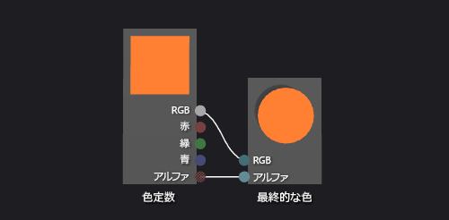

# 方法: 基本カラー シェーダーを作成する
[!INCLUDE[vs2017banner](../code-quality/includes/vs2017banner.md)]

このドキュメントでは、シェーダー デザイナーおよび Directed Graph Shader Language \(DGSL\) を使用して単色のシェーダーを作成する方法を説明します。  このシェーダーは、最終的な色を定数 RGB カラー値に設定します。  
  
 このドキュメントでは、以下のアクティビティについて説明します。  
  
-   グラフからのノードの削除  
  
-   グラフへのノードの追加  
  
-   ノード プロパティの設定  
  
-   ノードの接続  
  
## 単色のシェーダーの作成  
 RGB カラー定数のカラー値を最終的な出力カラーに書き込み、単色のシェーダーを実装できます。  
  
 開始する前に、**プロパティ** ウィンドウと**ツールボックス**が表示されていることを確認します。  
  
#### 単色のシェーダーを作成するには  
  
1.  操作する DGSL シェーダーを作成します。  プロジェクトに DGSL シェーダーを追加する方法については、「[シェーダー デザイナー](../designers/shader-designer.md)」の「作業の開始」を参照してください。  
  
2.  **\[ポイントの色\]** ノードを削除します。  **\[選択\]** ツールを使用して **\[ポイントの色\]** ノードを選択し、メニュー バーで **\[編集\]**、**\[削除\]** を使用します。  
  
3.  グラフに **\[色定数\]** ノードを追加します。  **ツールボックス**の **\[定数\]** で **\[色定数\]** をクリックし、デザイン サーフェイスに移動します。  
  
4.  **\[色定数\]** ノードのカラー値を指定します。  **\[選択\]** ツールを使用して **\[色定数\]** ノードを選択し、**\[プロパティ\]** ウィンドウの **\[出力\]** プロパティでカラー値を指定します。  オレンジの場合は、\(1.0、0.5、0.2、1.0\) の値を指定します。  
  
5.  最終的な色に色定数を接続します。  接続を作成するには、**\[色定数\]** ノードの **\[RGB\]** ターミナルを **\[最終的な色\]** ノードの **\[RGB\]** ターミナルに移動し、**\[色定数\]** ノードの **\[アルファ\]** ターミナルを **\[最終的な色\]** ノードの **\[アルファ\]** ターミナルに移動します。  この接続は、前の手順で定義した色定数に最終的な色を設定します。  
  
 次の図は、完了したシェーダー グラフと直方体に適用されるシェーダーのプレビューを示します。  
  
> [!NOTE]
>  この図では、シェーダーの効果をわかりやすく示すために、オレンジ色が指定されました。  
  
   
  
 特定の図形を使用すると、シェーダーをより適切にプレビューできる可能性があります。  シェーダー デザイナーでシェーダーをプレビューする方法の詳細については、「[シェーダー デザイナー](../designers/shader-designer.md)」を参照してください。  
  
## 参照  
 [方法: シェーダーを 3\-D モデルに適用する](../designers/how-to-apply-a-shader-to-a-3-d-model.md)   
 [方法: シェーダーをエクスポートする](../designers/how-to-export-a-shader.md)   
 [シェーダー デザイナー](../designers/shader-designer.md)   
 [シェーダー デザイナー ノード](../designers/shader-designer-nodes.md)