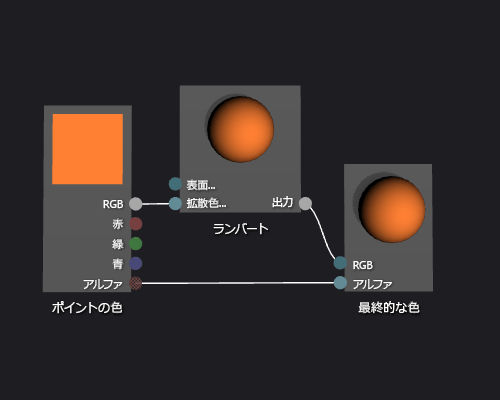

# 方法: 基本ランバート シェーダーを作成する
[!INCLUDE[vs2017banner](../code-quality/includes/vs2017banner.md)]

このドキュメントでは、シェーダー デザイナーおよび Directed Graph Shader Language \(DGSL\) を使用して、クラシックなランバート光源モデルを実装する光源シェーダーを作成する方法を説明します。  
  
 このドキュメントでは、以下のアクティビティについて説明します。  
  
-   シェーダー グラフにノードを追加する  
  
-   ノードをクリッピング  
  
-   ノードの接続  
  
## ランバート光源モデル  
 ランバート光源モデルは、アンビエントおよび指向性ライトを組み込み、3\-D シーン内のオブジェクトを灰色表示します。  アンビエント コンポーネントは、3\-D シーンの基本レベルの照明を提供します。  指向性コンポーネントは方向 \(遠くの\) 光源から追加の照明を提供します。  アンビエント照明は方向に関係なく、シーン内のすべてのサーフェイスに、均等に影響します。  特定のサーフェイスの場合、サーフェイスのアンビエント色、シーン内の環境光の色や輝度によって生成されます。  シーン内の各サーフェイスに指向性ライトが与える影響は、サーフェイスの向きと光源の方向との関係により異なります。  これは、サーフェイスの拡散色および向きと、光源の色、輝度、方向によって生成されます。  直接光源に向いているサーフェイスは、最大の効果を受け、光源に向いていないサーフェイスは効果をまったく受けません。  ランバート光源モデルで全体を決定するために、アンビエント コンポーネントと一つ以上の指向性コンポーネントは、拡散、オブジェクト上の各ポイントの色の効果を結合されます。  
  
 開始する前に、**プロパティ** ウィンドウと**ツールボックス**が表示されていることを確認します。  
  
#### ランバート シェーダーを作成するには  
  
1.  操作する DGSL シェーダーを作成します。  プロジェクトに DGSL シェーダーを追加する方法については、「[シェーダー デザイナー](../designers/shader-designer.md)」の「作業の開始」を参照してください。  
  
2.  **\[最終的な色\]** ノードから **\[ポイントの色\]** ノードを接続解除します。  **\[ポイントの色\]** ノードの **\[RGB\]** ターミナルを選択し、**\[リンクの解除\]** をクリックします。  **\[Alpha\]** ターミナルを接続する残すことができます。  
  
3.  グラフに **\[ランバート\]** ノードを追加します。  **ツールボックス**の **\[ユーティリティ\]** で **\[ランバート\]** をクリックし、デザイン サーフェイスに移動します。  ランバート ノードはアンビエント、拡散光パラメーターに基づいて全体を拡散するピクセルの色の効果を計算します。  
  
4.  **\[ランバート\]** ノードに **\[ポイントの色\]** ノードを接続します。  **\[選択\]** モードでは、**\[ランバート\]** ノードの **\[拡散色\]** ターミナルに **\[ポイントの色\]** ノードの **\[RGB\]** ターミナルに移動します。  この接続は、ピクセルの補間拡散色をランバート ノードを示します。  
  
5.  計算済みの色の値を最終的な色に接続します。  **\[最終的な色\]** ノードの **\[RGB\]** ターミナルに **\[ランバート\]** ノードの **\[出力\]** ターミナルに移動します。  
  
 次の図は、完成したシェーダー グラフとティーポット モデルに適用されるシェーダーのプレビューを示しています。  
  
> [!NOTE]
>  さらに、この図では、シェーダーの効果を示すために、オレンジ色がシェーダー **\[MaterialDiffuse\]** パラメーターを使用して指定されています。  ゲームまたはアプリケーションは各オブジェクトに一意のカラー値を指定するには、このパラメーターを使用できます。  素材のパラメーターの詳細については、[シェーダー デザイナー](../designers/shader-designer.md)シェーダーのプレビューのセクションを参照してください。  
  
   
  
 特定の図形を使用すると、シェーダーをより適切にプレビューできる可能性があります。  この方法の詳細についてはシェーダー デザイナーでシェーダーをプレビューする [シェーダー デザイナー](../designers/shader-designer.md)シェーダーのプレビュー セクションを参照します。  
  
 次の図は、このドキュメントで説明したシェーダーを 3\-D モデルに適用したものです。  
  
   
  
 3\-D モデルにシェーダーを適用する方法の詳細については、「[方法: シェーダーを 3\-D モデルに適用する](../designers/how-to-apply-a-shader-to-a-3-d-model.md)」を参照してください。  
  
## 参照  
 [方法: シェーダーを 3\-D モデルに適用する](../designers/how-to-apply-a-shader-to-a-3-d-model.md)   
 [方法: シェーダーをエクスポートする](../designers/how-to-export-a-shader.md)   
 [方法: 基本フォン シェーダーを作成する](../designers/how-to-create-a-basic-phong-shader.md)   
 [シェーダー デザイナー](../designers/shader-designer.md)   
 [シェーダー デザイナー ノード](../designers/shader-designer-nodes.md)