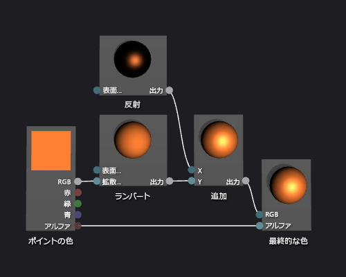

# 方法: 基本フォン シェーダーを作成する
[!INCLUDE[vs2017banner](../code-quality/includes/vs2017banner.md)]

このドキュメントでは、シェーダー デザイナーおよび Directed Graph Shader Language \(DGSL\) を使用して、クラシックなフォン光源モデルを実装する光源シェーダーを作成する方法を説明します。  
  
 このドキュメントでは、以下のアクティビティについて説明します。  
  
-   シェーダー グラフにノードを追加する  
  
-   ノードをクリッピング  
  
-   ノードの接続  
  
## フォン光源モデル  
 フォン光源モデルは、サーフェイスの反射特性をシミュレートするスペキュラ ハイライトを追加することによって、ランバート光源モデルを拡張したものです。  反射コンポーネントは、ランバート光源モデルで使用されますが、最終的な色に対する効果は異なる方法で処理されます。同じ指向性光源から追加の照明を提供します。  スペキュラ ハイライトはビューの向き、光源の方向、およびサーフェイスの向きの間の関係に基づいて、シーン内の各サーフェイスに、異なる方法に影響します。  これは、光源のサーフェイスの反射色、反射の度合い、方向、および色、輝度、方向によって生成されます。  ビューアーに直接光源を反射するサーフェイスは、ビューアーから光源を反射するサーフェイスと最大反射効果を受け。  フォン光源モデルでは、オブジェクト上の各ポイントのスペキュラ ハイライトの色と強度を決定するために、一つ以上の反射要素を結合し、ランバート光源モデルの結果にピクセルの最終的な色を生成するために追加されます。  
  
 ランバート光源モデルの詳細については、「[方法: 基本ランバート シェーダーを作成する](../designers/how-to-create-a-basic-lambert-shader.md)」を参照してください。  
  
 開始する前に、**プロパティ** ウィンドウと**ツールボックス**が表示されていることを確認します。  
  
#### フォン シェーダーを作成するには  
  
1.  [方法: 基本ランバート シェーダーを作成する](../designers/how-to-create-a-basic-lambert-shader.md)の説明に従って、ランバート シェーダーを作成します。  
  
2.  **\[最終的な色\]** ノードから **\[ランバート\]** ノードを接続解除します。  **\[ランバート\]** ノードの **\[RGB\]** ターミナルを選択し、**\[リンクの解除\]** をクリックします。  これにより、次の手順で追加するノードのための領域を確保できます。  
  
3.  グラフに **\[追加\]** ノードを追加します。  **\[ツールボックス\]** で、**\[数学\]** で、それをデザイン サーフェイスに **\[追加\]** を選択します移動します。  
  
4.  グラフに **\[反射\]** ノードを追加します。  **ツールボックス**の **\[ユーティリティ\]** で **\[反射\]** を選択し、デザイン サーフェイスに移動します。  
  
5.  反射効果を追加します。  **\[反射\]** ノードの **\[出力\]** ターミナルを **\[追加\]** ノードの **\[X\]** ターミナルに移動し、**\[追加\]** ノードの **\[Y\]** ターミナルに **\[ランバート\]** ノードの **\[出力\]** ターミナルに移動します。  これらの接続は、ピクセルの合計と拡散反射色の効果を結合します。  
  
6.  計算済みの色の値を最終的な色に接続します。  **\[最終的な色\]** ノードの **\[RGB\]** ターミナルに **\[追加\]** ノードの **\[出力\]** ターミナルに移動します。  
  
 次の図は、完成したシェーダー グラフとティーポット モデルに適用されるシェーダーのプレビューを示しています。  
  
> [!NOTE]
>  さらに、この図では、シェーダーの効果を示すために、オレンジ色がシェーダー **\[MaterialDiffuse\]** パラメーターを使用して指定され、金属表示は完了 **\[MaterialSpecular\]** と **\[MaterialSpecularPower\]** パラメーターを使用して指定されています。  素材のパラメーターの詳細については、[シェーダー デザイナー](../designers/shader-designer.md)シェーダーのプレビューのセクションを参照してください。  
  
   
  
 特定の図形を使用すると、シェーダーをより適切にプレビューできる可能性があります。  この方法の詳細についてはシェーダー デザイナーでシェーダーをプレビューする [シェーダー デザイナー](../designers/shader-designer.md)シェーダーのプレビュー セクションを参照します  
  
 次の図は、このドキュメントで説明したシェーダーを 3\-D モデルに適用したものです。  **\[MaterialSpecular\]** のプロパティは \(1.00、0.50、0.20、0.00\) に設定され、**\[MaterialSpecularPower\]** のプロパティは 16 に設定されます。  
  
> [!NOTE]
>  **\[素材: 鏡面\]** プロパティは、サーフェイス素材の外観上の仕上がりを決定します。  ガラスやプラスチックなどの高光沢サーフェイスの反射色は、明るいシェードの白になる傾向があります。  金属製のサーフェイスの反射色は、拡散色に近くなる傾向があります。  サテン仕上げサーフェイスの反射色は、暗いシェードの灰色になる傾向があります。  
>   
>  **\[素材: 反射の度合い\]** プロパティは、スペキュラ ハイライトの強度を決定します。  高反射の度合いは、鈍い、より多くのローカライズされた強調表示をシミュレートします。  きわめて低い反射の度合いは oversaturate および面全体の色が非表示になり、清掃の枠をシミュレートします。  
  
   
  
 3\-D モデルにシェーダーを適用する方法の詳細については、「[方法: シェーダーを 3\-D モデルに適用する](../designers/how-to-apply-a-shader-to-a-3-d-model.md)」を参照してください。  
  
## 参照  
 [方法: シェーダーを 3\-D モデルに適用する](../designers/how-to-apply-a-shader-to-a-3-d-model.md)   
 [方法: シェーダーをエクスポートする](../designers/how-to-export-a-shader.md)   
 [方法: 基本ランバート シェーダーを作成する](../designers/how-to-create-a-basic-lambert-shader.md)   
 [シェーダー デザイナー](../designers/shader-designer.md)   
 [シェーダー デザイナー ノード](../designers/shader-designer-nodes.md)