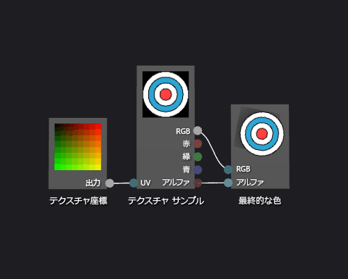

# 方法: 基本テクスチャ シェーダーを作成する
[!INCLUDE[vs2017banner](../code-quality/includes/vs2017banner.md)]

このドキュメントでは、シェーダー デザイナーおよび Directed Graph Shader Language \(DGSL\) を使用して単一テクスチャ シェーダーを作成する方法を説明します。  このシェーダーは、テクスチャからサンプリングされる RGB およびアルファ値に直接最終的な色を設定します。  
  
 このドキュメントでは、以下のアクティビティについて説明します。  
  
-   シェーダー グラフからノードを削除します。  
  
-   グラフへのノードの追加  
  
-   設定のシェーダーのパラメーター  
  
-   設定の表示  
  
-   ノードの接続  
  
## 基本的なテクスチャ シェーダーの作成  
 テクスチャ サンプルのカラー値とアルファ値を直接最終的な出力色に記述することで、基本的な単一テクスチャ シェーダーを実装できます。  
  
 開始する前に、**プロパティ** ウィンドウと**ツールボックス**が表示されていることを確認します。  
  
#### 基本的なテクスチャ シェーダーを作成するには  
  
1.  操作する DGSL シェーダーを作成します。  プロジェクトに DGSL シェーダーを追加する方法については、「[シェーダー デザイナー](../designers/shader-designer.md)」の「作業の開始」を参照してください。  
  
2.  **\[ポイントの色\]** ノードを削除します。  **\[選択\]** モードで **\[ポイントの色\]** ノードを選択し、メニュー バーで **\[編集\]**、**\[削除\]** を使用します。  これにより、次の手順で追加するノードのための領域を確保できます。  
  
3.  グラフに **\[テクスチャ サンプル\]** ノードを追加します。  **ツールボックス**の **\[テクスチャ\]** で **\[テクスチャ サンプル\]** を選択し、デザイン サーフェイスに移動します。  
  
4.  グラフに **\[テクスチャ座標\]** ノードを追加します。  **ツールボックス**の **\[テクスチャ\]** で **\[テクスチャ座標\]** を選択し、デザイン サーフェイスに移動します。  
  
5.  適用するテクスチャをクリックします。  次に **\[選択\]** モードでは、**\[プロパティ\]** ウィンドウの **\[テクスチャ サンプル\]** ノードを、指定し、**\[Filename\]** のプロパティで使用するテクスチャを選択します。  
  
6.  パブリック アクセスができるようにテクスチャを設定します。  次に **\[プロパティ\]** ウィンドウの **\[テクスチャ サンプル\]** ノードを選択し、設定します **\[パブリック\]** に **\[アクセス\]** のプロパティをクリックします。  これで**モデル エディター**などの別のツールからのテクスチャを設定できます。  
  
7.  テクスチャ座標をテクスチャ サンプルに接続します。  **\[選択\]** モードで、**\[テクスチャ座標\]** ノードの **\[出力\]** ターミナルを **\[テクスチャ サンプル\]** ノードの **\[UV\]** ターミナルに移動します。  この接続は、指定された座標でテクスチャをサンプリングします。  
  
8.  テクスチャ サンプルを最終的な色に接続します。  **\[テクスチャ サンプル\]** ノードの **\[RGB\]** ターミナルを **\[最終的な色\]** ノードの **\[RGB\]** ターミナルに移動し、**\[最終的な色\]** ノードの **\[Alpha\]** ターミナルに **\[テクスチャ サンプル\]** ノードの **\[Alpha\]** ターミナルに移動します。  
  
 次の図は、完了したシェーダー グラフと直方体に適用されるシェーダーのプレビューを示します。  
  
> [!NOTE]
>  この図では、平面は、シェーダーの効果をわかりやすく示すために、プレビュー図形とテクスチャが指定されたためです。  
  
   
  
 特定の図形を使用すると、シェーダーをより適切にプレビューできる可能性があります。  シェーダー デザイナーでシェーダーをプレビューする方法の詳細については、「[シェーダー デザイナー](../designers/shader-designer.md)」を参照してください。  
  
## 参照  
 [方法: シェーダーを 3\-D モデルに適用する](../designers/how-to-apply-a-shader-to-a-3-d-model.md)   
 [イメージ エディター](../designers/image-editor.md)   
 [シェーダー デザイナー](../designers/shader-designer.md)   
 [シェーダー デザイナー ノード](../designers/shader-designer-nodes.md)