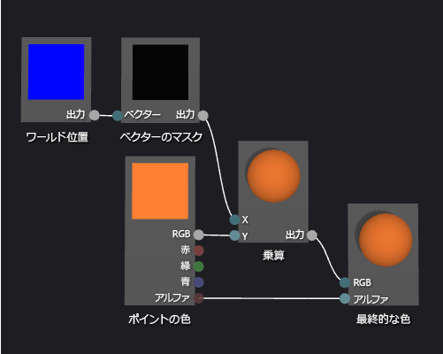

# 方法: ジオメトリベースのグラデーション シェーダーを作成する
このドキュメントでは、シェーダー デザイナーと Directed Graph Shader Language を使用してジオメトリベースのグラデーション シェーダーを作成する方法を説明します。 このシェーダーは、ワールド空間におけるオブジェクトの各ポイントの高さによって、定数の RGB 色の値をスケーリングします。  
  
 このドキュメントでは、以下のアクティビティについて説明します。  
  
-   シェーダー グラフへのノードの追加  
  
-   ノードのプロパティの設定  
  
-   ノードの接続の解除  
  
-   ノードの接続  
  
## ジオメトリベースのグラデーション シェーダーの作成  
 シェーダーにピクセルの位置を組み込むことによって、ジオメトリ ベースのシェーダーを実装できます。 シェーディング言語では、ピクセルには単なるカラーと 2-D 画面の場所より詳しい情報が含まれています。 ピクセルとは、システムによっては*フラグメント*とも呼ばれ、ピクセルに対応するサーフェイスを表す値のコレクションのことです。 このドキュメントで説明するシェーダーは、ワールド空間内の 3-D オブジェクトの各ピクセルの高さを使用して、フラグメントの最終的な出力の色に影響を及ぼします。  
  
 開始する前に、**[プロパティ]** ウィンドウと**ツールボックス**が表示されていることを確認します。  
  
#### ジオメトリベースのグラデーション シェーダーを作成するには  
  
1.  操作する DGSL シェーダーを作成します。 プロジェクトに DGSL シェーダーを追加する方法については、「[シェーダー デザイナー](../designers/shader-designer.md)」の「作業の開始」を参照してください。  
  
2.  **[最終的な色]** ノードから **[ポイントの色]** ノードを接続解除します。 **[ポイントの色]** ノードの **[RGB]** ターミナルを選択し、**[リンクの解除]** を選択します。 これにより、次の手順で追加するノードのための領域を確保できます。  
  
3.  グラフに **[乗算記号]** ノードを追加します。 **ツールボックス**の **[数式]** で **[乗算記号]** を選択し、デザイン サーフェイスに移動します。  
  
4.  グラフに **[ベクターのマスク]** ノードを追加します。 **ツールボックス**の **[ユーティリティ]** で **[ベクターのマスク]** を選択し、デザイン サーフェイスに移動します。  
  
5.  **[ベクターのマスク]** ノードのマスク値を指定します。 **[選択]** モードで **[ベクターのマスク]** ノードを選択し、**[プロパティ]** ウィンドウで **[Green / Y]** プロパティを **[True]** に設定し、**[Red / X]**、**[Blue / Z]**、**[Alpha / W]** プロパティを **[False]** に設定します。 この例では、**[Red / X]**、**[Green / Y]**、**[Blue / Z]** プロパティは **[ワールド位置]** ノードの x、y、z コンポーネントに対応し、**[Alpha / W]** は使用されません。 マスク後 **[Green / Y]** のみ **[True]** に設定されるため、入力のベクターの y コンポーネントだけが残ります。  
  
6.  グラフに **[ワールド位置]** ノードを追加します。  **ツールボックス**の **[定数]** で **[ワールド位置]** を選択し、デザイン サーフェイスに移動します。  
  
7.  フラグメントのワールド空間の位置をマスクします。 **[選択]** モードで、**[ワールド位置]** ノードの **[出力]** ターミナルを **[ベクターのマスク]** ノードの **[ベクター]** ターミナルに移動します。 この接続は、フラグメントの位置をマスクして x コンポーネントと z コンポーネントを無視します。  
  
8.  マスクされたワールド空間の位置で RGB 色の定数を乗算します。 **[ポイントの色]** ノードの **[RGB]** ターミナルを **[乗算記号]** ノードの **[Y]** ターミナルに移動し、**[ベクターのマスク]** ノードの **[出力]** ターミナルを **[乗算記号]** ノードの **[X]** ターミナルに移動します。 この接続は、ワールド空間のピクセルの高さによって色の値をスケーリングします。  
  
9. スケーリングされた色の値を最終的な色に接続します。 **[乗算記号]** ノードの **[出力]** ターミナルを **[最終的な色]** ノードの **[RGB]** ターミナルに移動します。  
  
 次の図は、完成したシェーダー グラフと、球に適用されるシェーダーのプレビューを示します。  
  
> [!NOTE]
>  この図では、シェーダーの効果をわかりやすく示すためにオレンジ色が指定されていますが、ワールド空間にプレビュー図形の位置がないため、シェーダー デザイナーでシェーダーを完全にプレビューすることができません。 完全な効果を確認するには、シェーダーを実際のシーンでプレビューする必要があります。  
  
   
  
 シェーダーによっては、特定の図形を使用すると、より適切にプレビューできる可能性があります。 シェーダー デザイナーでシェーダーをプレビューする方法については、「[シェーダー デザイナー](../designers/shader-designer.md)」の「**シェーダーのプレビュー**」を参照してください。  
  
 次の図は、このドキュメントで説明したシェーダーを「[方法: 3-D 地形をモデル化する](../designers/how-to-model-3-d-terrain.md)」に示した 3-D シーンに適用したものです。 ここでは、色の輝度とワールド空間のポイントの高さが共に増加しています。  
  
   
  
 3-D モデルにシェーダーを適用する方法の詳細については、「[方法: シェーダーを 3-D モデルに適用する](../designers/how-to-apply-a-shader-to-a-3-d-model.md)」を参照してください。  
  
## 参照  
 [方法: シェーダーを 3-D モデルに適用する](../designers/how-to-apply-a-shader-to-a-3-d-model.md)   
 [方法: シェーダーをエクスポートする](../designers/how-to-export-a-shader.md)   
 [方法: 3-D 地形をモデル化する](../designers/how-to-model-3-d-terrain.md)   
 [方法: グレースケール テクスチャ シェーダーを作成する](../designers/how-to-create-a-grayscale-texture-shader.md)   
 [シェーダー デザイナー](../designers/shader-designer.md)   
 [シェーダー デザイナー ノード](../designers/shader-designer-nodes.md)