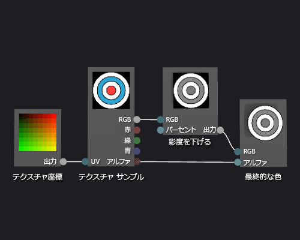

# 方法: グレースケール テクスチャ シェーダーを作成する

この記事では、シェーダー デザイナーと DGSL (Directed Graph Shader Language) を使用してグレースケール テクスチャ シェーダーを作成する方法を説明します。 このシェーダーは、テクスチャ サンプルの RGB 色の値を変更し、その値を未変更のアルファ値と併用して最終的な色を設定します。

## グレースケール テクスチャ シェーダーを作成する

テクスチャ サンプルの色の値を変更してから最終的な出力の色に記述することで、グレースケール テクスチャ シェーダーを実装できます。

開始する前に、**[プロパティ]** ウィンドウと**ツールボックス**が表示されていることを確認します。

1.  「[方法: 基本テクスチャ シェーダーを作成する](../designers/how-to-create-a-basic-texture-shader.md)」の説明に従って、基本テクスチャ シェーダーを作成します。

2.  **[テクスチャ サンプル]** ノードの **[RGB]** ターミナルを **[最終的な色]** ノードの **[RGB]** ターミナルから接続解除します。 **[選択]** モードで、**[テクスチャ サンプル]** ノードの **[RGB]** ターミナルを選択し、**[リンクの解除]** を選択します。 これにより、次の手順で追加するノードのための領域を確保できます。

3.  グラフに **[彩度を下げる]** ノードを追加します。 **ツールボックス**の **[フィルター]** で **[彩度を下げる]** を選択し、デザイン サーフェイスに移動します。

4.  **[彩度を下げる]** ノードを使用して、グレースケールの値を計算します。 **[選択]** モードで、**[テクスチャ サンプル]** ノードの **[RGB]** ターミナルを **[彩度を下げる]** ノードの **[RGB]** ターミナルに移動します。

    > [!NOTE]
    > 既定では、**[彩度を下げる]** ノードは、入力色の彩度を全体的に下げ、グレースケール変換に標準的な輝度の重みを使用します。 **[輝度]** プロパティの値を変更するか、入力色の彩度を一部だけ下げて、**[彩度を下げる]** ノードの動作を変更できます。 入力色の彩度を部分的に下げるには、**[彩度を下げる]** ノードの **[パーセント]** ターミナルに範囲 [0,1) のスカラー値を提供します。

5.  グレースケールの色の値を最終的な色に接続します。 **[彩度を下げる]** ノードの **[出力]** ターミナルを **[最終的な色]** ノードの **[RGB]** ターミナルに移動します。

次の図は、完成したシェーダー グラフと、立体に適用されるシェーダーのプレビューを示します。

> [!NOTE]
> この図では、平面がプレビューの図形として使用され、テクスチャはシェーダーの効果がわかりやすくなるように指定されています。

シェーダーによっては、特定の図形を使用すると、より適切にプレビューできる可能性があります。 シェーダー デザイナーでのシェーダーのプレビューの詳細については、「[シェーダー デザイナー](../designers/shader-designer.md)」を参照してください。

## 関連項目

- [方法: シェーダーを 3D モデルに適用する](../designers/how-to-apply-a-shader-to-a-3-d-model.md)
- [方法: シェーダーをエクスポートする](../designers/how-to-export-a-shader.md)
- [イメージ エディター](../designers/image-editor.md)
- [シェーダー デザイナー](../designers/shader-designer.md)
- [シェーダー デザイナー ノード](../designers/shader-designer-nodes.md)