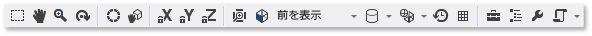

# モデル エディター

このドキュメントでは、Visual Studio **モデル エディター**を使用して 3D モデルを表示、作成、および変更する方法について説明します。

**モデル エディター**を使用すると、基本的な 3D モデルを最初から作成したり、多機能の 3D モデリング ツールを使用して作成されたより複雑な 3D モデルを表示したり変更したりすることができます。

## サポートされる形式

**モデル エディター**は DirectX アプリケーションの開発に使用する複数の 3D モデル形式をサポートしています。

|形式名|ファイル拡張子|サポートされる操作 (表示、編集、作成)|
|-----------------|--------------------|-------------------------------------------------|
|AutoDesk FBX Interchange File|*.fbx*|表示、編集、作成|
|Collada DAE File|*.dae*|表示、編集 (Collada DAE ファイルへの変更は FBX の形式で保存されます)。|
|OBJ|*.obj*|表示、編集 (OBJ ファイルへの変更は FBX の形式で保存されます)。|

## 作業開始

このセクションでは、Visual Studio C++ プロジェクトに 3D モデルを追加する方法と、作業の開始に役立つ基本的な情報について説明します。

> [!NOTE]
> 3D シーン (.fbx ファイル) のようなグラフィックス項目の自動ビルド統合がサポートされるのは、C++ プロジェクトの場合のみです。

### プロジェクトに 3D モデルを追加するには

1. グラフィックスを操作するために必要な必須 Visual Studio コンポーネントがインストールされていることを確認します。 このコンポーネントは**イメージ エディターと 3D モデル エディター**と呼ばれます。

   これをインストールするには、メニュー バーから **[ツール]** > **[ツールと機能を取得]** を選択して Visual Studio インストーラーを開き、**[個々のコンポーネント]** タブを選択します。**[ゲームおよびグラフィックス]** カテゴリで **[イメージ エディターと 3D モデル エディター]** コンポーネントを選択し、**[変更]** を選択します。

   

   コンポーネントのインストールが開始されます。

2. **ソリューション エクスプローラー**で、イメージを追加する C++ プロジェクトのショートカット メニューを開き、**[追加]** > **[新しい項目]** の順に選択します。

3. **[新しい項目の追加]** ダイアログ ボックスの **[グラフィックス]** カテゴリで、**[3D シーン (.fbx)]** を選択します。

   ![3D シーンが選択された状態の [新しい項目の追加] ダイアログ](media/add-new-3d-scene.png)

   > [!NOTE]
   > **[新しい項目の追加]** ダイアログ ボックスで **[グラフィックス]** カテゴリが表示されず、**[イメージ エディターと 3D モデル エディター]** コンポーネントをインストール済みである場合は、お使いのプロジェクトの種類でグラフィックス項目がサポートされていません。

4. モデル ファイルの**名前**を入力して、**[追加]** を選択します。

### 軸の向き

Visual Studio は、3D 軸の任意の向きをサポートし、それをサポートするモデル ファイル形式から軸の向きに関する情報を読み込みます。 軸の向きを指定しない場合、Visual Studio は右手座標系を既定で使用します。 **[軸インジケーター]** は、現在の軸の向きをデザイン サーフェイスの右下隅に示します。 **[軸インジケーター]** では、赤は x 軸を、緑は y 軸を、青は z 軸を表します。

### 3D モデルを開始する

モデル エディターで、新しい各オブジェクトは常に、モデル エディターに組み込まれている基本的な 3D 図形 (*プリミティブ*) の 1 つとして開始されます。 新しい一意のオブジェクトを作成するには、シーンにプリミティブを追加し、頂点を変更して形状を変更します。 複雑な図形の場合、浮き出しまたは再分割によって頂点を追加し、変更することができます。 シーンにプリミティブ オブジェクトを追加する方法については、「[3D オブジェクトを作成してインポートする](#Adding3DObjects)」を参照してください。 オブジェクトに頂点を追加する方法については、「[オブジェクトの変更](#ModifyingObjects)」を参照してください。

## モデル エディターを操作する

以下のセクションでは、モデル エディターを使用して 3D モデルを操作する方法について説明します。

### モデル エディターのツール バー

モデル エディターのツール バーには、3D モデルを操作する際に役立つコマンドが含まれています。

モデル エディターの状態に影響を与えるコマンドは、メイン Visual Studio ウィンドウの **[モデル エディターのモード]** ツール バーにあります。 モデリング ツールおよびスクリプト化されたコマンドは、モデル エディターのデザイン サーフェイスの **[モデル エディター]** ツール バーにあります。

**[モデル エディターのモード]** ツール バーを次に示します。

次の表は、**[モデル エディターのモード]** ツール バーに、左から右へ順に表示される項目を示します。

|ツール バーの項目|説明|
|------------------|-----------------|
|**選択**|アクティブな選択モードに応じて、シーンのポイント、境界、面、またはオブジェクトの選択が有効になります。|
|**パン**|ウィンドウ フレームに合わせた 3D シーンの移動を有効にします。 パンするには、シーン内のポイントを選択して周囲に移動します。   **[選択]** モードで **Ctrl** キーを押したままにすると、**[パン]** モードを一時的に有効にすることができます。|
|**ズーム**|ウィンドウ フレームに合わせてシーンの詳細の表示を拡大または縮小できます。 **[ズーム]** モードで、シーン内のポイントを選択して右または下へ移動すると拡大表示になります。左または上へ移動すると縮小表示になります。   **[選択]** モードでは、**Ctrl** キーを押しながらマウス ホイールを使用して、拡大または縮小することができます。|
|**軌道**|選択したオブジェクトの周囲の円形パスにビューを配置します。 オブジェクトが選択されていない場合、パスはシーンの原点を中心に配置されます。 **注:**  このモードは **[正投影]** が有効になっている場合は影響がありません。|
|**World Local**|この項目を有効にすると、選択したオブジェクトの変換はワールド空間で発生します。 それ以外の場合は、選択したオブジェクトの変換はローカル空間で発生します。|
|**ピボット モード**|この項目を有効にすると、変換は、選択したオブジェクトの "*ピボット ポイント*" の位置や向きに影響を与えます (ピボット ポイントは、平行移動、拡大縮小、および回転操作の中心を定義します)。それ以外の場合、変換は、ピボット ポイントを基準に、オブジェクトのジオメトリの場所と向きに影響を与えます。|
|**X 軸のロック**|X 軸に対するオブジェクトの操作を制限します。 マニピュレーターのウィジェットの中核部分を使用する場合にのみ適用されます。|
|**Y 軸のロック**|y 軸に対するオブジェクトの操作を制限します。 マニピュレーターのウィジェットの中核部分を使用する場合にのみ適用されます。|
|**Z 軸のロック**|z 軸に対するオブジェクトの操作を制限します。 マニピュレーターのウィジェットの中核部分を使用する場合にのみ適用されます。|
|**オブジェクトの構築**|選択したオブジェクトをビューの中央に配置するように構築します。|
|**表示**|ビューの向きを設定します。 使用できる向きを次に示します。   **前**  シーンの前面にビューを配置します。   **戻る**  シーンの背面にビューを配置します。   **左**  シーンの左側にビューを配置します。   **右**  シーンの右側にビューを配置します。   **上**  シーンの上部にビューを配置します。   **下**  シーンの下部にビューを配置します。 **注:**  **[正投影]** を有効にした場合、ビューの向きはこの方法でのみ変更されます。|
|**射影**|シーンの描画に使用するプロジェクションの種類を設定します。 使用できるプロジェクションを次に示します。   **パースペクティブ**  パースペクティブ射影では、オブジェクトはビューポイントから離れるほど小さくなり、最終的には遠くの一点に収束します。   **正射投影法**  正投影では、ビューポイントからの距離に関係なく、オブジェクトは同じサイズに見えます。 収束は表示されません。 **[正投影]** を有効にすると、**[軌道]** モードを使用してビューを配置できます。|
|**描画スタイル**|オブジェクトをシーン内に表示する方法を設定します。 使用できるスタイルを次に示します。   **ワイヤー フレーム**  有効にすると、オブジェクトはワイヤーフレームとして表示されます。   **範囲を超えて描画**  有効にすると、オブジェクトはブレンドを追加して表示されます。 シーン内に表示する描画の大きさを設定するときに使用できます。   **フラットな影付き**  有効にすると、オブジェクトは基本的なフラットな影付き照明モデルを使用して表示されます。 オブジェクトの面を簡単に見るときに使用できます。   これらのオプションのいずれも有効でない場合、各オブジェクトは、適用されている素材を使用して表示されます。|
|**リアルタイム レンダリング モード**|リアルタイム レンダリングを有効にすると、ユーザー動作がない場合でも、Visual Studio でデザイン サーフェスを再描画します。 このモードは、時間と共に変化するシェーダーを使用する場合に役立ちます。|
|**グリッドの切り替え**|有効にすると、グリッドが表示されます。 それ以外の場合、グリッドは表示されません。|
|**ツールボックス**|**ツールボックス**の表示または非表示を切り替えます。|
|**[ドキュメント アウトライン]**|**[ドキュメント アウトライン]** ウィンドウの表示または非表示を切り替えます。|
|**プロパティ**|**[プロパティ]** ウィンドウの表示または非表示を切り替えます。|
|**詳細設定**|高度なコマンドとオプションがあります。   **グラフィックス エンジン**   **D3D11 で描画**  Direct3D 11 を使用してモデル エディターのデザイン サーフェイスを表示します。   **[D3D11WARP で描画]**  モデル エディターのデザイン サーフェイスを表示するには、Direct3D 11 Windows Advanced Rasterization Platform (WARP) を使用します。   **シーン管理**   **Import**  オブジェクトを別の 3D モデル ファイルから現在のシーンにインポートします。   **親の設定**  選択した複数のオブジェクトの最初のオブジェクトを残りのオブジェクトの親として設定します。   **親の削除**  選択したオブジェクトを親からデタッチします。 選択したオブジェクトはシーンの "*ルート オブジェクト*" になります。 ルート オブジェクトには親オブジェクトはありません。   **グループの作成**  選択したオブジェクトを兄弟オブジェクトとしてグループ化します。   **オブジェクトの結合**  選択したオブジェクトを 1 つのオブジェクトに結合します。   **多角形選択によるオブジェクトの作成**  選択した面を現在のオブジェクトから削除し、これらの面を含む新しいオブジェクトをシーンに追加します。   **ツール**   **多角形ワインディングの反転**  ワインディングの順序とサーフェイスの法線が逆になるように、選択した多角形を反転させます。   **すべてのアニメーションの削除**  アニメーション データをオブジェクトから削除します。   **三角形に変換**  選択したオブジェクトを三角形に変換します。   **表示**   背面の切り取り  背面の切り取りを有効または無効にします。   **フレーム レート**  デザイン サーフェイスの右上隅にフレーム レートを表示します。 フレーム レートは、1 秒あたりの描画フレーム数です。   このオプションは **リアルタイム レンダリング モード** オプションを有効にする場合に便利です。   **すべて表示**  シーン内のすべてのオブジェクトが表示されます。 これにより、各オブジェクトの **[非表示]** プロパティが **[False]** にリセットされます。   **Show Face Normals (面の法線の表示)**  各面の法線を表示します。   **Show Missing Materials (欠落した素材の表示)**  素材が割り当てられていないオブジェクトの特殊なテクスチャを表示します。   **ピボットの表示**  アクティブな選択範囲のピボット ポイントでの 3D 軸マーカーの表示を有効または無効にします。   **プレースホルダーのノードの表示**  プレースホルダーのノードを表示します。 プレースホルダーのノードは、オブジェクトをグループ化すると作成されます。   **頂点法線の表示**  各頂点の法線を表示します。 **ヒント:**  **[スクリプト]** ボタンをクリックすると、最後のスクリプトを再度実行できます。|

**[モデル エディター]** ツール バーを次に示します。

次の表は、**[モデル エディター]** ツール バーに、上から下へ順に表示される項目を示します。

|ツール バーの項目|説明|
|------------------|-----------------|
|**平行移動**|選択範囲を移動します。|
|**拡大縮小**|選択範囲のサイズを変更します。|
|**回転**|選択範囲を回転します。|
|**ポイントの選択**|**[選択モード]** をオブジェクトの個々のポイントを選択するように設定します。|
|**境界の選択**|**[選択モード]** をオブジェクトの末尾 (2 つの頂点の間の線) を選択するように設定します。|
|**面の選択**|**[選択モード]** をオブジェクトの面を選択するように設定します。|
|**オブジェクトの選択**|**[選択モード]** をオブジェクト全体を選択するように設定します。|
|**浮き出し**|追加の面を作成し、選択した面に接続します。|
|**再分割**|選択した面を複数の面に分割します。 新しい面を作成するには、新しい頂点を、元の面の中心に 1 つ、各境界の中央に 1 つ追加して、元の頂点と結合します。 追加された面の数は、元の面の境界の数と等しくなります。|

### ビューを制御する

3D シーンはビューに従って表示される、位置と向きを設定した仮想のカメラと考えることができます。 位置と向きを変更するには、**[モデル エディターのモード]** ツール バーのビュー コントロールを使用します。

次の表に、主なビュー コントロールを示します。

|ビュー コントロール|説明|
|------------------|-----------------|
|**パン**|ウィンドウ フレームに合わせた 3D シーンの移動を有効にします。 パンするには、シーン内のポイントを選択して周囲に移動します。   **[選択]** モードで **Ctrl** キーを押したままにすると、**[パン]** モードを一時的に有効にすることができます。|
|**ズーム**|ウィンドウ フレームに合わせてシーンの詳細の表示を拡大または縮小できます。 **[ズーム]** モードで、シーン内のポイントを選択して右または下へ移動すると拡大表示になります。左または上へ移動すると縮小表示になります。   **[選択]** モードでは、**Ctrl** キーを押しながらマウス ホイールを使用して、拡大または縮小することができます。|
|**軌道**|選択したオブジェクトの周囲の円形パスにビューを配置します。 オブジェクトが選択されていない場合、パスはシーンの原点を中心に配置されます。 **注:**  このモードは **[正投影]** が有効になっている場合は影響がありません。|
|**オブジェクトの構築**|選択したオブジェクトをビューの中央に配置するように構築します。|

ビューは、仮想カメラで設定されますが、プロジェクションによっても定義されます。 プロジェクションは、ビューの図形およびオブジェクトをデザイン サーフェイスのピクセルにどのように変換するかを定義します。 **[モデル エディター]** ツール バーで、**[パースペクティブ]** または **[正投影]** を選択できます。

|射影|説明|
|----------------|-----------------|
|**パースペクティブ**|パースペクティブ射影では、オブジェクトはビューポイントから離れるほど小さくなり、最終的には遠くの一点に収束します。|
|**正射投影法**|正投影では、ビューポイントからの距離に関係なく、オブジェクトは同じサイズに見えます。 収束は表示されません。 **[正投影]** を有効にした場合、**[軌道]** モードでビューを配置できません。|

2 つの類似するシーンを比較する場合など、既知の位置や角度から 3D シーンを表示するときに役立ちます。 このシナリオでは、モデル エディターには複数の定義済みのビューがあります。 定義済みのビューを使用するには、**[モデル エディターのモード]** ツール バーで、**[表示]** を選択し、[前]、[後]、[左]、[右]、[上]、または [下] をクリックして定義済みのビューを選択します。 これらのビューでは、仮想カメラはシーンの原点を直視します。 たとえば、**[上を表示]** を選択すると、仮想カメラは真上からシーンの原点を注視します。

### 追加のジオメトリの詳細を表示する

3D オブジェクトやシーンの理解を深めるために、頂点ごとの法線、面ごとの法線、アクティブな選択範囲のピボット ポイントやその他の詳細などの追加のジオメトリの詳細を表示できます。 有効または無効にするには、**[モデル エディター]** ツール バーで、**[スクリプト]** > **[表示]** の順に選択してから必要なものを選びます。

### 3D オブジェクトを作成してインポートする 

定義済みの 3D 図形をシーンに追加するには、**[ツールボックス]** で、必要なものを選択してデザイン サーフェスに移動します。 新しい図形はシーンの原点に配置されます。 モデル エディターは 7 種類の図形、**[円すい]**、**[直方体]**、**[円柱]**、**[円盤]**、**[平面]**、**[球]**、および **[ティーポット]** を用意しています。

ファイルから 3D オブジェクトをインポートするには、**[モデル エディター]** ツール バーで、**[詳細設定]** > **[シーン管理]** > **[インポート]** の順に選択し、インポートするファイルを指定します。

### Transform オブジェクト

オブジェクトを "*変換*" するには、**[回転]**、**[拡大縮小]**、または **[並行移動]** の各プロパティを選択します。 *[回転]* は、ピボット ポイントで定義した x 軸、y 軸および z 軸を中心に連続した回転を適用することによってオブジェクトの向きを変えます。 回転には x、y、および z の 3 つの要素があり、この順に度数で指定します。 **[拡大縮小]** は、ピボット ポイントを中心とする 1 つ以上の軸を指定された要素によって伸縮することでオブジェクトのサイズを変更します。 "*変換*" は、ピボット ポイントの代わりに親を基準にして 3-D 空間にオブジェクトを配置します。

オブジェクトは、モデリング ツールを使用するかプロパティを設定して変換できます。

#### モデリング ツールを使用してオブジェクトを変換する

1. **[選択]** モードで、変換するオブジェクトを選択します。 ワイヤーフレームのオーバーレイはオブジェクトが選択されていることを示します。

2. **[モデル エディター]** ツール バーで、**[平行移動]**、**[拡大縮小]**、または **[回転]** ツールを選択します。 平行移動、拡大縮小、または回転のマニピュレーターが、選択したオブジェクトに表示されます。

3. マニピュレーターを使用して変換を実行します。 平行移動と拡大縮小の変換では、マニピュレーターは軸のインジケーターです。 一度に 1 つの軸を変更することも、インジケーターの中央にある白いキューブを使用してすべての軸を同時に変更することもできます。 回転の場合、マニピュレーターは x 軸 (赤)、Y 軸 (緑)、および Z 軸 (青) に対応して丸く色分けされた球です。 回転を作成するには、各軸を個別に変更する必要があります。

#### プロパティを設定してオブジェクトを変換する

1. **[選択]** モードで、変換するオブジェクトを選択します。 ワイヤーフレームのオーバーレイはオブジェクトが選択されていることを示します。

2. **[プロパティ]** ウィンドウで、**[回転]**、**[拡大縮小]**、および **[平行移動]** の各プロパティの値を指定します。

    > [!IMPORTANT]
    > **[回転]** プロパティでは、3 つの軸それぞれの回転角度を指定します。 回転は順番に適用されるため、必ず x 軸、y 軸、z 軸の順に回転を設定します。

モデリング ツールを使用すると、変換をすばやく作成できますが正確さを欠きます。 オブジェクトのプロパティを設定すると、変換を正確に指定できますが、時間がかかります。 モデリング ツールを使用して目的の変換に「十分に近似」させた後に、プロパティ値を微調整することをお勧めします。

マニピュレーターを使用しない場合は、自由形式モードを有効にできます。 **[モデル エディター]** ツール バーで、**[スクリプト]** > **[ツール]** > **[Free-form Manipulation]\(自由形式の操作\)** の順に選択して自由形式モードを有効 (または無効) にします。 自由形式モードでは、マニピュレーターのポイントではなく、デザイン サーフェイスのどのポイントでも操作を開始できます。 自由形式モードで、変更しない軸をロックすることによって特定の軸に対する変更を制限できます。 **[モデル エディターのモード]** ツール バーで、**[ロック X]**、**[ロック Y]**、および **[ロック Z]** ボタンの組み合わせを選択します。

グリッドにスナップを使用してオブジェクトを操作すると便利な場合があります。 **[モデル エディターのモード]** ツール バーで、**[スナップ]** を選択してグリッドにスナップを有効 (または無効) にします。 グリッドにスナップを有効にすると、平行移動、回転、拡大縮小の変換は定義済みのインクリメントに制限されます。

### ピボット ポイントを操作する

オブジェクトのピボット ポイントは回転および拡大縮小の中心を定義します。 オブジェクトのピボット ポイントを変更して、回転や拡大縮小の変換による影響を変えることができます。 **[モデル エディターのモード]** ツール バーで、**[ピボット モード]** をクリックしピボット モードを有効 (または無効) にします。 ピボット モードを有効にすると、選択したオブジェクトのピボット ポイントに小さい軸のインジケーターが表示されます。 このとき、**[平行移動]** と **[回転]** ツールを使用してピボット ポイントを操作できます。

ピボット ポイントの使用方法を示すデモについては、「[方法: ピボット ポイントの 3D モデルを変更する](../designers/how-to-modify-the-pivot-point-of-a-3-d-model.md)」を参照してください。

### ワールド モードとローカル モード

平行移動と回転は、オブジェクトのローカル座標系 (または "*ローカル基準系*") あるいはワールド座標系 (または "*ワールド基準系*") で実行できます。 ワールド基準系はオブジェクトの回転とは無関係です。 既定ではローカル モードです。 ワールド モードを有効 (または無効) にするには、**[モデル エディターのモード]** ツール バーで、**[WorldLocal]** ボタンをクリックします。

### オブジェクトを変更する 

頂点、境界、面を移動したり削除したりすることによって、3D オブジェクトの図形を変更できます。 既定では、モデル エディターは "*オブジェクト モード*" に設定されているため、オブジェクト全体を選択して変換できます。 ポイント、境界、または面を選択するには、適切な選択モードを選択します。 **[モデル エディターのモード]** ツール バーで、**[選択モード]** をクリックし、希望するモードを選択します。

浮き出しまたは再分割によって追加の頂点を作成できます。 浮き出しは面の頂点 (同一平面上の一連の頂点) を複製し、それらの頂点が結ばれています。 再分割は頂点を追加し、以前は 1 つの面だったところに複数の面を作成します。 新しい面を作成するには、新しい頂点を、元の面の中心に 1 つ、各境界の中央に 1 つ追加して、元の頂点と結合します。 追加された面の数は、元の面の境界の数と等しくなります。 いずれの場合も、新しい頂点を平行移動、回転、拡大縮小してオブジェクトのジオメトリを変更できます。

#### オブジェクトから面を浮き出すには

1. 面の選択モードで、浮き出す面を選択します。

2. **[モデル エディター]** ツール バーで、**[スクリプト]** > **[ツール]** > **[浮き出し]** の順に選択します。

#### 面を再分割するには

1. 面の選択モードで、再分割する面を選択します。 再分割では新しい境界データが作成されるため、面が隣接している場合にはすべての面を一度に再分割すると一貫した結果が得られます。

2. **[モデル エディター]** ツール バーで、**[スクリプト]** > **[ツール]** > **[再分割]** の順に選択します。

また、面の三角形変換、オブジェクトのマージ、多角形選択による新規オブジェクトの作成もできます。 三角形の変換では、三角形以外の面を最適な三角形の数に変換できるように追加の境界が作成されますが、追加のジオメトリの詳細は提供されません。 マージは選択したオブジェクトを 1 つのオブジェクトに結合します。 新しいオブジェクトを多角形選択により作成できます。

#### 面を三角形に変換する

1. 面の選択モードで、三角形に変換する面を選択します。

2. **[モデル エディター]** ツール バーで、**[スクリプト]** > **[ツール]** > **[三角形に変換]** の順に選択します。

#### オブジェクトをマージする

1. オブジェクトの選択モードで、マージするオブジェクトを選択します。

2. **[モデル エディター]** ツール バーで、**[スクリプト]** > **[ツール]** > **[オブジェクトのマージ]** の順に選択します。

#### 多角形選択からオブジェクトを作成する

1. 面の選択モードで、新しいオブジェクトを作成する面を選択します。

2. **[モデル エディター]** ツール バーで、**[スクリプト]** > **[ツール]** > **[多角形選択によるオブジェクトの作成]** の順に選択します。

### 素材とシェーダーを操作する

オブジェクトの外観はシーンの照明とオブジェクトの素材の相互作用によって決まります。 素材は、さまざまな照明にサーフェイスがどのように反応するかを説明するプロパティと、照明情報、テクスチャ マップ、法線マップ、および他のデータに基づいてオブジェクトのサーフェイスの各ピクセルの最終的な色を計算するシェーダーのプログラムによって定義されます。

モデル エディターの既定の素材は次のとおりです。

|質感|説明|
|--------------|-----------------|
|**光源なし**|光源がシミュレートされていない画面を表示します。|
|**ランバート**|環境光と拡散光をシミュレートした画面を表示します。|
|**フォン**|環境光、拡散光、および反射ハイライトをシミュレートした画面を表示します。|

これらの素材はそれぞれオブジェクトのサーフェイスの 1 つのテクスチャに適用されます。 素材を使用するオブジェクトごとに異なるテクスチャを設定できます。

特定のオブジェクトがシーン内の異なる光源に反応する方法を変更するには、素材を使用する他のオブジェクトに関係なく照明のプロパティを変更できます。 次の表は、共通の照明プロパティを示します。

|照明プロパティ|説明|
|-----------------------|-----------------|
|**環境光**|環境光照明がサーフェイスに与える影響について説明します。|
|**拡散光**|ディレクショナル ライトとポイント ライトがサーフェイスに与える影響について説明します。|
|**発光**|他の照明に関係なく、サーフェイスがどのように発光するかについて説明します。|
|**反射**|サーフェイスがディレクショナル ライトとポイント ライトをどのように反射するかについて説明します。|
|**反射輝度**|反射の光源の幅と輝度について説明します。|

素材がサポートするものに応じて、照明プロパティ、テクスチャ、および他のデータを変更できます。 **[選択]** モードで、変更するオブジェクトの素材を選択し、**[プロパティ]** ウィンドウで、**[素材: アンビエント]**、**[素材: 拡散]**、**[素材: 放射]**、**[素材: 鏡面]**、**[素材: 反射の度合い]**、または他の利用可能なプロパティを選択します。 素材は最大 8 種類のテクスチャが公開され、プロパティは **[テクスチャ 1]** から **[テクスチャ 8]** まで順に名前が付いています。

オブジェクトからすべての素材を削除するには、**[モデル エディター]** ツール バーで、**[スクリプト]** > **[素材]** > **[素材の削除]** の順に選択します。

**[シェーダー デザイナー]** を使用すると、カスタムのシェーダー素材を作成して 3D シーン内のオブジェクトに適用できます。 カスタムのシェーダー素材を作成する方法については、「[シェーダー デザイナー](../designers/shader-designer.md)」を参照してください。 カスタムのシェーダー素材をオブジェクトに適用する方法については、「[方法: シェーダーを 3D モデルに適用する](../designers/how-to-apply-a-shader-to-a-3-d-model.md)」を参照してください。

### シーン管理

シーンをオブジェクトの階層構造として管理できます。 複数のオブジェクトが階層構造に配置されていると、親ノードの移動、拡大縮小、または回転は子にも影響を与えます。 これは、基本的なオブジェクトから複合オブジェクトまたはシーンを構築するときに役立ちます。

**[ドキュメント アウトライン]** ウィンドウを使用して、シーンの階層構造を表示してシーンのノードを選択できます。 アウトラインのノードを選択すると、**[プロパティ]** ウィンドウを使用してプロパティを変更できます。

オブジェクトの 1 つを他のオブジェクトの親にするか、親として機能するプレースホルダーのノードの下に兄弟としてグループ化することによって、オブジェクトの階層構造を構築できます。

#### 親オブジェクトがある階層構造を作成する

1. **[選択]** モードで、2 つ以上のオブジェクトを選択します。 最初に選択したオブジェクトが親オブジェクトになります。

2. **[モデル エディター]** ツール バーで、**[スクリプト]** > **[シーン管理]** > **[親にアタッチ]** の順に選択します。

#### 兄弟オブジェクトの階層構造を作成する

1. **[選択]** モードで、2 つ以上のオブジェクトを選択します。 プレースホルダー オブジェクトを作成すると、親オブジェクトになります。

2. **[モデル エディター]** ツール バーで、**[スクリプト]** > **[シーン管理]** > **[グループの作成]** の順に選択します。

モデル エディターは、白いワイヤーフレームを使用して、最初に選択された親になるオブジェクトを識別します。 選択された他のオブジェクトには青いワイヤーフレームが付いています。 既定では、プレースホルダーのノードは表示されません。 プレースホルダーのノードを表示するには、**[モデル エディター]** ツール バーで、**[スクリプト]** > **[シーン管理]** > **[プレースホルダーのノードを表示]** の順に選択します。 プレースホルダーのノードは、プレースホルダーのないオブジェクトと同じように操作できます。

2 つのオブジェクト間の親子の関係を解除するには、子オブジェクトを選び、**[モデル エディター]** ツール バーで、**[スクリプト]** > **[シーン管理]** > **[親からのデタッチ]** の順に選択します。 子オブジェクトから親をデタッチすると、子オブジェクトはシーンのルート オブジェクトになります。

## キーボード ショートカット

|コマンド|キーボード ショートカット|
|-------------|------------------------|
|**[選択]** モードに切り替え|**Ctrl** + **G**、**Ctrl** + **Q**   **S**|
|**[ズーム]** モードに切り替え|**Ctrl** + **G**、**Ctrl** + **Z**   **Z**|
|**[パン]** モードに切り替え|**Ctrl** + **G**、**Ctrl** + **P**   **K**|
|すべて選択|**Ctrl** + **A**|
|現在の選択範囲を削除します。|**削除**|
|現在の選択を取り消します。|**エスケープ** (**Esc**)|
|拡大表示|**マウス ホイール前方移動**   **Ctrl** + **マウス ホイール前方移動**   **Shift** + **マウス ホイール前方移動**   **Ctrl** + **PageUp**   プラス記号 (**+**)|
|ズーム アウト|**マウス ホイール後方移動**   **Ctrl** + **マウス ホイール後方移動**   **Shift** + **マウス ホイール後方移動**   **Ctrl** + **PageDown**   マイナス記号 (**-**)|
|カメラを上へパン|**PageDown**|
|カメラを下へパン|**PageUp**|
|カメラを左へパン|**マウス ホイール左**   **Ctrl** + **PageDown**|
|カメラを右へパン|**マウス ホイール右**   **Ctrl** + **PageDown**|
|モデルの上部を表示|**Ctrl** + **L**、**Ctrl** + **T**   **T**|
|モデルの下部を表示|**Ctrl** + **L**、**Ctrl** + **U**|
|モデルの左側を表示|**Ctrl** + **L**、**Ctrl** + **L**|
|モデルの右側を表示|**Ctrl** + **L**、**Ctrl** + **R**|
|モデルの前面を表示|**Ctrl** + **L**、**Ctrl** + **F**|
|モデルの背面を表示|**Ctrl** + **L**、**Ctrl** + **B**|
|オブジェクトをウィンドウ内に構成|**F**|
|ワイヤフレーム モードの切り替え|**Ctrl** + **L**、**Ctrl** + **W**|
|グリッドにスナップの切り替え|**Ctrl** + **G**、**Ctrl** + **N**|
|ピボット モードの切り替え|**Ctrl** + **G**、**Ctrl** + **V**|
|x 軸の制限の切り替え|**Ctrl** + **L**、**Ctrl** + **X**|
|y 軸の制限の切り替え|**Ctrl** + **L**、**Ctrl** + **Y**|
|z 軸の制限の切り替え|**Ctrl** + **L**、**Ctrl** + **Z**|
|移動モードへの切り替え|**Ctrl** + **G**、**Ctrl** + **W**   **W**|
|拡大縮小モードへの切り替え|**Ctrl** + **G**、**Ctrl** + **E**   **E**|
|回転モードへの切り替え|**Ctrl** + **G**、**Ctrl** + **R**   **R**|
|ポイントの選択モードへの切り替え|**Ctrl** + **L**、**Ctrl** + **1**|
|境界の選択モードへの切り替え|**Ctrl** + **L**、**Ctrl** + **2**|
|面の選択モードへの切り替え|**Ctrl** + **L**、**Ctrl** + **3**|
|オブジェクトの選択モードへの切り替え|**Ctrl** + **L**、**Ctrl** + **4**|
|移動 (カメラ) モードへの切り替え|**Ctrl** + **G**、**Ctrl** + **O**|
|シーンの次のオブジェクトを選択|**Tab**|
|シーンの前のオブジェクトを選択|**Shift**+**Tab**|
|選択したオブジェクトを現在のツールに基づいて操作します。|**方向**キー|
|現在のマニピュレーターを非アクティブ化|**Q**|
|カメラの回転|マウスの左ボタンを使用して **Alt** キーを押しながら**ドラッグ**|

## 関連トピック

|Title|説明|
|-----------|-----------------|
|[ゲームとアプリ用の 3D アセットの操作](../designers/working-with-3-d-assets-for-games-and-apps.md)|テクスチャ、イメージ、3D モデルやシェーダー効果などのグラフィックス アセットの操作に使用できる Visual Studio のツールの概要を説明します。|
|[イメージ エディター](../designers/image-editor.md)|Visual Studio イメージ エディターを使用してテクスチャとイメージを操作する方法について説明します。|
|[シェーダー デザイナー](../designers/shader-designer.md)|Visual Studio シェーダー デザイナーを使用してシェーダーを操作する方法について説明します。|