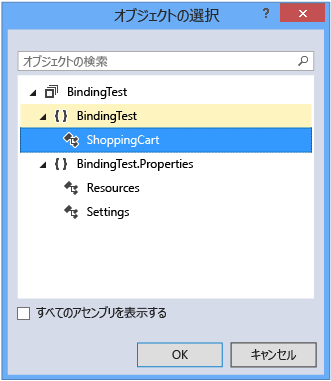
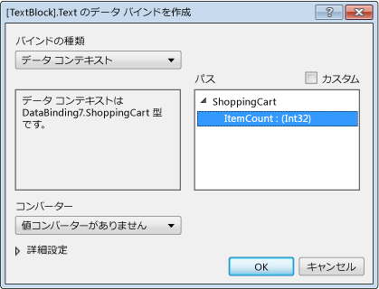

# チュートリアル: XAML デザイナーでデータにバインドする
[!INCLUDE[vs2017banner](../code-quality/includes/vs2017banner.md)]

XAML デザイナーでは、アートボードと \[プロパティ\] ウィンドウを使用してデータ バインドのプロパティを設定できます。  このチュートリアルの例では、データをコントロールにバインドする方法を示します。  具体的には、`ItemCount` という名前の [DependencyProperty](http://msdn.microsoft.com/library/windows/apps/windows.ui.xaml.dependencyproperty.aspx) を持つ簡単なショッピング カート クラスを作成し、`ItemCount` プロパティを [TextBlock](http://msdn.microsoft.com/library/windows/apps/windows.ui.xaml.controls.textblock.aspx) コントロールの **Text** プロパティにバインドします。  
  
### データ ソースとして使用するクラスを作成するには  
  
1.  **\[ファイル\]** メニューで、**\[新規\]**、**\[プロジェクト\]** をクリックします。  
  
2.  **\[新しいプロジェクト\]** ダイアログ ボックスで、**\[Visual C\#\]** ノードまたは **\[Visual Basic\]** ノードを選択します。次に、**\[Windows デスクトップ\]** ノードを展開し、**\[WPF アプリケーション\]** テンプレートを選択します。  
  
3.  プロジェクトに「BindingTest」という名前を付けて、**\[OK\]** をクリックします。  
  
4.  MainWindow.xaml.cs \(または MainWindow.xaml.vb\) ファイルを開き、次のコードを追加します。  C\# では、`BindingTest` 名前空間 \(ファイル内の最後の閉じかっこの前\) にコードを追加します。  Visual Basic の場合は、単に新しいクラスを追加します。  
  
    ```c#  
    public class ShoppingCart : DependencyObject  
    {  
        public int ItemCount  
        {  
            get { return (int)GetValue(ItemCountProperty); }  
            set { SetValue(ItemCountProperty, value); }  
        }  
  
        public static readonly DependencyProperty ItemCountProperty =  
             DependencyProperty.Register("ItemCount", typeof(int),  
             typeof(ShoppingCart), new PropertyMetadata(0));  
    }  
  
    ```  
  
    ```vb  
    Public Class ShoppingCart  
        Inherits DependencyObject  
  
        Public Shared ReadOnly ItemCountProperty As DependencyProperty = DependencyProperty.Register(  
            "ItemCount", GetType(Integer), GetType(ShoppingCart), New PropertyMetadata(0))  
        Public Property ItemCount As Integer  
            Get  
                ItemCount = CType(GetValue(ItemCountProperty), Integer)  
            End Get  
            Set(value As Integer)  
                SetValue(ItemCountProperty, value)  
            End Set  
        End Property  
    End Class  
    ```  
  
     このコードでは、[PropertyMetadata](http://msdn.microsoft.com/library/windows/apps/windows.ui.xaml.propertymetadata.aspx) オブジェクトを使用して既定のアイテム数に値 0 を設定します。  
  
5.  **\[ファイル\]** メニューで、**\[ビルド\]**、**\[ソリューションのビルド\]** の順に選択します。  
  
### ItemCount プロパティを TextBlock コントロールにバインドするには  
  
1.  ソリューション エクスプローラーで、MainWindow.xaml のショートカット メニューを開き、**\[デザイナーの表示\]** を選択します。  
  
2.  \[ツールボックス\] で、\[[Grid](http://msdn.microsoft.com/library/windows/apps/windows.ui.xaml.controls.grid.aspx)\] コントロールを選択し、フォームに追加します。  
  
3.  `Grid` を選択した状態で、\[プロパティ\] ウィンドウの **\[DataContext\]** プロパティの横にある **\[新規作成\]** ボタンをクリックします。  
  
4.  **\[オブジェクトの選択\]** ダイアログ ボックスで、**\[すべてのアセンブリを表示する\]** チェック ボックスがオフであることを確認し、**\[BindingTest\]** 名前空間の下にある **\[ShoppingCart\]** を選択し、**\[OK\]** をクリックします。  
  
     次の図は、**\[オブジェクトの選択\]** ダイアログ ボックスで **\[ShoppingCart\]** 選択した状態を示しています。  
  
       
  
5.  **\[ツールボックス\]** で、`TextBlock` コントロールを選択してフォームに追加します。  
  
6.  `TextBlock` コントロールを選択した状態で、\[プロパティ\] ウィンドウで **\[Text\]** プロパティの右側にあるプロパティ マーカーを選択してから、**\[データ バインディングの作成\]** を選択します。  \(プロパティ マーカーは小さいボックスのような外観です。\)  
  
7.  \[データ バインディングを作成\] ダイアログ ボックスの **\[パス\]** ボックスで、**\[ItemCount: \(int32\)\]** プロパティを選択し、**\[OK\]** をクリックします。  
  
     次の図は、**\[データ バインディングを作成\]** ダイアログ ボックスで **\[ItemCount\]** プロパティを選択した状態を示しています。  
  
       
  
8.  F5 キーを押してアプリを実行します。  
  
     `TextBlock` コントロールに、既定値の 0 がテキストとして表示されるはずです。  
  
## 参照  
 [XAML デザイナーを使用した UI の作成](../designers/creating-a-ui-by-using-xaml-designer-in-visual-studio.md)   
 [NIB: Add Value Converter dialog box](http://msdn.microsoft.com/ja-jp/c5f3d110-a541-4b55-8bca-928f77778af8)