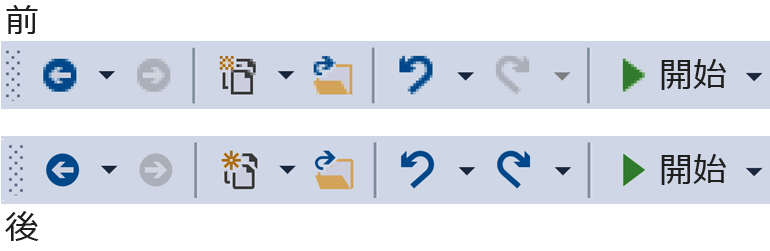
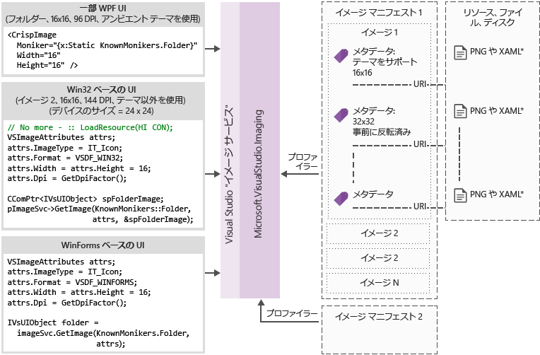

# <a name="image-service-and-catalog"></a>イメージ サービスとカタログ
このクックブックには、ガイダンスと、Visual Studio イメージ サービスと Visual Studio 2015 で導入されたイメージのカタログを採用するためのベスト プラクティスが含まれています。  
  
 Visual Studio 2015 で導入されたイメージのサービスでは、開発者は、デバイスと表示されるコンテキストの正しいテーマなど、イメージを表示するユーザーの選択したテーマの最適なイメージの取得ができます。 イメージのサービスを採用することと、資産管理、HDPI スケーリング、およびテーマの適用に関連する主要な問題点を排除するのに役立ちます。  
  
|||  
|-|-|  
|**現在の問題**|**ソリューション**|  
|背景色のブレンド|組み込みのアルファ ブレンド|  
|(一部) のテーマのイメージ|テーマのメタデータ|  
|ハイ コントラスト モード|ハイ コントラストの代替のリソース|  
|さまざまな DPI モードに対して複数のリソースを必要があります。|選択可能なベクター ベースのフォールバック リソース|  
|イメージが重複しています|イメージの概念ごとの 1 つの識別子|  
  
 イメージのサービスを採用する理由  
  
-   Visual Studio から常に最新の「ピクセル単位で正確」イメージを取得します。  
  
-   送信して、独自のイメージを使用することができます。  
  
-   Windows が新しい DPI スケールを追加するときに、イメージをテストする必要はありません。  
  
-   実装では古いアーキテクチャ上の問題を対処します。  
  
 Visual Studio shell ツールバー前に、と後イメージのサービスを使用します。  
  
   
  
## <a name="how-it-works"></a>しくみ
 イメージ サービスは、任意のサポートされている UI フレームワークの適切なビットマップ イメージを指定できます。  
  
-   WPF: BitmapSource  
  
-   WinForms: System.Drawing.Bitmap  
  
-   Win32: HBITMAP  
  
 イメージ サービスのフロー ダイアグラム  
  
   
  
 **イメージのモニカー**  
  
 イメージのモニカー (または略してモニカー) はのイメージ アセットまたはイメージ ライブラリにあるイメージの一覧の資産を一意に識別する GUID と ID のペアです。  
  
 **既知のモニカー**  
  
 任意の Visual Studio のコンポーネントまたは拡張機能を Visual Studio のイメージのカタログおよびパブリックに使用できるに含まれるイメージ モニカーのセット。  
  
 **イメージ マニフェスト ファイル**  
  
 イメージ マニフェスト (*.imagemanifest*) ファイルは、これらの資産と実際のイメージまたは各資産を表すイメージを表すモニカーのイメージ アセットのセットを定義する XML ファイルです。 従来の UI サポートのイメージを一覧表示またはイメージ マニフェストは、スタンドアロン画像を定義できます。 さらに、ときに、これらの資産を表示する方法を変更する、資産または各資産の背後にある個別のイメージのいずれかに設定できる属性があります。  
  
 **イメージ マニフェスト スキーマ**  
  
 イメージの完了のマニフェストのようになります。  
  
```xml  
<ImageManifest>  
      <!-- zero or one Symbols elements -->  
      <Symbols>  
        <!-- zero or more Import, Guid, ID, or String elements -->  
      </Symbols>  
      <!-- zero or one Images elements -->  
      <Images>  
        <!-- zero or more Image elements -->  
      </Images>  
      <!-- zero or one ImageLists elements -->  
      <ImageLists>  
        <!-- zero or more ImageList elements -->  
      </ImageLists>  
</ImageManifest>  
```  
  
 **シンボル**  
  
 読みやすさと保守に役立てるため、イメージ マニフェストは、属性値のシンボルを使用できます。 このようなシンボルが定義されます。  
  
```xml  
<Symbols>  
      <Import Manifest="manifest" />  
      <Guid Name="ShellCommandGuid" Value="8ee4f65d-bab4-4cde-b8e7-ac412abbda8a" />  
      <ID Name="cmdidSaveAll" Value="1000" />  
      <String Name="AssemblyName" Value="Microsoft.VisualStudio.Shell.UI.Internal" />  
</Symbols>  
```  
  
|||  
|-|-|  
|**サブ要素**|**定義**|  
|インポート|現在のマニフェストで使用するための指定されたマニフェスト ファイルのシンボルをインポートします。|  
|GUID|シンボルは、GUID を表し、GUID の書式設定と一致する必要があります。|  
|ID|シンボルは、ID を表し、負でない整数でなければなりません|  
|String|シンボルは、任意の文字列値を表します|  
  
 シンボルは、大文字と小文字、および $(symbol-name) 構文を使用して参照には。  
  
```xml  
<Image Guid="$(ShellCommandGuid)" ID="$(cmdidSaveAll)" >  
      <Source Uri="/$(AssemblyName);Component/Resources/image.xaml" />  
</Image>  
```  
  
 いくつかの記号は、すべてのマニフェストを事前定義されています。 これらの Uri の属性で使用できる、\<ソース > または\<インポート > 要素をローカル コンピューター上の参照のパス。  
  
|||  
|-|-|  
|**シンボル**|**説明**|  
|CommonProgramFiles|%Commonprogramfiles% 環境変数の値|  
|LocalAppData|LocalAppData 環境変数の値|  
|ManifestFolder|マニフェスト ファイルを含むフォルダー|  
|[マイ ドキュメント]|現在のユーザーのマイ ドキュメント フォルダーの完全なパス|  
|ProgramFiles|%Programfiles% 環境変数の値|  
|システム|*Windows \system32*フォルダー|  
|%Windir%|WinDir 環境変数の値|  
  
 **イメージ**  
  
 \<イメージ > 要素は、モニカーで参照できるイメージを定義します。 GUID と組み合わされる ID は、イメージ モニカーを形成します。 イメージのモニカーは、全体のイメージ ライブラリ全体で一意である必要があります。 1 つ以上のイメージに指定したモニカーがある場合は、ライブラリのビルド中に発生した 1 つ目が保持される 1 つにします。  
  
 ソースの少なくとも 1 つ含める必要があります。 サイズに依存しないソースは、サイズの広範な範囲にわたる最適な結果を提供しますが、必須ではありません。 定義されていないサイズのイメージのサービスが求められるかどうか、\<イメージ > 要素のサイズに依存しないソースがないと、サービスが最適なサイズに固有のソースを選択し、要求されたサイズに拡大します。  
  
```xml  
<Image Guid="guid" ID="int" AllowColorInversion="true/false">  
      <Source ... />  
      <!-- optional additional Source elements -->  
</Image>  
```  
  
|||  
|-|-|  
|**属性**|**定義**|  
|GUID|[必須]イメージのモニカーの GUID 部分|  
|ID|[必須]イメージのモニカーの ID 部分|  
|AllowColorInversion|[省略可能、既定値は true]イメージが黒っぽい背景で使用されるときに反転されるプログラムでの色を持つかどうかを示します。|  
  
 **ソース**  
  
 \<ソース > 要素が 1 つのイメージのソース資産 (XAML および PNG) を定義します。  
  
```xml  
<Source Uri="uri" Background="background">  
      <!-- optional NativeResource element -->  
 </Source>  
```  
  
|||  
|-|-|  
|**属性**|**定義**|  
|URI|[必須]イメージを読み込むことを定義する URI。 次のいずれかを指定できます。<br /><br /> は、 [Pack URI](http://msdn.microsoft.com/en-US/library/aa970069\(v=vs.100\).aspx)アプリケーションを使用して:///オーソリティ<br />-絶対コンポーネント リソース参照<br />-ネイティブ リソースを含むファイルへのパス|  
|背景|[省略可能]背景が使用するものでは、ソースの種類にどのようなことを示します。<br /><br /> 次のいずれかを指定できます。<br /><br /> *光源:* 明るい背景では、ソースを使用できます。<br /><br /> *濃い:* ソースは、暗い背景で使用できます。<br /><br /> *ハイコントラスト:* ソースは、ハイ コントラスト モードで、色の背景で使用できます。<br /><br /> *HighContrastLight:* ソースは、ハイ コントラスト モードで明るい背景で使用できます。<br /><br /> *HighContrastDark:* ソースは、ハイ コントラスト モードで暗い背景で使用できます。<br /><br /> バック グラウンド属性を省略した場合は、任意のバック グラウンドで、ソースを使用できます。<br /><br /> 背景色が場合*光*、*濃い*、 *HighContrastLight*、または*HighContrastDark*ソースの色を反転ことはありません。 バック グラウンドを省略するかに設定した場合*ハイコントラスト*、ソースの色の反転は、イメージのによって制御される**AllowColorInversion**属性。|  
|||  
  
 A\<ソース > 要素は省略可能な次のサブ要素の 1 つだけであることができます。  
  
||||  
|-|-|-|  
|**要素**|**属性 (必要なすべて)**|**定義**|  
|\<サイズ >|[値]|(デバイス単位) で指定されたサイズのイメージのソースが使用されます。 画像は正方形になります。|  
|\<SizeRange >|MinSize、MaxSize|ソースは、範囲 (デバイス単位) の最大サイズに MinSize からイメージに使用されます。 画像は正方形になります。|  
|\<ディメンション >|Width、Height|指定した幅と高さ (デバイス単位) のイメージのソースが使用されます。|  
|\<DimensionRange >|MinWidth、MinHeight、<br /><br /> MaxWidth、MaxHeight|ソースは、範囲 (デバイス単位) で最大の幅と高さを幅/高さの最小値からのイメージに使用されます。|  
  
 A\<ソース > 要素は省略可能なこともできます\<NativeResource > を定義するサブ要素を\<ソース > マネージ アセンブリではなく、ネイティブ アセンブリから読み込むことができます。  
  
```xml  
<NativeResource Type="type" ID="int" />  
```  
  
|||  
|-|-|  
|**属性**|**定義**|  
|型|[必須]XAML または PNG のいずれかのネイティブのリソースの種類|  
|ID|[必須]ネイティブ リソースの整数 ID の部分|  
  
 **ImageList**  
  
 \<ImageList > 要素が 1 つのストリップに返すことができるイメージのコレクションを定義します。 ストリップは、必要に応じて、オンデマンドで構築されます。  
  
```xml  
<ImageList>  
      <ContainedImage Guid="guid" ID="int" External="true/false" />  
      <!-- optional additional ContainedImage elements -->  
 </ImageList>  
```  
  
|||  
|-|-|  
|**属性**|**定義**|  
|GUID|[必須]イメージのモニカーの GUID 部分|  
|ID|[必須]イメージのモニカーの ID 部分|  
|外部|[省略可能、既定値は false]イメージ モニカーが現在のマニフェストでイメージを参照するかどうかを示します。|  
  
 含まれているイメージのモニカーを現在のマニフェストで定義されているイメージを参照する必要はありません。 イメージ ライブラリに含まれているイメージが見つからない場合、空のプレース ホルダー イメージは、代わりに使用されます。  
  
## <a name="using-the-image-service"></a>イメージのサービスを使用します。  
  
### <a name="first-steps-managed"></a>最初の手順 (マネージ)  
 イメージのサービスを使用するには、次のアセンブリの一部またはすべてへの参照をプロジェクトに追加する必要があります。  
  
-   *Microsoft.VisualStudio.ImageCatalog.dll*  
  
    -   組み込みイメージのカタログを使用するかどうかは必ず**KnownMonikers**します。  
  
-   *Microsoft.VisualStudio.Imaging.dll*  
  
    -   使用するかどうかは必ず**CrispImage**と**ImageThemingUtilities** WPF の UI にします。
  
-   *Microsoft.VisualStudio.Imaging.Interop.14.0.DesignTime.dll*  
  
    -   使用するかどうかは必ず、 **ImageMoniker**と**ImageAttributes**型。  
  
    -   **EmbedInteropTypes**設定が true に設定します。  
  
-   *Microsoft.VisualStudio.Shell.Interop.14.0.DesignTime*  
  
    -   使用するかどうかは必ず、 **IVsImageService2**型。  
  
    -   **EmbedInteropTypes**設定が true に設定します。  
  
-   *Microsoft.VisualStudio.Utilities.dll*  
  
    -   使用するかどうかは必ず、 **BrushToColorConverter**の**ImageThemingUtilities.ImageBackgroundColor** WPF の UI にします。  
  
-   *Microsoft.VisualStudio.Shell します。\<VSVersion >.0*  
  
    -   使用するかどうかは必ず、 **IVsUIObject**型。  
  
-   *Microsoft.VisualStudio.Shell.Interop.10.0.dll*  
  
    -   UI の WinForms 関連ヘルパーを使用するかどうかに必要です。  
  
    -   **EmbedInteropTypes**設定が true に設定  
  
### <a name="first-steps-native"></a>最初の手順 (ネイティブ)  
 イメージのサービスを使用するには、一部またはすべてのプロジェクトに次のヘッダーを含める必要があります。  
  
-   **KnownImageIds.h**  
  
    -   組み込みイメージのカタログを使用するかどうかは必ず**KnownMonikers**、使用できませんが、 **ImageMoniker**から値を返す場合など、型**IVsHierarchy GetGuidProperty**または**GetProperty**呼び出し。  
  
-   **KnownMonikers.h**  
  
    -   組み込みイメージのカタログを使用するかどうかは必ず**KnownMonikers**します。  
  
-   **ImageParameters140.h**  
  
    -   使用するかどうかは必ず、 **ImageMoniker**と**ImageAttributes**型。  
  
-   **VSShell140.h**  
  
    -   使用するかどうかは必ず、 **IVsImageService2**型。  
  
-   **ImageThemingUtilities.h**  
  
    -   イメージ サービスがテーマを処理できるようにすることがないかどうかに必要です。  
  
    -   イメージ サービスは、イメージのテーマを処理できる場合は、このヘッダーを使用しないでください。  
  
-   **VSUIDPIHelper.h**  
  
    -   DPI ヘルパーを使用して、現在の DPI を取得するかどうかに必要です。  
  
## <a name="how-do-i-write-new-wpf-ui"></a>新しい WPF の UI を作成する方法はありますか  
  
1.  上記の必要なアセンブリ参照を追加することにより、最初のセクションの手順をプロジェクトにします。 それらのすべてを追加、参照だけが必要なので必要ありません。 (注: を使用している場合やへのアクセスを持っている場合**色**の代わりに**ブラシ**への参照をスキップできます**ユーティリティ**コンバーターの必要はありませんので、)。  
  
2.  必要なイメージを選択し、そのモニカーを取得します。 使用して、 **KnownMoniker**、または独自のカスタム イメージとモニカーがある場合、独自に使用します。  
  
3.  追加**CrispImages** XAML にします。 (詳しくは、次の例を参照してください)。  
  
4.  設定、 **ImageThemingUtilities.ImageBackgroundColor** UI 階層内のプロパティ。 (これは、背景色が既知の場合、必ずしもでない場所に設定する必要があります、 **CrispImage**)。(詳しくは、次の例を参照してください)。  
  
```xaml  
<Window  
  x:Class="WpfApplication.MainWindow"  
  xmlns="http://schemas.microsoft.com/winfx/2006/xaml/presentation"  
  xmlns:x="http://schemas.microsoft.com/winfx/2006/xaml"  
  xmlns:imaging="clr-namespace:Microsoft.VisualStudio.Imaging;assembly=Microsoft.VisualStudio.Imaging"  
  xmlns:theming="clr-namespace:Microsoft.VisualStudio.PlatformUI;assembly=Microsoft.VisualStudio.Imaging"  
  xmlns:utilities="clr-namespace:Microsoft.Internal.VisualStudio.Imaging;assembly=Microsoft.VisualStudio.Imaging"  
  xmlns:catalog="clr-namespace:Microsoft.VisualStudio.Imaging;assembly=Microsoft.VisualStudio.ImageCatalog"  
  Title="MainWindow" Height="350" Width="525" UseLayoutRounding="True">  
  <Window.Resources>  
    <utilities:BrushToColorConverter x:Key="BrushToColorConverter"/>  
  </Window.Resources>  
  <StackPanel Background="White" VerticalAlignment="Center"   
    theming:ImageThemingUtilities.ImageBackgroundColor="{Binding Background, RelativeSource={RelativeSource Self}, Converter={StaticResource BrushToColorConverter}}">  
    <imaging:CrispImage Width="16" Height="16" Moniker="{x:Static catalog:KnownMonikers.MoveUp}" />  
  </StackPanel>  
</Window>  
```  
  
 **既存の WPF UI の更新方法**  
  
 既存の WPF UI の更新は、次の 3 つの基本的な手順で構成される比較的単純なプロセスです。  
  
1.  すべて置換\<イメージ > 要素での UI に\<CrispImage > 要素。  
  
2.  モニカー属性には、すべてのソース属性を変更します。  
  
    -   イメージが変化しないと、使用している場合**KnownMonikers**、するには、そのプロパティを静的にバインド、 **KnownMoniker**します。 (上記の例を参照してください)。  
  
    -   イメージが変更されない、独自のカスタム イメージを使用している場合は、静的にバインド、独自のモニカー。  
  
    -   イメージを変更できる場合は、プロパティの変更を通知するコード プロパティにモニカー属性をバインドします。  
  
3.  どこかに、UI 階層で次のように設定します。 **ImageThemingUtilities.ImageBackgroundColor**正しく動作させる、色の反転を確認してください。  
  
    -   これを使用する必要があります、 **BrushToColorConverter**クラス。 (上記の例を参照してください)。  
  
## <a name="how-do-i-update-win32-ui"></a>Win32 の UI の更新方法  
 置換イメージの生の読み込みに該当する場合は、コードに、次を追加します。 必要に応じて、HIMAGELIST と HICONs とようなを返すための値を切り替えます。  
  
 **イメージ サービスを取得します。**  
  
```cpp  
CComPtr<IVsImageService2> spImgSvc;  
CGlobalServiceProvider::HrQueryService(SID_SVsImageService, &spImgSvc);  
```  
  
 **イメージを要求します。**  
  
```cpp  
ImageAttributes attr = { 0 };  
attr.StructSize      = sizeof(attributes);  
attr.Format          = DF_Win32;  
// IT_Bitmap for HBITMAP, IT_Icon for HICON, IT_ImageList for HIMAGELIST  
attr.ImageType       = IT_Bitmap;  
attr.LogicalWidth    = 16;  
attr.LogicalHeight   = 16;  
attr.Dpi             = VsUI::DpiHelper::GetDeviceDpiX();  
attr.Background      = 0xFFFFFFFF;  
// Desired RGBA color, if you don't use this, don't set IAF_Background below  
attr.Flags           = IAF_RequiredFlags | IAF_Background;  
  
CComPtr<IVsUIObject> spImg;  
// Replace this KnownMoniker with your desired ImageMoniker  
spImgSvc->GetImage(KnownMonikers::Blank, attributes, &spImg);  
  
```  
  
## <a name="how-do-i-update-winforms-ui"></a>WinForms UI の更新方法  
 置換イメージの生の読み込みに該当する場合は、コードに、次を追加します。 必要に応じて、アイコンとビットマップを返すための値を切り替えます。  
  
 **ステートメントを使用してを参考になった**  
  
```csharp  
using GelUtilities = Microsoft.Internal.VisualStudio.PlatformUI.Utilities;  
```  
  
 **イメージ サービスを取得します。**  
  
```csharp  
// This or your preferred way of querying for Visual Studio services  
IVsImageService2 imageService = (IVsImageService2)Package.GetGlobalService(typeof(SVsImageService));  
  
```  
  
 **イメージを要求します。**  
  
```csharp  
ImageAttributes attributes = new ImageAttributes  
{  
    StructSize    = Marshal.SizeOf(typeof(ImageAttributes)),  
    // IT_Bitmap for Bitmap, IT_Icon for Icon  
    ImageType     = (uint)_UIImageType.IT_Bitmap,  
    Format        = (uint)_UIDataFormat.DF_WinForms,  
    LogicalWidth  = 16,  
    LogicalHeight = 16,  
    // Desired RGBA color, if you don't use this, don't set IAF_Background below  
    Background    = 0xFFFFFFFF,  
    Flags = (uint)_ImageAttributesFlags.IAF_RequiredFlags | _ImageAttributesFlags.IAF_Background,  
};  
  
// Replace this KnownMoniker with your desired ImageMoniker  
IVsUIObject uIObj = imageService.GetImage(KnownMonikers.Blank, attributes);  
  
Bitmap bitmap = (Bitmap)GelUtilities.GetObjectData(uiObj); // Use this if you need a bitmap  
// Icon icon = (Icon)GelUtilities.GetObjectData(uiObj); // Use this if you need an icon  
  
```  
  
## <a name="how-do-i-use-image-monikers-in-a-new-tool-window"></a>新しいツール ウィンドウのイメージ モニカーを使用する方法  
 Visual Studio 2015 用の VSIX パッケージ プロジェクト テンプレートが更新されました。 新しいツール ウィンドウを作成するには、VSIX プロジェクトを右クリックし、選択**追加** > **新しい項目の**(**Ctrl**+**Shift**+ **A**)。 [プロジェクトの言語の機能拡張] ノードで次のように選択します。**カスタム ツール ウィンドウ**、名、およびキーを押して、[ツール] ウィンドウを与える、**追加**ボタンをクリックします。  
  
 これらは、ツール ウィンドウでモニカーを使用するキーの場所です。 各手順に従います。  
  
1.  タブ十分に小さい場合、ツール ウィンドウ タブ (でも使用、 **Ctrl**+**タブ**ウィンドウの切り替え)。  
  
     派生したクラスのコンス トラクターにこの行を追加、 **ToolWindowPane**型。  
  
    ```csharp  
    // Replace this KnownMoniker with your desired ImageMoniker  
    this.BitmapImageMoniker = KnownMonikers.Blank;  
    ```  
  
2.  ツール ウィンドウを開くコマンド。  
  
     *.Vsct*パッケージのファイル、ツール ウィンドウのコマンド ボタンの編集します。  
  
    ```xml  
    <Button guid="guidPackageCmdSet" id="CommandId" priority="0x0100" type="Button">  
      <Parent guid="guidSHLMainMenu" id="IDG_VS_WNDO_OTRWNDWS1"/>  
      <!-- Replace this KnownMoniker with your desired ImageMoniker -->  
      <Icon guid="ImageCatalogGuid" id="Blank" />  
      <!-- Add this -->  
      <CommandFlag>IconIsMoniker</CommandFlag>  
      <Strings>  
        <ButtonText>MyToolWindow</ButtonText>  
      </Strings>  
    </Button>  
    ```  
  
 **既存のツール ウィンドウのイメージ モニカーを使用する方法**  
  
 イメージ モニカーを使用する既存のツール ウィンドウを更新することは、新しいツール ウィンドウを作成するための手順に似ています。  
  
 これらは、ツール ウィンドウでモニカーを使用するキーの場所です。 各手順に従います。  
  
1.  タブ十分に小さい場合、ツール ウィンドウ タブ (でも使用、 **Ctrl**+**タブ**ウィンドウの切り替え)。  
  
    1.  派生したクラスのコンス トラクターでこれらの行を削除 (存在する場合)、 **ToolWindowPane**型。  
  
        ```csharp  
        this.BitmapResourceID = <Value>;  
        this.BitmapIndex = <Value>;  
        ```  
  
    2.  手順 1. を参照してください、「を使用する方法のイメージ モニカー新しいツール ウィンドウのでしょうか」。 前のセクション。  
  
2.  ツール ウィンドウを開くコマンド。  
  
    -   手順 2 の参照、「を使用する方法のイメージ モニカー新しいツール ウィンドウのでしょうか」。 前のセクション。  
  
## <a name="how-do-i-use-image-monikers-in-a-vsct-file"></a>.Vsct ファイルのイメージ モニカーを使用する方法  
 更新プログラム、 *.vsct*ファイルの次のコメント行で示されます。  
  
```xml  
<?xml version="1.0" encoding="utf-8"?>  
<CommandTable xmlns="http://schemas.microsoft.com/VisualStudio/2005-10-18/CommandTable" xmlns:xs="http://www.w3.org/2001/XMLSchema">  
  <!--  Include the definitions for images included in the VS image catalog -->  
  <Include href="KnownImageIds.vsct"/>  
  <Commands package="guidMyPackage">  
    <Buttons>  
      <Button guid="guidMyCommandSet" id="cmdidMyCommand" priority="0x0000" type="Button">  
        <!-- Add an Icon element, changing the attributes to match the image moniker you want to use.  
             In this case, we're using the Guid for the VS image catalog.  
             Change the id attribute to be the ID of the desired image moniker. -->  
        <Icon guid="ImageCatalogGuid" id="OpenFolder" />  
        <CommandFlag>DynamicVisibility</CommandFlag>  
        <CommandFlag>DefaultInvisible</CommandFlag>  
        <CommandFlag>DefaultDisabled</CommandFlag>  
        <CommandFlag>CommandWellOnly</CommandFlag>  
        <CommandFlag>IconAndText</CommandFlag>  
        <!-- Add the IconIsMoniker CommandFlag -->  
        <CommandFlag>IconIsMoniker</CommandFlag>  
        <Strings>  
          <ButtonText>Quick Fixes...</ButtonText>  
          <CommandName>Show Quick Fixes</CommandName>  
          <CanonicalName>ShowQuickFixes</CanonicalName>  
          <LocCanonicalName>ShowQuickFixes</LocCanonicalName>  
        </Strings>  
      </Button>  
    </Buttons>  
  </Commands>  
  <!-- It is recommended that you remove <Bitmap> elements that are no longer used in the vsct file -->  
  <Symbols>  
    <GuidSymbol name="guidMyPackage"    value="{1491e936-6ffe-474e-8371-30e5920d8fdd}" />  
    <GuidSymbol name="guidMyCommandSet" value="{10347de4-69a9-47f4-a950-d3301f6d2bc7}">  
      <IDSymbol name="cmdidMyCommand" value="0x9437" />  
    </GuidSymbol>  
  </Symbols>  
</CommandTable>  
```  
  
 **場合、.vsct ファイルは、古いバージョンの Visual Studio によって読み取られるも必要ですか。**  
  
 Visual Studio の以前のバージョンを認識しない、 **IconIsMoniker**コマンド フラグ。 旧形式のイメージを使用して、以前のバージョンの Visual Studio を引き続きサポートするには、Visual Studio のバージョンでは、イメージのサービスからのイメージを使用できます。 これを行うには、ままに、 *.vsct*ファイルの変更 (と Visual Studio の以前のバージョンと互換性のあるため) と GUID と ID のペアで定義されているからマップする CSV (コンマ区切り値) ファイルを作成、 *.vsct*ファイルの\<ビットマップ > イメージ モニカー GUID と ID のペアを要素。  
  
 CSV のマッピング ファイルの形式です。  
  
```  
Icon guid, Icon id, Moniker guid, Moniker id  
b714fcf7-855e-4e4c-802a-1fd87144ccad,1,fda30684-682d-421c-8be4-650a2967058e,100  
b714fcf7-855e-4e4c-802a-1fd87144ccad,2,fda30684-682d-421c-8be4-650a2967058e,200  
```  
  
 CSV ファイルはパッケージと共にデプロイされ、その場所がで指定された、 **IconMappingFilename**のプロパティ、 **ProvideMenuResource**パッケージ属性。  
  
```csharp  
[ProvideMenuResource("MyPackage.ctmenu", 1, IconMappingFilename="IconMappings.csv")]  
```  
  
 **IconMappingFilename**がいずれかの相対パスに暗黙的にルート (例のように、上記)、$PackageFolder$ または絶対パスなど、環境変数で定義されているディレクトリを明示的にルートと *@"%UserProfile%\dir1\dir2\MyMappingFile.csv"* します。  
  
## <a name="how-do-i-port-a-project-system"></a>プロジェクト システムを移植する方法は?  
 **プロジェクトの ImageMonikers を指定する方法**  
  
1.  実装**VSHPROPID_SupportsIconMonikers**プロジェクトの**IVsHierarchy**、true を返すとします。  
  
2.  いずれも実装して**VSHPROPID_IconMonikerImageList** (元のプロジェクトが使用されている場合**VSHPROPID_IconImgList**) または**VSHPROPID_IconMonikerGuid**、 **VSHPROPID_IconMonikerId**、 **VSHPROPID_OpenFolderIconMonikerGuid**、 **VSHPROPID_OpenFolderIconMonikerId** (元のプロジェクトが使用されている場合**VSHPROPID_IconHandle**と**VSHPROPID_OpenFolderIconHandle**)。  
  
3.  拡張ポイントを要求している場合は、「レガシ」のバージョンのアイコンを作成するアイコンの元の VSHPROPIDs の実装を変更します。 **IVsImageService2**これらのアイコンを取得するために必要な機能を提供します  
  
 **追加の要件の VB/c# プロジェクトの種類**  
  
 実装するだけ**VSHPROPID_SupportsIconMonikers** 、プロジェクトがあることを検出した場合、**最も外側のフレーバー**します。 それ以外の場合、実際の最も外側のフレーバーでは実際には、イメージ モニカーをサポートしていませんが、基本のフレーバーが効果的に「隠す」カスタマイズされたイメージ。  
  
 **CPS 内のイメージ モニカーを使用する方法**  
  
 手動でまたはプロジェクト システムの機能拡張 SDK に付属している項目テンプレートを使用して、CPS (共通プロジェクト システム) でのカスタム イメージの設定を行うことができます。  
  
 **プロジェクト システムの拡張機能 SDK を使用します。**  
  
 手順に従って[プロジェクトの種類/項目の種類のカスタム アイコンを提供](https://github.com/Microsoft/VSProjectSystem/blob/master/doc/scenario/provide_custom_icons_for_the_project_or_item_type.md)CPS イメージをカスタマイズします。 CPS の詳細についてで見つかります[Visual Studio プロジェクト システムの機能拡張ドキュメント](https://github.com/Microsoft/VSProjectSystem)  
  
 **ImageMonikers を使用して手動で**  
  
1.  実装およびエクスポート、 **IProjectTreeModifier**プロジェクト システムでのインターフェイス。  
  
2.  決定**KnownMoniker**または使用するカスタム イメージのモニカー。  
  
3.  **ApplyModifications**メソッドを次の操作を新しいツリーを返す前に、メソッドのどこかに、次の例。  
  
    ```csharp  
    // Replace this KnownMoniker with your desired ImageMoniker  
    tree = tree.SetIcon(KnownMonikers.Blank.ToProjectSystemType());  
    ```  
  
4.  目的のモニカーのような NewTree メソッドに渡すことで、カスタム イメージを設定するには、新しいツリーを作成する場合、次の例。  
  
    ```csharp  
    // Replace this KnownMoniker with your desired ImageMoniker  
    ProjectImageMoniker icon         = KnownMonikers.FolderClosed.ToProjectSystemType();  
    ProjectImageMoniker expandedIcon = KnownMonikers.FolderOpened.ToProjectSystemType();  
  
    return this.ProjectTreeFactory.Value.NewTree(/*caption*/<value>,  
                                                 /*filePath*/<value>,  
                                                 /*browseObjectProperties*/<value>,  
                                                 icon,  
                                                 expandedIcon);  
    ```  
  
## <a name="how-do-i-convert-from-a-real-image-strip-to-a-moniker-based-image-strip"></a>モニカ ベースのイメージ ストリップに実際のイメージ ストリップから変換する方法  
 **HIMAGELISTs をサポートする必要があります。**  
  
 イメージ サービスの使用を更新したいが、イメージ リストの周囲の受け渡しを必要とする Api によって制限されるコードの既存のイメージ ストリップがある場合、イメージのサービスの利点を取得することができます。 モニカ ベースのイメージ ストリップを作成するには、既存のモニカーからマニフェストを作成する次の手順に従います。  
  
1.  実行、 **ManifestFromResources**ツール、イメージ ストリップを渡します。 これにより、ストリップのマニフェストが生成されます。  
  
    -   お勧めします。 その使用法に合わせてマニフェストの既定以外の名前を提供します。  
  
2.  のみを使用する場合**KnownMonikers**、次の操作を行います。  
  
    -   置換、\<イメージ > セクションを使用したマニフェストの\<イメージ/>。  
  
    -   すべてのサブイメージ Id の削除 (を含むもの\<imagestrip 名 > _ ##)。  
  
    -   AssetsGuid シンボルとその使用法に合わせてイメージ ストリップ シンボルお勧めします。 名前を変更します。  
  
    -   各を置き換える**ContainedImage**の各 GUID $(ImageCatalogGuid) で置き換える**ContainedImage**の ID では、$(\<モニカー >)、各に外部="true"属性を追加および**ContainedImage**  
  
        -   \<モニカー > 置き換える必要があります、 **KnownMoniker**イメージと一致するが、"KnownMonikers"。 名前から削除されます。  
  
    -   追加 < インポート Manifest="$(ManifestFolder)\\< 相対インストールへのパスを dir *\>\Microsoft.VisualStudio.ImageCatalog.imagemanifest"/\*> の先頭に、\<シンボル > セクション。  
  
        -   相対パスは、マニフェストの作成の設定で定義されている配置場所によって決まります。  
  
3.  実行、 **ManifestToCode**既存のコードがあるイメージ ストリップに対してイメージのサービスのクエリに使用できるモニカーを持つように、ラッパーを生成するためのツール。  
  
    -   推奨: ラッパーとその使用状況に合わせて名前空間の既定以外の名前を指定します。  
  
4.  すべては、追加すると、セットアップの作成/デプロイ、およびイメージのサービスと新しいファイルを操作するには、その他のコード変更します。  
  
 それがどのようにして、内部および外部の両方のイメージを含むサンプル マニフェスト:  
  
```xml  
<?xml version="1.0"?>  
<ImageManifest  
  xmlns:xsi="http://www.w3.org/2001/XMLSchema-instance"  
  xmlns:xsd="http://www.w3.org/2001/XMLSchema"  
  xmlns="http://schemas.microsoft.com/VisualStudio/ImageManifestSchema/2014">  
  
  <Symbols>  
    <!-- This needs to be the relative path from your manifest to the ImageCatalog's manifest  
         where $(ManifestFolder) is the deployed location of this manifest. -->  
    <Import Manifest="$(ManifestFolder)\<RelPath>\Microsoft.VisualStudio.ImageCatalog.imagemanifest" />  
  
    <String Name="Resources" Value="/My.Assembly.Name;Component/Resources/ImageStrip" />  
    <Guid Name="ImageGuid" Value="{fb41b7ef-6587-480c-aa27-5b559d42cfc9}" />  
    <Guid Name="ImageStripGuid" Value="{9c84a570-d9a7-4052-a340-188fb276f973}" />  
    <ID Name="MyImage_0" Value="100" />  
    <ID Name="MyImage_1" Value="101" />  
    <ID Name="InternalList" Value="1001" />  
    <ID Name="ExternalList" Value="1002" />  
  </Symbols>  
  
  <Images>  
    <Image Guid="$(ImageGuid)" ID="$(MyImage_0)">  
      <Source Uri="$(Resources)/MyImage_0.png">  
        <Size Value="16" />  
      </Source>  
    </Image>  
    <Image Guid="$(ImageGuid)" ID="$(MyImage_1)">  
      <Source Uri="$(Resources)/MyImage_1.png">  
        <Size Value="16" />  
      </Source>  
    </Image>  
  </Images>  
  
  <ImageLists>  
    <ImageList Guid="$(ImageStripGuid)" ID="$(InternalList)">  
      <ContainedImage Guid="$(ImageGuid)" ID="$(MyImage_0)" />  
      <ContainedImage Guid="$(ImageGuid)" ID="$(MyImage_1)" />  
    </ImageList>  
    <ImageList Guid="$(ImageStripGuid)" ID="$(ExternalList)">  
      <ContainedImage Guid="$(ImageCatalogGuid)" ID="$(StatusError)" External="true" />  
      <ContainedImage Guid="$(ImageCatalogGuid)" ID="$(StatusWarning)" External="true" />  
      <ContainedImage Guid="$(ImageCatalogGuid)" ID="$(StatusInformation)" External="true" />  
    </ImageList>  
  </ImageLists>  
  
</ImageManifest>  
```  
  
 **HIMAGELISTs をサポートする必要はありません。**  
  
1.  セットを決定する**KnownMonikers**イメージ ストリップ内のイメージを一致や、イメージ ストリップのイメージの独自のモニカーを作成します。  
  
2.  代わりに、モニカーを使用するイメージ ストリップに必要なインデックス位置にあるイメージを取得するために使用するどのようなマッピングを更新します。  
  
3.  更新されたマッピングを使用してモニカーを要求するイメージのサービスを使用するコードを更新します。 (更新する可能性があります**CrispImages**のマネージ コード、またはイメージのサービスからのようなまたは HICONs の要求とそれらのネイティブ コードに渡すことです)。  
  
## <a name="testing-your-images"></a>イメージのテスト  
 イメージ ライブラリ ビューアー ツールを使用して、すべてが正しく作成されているかどうかを確認する、イメージのマニフェストをテストすることができます。 ツールを見つけることができます、 [Visual Studio 2015 SDK](http://msdn.microsoft.com/library/bb166441.aspx)します。 このツールおよびその他のドキュメントを参照して[ここ](http://aka.ms/VSImageThemeTools)します。  
  
## <a name="additional-resources"></a>その他の技術情報  
  
### <a name="samples"></a>サンプル  
 Visual Studio のサンプルを GitHub でのいくつかは、さまざまな Visual Studio 機能拡張ポイントの一部として、イメージのサービスを使用する方法について説明更新されました。  
  
 確認[ http://github.com/Microsoft/VSSDK-Extensibility-Samples ](http://github.com/Microsoft/VSSDK-Extensibility-Samples)の最新のサンプルです。  
  
### <a name="tooling"></a>ツール  
 一連のイメージのサービスのサポート ツールは、イメージのサービスと連携する UI の作成/更新で支援するために作成されました。 各ツールの詳細については、ツールに付属するドキュメントを確認してください。 ツールはの一部として含める、 [Visual Studio 2015 SDK。](http://msdn.microsoft.com/library/bb166441.aspx)  
  
 **ManifestFromResources**  
  
 リソースのツールから、マニフェストは、イメージ リソース (PNG や XAML) の一覧を受け取り、それらのイメージをイメージのサービスを使用するためのイメージのマニフェスト ファイルを生成します。  
  
 **ManifestToCode**  
  
 コード ツールにマニフェスト イメージのマニフェスト ファイルを受け取り (C++、c# または VB) のコードでは、マニフェストの値を参照するためのラッパー ファイルを生成または *.vsct*ファイル。  
  
 **ImageLibraryViewer**  
  
 イメージ ライブラリ ビューアー ツールでは、イメージ マニフェストを読み込むことができ、Visual Studio のマニフェストが正しく作成されているかどうかを確認すると同じ方法で操作できます。 ユーザーは、バック グラウンド、サイズ、DPI の設定、ハイ コントラスト、およびその他の設定を変更できます。 マニフェストでエラーを見つけるための読み込み情報が表示され、マニフェスト内の各イメージのソース情報を表示します。  
  
## <a name="faq"></a>FAQ  
  
-   読み込むときに含める必要のある依存している\<Include="Microsoft.VisualStudio.* の参照。Interop.14.0.DesignTime"/> でしょうか。  
  
    -   設定 EmbedInteropTypes = すべての相互運用機能 Dll では、"true"です。  
  
-   My の拡張機能でイメージ マニフェストがデプロイする方法  
  
    -   追加、 *.imagemanifest*ファイルをプロジェクト。  
  
    -   「VSIX に含める」が True に設定します。  
  
-   CPS プロジェクト システムが更新されます。 変更点**ImageName**と**StockIconService**でしょうか。  
  
    -   これらは、モニカーを使用する CPS が更新されたときに削除されました。 呼び出しが不要になった、 **StockIconService**を渡すだけの目的**KnownMoniker**メソッドまたはプロパティを使用して、 **ToProjectSystemType()** で拡張メソッドCPS のユーティリティです。 マッピングを見つけることができます**ImageName**に**KnownMonikers**下。  
  
        |||  
        |-|-|  
        |**ImageName**|**KnownMoniker**|  
        |ImageName.OfflineWebApp|KnownImageIds.Web|  
        |ImageName.WebReferencesFolder|KnownImageIds.Web|  
        |ImageName.OpenReferenceFolder|KnownImageIds.FolderOpened|  
        |ImageName.ReferenceFolder|KnownImageIds.Reference|  
        |ImageName.Reference|KnownImageIds.Reference|  
        |ImageName.SdlWebReference|KnownImageIds.WebReferenceFolder|  
        |ImageName.DiscoWebReference|KnownImageIds.DynamicDiscoveryDocument|  
        |ImageName.Folder|KnownImageIds.FolderClosed|  
        |ImageName.OpenFolder|KnownImageIds.FolderOpened|  
        |ImageName.ExcludedFolder|KnownImageIds.HiddenFolderClosed|  
        |ImageName.OpenExcludedFolder|KnownImageIds.HiddenFolderOpened|  
        |ImageName.ExcludedFile|KnownImageIds.HiddenFile|  
        |ImageName.DependentFile|KnownImageIds.GenerateFile|  
        |ImageName.MissingFile|KnownImageIds.DocumentWarning|  
        |ImageName.WindowsForm|KnownImageIds.WindowsForm|  
        |ImageName.WindowsUserControl|KnownImageIds.UserControl|  
        |ImageName.WindowsComponent|KnownImageIds.ComponentFile|  
        |ImageName.XmlSchema|KnownImageIds.XMLSchema|  
        |ImageName.XmlFile|KnownImageIds.XMLFile|  
        |ImageName.WebForm|KnownImageIds.Web|  
        |ImageName.WebService|KnownImageIds.WebService|  
        |ImageName.WebUserControl|KnownImageIds.WebUserControl|  
        |ImageName.WebCustomUserControl|KnownImageIds.WebCustomControl|  
        |ImageName.AspPage|KnownImageIds.ASPFile|  
        |ImageName.GlobalApplicationClass|KnownImageIds.SettingsFile|  
        |ImageName.WebConfig|KnownImageIds.ConfigurationFile|  
        |ImageName.HtmlPage|KnownImageIds.HTMLFile|  
        |ImageName.StyleSheet|KnownImageIds.StyleSheet|  
        |ImageName.ScriptFile|KnownImageIds.JSScript|  
        |ImageName.TextFile|KnownImageIds.Document|  
        |ImageName.SettingsFile|KnownImageIds.Settings|  
        |ImageName.Resources|KnownImageIds.DocumentGroup|  
        |ImageName.Bitmap|KnownImageIds.Image|  
        |ImageName.Icon|KnownImageIds.IconFile|  
        |ImageName.Image|KnownImageIds.Image|  
        |ImageName.ImageMap|KnownImageIds.ImageMapFile|  
        |ImageName.XWorld|KnownImageIds.XWorldFile|  
        |ImageName.Audio|KnownImageIds.Sound|  
        |ImageName.Video|KnownImageIds.Media|  
        |ImageName.Cab|KnownImageIds.CABProject|  
        |ImageName.Jar|KnownImageIds.JARFile|  
        |ImageName.DataEnvironment|KnownImageIds.DataTable|  
        |ImageName.PreviewFile|KnownImageIds.Report|  
        |ImageName.DanglingReference|KnownImageIds.ReferenceWarning|  
        |ImageName.XsltFile|KnownImageIds.XSLTransform|  
        |ImageName.Cursor|KnownImageIds.CursorFile|  
        |ImageName.AppDesignerFolder|KnownImageIds.Property|  
        |ImageName.Data|KnownImageIds.Database|  
        |ImageName.Application|KnownImageIds.Application|  
        |ImageName.DataSet|KnownImageIds.DatabaseGroup|  
        |ImageName.Pfx|KnownImageIds.Certificate|  
        |ImageName.Snk|KnownImageIds.Rule|  
        |ImageName.VisualBasicProject|KnownImageIds.VBProjectNode|  
        |ImageName.CSharpProject|KnownImageIds.CSProjectNode|  
        |ImageName.Empty|KnownImageIds.Blank|  
        |ImageName.MissingFolder|KnownImageIds.FolderOffline|  
        |ImageName.SharedImportReference|KnownImageIds.SharedProject|  
        |ImageName.SharedProjectCs|KnownImageIds.CSSharedProject|  
        |ImageName.SharedProjectVc|KnownImageIds.CPPSharedProject|  
        |ImageName.SharedProjectJs|KnownImageIds.JSSharedProject|  
        |ImageName.CSharpCodeFile|KnownImageIds.CSFileNode|  
        |ImageName.VisualBasicCodeFile|KnownImageIds.VBFileNode|  
  
    -   入力候補一覧プロバイダーが更新されます。 どのような**KnownMonikers**を古い一致**StandardGlyphGroup**と**StandardGlyph**値でしょうか。  
  
        ||||  
        |-|-|-|  
        |GlyphGroupClass|GlyphItemPublic|ClassPublic|  
        |GlyphGroupClass|GlyphItemInternal|ClassInternal|  
        |GlyphGroupClass|GlyphItemFriend|ClassInternal|  
        |GlyphGroupClass|GlyphItemProtected|ClassProtected|  
        |GlyphGroupClass|GlyphItemPrivate|ClassPrivate|  
        |GlyphGroupClass|GlyphItemShortcut|ClassShortcut|  
        |GlyphGroupConstant|GlyphItemPublic|ClassPublic|  
        |GlyphGroupConstant|GlyphItemInternal|ClassInternal|  
        |GlyphGroupConstant|GlyphItemFriend|ClassInternal|  
        |GlyphGroupConstant|GlyphItemProtected|ClassProtected|  
        |GlyphGroupConstant|GlyphItemPrivate|ClassPrivate|  
        |GlyphGroupConstant|GlyphItemShortcut|ClassShortcut|  
        |GlyphGroupDelegate|GlyphItemPublic|DelegatePublic|  
        |GlyphGroupDelegate|GlyphItemInternal|DelegateInternal|  
        |GlyphGroupDelegate|GlyphItemFriend|DelegateInternal|  
        |GlyphGroupDelegate|GlyphItemProtected|DelegateProtected|  
        |GlyphGroupDelegate|GlyphItemPrivate|DelegatePrivate|  
        |GlyphGroupDelegate|GlyphItemShortcut|DelegateShortcut|  
        |GlyphGroupEnum|GlyphItemPublic|EnumerationPublic|  
        |GlyphGroupEnum|GlyphItemInternal|EnumerationInternal|  
        |GlyphGroupEnum|GlyphItemFriend|EnumerationInternal|  
        |GlyphGroupEnum|GlyphItemProtected|EnumerationProtected|  
        |GlyphGroupEnum|GlyphItemPrivate|EnumerationPrivate|  
        |GlyphGroupEnum|GlyphItemShortcut|EnumerationShortcut|  
        |GlyphGroupEnumMember|GlyphItemPublic|EnumerationMemberPublic|  
        |GlyphGroupEnumMember|GlyphItemInternal|EnumerationMemberInternal|  
        |GlyphGroupEnumMember|GlyphItemFriend|EnumerationMemberInternal|  
        |GlyphGroupEnumMember|GlyphItemProtected|EnumerationMemberProtected|  
        |GlyphGroupEnumMember|GlyphItemPrivate|EnumerationMemberPrivate|  
        |GlyphGroupEnumMember|GlyphItemShortcut|EnumerationMemberShortcut|  
        |GlyphGroupEvent|GlyphItemPublic|EventPublic|  
        |GlyphGroupEvent|GlyphItemInternal|EventInternal|  
        |GlyphGroupEvent|GlyphItemFriend|EventInternal|  
        |GlyphGroupEvent|GlyphItemProtected|EventProtected|  
        |GlyphGroupEvent|GlyphItemPrivate|EventPrivate|  
        |GlyphGroupEvent|GlyphItemShortcut|EventShortcut|  
        |GlyphGroupException|GlyphItemPublic|ExceptionPublic|  
        |GlyphGroupException|GlyphItemInternal|ExceptionInternal|  
        |GlyphGroupException|GlyphItemFriend|ExceptionInternal|  
        |GlyphGroupException|GlyphItemProtected|ExceptionProtected|  
        |GlyphGroupException|GlyphItemPrivate|ExceptionPrivate|  
        |GlyphGroupException|GlyphItemShortcut|ExceptionShortcut|  
        |GlyphGroupField|GlyphItemPublic|FieldPublic|  
        |GlyphGroupField|GlyphItemInternal|FieldInternal|  
        |GlyphGroupField|GlyphItemFriend|FieldInternal|  
        |GlyphGroupField|GlyphItemProtected|FieldProtected|  
        |GlyphGroupField|GlyphItemPrivate|FieldPrivate|  
        |GlyphGroupField|GlyphItemShortcut|FieldShortcut|  
        |GlyphGroupInterface|GlyphItemPublic|InterfacePublic|  
        |GlyphGroupInterface|GlyphItemInternal|InterfaceInternal|  
        |GlyphGroupInterface|GlyphItemFriend|InterfaceInternal|  
        |GlyphGroupInterface|GlyphItemProtected|InterfaceProtected|  
        |GlyphGroupInterface|GlyphItemPrivate|InterfacePrivate|  
        |GlyphGroupInterface|GlyphItemShortcut|InterfaceShortcut|  
        |GlyphGroupMacro|GlyphItemPublic|MacroPublic|  
        |GlyphGroupMacro|GlyphItemInternal|MacroInternal|  
        |GlyphGroupMacro|GlyphItemFriend|MacroInternal|  
        |GlyphGroupMacro|GlyphItemProtected|MacroProtected|  
        |GlyphGroupMacro|GlyphItemPrivate|MacroPrivate|  
        |GlyphGroupMacro|GlyphItemShortcut|MacroShortcut|  
        |GlyphGroupMap|GlyphItemPublic|MapPublic|  
        |GlyphGroupMap|GlyphItemInternal|MapInternal|  
        |GlyphGroupMap|GlyphItemFriend|MapInternal|  
        |GlyphGroupMap|GlyphItemProtected|MapProtected|  
        |GlyphGroupMap|GlyphItemPrivate|MapPrivate|  
        |GlyphGroupMap|GlyphItemShortcut|MapShortcut|  
        |GlyphGroupMapItem|GlyphItemPublic|MapItemPublic|  
        |GlyphGroupMapItem|GlyphItemInternal|MapItemInternal|  
        |GlyphGroupMapItem|GlyphItemFriend|MapItemInternal|  
        |GlyphGroupMapItem|GlyphItemProtected|MapItemProtected|  
        |GlyphGroupMapItem|GlyphItemPrivate|MapItemPrivate|  
        |GlyphGroupMapItem|GlyphItemShortcut|MapItemShortcut|  
        |GlyphGroupMethod|GlyphItemPublic|MethodPublic|  
        |GlyphGroupMethod|GlyphItemInternal|MethodInternal|  
        |GlyphGroupMethod|GlyphItemFriend|MethodInternal|  
        |GlyphGroupMethod|GlyphItemProtected|MethodProtected|  
        |GlyphGroupMethod|GlyphItemPrivate|MethodPrivate|  
        |GlyphGroupMethod|GlyphItemShortcut|MethodShortcut|  
        |GlyphGroupOverload|GlyphItemPublic|MethodPublic|  
        |GlyphGroupOverload|GlyphItemInternal|MethodInternal|  
        |GlyphGroupOverload|GlyphItemFriend|MethodInternal|  
        |GlyphGroupOverload|GlyphItemProtected|MethodProtected|  
        |GlyphGroupOverload|GlyphItemPrivate|MethodPrivate|  
        |GlyphGroupOverload|GlyphItemShortcut|MethodShortcut|  
        |GlyphGroupModule|GlyphItemPublic|ModulePublic|  
        |GlyphGroupModule|GlyphItemInternal|ModuleInternal|  
        |GlyphGroupModule|GlyphItemFriend|ModuleInternal|  
        |GlyphGroupModule|GlyphItemProtected|ModuleProtected|  
        |GlyphGroupModule|GlyphItemPrivate|ModulePrivate|  
        |GlyphGroupModule|GlyphItemShortcut|ModuleShortcut|  
        |GlyphGroupNamespace|GlyphItemPublic|NamespacePublic|  
        |GlyphGroupNamespace|GlyphItemInternal|NamespaceInternal|  
        |GlyphGroupNamespace|GlyphItemFriend|NamespaceInternal|  
        |GlyphGroupNamespace|GlyphItemProtected|NamespaceProtected|  
        |GlyphGroupNamespace|GlyphItemPrivate|NamespacePrivate|  
        |GlyphGroupNamespace|GlyphItemShortcut|NamespaceShortcut|  
        |GlyphGroupOperator|GlyphItemPublic|OperatorPublic|  
        |GlyphGroupOperator|GlyphItemInternal|OperatorInternal|  
        |GlyphGroupOperator|GlyphItemFriend|OperatorInternal|  
        |GlyphGroupOperator|GlyphItemProtected|OperatorProtected|  
        |GlyphGroupOperator|GlyphItemPrivate|OperatorPrivate|  
        |GlyphGroupOperator|GlyphItemShortcut|OperatorShortcut|  
        |GlyphGroupProperty|GlyphItemPublic|PropertyPublic|  
        |GlyphGroupProperty|GlyphItemInternal|PropertyInternal|  
        |GlyphGroupProperty|GlyphItemFriend|PropertyInternal|  
        |GlyphGroupProperty|GlyphItemProtected|PropertyProtected|  
        |GlyphGroupProperty|GlyphItemPrivate|PropertyPrivate|  
        |GlyphGroupProperty|GlyphItemShortcut|PropertyShortcut|  
        |GlyphGroupStruct|GlyphItemPublic|StructurePublic|  
        |GlyphGroupStruct|GlyphItemInternal|StructureInternal|  
        |GlyphGroupStruct|GlyphItemFriend|StructureInternal|  
        |GlyphGroupStruct|GlyphItemProtected|StructureProtected|  
        |GlyphGroupStruct|GlyphItemPrivate|StructurePrivate|  
        |GlyphGroupStruct|GlyphItemShortcut|StructureShortcut|  
        |GlyphGroupTemplate|GlyphItemPublic|TemplatePublic|  
        |GlyphGroupTemplate|GlyphItemInternal|TemplateInternal|  
        |GlyphGroupTemplate|GlyphItemFriend|TemplateInternal|  
        |GlyphGroupTemplate|GlyphItemProtected|TemplateProtected|  
        |GlyphGroupTemplate|GlyphItemPrivate|TemplatePrivate|  
        |GlyphGroupTemplate|GlyphItemShortcut|TemplateShortcut|  
        |GlyphGroupTypedef|GlyphItemPublic|TypeDefinitionPublic|  
        |GlyphGroupTypedef|GlyphItemInternal|TypeDefinitionInternal|  
        |GlyphGroupTypedef|GlyphItemFriend|TypeDefinitionInternal|  
        |GlyphGroupTypedef|GlyphItemProtected|TypeDefinitionProtected|  
        |GlyphGroupTypedef|GlyphItemPrivate|TypeDefinitionPrivate|  
        |GlyphGroupTypedef|GlyphItemShortcut|TypeDefinitionShortcut|  
        |GlyphGroupType|GlyphItemPublic|TypePublic|  
        |GlyphGroupType|GlyphItemInternal|TypeInternal|  
        |GlyphGroupType|GlyphItemFriend|TypeInternal|  
        |GlyphGroupType|GlyphItemProtected|TypeProtected|  
        |GlyphGroupType|GlyphItemPrivate|TypePrivate|  
        |GlyphGroupType|GlyphItemShortcut|TypeShortcut|  
        |GlyphGroupUnion|GlyphItemPublic|UnionPublic|  
        |GlyphGroupUnion|GlyphItemInternal|UnionInternal|  
        |GlyphGroupUnion|GlyphItemFriend|UnionInternal|  
        |GlyphGroupUnion|GlyphItemProtected|UnionProtected|  
        |GlyphGroupUnion|GlyphItemPrivate|UnionPrivate|  
        |GlyphGroupUnion|GlyphItemShortcut|UnionShortcut|  
        |GlyphGroupVariable|GlyphItemPublic|FieldPublic|  
        |GlyphGroupVariable|GlyphItemInternal|FieldInternal|  
        |GlyphGroupVariable|GlyphItemFriend|FieldInternal|  
        |GlyphGroupVariable|GlyphItemProtected|FieldProtected|  
        |GlyphGroupVariable|GlyphItemPrivate|FieldPrivate|  
        |GlyphGroupVariable|GlyphItemShortcut|FieldShortcut|  
        |GlyphGroupValueType|GlyphItemPublic|ValueTypePublic|  
        |GlyphGroupValueType|GlyphItemInternal|ValueTypeInternal|  
        |GlyphGroupValueType|GlyphItemFriend|ValueTypeInternal|  
        |GlyphGroupValueType|GlyphItemProtected|ValueTypeProtected|  
        |GlyphGroupValueType|GlyphItemPrivate|ValueTypePrivate|  
        |GlyphGroupValueType|GlyphItemShortcut|ValueTypeShortcut|  
        |GlyphGroupIntrinsic|GlyphItemPublic|ObjectPublic|  
        |GlyphGroupIntrinsic|GlyphItemInternal|ObjectInternal|  
        |GlyphGroupIntrinsic|GlyphItemFriend|ObjectInternal|  
        |GlyphGroupIntrinsic|GlyphItemProtected|ObjectProtected|  
        |GlyphGroupIntrinsic|GlyphItemPrivate|ObjectPrivate|  
        |GlyphGroupIntrinsic|GlyphItemShortcut|ObjectShortcut|  
        |GlyphGroupJSharpMethod|GlyphItemPublic|MethodPublic|  
        |GlyphGroupJSharpMethod|GlyphItemInternal|MethodInternal|  
        |GlyphGroupJSharpMethod|GlyphItemFriend|MethodInternal|  
        |GlyphGroupJSharpMethod|GlyphItemProtected|MethodProtected|  
        |GlyphGroupJSharpMethod|GlyphItemPrivate|MethodPrivate|  
        |GlyphGroupJSharpMethod|GlyphItemShortcut|MethodShortcut|  
        |GlyphGroupJSharpField|GlyphItemPublic|FieldPublic|  
        |GlyphGroupJSharpField|GlyphItemInternal|FieldInternal|  
        |GlyphGroupJSharpField|GlyphItemFriend|FieldInternal|  
        |GlyphGroupJSharpField|GlyphItemProtected|FieldProtected|  
        |GlyphGroupJSharpField|GlyphItemPrivate|FieldPrivate|  
        |GlyphGroupJSharpField|GlyphItemShortcut|FieldShortcut|  
        |GlyphGroupJSharpClass|GlyphItemPublic|ClassPublic|  
        |GlyphGroupJSharpClass|GlyphItemInternal|ClassInternal|  
        |GlyphGroupJSharpClass|GlyphItemFriend|ClassInternal|  
        |GlyphGroupJSharpClass|GlyphItemProtected|ClassProtected|  
        |GlyphGroupJSharpClass|GlyphItemPrivate|ClassPrivate|  
        |GlyphGroupJSharpClass|GlyphItemShortcut|ClassShortcut|  
        |GlyphGroupJSharpNamespace|GlyphItemPublic|NamespacePublic|  
        |GlyphGroupJSharpNamespace|GlyphItemInternal|NamespaceInternal|  
        |GlyphGroupJSharpNamespace|GlyphItemFriend|NamespaceInternal|  
        |GlyphGroupJSharpNamespace|GlyphItemProtected|NamespaceProtected|  
        |GlyphGroupJSharpNamespace|GlyphItemPrivate|NamespacePrivate|  
        |GlyphGroupJSharpNamespace|GlyphItemShortcut|NamespaceShortcut|  
        |GlyphGroupJSharpInterface|GlyphItemPublic|InterfacePublic|  
        |GlyphGroupJSharpInterface|GlyphItemInternal|InterfaceInternal|  
        |GlyphGroupJSharpInterface|GlyphItemFriend|InterfaceInternal|  
        |GlyphGroupJSharpInterface|GlyphItemProtected|InterfaceProtected|  
        |GlyphGroupJSharpInterface|GlyphItemPrivate|InterfacePrivate|  
        |GlyphGroupJSharpInterface|GlyphItemShortcut|InterfaceShortcut|  
        |GlyphGroupError||StatusError|  
        |GlyphBscFile||クラスファイル|  
        |GlyphAssembly||参照|  
        |GlyphLibrary||ライブラリ|  
        |GlyphVBProject||VBProjectNode|  
        |GlyphCoolProject||CSProjectNode|  
        |GlyphCppProject||CPPProjectNode|  
        |GlyphDialogId||ダイアログ|  
        |GlyphOpenFolder||FolderOpened|  
        |GlyphClosedFolder||FolderClosed|  
        |GlyphArrow||GoToNext|  
        |GlyphCSharpFile||CSFileNode|  
        |GlyphCSharpExpansion||スニペット|  
        |GlyphKeyword||IntellisenseKeyword|  
        |GlyphInformation||StatusInformation|  
        |GlyphReference||ClassMethodReference|  
        |GlyphRecursion||再帰|  
        |GlyphXmlItem||タグ|  
        |GlyphJSharpProject||DocumentCollection|  
        |GlyphJSharpDocument||ドキュメント|  
        |GlyphForwardType||GoToNext|  
        |GlyphCallersGraph||の|  
        |GlyphCallGraph||CallFrom|  
        |GlyphWarning||StatusWarning|  
        |GlyphMaybeReference||疑問符|  
        |GlyphMaybeCaller||の|  
        |GlyphMaybeCall||CallFrom|  
        |GlyphExtensionMethod||ExtensionMethod|  
        |GlyphExtensionMethodInternal||ExtensionMethod|  
        |GlyphExtensionMethodFriend||ExtensionMethod|  
        |GlyphExtensionMethodProtected||ExtensionMethod|  
        |GlyphExtensionMethodPrivate||ExtensionMethod|  
        |GlyphExtensionMethodShortcut||ExtensionMethod|  
        |GlyphXmlAttribute||XmlAttribute|  
        |GlyphXmlChild||XmlElement|  
        |GlyphXmlDescendant||XmlDescendant|  
        |GlyphXmlNamespace||XmlNamespace|  
        |GlyphXmlAttributeQuestion||XmlAttributeLowConfidence|  
        |GlyphXmlAttributeCheck||XmlAttributeHighConfidence|  
        |GlyphXmlChildQuestion||XmlElementLowConfidence|  
        |GlyphXmlChildCheck||XmlElementHighConfidence|  
        |GlyphXmlDescendantQuestion||XmlDescendantLowConfidence|  
        |GlyphXmlDescendantCheck||XmlDescendantHighConfidence|  
        |GlyphCompletionWarning||IntellisenseWarning|