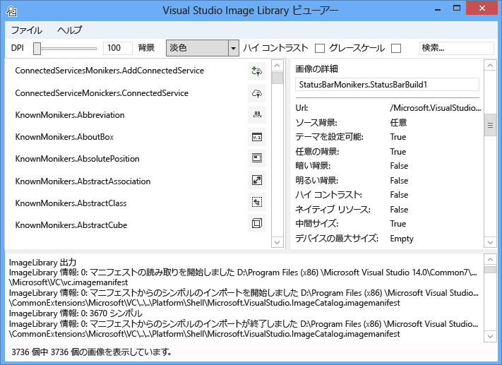
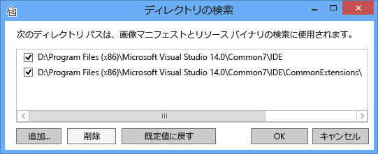
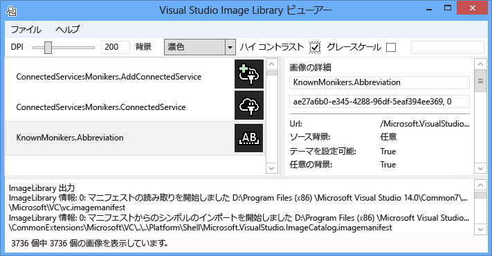
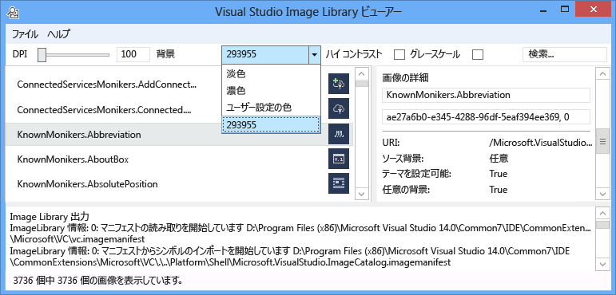
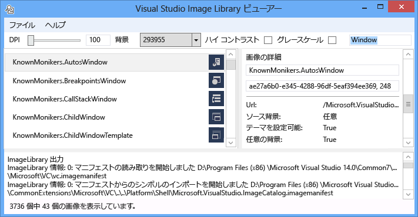
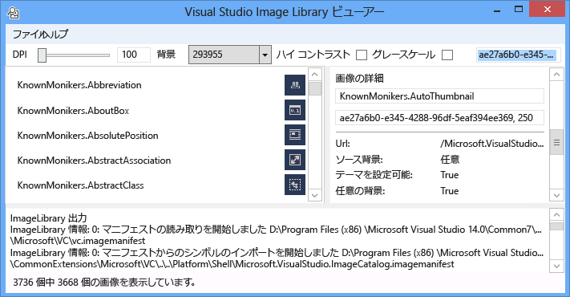
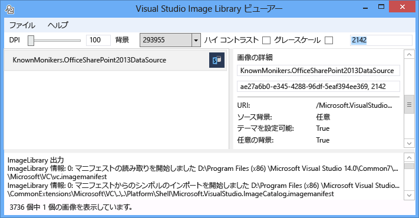

# <a name="image-library-viewer"></a>イメージ ライブラリ ビューアー
Visual Studio Image Library ビューアー ツールは、読み込むし、ユーザーが Visual Studio と同じ方法で操作できるように、画像マニフェストを検索できます。 ユーザーには、バック グラウンド、サイズ、DPI、ハイ コントラスト、およびその他の設定を変更できます。 ツールは、各イメージ マニフェストの読み込み情報を表示し、イメージ マニフェストで各イメージのソース情報を表示します。 このツールは、に役立ちます。  
  
1.  エラーの診断  
  
2.  カスタム イメージ マニフェストで確保属性が正しく設定します。  
  
3.  Visual Studio 拡張機能が Visual Studio のスタイルに合わせて画像を使用できるように、Visual Studio イメージ カタログ内のイメージの検索  
  
   
  
 **イメージのモニカー**  
  
 イメージ モニカー (または略してモニカー) は、イメージ アセットまたはイメージ ライブラリでイメージ リストのアセットを一意に識別する GUID:ID ペアです。  
  
 **イメージ マニフェスト ファイル**  
  
 イメージ マニフェスト (.imagemanifest) ファイルは、これらの資産および実際のイメージまたは各アセットを表すイメージを表すモニカーのイメージ資産のセットを定義する XML ファイルです。 レガシの UI サポートのためのイメージ リストや画像マニフェストは、スタンドアロンのイメージを定義できます。 また、ときに、これらの資産の表示方法を変更する資産と各アセットの背後にある個々 のイメージのどちらかに設定できる属性があります。  
  
 **イメージ マニフェスト スキーマ**  
  
 イメージの完了マニフェストは、このようになります。  
  
```xml  
<ImageManifest>  
      <!-- zero or one Symbols elements -->  
      <Symbols>  
        <!-- zero or more Guid, ID, or String elements -->  
      </Symbols>  
      <!-- zero or one Images elements -->  
      <Images>  
        <!-- zero or more Image elements -->  
      </Images>  
      <!-- zero or one ImageLists elements -->  
      <ImageLists>  
        <!-- zero or more ImageList elements -->  
      </ImageLists>  
</ImageManifest>  
```  
  
 **シンボル**  
  
 読みやすさとメンテナンスに役立てるためとイメージ マニフェストは、属性値のシンボルを使用できます。 シンボルは、次のように定義されています。  
  
```xml  
<Symbols>  
      <Import Manifest="manifest" />  
      <Guid Name="ShellCommandGuid" Value="8ee4f65d-bab4-4cde-b8e7-ac412abbda8a" />  
      <ID Name="cmdidSaveAll" Value="1000" />  
      <String Name="AssemblyName" Value="Microsoft.VisualStudio.Shell.UI.Internal" />  
</Symbols>  
```  
  
|||  
|-|-|  
|**サブ要素**|**定義**|  
|インポート|現在のマニフェストで使用する指定されたマニフェスト ファイルのシンボルをインポートします。|  
|GUID|シンボルは、GUID を表し、GUID の書式設定と一致する必要があります。|  
|ID|シンボルは、ID を表し、負でない整数でなければなりません。|  
|String|シンボルは、任意の文字列値を表します。|  
  
 シンボルは、大文字と小文字、および参照 $(symbol-name) 構文を使用するには。  
  
```xml  
<Image Guid="$(ShellCommandGuid)" ID="$(cmdidSaveAll)" >  
      <Source Uri="/$(AssemblyName);Component/Resources/image.xaml" />  
</Image>  
```  
  
 すべてのマニフェストには、一部のシンボルが定義されています。 これらの Uri 属性で使用できる、\<ソース > または\<インポート > 要素をローカル コンピューター上の参照パス。  
  
|||  
|-|-|  
|**シンボル**|**説明**|  
|CommonProgramFiles|%Commonprogramfiles% 環境変数の値|  
|LocalAppData|LocalAppData 環境変数の値|  
|ManifestFolder|マニフェスト ファイルを含むフォルダー|  
|マイ ドキュメント|現在のユーザーの [マイ ドキュメント] フォルダーの完全なパス|  
|ProgramFiles|%Programfiles% 環境変数の値|  
|システム|Windows \system32 フォルダー|  
|%Windir%|WinDir 環境変数の値|  
  
 **イメージ**  
  
 \<イメージ > 要素は、モニカーで参照できるイメージを定義します。 GUID と ID をまとめると、イメージのモニカーを形成します。 イメージのモニカーは、全体のイメージ ライブラリ全体で一意である必要があります。 複数のイメージに特定のモニカーがある場合、ライブラリのビルド中に発生した 1 つ目は保持されているです。  
  
 これによりには、少なくとも 1 つのソースが含まれる必要があります。 サイズに依存しないソースでは、幅広いサイズで、最適な結果をもたらすは、必須ではありません。 定義されていないサイズのイメージのサービスが要求するかどうか、\<イメージ > 要素のサイズに依存しないソースがないと、サービスは、最適なサイズに固有のソースを選択し、要求されたサイズに拡大します。  
  
```xml  
<Image Guid="guid" ID="int" AllowColorInversion="true/false">  
      <Source ... />  
      <!-- optional additional Source elements -->  
</Image>  
```  
  
|||  
|-|-|  
|**属性**|**定義**|  
|GUID|[必須]イメージのモニカーの GUID 部分|  
|ID|[必須]イメージのモニカーの ID 部分|  
|AllowColorInversion|[省略可能で、既定値は true]イメージが、暗い背景で使用するとは逆にプログラムでの色を持つかどうかを示します。|  
  
 **ソース**  
  
 \<ソース > 要素が 1 つのイメージ ソース アセット (XAML および PNG) を定義します。  
  
```xml  
<Source Uri="uri" Background="background">  
      <!-- optional NativeResource element -->  
 </Source>  
```  
  
|||  
|-|-|  
|**属性**|**定義**|  
|URI|[必須]定義する URI からイメージを読み込むことができます。 次のいずれかを指定できます。<br /><br /> A [Pack URI](http://msdn.microsoft.com/en-US/library/aa970069\(v=vs.100\).aspx)アプリケーションを使用して:///機関<br /><br /> -絶対コンポーネント リソース参照<br /><br /> -ネイティブ リソースを含むファイルへのパス|  
|背景|[オプション]ソースを使用するものではバック グラウンドの種類にどのようなことを示します。<br /><br /> 次のいずれかを指定できます。<br /><br /> - *ライト*: ソースは、明るい背景で使用できます。<br /><br /> - *濃い*: ソースは、暗い背景で使用できます。<br /><br /> - *ハイコントラスト*: ソースは、ハイ コントラスト モードで、色の背景で使用できます。<br /><br /> - *HighContrastLight*: ソースは、ハイ コントラスト モードで明るい背景で使用できます。<br /><br /> -*HighContrastDark*: ソースは、ハイ コントラスト モードで、暗い背景で使用できます。<br /><br /> 場合、**背景**属性を省略すると、ソースは、任意の背景で使用できます。<br /><br /> 場合**背景**は*ライト*、*濃い*、 *HighContrastLight*、または*HighContrastDark*では、ソースの色を反転ことはありません。 場合**背景**を省略するかに設定*ハイコントラスト*、ソースの色の反転は、イメージのによって制御されます**AllowColorInversion**属性。|  
  
 A\<ソース > 要素には、次の省略可能なサブ要素の 1 つだけ持つことができます。  
  
||||  
|-|-|-|  
|**要素**|**属性 (すべてが必須)**|**定義**|  
|\<サイズ >|[値]|ソースは、指定されたサイズ (デバイスのユニット数) のイメージの適用されます。 画像は四角形になります。|  
|\<SizeRange >|MinSize、MaxSize|ソースは、包括的 (デバイス単位で) の MaxSize を MinSize からイメージに使用されます。 画像は四角形になります。|  
|\<ディメンション >|幅、高さ|ソースは、指定した幅と高さ (デバイス単位) のイメージの適用されます。|  
|\<DimensionRange >|MinWidth、MinHeight、<br /><br /> MaxWidth、MaxHeight|ソースは、包括的イメージの幅/高さの最小値から最大の幅と高さ (デバイス単位で) に使用されます。|  
  
 A\<ソース > 要素は省略可能なこともできます\<NativeResource > サブ要素を定義する、\<ソース > マネージ アセンブリではなく、ネイティブ アセンブリから読み込まれる。  
  
```xml  
<NativeResource Type="type" ID="int" />  
```  
  
|||  
|-|-|  
|**属性**|**定義**|  
|型|[必須]ネイティブ リソース、XAML または PNG のいずれかの種類|  
|ID|[必須]ネイティブ リソースの整数 ID の部分|  
  
 **ImageList**  
  
 \<ImageList > 要素が 1 つのストリップに返すことができるイメージのコレクションを定義します。 必要に応じて、ストリップがオンデマンドで作成されています。  
  
```xml  
<ImageList>  
      <ContainedImage Guid="guid" ID="int" External="true/false" />  
      <!-- optional additional ContainedImage elements -->  
 </ImageList>  
```  
  
|||  
|-|-|  
|**属性**|**定義**|  
|GUID|[必須]イメージのモニカーの GUID 部分|  
|ID|[必須]イメージのモニカーの ID 部分|  
|外部|[省略可能で、既定値は false]イメージ モニカーが現在のマニフェストでイメージを参照するかどうかを示します。|  
  
 含まれているイメージのモニカーを現在のマニフェストで定義されているイメージを参照する必要はありません。 イメージ ライブラリに含まれているイメージが見つからない場合、空のプレース ホルダー イメージは、代わりに使用されます。  
  
## <a name="how-to-use-the-tool"></a>ツールを使用する方法  
 **カスタム イメージ マニフェストの検証**  
  
 カスタム マニフェストを作成するには、マニフェストを自動生成 ManifestFromResources ツールを使用することをお勧めします。 カスタム マニフェストを検証するには、イメージ ライブラリ ビューアーを起動し、ファイルを選択 > パスの設定 ディレクトリの検索 ダイアログを開きます。 イメージ マニフェストを読み込む検索ディレクトリが使用されますが、それもが使用されます、マニフェストでイメージを含む .dll ファイルを検索することになるようにこのダイアログ ボックスで、マニフェストと DLL ディレクトリの両方を含めるようにしてください。  
  
   
  
 をクリックして**を追加しています.** マニフェストとその対応する Dll 検索に新しい検索ディレクトリを選択します。 このツールはこれらの検索ディレクトリに保存され、変換できる、オンまたはオフをオンまたはオフにするディレクトリ。  
  
 既定では、ツールしようと、Visual Studio インストール ディレクトリを検索し、検索ディレクトリの一覧にこれらのディレクトリを追加します。 ツールを検索しないディレクトリを手動で追加することができます。  
  
 すべてのマニフェストが読み込まれ、ツールを使用を切り替える**背景**色、 **DPI**、**ハイ コントラスト**、または**ディザリングを行います**のイメージ、ユーザーは、さまざまな設定を正しく、レンダリングされるされていることを確認するイメージの資産を調べることができます視覚的にようにします。  
  
   
  
 背景色は、淡色、濃色、またはカスタム値を設定できます。 「カスタム色」を選択すると、色の選択 ダイアログ ボックスを開き、簡単な取り消し後のバック グラウンドのコンボ ボックスの下部にそのカスタム色を追加します。  
  
   
  
 イメージのモニカーを選択すると、右側の画像の詳細ペインで、そのモニカーの背後にある各実際のイメージ情報が表示されます。 ウィンドウでは、名前または生の GUID:ID 値では、モニカーをコピーすることもできます。  
  
   
  
 イメージ ソースごとに表示される情報テーマを付けるかどうか、上に表示するバック グラウンドの種類が含まれていますハイ コントラストなどは妥当なサイズをサポートしているまたはサイズに依存しないであるかどうかや、イメージは、ネイティブ アセンブリから取得するかどうか。  
  
   
  
 イメージ マニフェストを検証する場合は、マニフェスト、およびイメージの実際の場所に DLL を配置することをお勧めします。 相対パスが正しく動作していると、イメージ ライブラリが検索し、マニフェストとイメージ DLL を読み込むことができますが確認されます。  
  
 **イメージ カタログ KnownMonikers の検索**  
  
 Visual Studio スタイルに合わせて、Visual Studio 拡張機能は、Visual Studio イメージ カタログではなくを作成すると使用方法、独自のイメージを使用できます。 これにより、それらのイメージを維持する必要がないの利点は、Visual Studio でサポートされているすべての DPI 設定の正しいなりますので、イメージが高 DPI のバックアップ イメージを持つことが保証します。  
  
 イメージ ライブラリ ビューアーでは、ユーザーがイメージ アセットを表すモニカーを検索したり、コード内でそのモニカーを使用できるように検索するマニフェストを使用します。 イメージを検索するに検索ボックスに、必要な検索用語を入力し、Enter キーを押します。 一致の件数内で見つかった合計イメージからのすべてのマニフェストの下部にあるステータス バーが表示されます。  
  
   
  
 既存のマニフェストでイメージ モニカーを検索するときに、検索して、Visual Studio イメージ カタログのモニカーのみ、その他の意図的にパブリックにアクセスできるモニカーまたは独自のカスタムのモニカーを使用することをお勧めします。 非パブリックのモニカーを使用する場合のカスタム UI が壊れている可能性がありますか、イメージ変更された予期しない方法で場合、またはこれらの非パブリックなモニカーおよびイメージを変更または更新したとき。  
  
 また、GUID によって検索が可能です。 この種の検索が 1 つのマニフェストにリストをフィルター処理に役立つか、マニフェストの場合は、そのマニフェストの 1 つのサブセクションには、複数の Guid が含まれています。  
  
   
  
 最後に、ID によって検索も可能になります。  
  
   
  
## <a name="notes"></a>メモ  
  
-   既定では、ツールは Visual Studio インストール ディレクトリにあるいくつかのイメージ マニフェストで取得します。 パブリックに使用できるようにモニカーを持つ 1 つだけが、 **Microsoft.VisualStudio.ImageCatalog**マニフェストします。 GUID: ae27a6b0-e345-4288-96df-5eaf394ee369 (しないで**いない**カスタム マニフェストにこの GUID を上書き) の種類: KnownMonikers  
  
-   ツールは、アプリケーションが、実際に表示するのに数秒かかる場合がありますのでが見つかると、すべてのイメージ マニフェストを読み込む 起動時に試行します。 ありますが遅いか応答していない、マニフェストの読み込み中に。  
  
## <a name="sample-output"></a>出力例  
 このツールは、出力を生成しません。