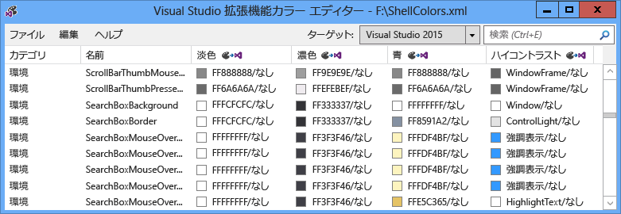
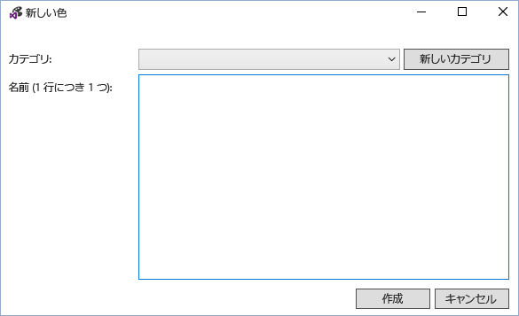
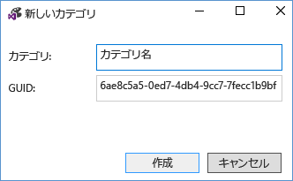
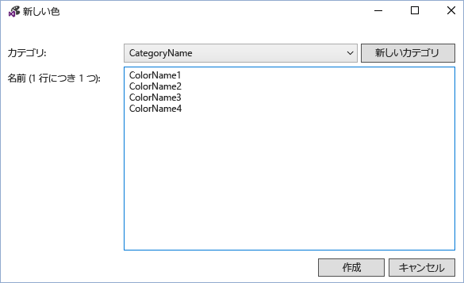
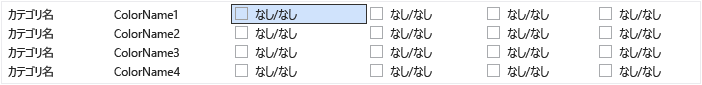
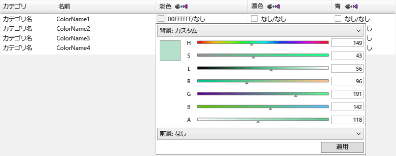
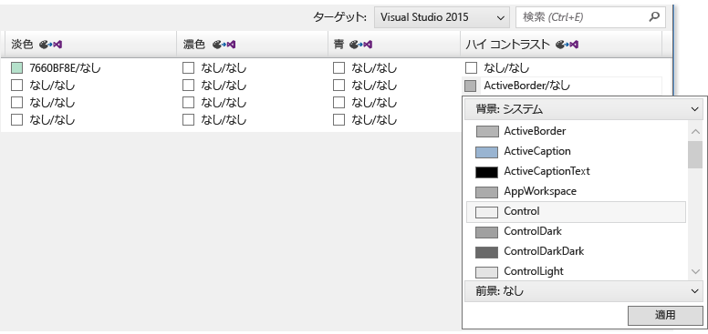
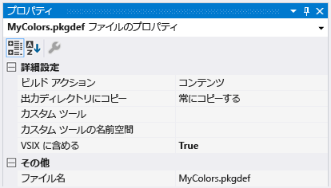
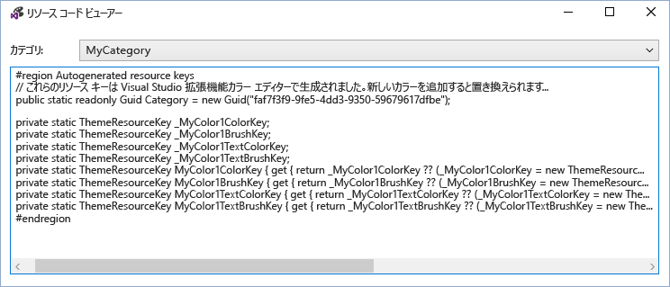
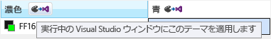

# <a name="vsix-color-editor"></a>VSIX カラー エディター
Visual Studio 拡張機能カラー エディター ツールでは、作成でき、Visual Studio のカスタム色を編集することができます。 色は、コードで使用できるように、ツールは、テーマのリソース キーを生成もできます。 このツールは、色のテーマをサポートする Visual Studio 拡張機能をするのに役立ちます。 このツールは、.pkgdef および .xml ファイルを開くことができます。 Visual Studio のテーマ (.vstheme ファイル) をファイル拡張子を .xml に変更することで Visual Studio 拡張機能カラー エディターで使用できます。 さらに、.vstheme ファイルは、現在の .xml ファイルにインポートできます。  
  
   
  
 **パッケージ定義ファイル**  
  
 パッケージ定義 (.pkgdef) ファイルは、テーマを定義するファイルです。 色自体は、.pkgdef ファイルにコンパイルされるテーマの色 .xml ファイルに格納されます。 .Pkgdef ファイルの Visual Studio の検索可能な場所にデプロイされた、実行時に処理およびテーマを定義する結合していること。  
  
 **色のトークン**  
  
 色のトークンは、4 つの要素で構成されています。  
  
-   **カテゴリ名:** 色のセットを論理的にグループ化します。 目的の UI 要素、または UI 要素のグループに固有の色が既に存在している場合は、既存のカテゴリ名を使用します。  
  
-   **トークン名:** トークンとトークンの色のわかりやすい名前を設定します。 背景と前景 (テキスト) のトークン名だけでなく、すべての州をセットに含まれます、ペアと適用される状態を識別しやすいようにこれら名前必要があります。  
  
-   **色の値 (または色相):** カラー テーマごとに必要です。 常に作成背景とテキスト色の値のペアにします。 テキスト (前景) 色が常が描画される背景色を読み取れるように背景と前景の色がペアリングされます。 これらの色はリンクされ、UI で同時に使用されます。 背景は、テキストで使用するためのものではありません、前景色を定義してください。  
  
-   **システム色の名前。** ハイ コントラスト表示で使用します。  
  
## <a name="how-to-use-the-tool"></a>ツールを使用する方法  
 可能な限り、新しいものではなく、既存の Visual Studio の色を再利用する必要があります、適切な場所。 ただし、適切な色が定義されていない場合は、カスタムの色を互換性のある、拡張機能のテーマを保持する作成する必要があります。  
  
 **新しい色のトークンを作成します。**  
  
 Visual Studio 拡張機能カラー エディターを使用してカスタムの色を作成するには、次の手順を実行します。  
  
1. 新しい色のトークンのカテゴリとトークンの名前を決定します。  
  
2. ハイ コントラストのテーマとしたシステム カラーの UI 要素を使用するための異なる色合いを選択します。  
  
3. カラー エディターを使用すると、新しい色のトークンを作成できます。  
  
4. Visual Studio 拡張機能で色を使用します。  
  
5. Visual Studio での変更をテストします。  
  
   **手順 1:新しい色のトークンのカテゴリとトークンの名前を決定します。**  
  
   VSColor は、推奨される名前付けスキーム **[Category] [UI の種類] [State]** します。 冗長であるために、VSColor 名に"color"という単語を使わないでください。  
  
   カテゴリ名は、論理的にグループ化を行い、可能な限り狭くとして定義する必要があります。 たとえば、カテゴリ名を指定することが 1 つのツール ウィンドウの名前が、ビジネス全体の単位またはプロジェクト チームの名前ではありません。 エントリのカテゴリにグループ化では、同じ名前の色の間の混乱を防止します。  
  
   トークン名は、要素の型と状況は、または「状態を」色の適用を明確に示す必要があります。 など、アクティブなデータのヒントの **[UI の種類]** という名前を付けることが"**データヒント**"と **[State]** という可能性があります"**Active**、"の結果として得られる、色の名前"**DataTipActive**"。 データのヒント テキストがあるため、前景と背景色を定義する必要があります。 背景と前景の組み合わせを使用して、カラー エディターが自動的に作成、色"**DataTipActive**"の背景と"**DataTipActiveText**"前景色。  
  
   UI の 1 つだけの状態がある場合、 **[State]** 名の一部を省略できます。 たとえば、検索ボックスの境界線を使用する境界線の色に影響する状態の変更はない場合は、し、罫線の色のトークンの名前だけです呼び出せる"**SearchBoxBorder**"。  
  
   いくつかの一般的な状態名は次のとおりです。  
  
- アクティブ  
  
- 非アクティブ  
  
- MouseOver  
  
- MouseDown  
  
- 選択済み  
  
- フォーカスされている  
  
  リスト項目コントロールのパーツのいくつかのトークン名の例:  
  
- ListItem  
  
- ListItemBorder  
  
- ListItemMouseOver  
  
- ListItemMouseOverBorder  
  
- ListItemSelected  
  
- ListItemSelectedBorder  
  
- ListItemDisabled  
  
- ListItemDisabledBorder  
  
  **手順 2:ハイ コントラストのテーマとしたシステム カラーの UI 要素を使用するための異なる色合いを選択します。**  
  
  UI のカスタム色を選択する際に、類似した既存の UI 要素を選択し、その色のベースとして使用します。 ボックスの UI 要素の色があるため、適切なすべてのテーマで正しく動作にの確認およびテストするには、行われています。  
  
  **手順 3:カラー エディターを使用すると、新しい色のトークンを作成できます。**  
  
  カラー エディターを起動し、開くか、新しいカスタム テーマの色の .xml ファイルを作成します。 選択**編集 > 新しい色** メニューから。 これは、カテゴリを指定するためのダイアログとそのカテゴリ内の色のエントリの 1 つまたは複数の名前が表示されます。  
  
    
  
  既存のカテゴリを選択するか選択**新しいカテゴリ**新しいカテゴリを作成します。 別のダイアログが開き、新しいカテゴリ名を作成します。  
  
    
  
  新しいカテゴリで使用可能になるされますし、**新しい色**カテゴリ ドロップダウン メニュー。 カテゴリを選択すると、新しい各色のトークンの 1 行につき 1 つの名前を入力し、完了したら [作成] を選択します。  
  
    
  
  色の値は、"None"、色が定義されていないことを示すと、背景と前景のペアで表示されます。 注: 色がテキストの色や背景の色ペアを持たない場合、バック グラウンドのみ定義する必要があります。  
  
    
  
  色トークンを編集するには、そのトークンのテーマ (列) の色のエントリを選択します。 ARGB 形式の 8 桁の 16 進カラー値を入力するか、セルに、システムの色の名前を入力またはスライダーの色のセットまたはシステムの色の一覧を使用して目的の色を選択するドロップダウン メニューを使用して、色の値を追加します。  
  
    
  
    
  
  テキストを表示する必要のないコンポーネントでは、1 つだけの色の値を入力します。 背景色。 それ以外の場合、スラッシュで区切られた、背景色とテキストの両方の色の値を入力します。  
  
  ハイ コントラストの値を入力するときに、有効な Windows システム色の名前を入力します。 ハードコードされた ARGB 値を入力しないでください。 有効なシステム色の名前の一覧を表示するを選択"背景。システム"または"前景色。色の値のドロップダウン メニューから"システム。 テキストのコンポーネントを持つ要素を作成するときに正しい背景/テキストのシステム カラー ペアを使用して、またはテキストが読み取り可能なない可能性があります。  
  
  作成、設定、および色のトークンの編集が完了したら、必要な .xml または .pkgdef 形式に保存します。 どちらの背景を持つトークンの色もフォア グラウンドのセットを .xml の形式で空の色として保存されますが、.pkgdef 形式で破棄されます。 .Pkgdef ファイルを空の色を保存しようとした場合は、ダイアログ ボックスで色損失の可能性を警告します。  
  
  **手順 4:Visual Studio 拡張機能で色を使用します。**  
  
  新しい色を定義した後、トークンは、「ビルド アクション」、「コンテンツ」に設定をプロジェクト ファイルに、.pkgdef を含めるし、"VSIX に含める""True"に設定します。  
  
    
  
  Visual Studio 拡張機能カラー エディターで、ファイルの選択 > WPF ベースの UI でカスタムにアクセスするために使用されるコードを表示するリソース コードの表示の色します。  
  
    
  
  このコードをプロジェクトに静的クラスに含めます。 参照を**Microsoft.VisualStudio.Shell\< 。VSVersion >.0.dll**を使用するプロジェクトに追加する必要があります、 **ThemeResourceKey**型。  
  
```csharp  
namespace MyCustomColors  
{  
    public static class MyCategory  
    {  
        #region Autogenerated resource keys  
        // These resource keys are generated by Visual Studio Extension Color Editor, and should be replaced when new colors are added to this category.  
        public static readonly Guid Category = new Guid("faf7f3f9-9fe5-4dd3-9350-59679617dfbe");  
  
        private static ThemeResourceKey _MyColor1ColorKey;  
        private static ThemeResourceKey _MyColor1BrushKey;  
        private static ThemeResourceKey _MyColor1TextColorKey;  
        private static ThemeResourceKey _MyColor1TextBrushKey;  
        public static ThemeResourceKey MyColor1ColorKey { get { return _MyColor1ColorKey ?? (_MyColor1ColorKey = new ThemeResourceKey(Category, "MyColor1", ThemeResourceKeyType.BackgroundColor)); } }  
        public static ThemeResourceKey MyColor1BrushKey { get { return _MyColor1BrushKey ?? (_MyColor1BrushKey = new ThemeResourceKey(Category, "MyColor1", ThemeResourceKeyType.BackgroundBrush)); } }  
        public static ThemeResourceKey MyColor1TextColorKey { get { return _MyColor1TextColorKey ?? (_MyColor1TextColorKey = new ThemeResourceKey(Category, "MyColor1", ThemeResourceKeyType.ForegroundColor)); } }  
        public static ThemeResourceKey MyColor1TextBrushKey { get { return _MyColor1TextBrushKey ?? (_MyColor1TextBrushKey = new ThemeResourceKey(Category, "MyColor1", ThemeResourceKeyType.ForegroundBrush)); } }  
        #endregion  
    }  
}  
```  
  
 これにより、XAML コード内の色へのアクセスでき、テーマの変更に応答する UI。  
  
```xaml  
<UserControl x:Class="NewTestProject.TestPackageControl" Name="MyToolWindow"  
             xmlns="http://schemas.microsoft.com/winfx/2006/xaml/presentation"  
             xmlns:x="http://schemas.microsoft.com/winfx/2006/xaml"  
             xmlns:ns="clr-namespace:MyCustomColors">  
  <Grid>  
    <TextBlock Background="{DynamicResource {x:Static ns:MyCategory.MyColor1BrushKey}}"  
               Foreground="{DynamicResource {x:Static ns:MyCategory.MyColor1TextBrushKey}}"  
      >Sample Text</TextBlock>  
  
  </Grid>  
</UserControl>  
```  
  
 **手順 5:Visual Studio での変更をテストします。**  
  
 カラー エディターは、拡張機能パッケージをリビルドせずに色のライブの変更を表示する Visual Studio の実行中のインスタンスへの色のトークンを一時的に適用できます。 これを行うには、各テーマの列のヘッダーにある「Visual Studio の windows を実行しているこのテーマを適用」ボタンをクリックします。 VSIX カラー エディターを閉じるときに、この一時的なテーマは表示されなく。  
  
   
  
 変更を永続的な再構築し、.pkgdef ファイルを新しい色を追加し、その色を使用するコードを記述した後、Visual Studio 拡張機能を再デプロイします。 Visual Studio 拡張機能を再構築すると、テーマの残りの部分に新しい色のレジストリ値がマージされます。 Visual Studio を再起動し、UI を表示し、期待どおりに新しい色が表示されることを確認します。  
  
## <a name="notes"></a>メモ  
 このツールは、既存の Visual Studio のテーマまたは Visual Studio のカスタム テーマの色を編集するためのカスタム色を作成するために使用します。 完全なカスタム Visual Studio のテーマを作成するには、ダウンロード、 [Visual Studio 配色テーマ エディター拡張機能](https://marketplace.visualstudio.com/items?itemName=VisualStudioProductTeam.VisualStudio2015ColorThemeEditor)Visual Studio の拡張機能ギャラリーから。  
  
## <a name="sample-output"></a>出力例  
 **色の XML 出力**  
  
 ツールによって生成された .xml ファイルに次のようになります。  
  
```xml  
<Themes>  
  <Theme Name="Light" GUID="{de3dbbcd-f642-433c-8353-8f1df4370aba}">  
    <Category Name="CategoryName" GUID="{eee9d521-dac2-48d9-9a5e-5c625ba2040c}">  
      <Color Name="ColorName1">  
        <Background Type="CT_RAW" Source="FFFFFFFF" />  
      </Color>  
      <Color Name="ColorName2">  
        <Background Type="CT_RAW" Source="FFFFFFFF" />  
        <Foreground Type="CT_RAW" Source="FF000000" />  
      </Color>  
      <Color Name="ColorName3">  
        <Background Type="CT_RAW" Source="FFFF0000" />  
      </Color>  
      <Color Name="ColorName4">  
        <Background Type="CT_RAW" Source="FF000088" />  
        <Foreground Type="CT_RAW" Source="FFFFFFFF" />  
      </Color>  
    </Category>  
  </Theme>  
  <Theme Name="Dark" GUID="{1ded0138-47ce-435e-84ef-9ec1f439b749}">...</Theme>  
  <Theme Name="Blue" GUID="{a4d6a176-b948-4b29-8c66-53c97a1ed7d0}">...</Theme>  
  <Theme Name="HighContrast" GUID="{a5c004b4-2d4b-494e-bf01-45fc492522c7}">...</Theme>  
</Themes>  
  
```  
  
 **PKGDEF 色出力**  
  
 ツールによって生成された、.pkgdef ファイルは、次のようになります。  
  
```  
[$RootKey$\Themes\{de3dbbcd-f642-433c-8353-8f1df4370aba}\CategoryName]  
"Data"=hex:78,00,00,00,0b,00,00,00,01,00,00,00,21,d5,e9,ee,c2,da,d9,48,9a,5e,5c,62,5b,a2,04,0c,04,00,00,00,0a,00,00,00,43,6f,6c,6f,72,4e,61,6d,65,31,01,ff,ff,ff,ff,00,0a,00,00,00,43,6f,6c,6f,72,4e,61,6d,65,32,01,ff,ff,ff,ff,01,00,00,00,ff,0a,00,00,00,43,6f,6c,6f,72,4e,61,6d,65,33,01,ff,00,00,ff,00,0a,00,00,00,43,6f,6c,6f,72,4e,61,6d,65,34,01,00,00,88,ff,01,ff,ff,ff,ff  
[$RootKey$\Themes\{1ded0138-47ce-435e-84ef-9ec1f439b749}\CategoryName]  
"Data"=hex:...  
[$RootKey$\Themes\{a4d6a176-b948-4b29-8c66-53c97a1ed7d0}\CategoryName]  
"Data"=hex:...  
[$RootKey$\Themes\{a5c004b4-2d4b-494e-bf01-45fc492522c7}\CategoryName]  
"Data"=hex:...  
  
```  
  
 **C# のリソース キーのラッパー**  
  
 ツールによって生成される色リソース キーは、次のようになります。  
  
```csharp  
namespace MyNamespace  
{  
    public static class MyColors  
    {  
        #region Autogenerated resource keys  
        // These resource keys are generated by Visual Studio Extension Color Editor, and should be replaced when new colors are added to this category.  
  
        public static string ColorName1ColorKey { get { return "ColorName1ColorKey"; } }  
        public static string ColorName1BrushKey { get { return "ColorName1BrushKey"; } }  
  
        public static string ColorName2ColorKey { get { return "ColorName2ColorKey"; } }  
        public static string ColorName2BrushKey { get { return "ColorName2BrushKey"; } }  
        public static string ColorName2TextColorKey { get { return "ColorName2TextColorKey"; } }  
        public static string ColorName2TextBrushKey { get { return "ColorName2TextBrushKey"; } }  
  
        public static string ColorName3ColorKey { get { return "ColorName4ColorKey"; } }  
        public static string ColorName3BrushKey { get { return "ColorName4BrushKey"; } }  
        public static string ColorName3TextColorKey { get { return "ColorName4TextColorKey"; } }  
        public static string ColorName3TextBrushKey { get { return "ColorName4TextBrushKey"; } }  
        #endregion  
    }  
}  
```  
  
 **WPF リソース ディクショナリのラッパー**  
  
 色**ResourceDictionary**ツールによって生成されたキーに次のようになります。  
  
```xaml  
<ResourceDictionary xmlns="http://schemas.microsoft.com/winfx/2006/xaml/presentation"  
        xmlns:x="http://schemas.microsoft.com/winfx/2006/xaml"  
        xmlns:colors="clr-namespace:MyNamespace">  
  
  <SolidColorBrush x:Key="{x:Static colors:MyColors.ColorName1BrushKey}" Color="#FFFFFFFF" />  
  <Color x:Key="{x:Static colors:MyColors.ColorName1ColorKey}" A="255" R="255" G="255" B="255" />  
  
  <SolidColorBrush x:Key="{x:Static colors:MyColors.ColorName2BrushKey}" Color="#FFFFFFFF" />  
  <Color x:Key="{x:Static colors:MyColors.ColorName2ColorKey}" A="255" R="255" G="255" B="255" />  
  <SolidColorBrush x:Key="{x:Static colors:MyColors.ColorName2TextBrushKey}" Color="#FF000000" />  
  <Color x:Key="{x:Static colors:MyColors.ColorName2TextColorKey}" A="255" R="0" G="0" B="0" />  
  
  <SolidColorBrush x:Key="{x:Static colors:MyColors.ColorName3BrushKey}" Color="#FFFF0000" />  
  <Color x:Key="{x:Static colors:MyColors.ColorName3ColorKey}" A="255" R="255" G="0" B="0" />  
  
  <SolidColorBrush x:Key="{x:Static colors:MyColors.ColorName4BrushKey}" Color="#FF000088" />  
  <Color x:Key="{x:Static colors:MyColors.ColorName4ColorKey}" A="255" R="0" G="0" B="136" />  
  <SolidColorBrush x:Key="{x:Static colors:MyColors.ColorName4TextBrushKey}" Color="#FFFFFFFF" />  
  <Color x:Key="{x:Static colors:MyColors.ColorName4TextColorKey}" A="255" R="255" G="255" B="255" />  
</ResourceDictionary>  
```