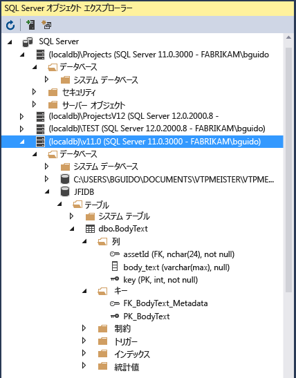

# Visual Studio 2017 の機能

Visual Studio の基礎についてはトピック「[Visual Studio IDE の概要](../ide/visual-studio-ide.md)」で説明しています。 この記事では、経験を積んだ開発者または Visual Studio を使い慣れている開発者に適した機能について説明します。

## モジュール式インストール

Visual Studio のモジュラー インストーラーでは、*ワークロード* (好みのプログラミング言語やプラットフォームで必要な機能のグループ) を選択してインストールできます。 この方法により、Visual Studio のインストールのフットプリントが小さくなり、インストールと更新に要する時間が短縮されました。

Visual Studio 2017 をまだインストールしていない場合は、[Visual Studio のダウンロード](https://www.visualstudio.com/downloads/?utm_medium=microsoft&utm_source=docs.microsoft.com&utm_campaign=button+cta&utm_content=download+vs2017) ページに移動し、無料試用版をインストールしてください。

お使いのシステムに Visual Studio をセットアップする方法について詳しくは、「[Visual Studio 2017 のインストール](../install/install-visual-studio.md)」をご覧ください。

## Azure 用のクラウド対応アプリの作成

Visual Studio には、Microsoft Azure を使用するクラウド ファーストのアプリケーションを簡単に作成できるツールのスイートが用意されています。 これにより、IDE から直接 Microsoft Azure でアプリケーションとサービスを簡単に構成、ビルド、デバッグ、パッケージ化、およびデプロイできます。 Azure Tools およびプロジェクト テンプレートを入手するには、Visual Studio をインストールするときに **Azure 開発**ワークロードを選択します。

**Azure 開発**ワークロードのインストール後は、**[新しいプロジェクト]** ダイアログ ボックスで、以下に示す C# 用 **[クラウド]** テンプレートを使用することができます。

Visual Studio の [Cloud Explorer](/azure/vs-azure-tools-resources-managing-with-cloud-explorer) では、Visual Studio 内の Azure ベースのクラウド リソースを表示および管理できます。 これらのリソースには仮想マシン、テーブル、SQL データベースなどが含まれる場合があります。 **Cloud Explorer** には、ユーザーがログインしている Azure サブスクリプションで管理されているすべてのアカウントに含まれる Azure リソースが表示されます。 特定の操作で Azure Portal が必要な場合は、**Cloud Explorer** によって提供されるリンクから Azure Portal 内の目的の場所に移動できます。

次のような**接続済みサービス**を使用して、アプリに Azure のサービスを活用することができます。

- ユーザーが [Azure Active Directory](/azure/active-directory/active-directory-whatis) からのアカウントを使用して Web アプリに接続するための [Active Directory 接続済みサービス](/azure/active-directory/develop/vs-active-directory-add-connected-service)
- BLOB ストレージ、キュー、およびテーブル用の [Azure Storage 接続済みサービス](/azure/vs-azure-tools-connected-services-storage)
- Web アプリのシークレットを管理する [Key Vault 接続済みサービス](/azure/key-vault/vs-key-vault-add-connected-service)

使用できる**接続済みサービス**はプロジェクトの種類によって異なります。 サービスを追加するには、**ソリューション エクスプローラー**内のプロジェクトを右クリックし、**[追加]** > **[接続済みサービス]** の順に選択します。

詳細については、[Visual Studio および Azure を使用したクラウドへの移行](https://www.visualstudio.com/vs/azure-tools/)に関するページを参照してください。

## Web 用のアプリの作成

現在世界を動かしているのは Web であり、Visual Studio は Web 用のアプリの作成をサポートします。 Web アプリは ASP.NET、Node.js、Python、JavaScript、TypeScript を使用して作成できます。 Visual Studio は、Angular、jQuery、Express などの Web フレームワークを理解します。 ASP.NET Core と .NET Core は、Windows、Mac、Linux の各オペレーティング システムで実行できます。 [ASP.NET Core](http://www.asp.net/core/overview) は、MVC、WebAPI、および SignalR へのメジャー アップデートであり、Windows、Mac、および Linux で実行されます。  ASP.NET Core は、最新のクラウド ベースの Web アプリとサービスをビルドするための効率的で構成可能な .NET スタックを提供するために、まったく新たに設計されました。

詳細については、「[最新の Web ツール](https://www.visualstudio.com/vs/modern-web-tooling/)」をご覧ください。

## クロス プラットフォーム アプリとゲームをビルドする

Visual Studio を使用して、macOS、Linux、Windows 用のアプリおよびゲームをビルドし、Android、iOS、およびその他の[モバイル デバイス](https://www.visualstudio.com/vs/mobile-app-development/)用のアプリおよびゲームもビルドします。

- Windows、macOS、および Linux で実行される [.NET Core](/dotnet/core/) アプリをビルドします。

- [Xamarin](https://developer.xamarin.com/guides/cross-platform/windows/visual-studio/) を使用して、iOS、Android、および Windows 向けにモバイル アプリをビルドします。

- 標準的な Web テクノロジである &mdash;HTML、CSS、および JavaScript&mdash; を使用して iOS、Android、および Windows 用のモバイル アプリをビルドするには、[Apache Cordova](/visualstudio/cross-platform/tools-for-cordova/) を使用します。

- [Visual Studio Tools for Unity](../cross-platform/visual-studio-tools-for-unity.md) を使用して、C# で 2D および 3D ゲームをビルドします。

- [C++ for Cross-Platform Development](../cross-platform/visual-cpp-for-cross-platform-mobile-development.md) を使用することによって、iOS、Android、および Windows デバイス対応のネイティブ C++ アプリをビルドし、iOS、Android、および Windows 用にビルドされたライブラリ内で共通コードを共有します。

- [Android エミュレーター](../cross-platform/visual-studio-emulator-for-android.md)で、Android アプリを展開、テスト、およびデバッグします。

## データベースへの接続

**サーバー エクスプローラー**は、ローカル、リモートで、また Azure、Salesforce.com、Office 365、および Web サイトで SQL Server インスタンスとアセットを参照および管理するのに役立ちます。 **サーバー エクスプローラー**を開くには、メイン メニューで **[表示]** > **[サーバー エクスプローラー]** の順に選択します。 サーバー エクスプローラーの使用方法について詳しくは、「[Add new connections](../data-tools/add-new-connections.md)」 (新しい接続の追加) をご覧ください。

[SQL Server Data Tools (SSDT)](/sql/ssdt/download-sql-server-data-tools-ssdt) は、SQL Server、Azure SQL Database、Azure SQL Data Warehouse 用の強力な開発環境です。 データベースを構築、デバッグ、管理、およびリファクターできます。 データベース プロジェクトを操作したり、オンプレミスまたはオフプレミスで接続されたデータベース インスタンスを直接操作したりすることができます。

Visual Studio の **SQL Server オブジェクト エクスプローラー**では、SQL Server Management Studio と同様のデータベース オブジェクトのビューを提供します。 SQL Server オブジェクト エクスプローラーを使用すると、軽いデータベース管理と設計作業を実行できます。これには、SQL Server オブジェクト エクスプローラーのコンテキスト メニューを使用したテーブル データの編集、スキーマの比較、クエリの実行などが含まれます。

## デバッグとテストによるコードの改善

コードを記述する際には、バグの存在やパフォーマンスを確認するために実際に実行してテストする必要があります。 Visual Studio の最新のデバッグ システムを使うと、ローカル プロジェクト、リモート デバイス、または[デバイス エミュレーター](../cross-platform/visual-studio-emulator-for-android.md)で実行されるコードをデバッグできます。 一度に 1 つのステートメントずつ、コードを実行して必要に応じて変数を検査できます。 指定した条件が True の場合にのみヒットするブレークポイントを設定することができます。 すべてコード エディター自体で管理できるため、コードを離れる必要はありません。 Visual Studio でのデバッグの詳細については、[デバッガーの機能ツアー](../debugger/debugger-feature-tour.md)に関するページをご覧ください。

アプリのパフォーマンスを改善する方法の詳細については、Visual Studio の[プロファイリング](../profiling/profiling-feature-tour.md)に関するページを参照してください。

[テスト](../test/improve-code-quality.md)として、Visual Studio には単体テスト、Live Unit Testing、IntelliTest、負荷およびパフォーマンス テストなどが用意されています。 Visual Studio はまた、デザイン、セキュリティ、およびその他の種類の不具合を検出する[コード分析](../code-quality/code-analysis-for-managed-code-overview.md)機能も備えています。

## 完成したアプリケーションを配置する

アプリケーションをユーザーやお客様に配置する用意ができたら、Visual Studio で配置するためのツールが提供されます。Microsoft ストアや SharePoint サイトに配置する場合でも、InstallShield または Windows インストーラー テクノロジを利用する場合でも提供されます。 これはすべて、IDE を使用してアクセスできます。 詳細については、「[アプリケーション、サービス、およびコンポーネントの配置](../deployment/deploying-applications-services-and-components.md)」をご覧ください。

## ソース コードの管理および他のユーザーとの共同作業

GitHub などの任意のプロバイダーがホストしている Git リポジトリにあるソース コードを管理できます。 また、[Visual Studio Team Services (VSTS)](/vsts/index) を使用して、プロジェクト全体でコードをバグおよび作業項目と共に管理することもできます。 Visual Studio でチーム エクスプローラーを使用して Git リポジトリを管理する方法の詳細については、[Git および Team Services (VSTS) の概要](/vsts/git/gitquickstart?tabs=visual-studio)に関するページを参照してください。 Visual Studio には、その他の組み込みのソース管理機能もあります。 それらの機能の詳細については、ブログ「[New Git Features in Visual Studio 2017](https://blogs.msdn.microsoft.com/visualstudioalm/2017/03/06/new-git-features-in-visual-studio-2017/)」(Visual Studio 2017 の新しい Git 機能) をご覧ください。

Visual Studio Team Services は、ソフトウェア プロジェクトをホストし、チームでのコラボレーションを有効にするためのクラウド ベースのサービスです。 VSTS は、Git ソース管理システムと Team Foundation ソース管理システムの両方をサポートしています。また、Scrum、CMMI、アジャイル開発方法もサポートしています。 Team Foundation バージョン管理 (TFVC) は、単一の集中サーバー リポジトリを使用して、ファイルを追跡してバージョン管理します。 ローカルの変更は常に集中サーバーにチェックインされます。他の開発者はそこで、最新の変更を取得できます。

Team Foundation Server (TFS) は、Visual Studio のアプリケーション ライフサイクル管理のハブです。 これにより、開発プロセスに関わるすべてのユーザーが 1 つのソリューションを使用して参加できるようになります。 TFS は、異種混合のチームやプロジェクトを管理するのにも役立ちます。

Visual Studio Team Services のアカウントまたは Team Foundation Server がネットワーク上にある場合、Visual Studio の **[チーム エクスプローラー]** ウィンドウから接続することができます。 このウィンドウからソース管理にコードをチェックインしたりソース管理からコードをチェックアウトできます。また、作業項目を管理したり、ビルドを開始したり、チームのルームやワークスペースにアクセスできます。 **チーム エクスプローラー**は、**[クイック起動]** ボックスから、**[ビュー]** > **[チーム エクスプローラー]** の順に選択してメイン メニューから、または **[チーム]** > **[接続の管理]** の順に選択して開くことができます。

次の図は、VSTS でホストされているソリューションの **[チーム エクスプローラー]** ウィンドウを示しています。

チームの開発者がバージョン管理にチェックインしたコードをビルドするように、ビルド プロセスを自動化することもできます。 たとえば、1 つまたは複数のプロジェクトを夜間にビルドすることも、コードのチェックインごとにビルドすることもできます。 詳細については、「[Build and Release (VSTS and TFS)](/vsts/build-release/index)」(ビルドとリリース (VSTS と TFS)) を参照してください。

## Visual Studio を拡張する

Visual Studio に必要な機能がない場合は、機能を追加できます。 ワークフローとスタイルに基づいて IDE をカスタマイズしたり、Visual Studio にまだ統合されていない外部ツールのサポートを追加したり、既存の機能を変更して生産性の向上を図ることができます。 Visual Studio 機能拡張ツール (VS SDK) の最新バージョンを検索するには、「 [Visual Studio SDK](../extensibility/visual-studio-sdk.md)」を参照してください。

.NET Compiler Platform ("Roslyn") を使って、独自のコード アナライザーとコード ジェネレーターを記述することができます。 必要なものはすべて [Roslyn](https://github.com/dotnet/Roslyn)に揃っています。

Microsoft 開発者や開発コミュニティが作成した Visual Studio の[既存の拡張機能](https://marketplace.visualstudio.com/vs) を検索してください。

Visual Studio の拡張について詳しくは、「[Visual Studio IDE を機能拡張する](https://www.visualstudio.com/vs/extend/)」をご覧ください。

## 関連項目

- [Visual Studio IDE の概要](../ide/visual-studio-ide.md)
- [Visual Studio 2017 の新機能](../ide/whats-new-in-visual-studio.md)