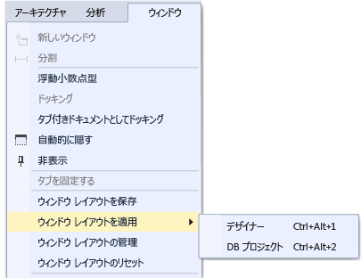

# Visual Studio のウィンドウ レイアウトをカスタマイズする

Visual Studio では、さまざまな開発ワークフローに最も適したウィンドウのレイアウトを作成するために、ウィンドウの位置、サイズ、および動作をカスタマイズできます。 レイアウトをカスタマイズすると、IDE はそれを記憶します。 たとえば、 **ソリューション エクスプローラー** のドッキング位置を変更した後で Visual Studio を閉じた場合、次回起動時には、別のコンピューターで作業していても、 **ソリューション エクスプローラー** が同じ位置にドッキングされます。 また、カスタム レイアウトに名前を付けて保存した後、1 つのコマンドでレイアウト間を切り替えることもできます。 たとえば、編集用のレイアウトとデバッグ用のレイアウトを作成し、**[ウィンドウ]**、**[ウィンドウ レイアウトを適用]** メニュー コマンドを使用してそれらを切り替えることができます。

## ウィンドウの種類

### ツール ウィンドウとドキュメント ウィンドウ

IDE には *ツール ウィンドウ* と *ドキュメント ウィンドウ*の 2 種類の基本的なウィンドウがあります。 ツール ウィンドウには、**ソリューション エクスプローラー**、**サーバー エクスプローラー**、**出力ウィンドウ**、**エラー一覧**、デザイナー、デバッガー ウィンドウなどがあります。 ドキュメント ウィンドウには、ソース コード ファイル、任意のテキスト ファイル、構成ファイルなどが含まれます。 ツール ウィンドウは、サイズを変更したり、タイトル バーでドラッグしたりできます。 ドキュメント ウィンドウはタブでドラッグできます。ウィンドウに関するその他のオプションを設定するには、タブまたはタイトルバーを右クリックします。

**[ウィンドウ]** メニューには、IDE でのウィンドウのドッキング、フローティング、および非表示のオプションが表示されます。 ウィンドウのタブまたはタイトル バーを右クリックすると、その特定のウィンドウのその他のオプションが表示されます。 特定のツール ウィンドウの複数のインスタンスを同時に表示できます。 たとえば、複数の Web ブラウザー ウィンドウを表示することができます。また、 **[ウィンドウ]** メニューの **[新規ウィンドウ]** を選択して、複数のツール ウィンドウの追加のインスタンスを作成できます。

### [プレビュー] タブ (ドキュメント ウィンドウ)

**[プレビュー]** タブで、ファイルを開かずに、エディターで見ることができます。 ファイルのプレビューは、**ソリューション エクスプローラー**でファイルを選択したり、デバッグ中にファイルにステップ インしたり、**[定義へ移動]** を使用したり、検索結果を参照する際に利用できます。 プレビュー ファイルはドキュメント タブの右側にあるタブに表示されます。 ファイルを変更するか **[開く]** を選択すると、編集のためにファイルが開きます。

### タブ グループ

タブ グループは、IDE で 2 つ以上のドキュメントを開いて作業しているときに、限られたワークスペースを管理する能力を拡張します。 複数のドキュメント ウィンドウとツール ウィンドウを縦または横のタブ グループに整理し、あるタブ グループから別のグループにドキュメントを入れ替えることができます。

### 分割ウィンドウ

1 つのドキュメント内で同時に 2 つの場所を表示または編集する必要があるときに、ウィンドウを分割できます。 2 つの独立したスクロール セクションにドキュメントを分割するには、 **[ウィンドウ]** メニューの **[分割]** をクリックします。 1 つのビューを戻すには、 **[ウィンドウ]** メニューの **[分割の解除]** をクリックします。

### ツールバー

ツール バーは、ドラッグするか **[カスタマイズ]** ダイアログ ボックスを使用して配置できます。 ツールバーを配置およびカスタマイズする方法の詳細については、[メニューおよびツール バーをカスタマイズする方法](../ide/how-to-customize-menus-and-toolbars-in-visual-studio.md)に関するページを参照してください。

## ウィンドウの整列と固定

ドキュメント ウィンドウまたはツール ウィンドウは *ドッキング*できるので、IDE のウィンドウ フレーム内にサイズを合わせて配置したり、または IDE とは独立したウィンドウとしてフローティングさせることもできます。 ツール ウィンドウは IDE フレーム内のどこにでもドッキングできます。一部のツール ウィンドウは、エディター フレーム内のタブ付きウィンドウとしてドッキングできます。 ドキュメント ウィンドウはエディター フレーム内にドッキングでき、タブ順の現在の位置にピン留めすることができます。 複数のウィンドウを "*ラフト操作*" で IDE 上または IDE 外で一緒にフローティングするよう、ドッキングできます。 また、ツール ウィンドウは非表示にしたり最小化することもできます。

次の方法でウィンドウを配置できます。

-   タブ ウェルの左側にドキュメント ウィンドウを固定する。

-   タブによりウィンドウを編集フレームにドッキングする。

-   IDE の枠の端にツール ウィンドウをドッキングする。

-   ドキュメントまたはツール ウィンドウを IDE 上または IDE の外部にフローティングする。

-   ツール ウィンドウを IDE の端で非表示にする。

-   ウィンドウを別々のモニターに表示する。

-   ウィンドウの場所を既定のレイアウト、または保存済みのカスタム レイアウトにリセットする。

ツール ウィンドウとドキュメント ウィンドウは、ドラッグ、 **[ウィンドウ]** メニューのコマンドの使用、および配置するウィンドウのタイトル バーの右クリックによって配置できます。

### ウィンドウのドッキング

ツール ウィンドウのタイトル バーまたはドキュメント ウィンドウのタブをクリックしてドラッグすると、ガイド用のひし形が表示されます。 ドラッグ操作中にマウス カーソルが、ひし形の矢印のいずれかの上にくると、網かけされた部分が表示されます。これは、この時にマウスのボタンを離すと、ウィンドウがドッキングされるを示しています。

ドッキング可能ウィンドウをスナップせずに移動するには、**Ctrl** キーを押しながらウィンドウをドラッグします。

ツール ウィンドウまたはドキュメント ウィンドウを直近のドッキング場所に戻すには、**Ctrl** キーを押しながらウィンドウのタイトル バーまたはタブをダブルクリックします。

次の図は、ドキュメント ウィンドウのガイド用のひし形を示しています。ドキュメント ウィンドウは、編集フレーム内にのみドッキングできます。

ツール ウィンドウは、IDE の枠の 1 辺または編集フレーム内に固定できます。 ツール ウィンドウを別の位置にドラッグすると、ウィンドウの再ドッキングが容易になるように、ガイド用のひし形が表示されます。

ツール ウィンドウのガイド用のひし形

次の図は、青の網掛け部分で示されている、新しい場所にドッキングされている**ソリューション エクスプローラー**を示しています。

### ツール ウィンドウを閉じる/自動的に隠す

タイトル バーの右上にある **[X]** をクリックして、ツール ウィンドウを閉じることができます。ウィンドウを再び開くには、キーボード ショートカットかメニュー コマンドを使用します。 ツール ウィンドウでは*自動非表示*という機能をサポートしています。これは、別のウィンドウを使用すると現在のウィンドウが非表示になるものです。 ウィンドウが自動非表示になっている場合は、IDE の端にあるタブにウィンドウの名前が表示されます。 非表示のウィンドウをもう一度使用する場合は、タブをポイントすると、そのウィンドウが元の状態で表示されます。

> [!NOTE]
> [自動的に隠す] の操作対象が、個々のツール ウィンドウなのか、ドッキングされているウィンドウ グループなのかを設定するには、 **[オプション]** ダイアログ ボックスの **[[自動的に隠す] ボタンをアクティブなツール ウィンドウにのみ実行する]** をオンまたはオフにします。 詳細については、「[[全般] ([オプション] ダイアログ ボックス - [環境])](../ide/reference/general-environment-options-dialog-box.md)」を参照してください。

> [!NOTE]
> [自動的に隠す] が選択されているツール ウィンドウにフォーカスを移すと、そのウィンドウが一時的に表示されることがあります。 ウィンドウを再び非表示にするには、そのウィンドウの外部にあるアイテムをクリックします。 フォーカスが別のアイテムに移ると、ウィンドウはビューから外れて元の状態に戻ります。

### 2 台目のモニターを指定する

2 台目のモニターがあり、オペレーティング システムでサポートされる場合は、ウィンドウをいずれのモニターに表示するのかを選択できます。 他のモニターで "*ラフト操作*" し、複数のウィンドウをグループ化することもできます。

> [!TIP]
> **ソリューション エクスプローラー** の複数のインスタンスを作成し、別のモニターに移動することもできます。 ウィンドウを右クリックし、 **[新しいソリューション エクスプローラー ビュー]** をクリックします。 **Ctrl** キーを押しながらダブルクリックすると、すべてのウィンドウを元のモニターに戻すことができます。

### ウィンドウ レイアウトのリセット、名前付け、および切り替え

**[ウィンドウ レイアウトのリセット]** を使用して設定コレクションを IDE の元のウィンドウ レイアウトに戻すことができます。 このコマンドを実行すると、次のアクションが発生します。

-   すべてのウィンドウが既定の場所に移動されます。

-   既定のウィンドウ レイアウトで閉じられているウィンドウは閉じられます。

-   既定のウィンドウ レイアウトで開かれているウィンドウは開かれます。

### カスタム レイアウトの作成と保存

Visual Studio を使用すると、最大 10 個のカスタム ウィンドウ レイアウトを保存し、すばやく切り替えることができます。 次の手順では、ドッキングされた状態およびフローティング状態のツール ウィンドウを使用して複数のモニターを活用するためのカスタム レイアウトの作成、保存、呼び出し、管理方法を説明します。

最初に、2 つのプロジェクトがあるテスト ソリューションを作成し、それぞれに最適な別個のレイアウトを設定します。

#### UI プロジェクトの作成とレイアウトのカスタマイズ

1.  **[新しいプロジェクト]** ダイアログで、**C# WPF デスクトップ アプリケーション**を作成し、任意の名前を付けます。 これがユーザー インターフェイスを操作するプロジェクトであることを装うため、デザイナー ウィンドウのスペースを最大にして、その他のツール ウィンドウを邪魔にならない所に移動したいと思います。

2.  複数のモニターがある場合は、 **ソリューション エクスプローラー** ウィンドウと **プロパティ** ウィンドウを 2 台目のモニターに移動させます。 シングル モニター システムでは、デザイナー以外のウィンドウはすべて閉じてください。

3.  **Ctrl + Alt + X** キーを押して**ツールボックス**を表示します。 ウィンドウがドッキングされている場合は、いずれかのモニターの配置したい場所でウィンドウがフローティングするように、ウィンドウをドラッグします。

4.  **F5** キーを押して Visual Studio をデバッグ モードにします。 **自動変数**、**呼び出しスタック**、**出力**の各デバッグ ウィンドウを任意の場所に移動します。 作成するレイアウトは、編集モードとデバッグ モードの両方に適用されます。

5.  デバッグ モードと編集モードの両方でレイアウトが希望どおりになったら、[メイン メニュー] で **[ウィンドウ]**、**[ウィンドウのレイアウトを保存]** の順にクリックします。 このレイアウトを "デザイナー" と呼びます。

     新しいレイアウトには、**Ctrl** + +  **Alt**  +  **1 ～ 0** キーの予約リストから次のキーボードのショートカットが割り当てられることに注意してください。

#### データベース プロジェクトとレイアウトの作成

1.  新しい **SQL Server データベース** プロジェクトをソリューションに追加します。

2.  **ソリューション エクスプローラー**で新しいプロジェクトを右クリックし、**[オブジェクト エクスプローラーで表示]** 選択します。 **SQL Server オブジェクト エクスプローラー** ウィンドウが表示され、データベース内のテーブル、ビュー、その他のオブジェクトにアクセスできるようになります。 このウィンドウは、フローティングさせることも、ドッキングしたままにすることもできます。 もう一方のツール ウィンドウを、好きなように調整します。 よりリアルにするために実際のデータベースを追加することもできますが、このチュートリアルでは必要ありません。

3.  レイアウトが希望どおりになったら、[メイン メニュー] から、**[ウィンドウ]**、**[ウィンドウ レイアウトの保存]** の順にクリックします。 このレイアウトを "DB プロジェクト" と呼びます。 (このプロジェクトではデバッグ モードのレイアウトは扱いません。)

#### レイアウトの切り替え

レイアウトを切り替えるには、キーボードのショートカットを使うか、[メイン メニュー] で **[ウィンドウ]**、**[ウィンドウ レイアウトの適用]** の順にクリックします。

UI のレイアウトを適用後、編集モードとデバッグ モードの両方でレイアウトがどのように保持されているかに注意してください。

仕事場ではマルチ モニターがセットアップされ、自宅にはシングル モニターのノート PC がある場合、それぞれのコンピューター向けに最適化されたレイアウトを作成できます。

> [!NOTE]
> マルチモニターのレイアウトをシングルモニターのシステムに適用すると、2 台目のモニターに配置したフローティング ウィンドウが Visual Studio ウィンドウの背後に隠れるようになります。 **Alt キーを押しながら Tab キー**を押すと、背後にあるウィンドウを前に出すことができます。後で Visual Studio を複数のモニターで開く場合、レイアウトを再度適用して、ウィンドウを指定された場所に復元してください。

#### レイアウトの管理とローミング

**[ウィンドウ]**、**[ウィンドウ レイアウトの管理]** 順に選択し、カスタム レイアウトの削除、名前変更、または順序変更を行えます。 レイアウトを移動すると、キー バインドがリスト内の新しい位置を反映するように自動調整されます。 バインディングは変更できないため、同時に保存できるレイアウトは最大 10 個です。

どのキーボード ショートカットがどのレイアウトに割り当てられているかを確認するには、**[ウィンドウ]**、**[ウィンドウ レイアウトの適用]** を選択します。

これらのレイアウトは、Visual Studio のエディション間だけでなく、別のコンピューターの Blend インスタンス間や、任意の Express エディションからその他の Express 組織に自動的にローミングされます。 ただし、レイアウトは Visual Studio、Blend、Express の間ではローミングしません。

## 関連項目

- [方法: IDE 内で移動する](../ide/how-to-move-around-in-the-visual-studio-ide.md)