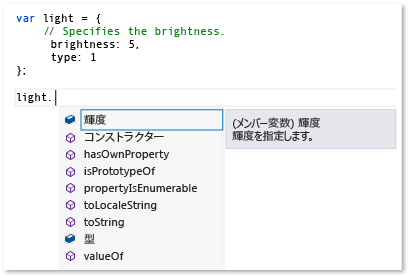
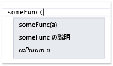
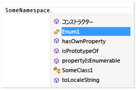

# JavaScript IntelliSense の拡張
[!INCLUDE[vs2017banner](../code-quality/includes/vs2017banner.md)]

JavaScript IntelliSense の機能拡張機能は、サードパーティのライブラリの JavaScript エディターの IntelliSense 結果をカスタマイズできるようにします。  これは、これらのライブラリを使用する開発者の操作性を向上できます。  
  
 JavaScript の言語サービスがプロジェクトに追加される JavaScript のサードパーティ製ライブラリでは、IntelliSense の機能を提供します。  ほとんどのライブラリは、ステートメント入力候補は言語サービスによって自動的に提供されます。  次の図は、ステートメント入力候補の例を示します:  
  
   
  
 ライブラリが、標準の JavaScript のコメントのタグに変数、関数、およびオブジェクトの説明 \(\/\/\) と、コンプリート リストの要素の右に表示される場合や、関数呼び出しの左かっこを入力するポップアップ ボックスの説明情報を提供する IntelliSense の機能拡張機能から自動的に、既定で利用できます。  ポップアップ ボックスのコメントは、メンバーの説明が表示されます。  次の例では、コンプリート リストのポップアップ ボックスを示しています。  
  
   
  
 さらにの操作性を向上させるために、ポップアップ ボックスの開発者に型情報を提供する可能性があります。  標準コメントのタグではなく JavaScript [XML ドキュメント コメント](../ide/xml-documentation-comments-javascript.md) を使用して、型の情報を提供します。  トリプル スラッシュ コメント内にタグ \(\/\/\/\) および定義された一連の XML 要素を使用して XML ドキュメント コメントを追加します。  
  
 また、JavaScript IntelliSense の機能拡張を使用して型情報を提供できます。  この機能は、JavaScript 拡張機能を作成し、スクリプトのコンテキストに追加して、IntelliSense の結果をカスタマイズできるようにします。  JavaScript ファイルである拡張では、言語サービスの `intellisense` のオブジェクトによって公開されるイベントをサブスクライブします。  JavaScript IntelliSense の機能拡張は、JavaScript の言語サービスは IntelliSense のサポートの目的のレベルを提供する、宣言 XML ドキュメント コメントへの代わりに、必要とされた場合はライブラリなしの動作によってライブラリに設定されたソリューションです。  IntelliSense の結果をカスタマイズすると、言語サービスの既定の機能を制限する動作のパターンに関係なく、IntelliSense にファーストクラスのエクスペリエンスを作成できます。  詳細については、「[識別子の入力候補](../ide/statement-completion-for-identifiers.md)」を参照してください。  
  
## スクリプトのコンテキストへ拡張機能の追加  
 実行される IntelliSense の拡張子に対して現在のスクリプトのコンテキストに追加する必要があります。  拡張機能が自動検出機構によってスクリプトのコンテキストに自動的に追加したり、スクリプトのコンテキストに参照またはグループの参照ディレクティブを使用して拡張機能を手動で追加できます。  
  
 自動検出機構が自動的に *libraryname*.intellisense.js ファイルの名前付け規則に従う、拡張子を適用するライブラリと同じディレクトリにあり拡張機能の検索言語サービスを有効にします。  たとえば、jQuery ライブラリの有効な拡張機能が jQuery.intellisense.js です。  より制限の厳しい jQuery の拡張機能の場合、jQuery\-1.7.1.intellisense.js \(バージョン固有の拡張機能\) または \(jQuery.ui.intellisense.js スコープの jQuery ライブラリの拡張機能\) などのファイル名を使用できます。  拡張機能の最も制限されたバージョンは複数の拡張子が特定のライブラリにある場合に使用されます。  
  
 JavaScript のすべてのプロジェクト ファイル用の拡張機能を使用する場合は、参照グループに拡張子を追加する場合は、代わりにを選択する場合があります。  専用のワーカー スレッドの参照を含む参照グループ、または暗黙の参照を含むそれらの複数それらの型があります。  拡張機能を追加するには、通常、暗黙的な参照変換グループ、またはの **\[暗黙 \(Windows\)\]**、**\[暗黙 \(Web\)\]** としてファイルを追加する必要があります。  暗黙の参照がコード エディターで開かれた .js ファイルのスコープ内にあります。  このメソッドを使用すると、拡張機能と拡張機能が補っているファイルの両方を追加する必要があります。  
  
 参照グループとして拡張子を追加するには **\[オプション\]** のダイアログ ボックスの **\[IntelliSense\]** のページを使用します。  **\[ツール\]**、メニュー バーと **\[テキスト エディター\]**、**\[JavaScript\]** を選択するための **\[オプション\]** を選択して **\[IntelliSense\]**、**\[参照\]\[IntelliSense\]** のページにアクセスできます。  参照グループの詳細については、[JavaScript IntelliSense](../ide/javascript-intellisense.md) と [\[オプション\]、\[テキスト エディター\]、\[JavaScript\]、\[IntelliSense\]](../ide/reference/options-text-editor-javascript-intellisense.md)を参照してください。  
  
 特定のファイル セットに対して拡張機能を使用する場合は、参照ディレクティブを使用します。  このメソッドを使用すると、拡張機能を参照する必要があり、拡張子が補ってするファイル。  参照ディレクティブの使用については、[JavaScript IntelliSense](../ide/javascript-intellisense.md)を参照してください。  
  
## IntelliSense のイベント処理  
 機能拡張機能は、言語サービスの `intellisense` のオブジェクトの `statementcompletion` のイベントのようなイベントをサブスクライブすることで IntelliSense の結果をカスタマイズできるようにします。  次の例では、ステートメント入力候補のアンダースコアで始まるメンバーを非表示にするには、言語サービスによって使用される単純な拡張を示します。  このコードは underscorefilter.js に含まれ、\\\\の*Visual Studio インストール パス*の\\JavaScript\\References フォルダーにあります。  
  
```javascript  
intellisense.addEventListener('statementcompletion', function (event) {  
    if (event.targetName === "this") return;  
  
    var filterRegex;  
  
    if (event.target === undefined || event.target === window)  
        filterRegex = /^_.*\d{2,}/;  
    else  
        filterRegex = /^_.*/;  
  
    event.items = event.items.filter(function (item) {  
        return !filterRegex.test(item.name);  
    });  
});  
```  
  
 上のコードでは、[targetName のプロパティ](#TargetName) をチェックし、`this` と `window`などのオブジェクトを解除し、有効なステートメント入力候補リストを指定できるようにするには `statementcompletion` のイベントの [ターゲット プロパティ](#Target) のプロパティを追加します。  コンプリート リストが識別できる場合、拡張機能はアンダースコアで始まるメンバーをフィルターで除外して、ステートメント入力候補の [項目のプロパティ](#Items) のコレクションを更新します。  
  
 そのほかの例については、\\\\の*Visual Studio インストール パス*の\\JavaScript\\References フォルダーを参照します。  このフォルダーの showPlainComments.js ファイルは、標準の JavaScript のコメントのタグに既定の IntelliSense サポートを提供するために他のイベントの使用例を示します \(\/\/\)。  underscorefilter.js のように、showPlainComments.js は既に機能拡張子として使用できるようになり、コメントのタグをコード内で使用するときに、変数、関数、およびオブジェクトについては、IntelliSense、結果の情報を確認できます。  その他の例については、「[コード例](#CodeExamples)」を参照してください。  
  
> [!WARNING]
>  Visual Studio に含まれているファイル拡張子を変更すると拡張機能でサポートされている JavaScript IntelliSense や機能を無効にできます。  
  
 拡張コードでは、`addEventListener`を使用して次の種類のイベントのハンドラーを作成します:  
  
-   `statementcompletion`、ステートメントの完了イベントのハンドラーを追加。  ステートメント入力候補を特定の型にピリオド \(.\) などの特殊文字を入力した、または入力する間、または Ctrl \+ J を押すと表示される識別子の後に一覧表示されるメンバーの一覧を示します。  ハンドラーは、次のメンバーをサポートする型 `CompletionEvent`のイベント オブジェクトを受け取ります: [項目のプロパティ](#Items)、[ターゲット プロパティ](#Target)[targetName のプロパティ](#TargetName)、および [範囲のプロパティ](#Scope)。  
  
-   `signaturehelp`、IntelliSense のパラメーター情報のハンドラーを追加。  パラメーター情報は、関数で必要とされるパラメーターの数、名前、およびデータ型について説明します。  ハンドラーは、次のメンバーをサポートする型 `SignatureHelpEvent`のイベント オブジェクトを受け取ります: [ターゲット プロパティ](#Target)[parentObject のプロパティ](#ParentObject)、[functionComments のプロパティ](#FunctionComments)、[functionHelp のプロパティ](#FunctionHelp)。  
  
-   `statementcompletionhint`、IntelliSense クイック ヒントのハンドラーを追加。  クイック ヒント ポップアップ ボックスは、コード内の識別子の完全な申告を示します。  ハンドラーは、次のメンバーをサポートする型 `CompletionHintEvent`のイベント オブジェクトを受け取ります: [completionItem のプロパティ](#CompletionItem)と [symbolHelp のプロパティ](#SymbolHelp)。  
  
 ステートメント入力候補は、パラメーターの情報およびクイック ヒントなど、IntelliSense の機能を示す例については、[IntelliSense の使用方法](../ide/using-intellisense.md)を参照してください。  
  
> [!NOTE]
>  JavaScript では、クイック ヒントが入力候補一覧の右に表示されるポップアップ ボックスが表示されます。  手動でクイック ヒントを呼び出すことはできません。  
  
##  <a name="intellisenseObject"></a> intellisense のオブジェクト  
 次の表は `intellisense` のオブジェクトで使用できる関数を示しています。  `intellisense` のオブジェクトは、デザイン時にのみ使用できます。  
  
|Function|説明|  
|--------------|--------|  
|`addEventListener(type, handler);`|IntelliSense のイベントのイベント ハンドラーを追加します。<br /><br /> `type` は文字列値です。  有効な値は `statementcompletion`、`signaturehelp`と `statementcompletionhint`が含まれます。<br /><br /> `handler` は次の 1 種類の二つのイベント オブジェクトを受け取るイベント ハンドラー関数です:<br /><br /> -   `statementcompletion` のイベントに使用する`CompletionEvent`。<br />-   `signaturehelp` のイベントに使用する`SignatureHelpEvent`。<br />-   `statementcompletionhint` のイベントに使用する`CompletionHintEvent`。<br /><br /> この関数を使用する例については、[コード例](#CodeExamples)"を参照してください。|  
|`annotate(obj, doc);`|1 個のオブジェクトから別のオブジェクトにドキュメント コメントをコピーしてオブジェクトに対してドキュメントを指定します。<br /><br /> `obj` は、ドキュメントをコピーするオブジェクトを指定します。<br /><br /> `doc` は、ドキュメントをコピーするオブジェクトを指定します。<br /><br /> この関数を使用する方法について [IntelliSense のコメントの追加](#Annotations)の例について。|  
|`getFunctionComments(func);`|指定した関数のコメントを返します。<br /><br /> `func` はコメントがを返す関数を指定します。<br /><br /> `completionItem.value`を使用して `func` のパラメーターを設定できます。<br /><br /> `functionComments` の返されたオブジェクトは、次のメンバーも含まれます: `above`、`inside`と `paramComment`。  詳細については、[functionComments のプロパティ](#FunctionComments) プロパティのトピックを参照してください。<br /><br /> `getFunctionComments` は `addEventListener`して登録されたイベント ハンドラー内から 1 のみ呼び出すことができます。<br /><br /> この関数を使用する方法を確認\\\\*Visual Studio インストール パス*\\JavaScript\\References\\showPlainComments.js の例について。|  
|`logMessage(msg);`|出力ウィンドウに診断メッセージを送信します。<br /><br /> `msg` はメッセージを格納する文字列です。<br /><br /> この関数を使用する方法を確認 [[出力]ウィンドウにメッセージを送信できます。](#Logging)の例について。|  
|`nullWithCompletionsOf(value);`|コンプリート リストが `value` のパラメーターで渡されるオブジェクトによって決定される特別な NULL 値を返します。<br /><br /> `value` は、返される値のコンプリート リストが決まります。  `value` は、型を使用できます。<br /><br /> null の戻り値は、デザイン時と同様に処理された null ですが、戻り値のコンプリート リストには `value` のパラメーターのコンプリート リスト同じです。<br /><br /> この関数の 1 とおりの使用は戻り値の型を実行時に予測できますが、戻り値はデザイン時に `null` には戻り値に IntelliSense を提供することです。|  
|`redirectDefinition(func, definition);`|パラメーター ヘルプまたは **\[定義へ移動\]** が要求されたときに IntelliSense 機能に元の関数の代わりに提供されている定義関数を使用するように指示します。<br /><br /> `func` が対象の関数を指定します。<br /><br /> `definition` はパラメーター情報と **\[定義へ移動\]** の対象の関数の代わりに使用される関数を指定します。|  
|`setCallContext(func, thisArg);`|指定した関数の呼び出しコンテキスト \(スコープを設定します。<br /><br /> `func` は範囲を設定する関数を指定します。<br /><br /> `thisArg` は、メンバーの新しい範囲を指定する `this` のキーワードが参照できるオブジェクト リテラルです。  このパラメーターは、たとえば、`intellisense.setCallContext(func, { thisArg: "", args: [23,2] });`}\) に渡す引数を含めることができます。<br /><br /> `setCallContext` は `Function.prototype.bind`と同様に動作しますが、デザイン時の IntelliSense のサポートにのみ使用されます。  関数を呼び出すときに、関数呼び出しは正しい範囲と引数を含めるように、別の方法で到達可能でないコードへの呼び出しをシミュレートする必要がある場合は、関数のスコープを設定するには `setCallContext` を使用できます。|  
|`undefinedWithCompletionsOf(value);`|コンプリート リストが `value` のパラメーターで渡されるオブジェクトによって決定される特別によって未定義にした値を返します。<br /><br /> `value` は、返される値のコンプリート リストが決まります。  `value` は、型を使用できます。<br /><br /> 未定義の戻り値は、デザイン時に未定義同様に扱われますが、戻り値のコンプリート リストには `value` のパラメーターのコンプリート リスト同じです。<br /><br /> この関数の 1 とおりの使用は戻り値の型を実行時に予測できますが、戻り値はデザイン時に未定義には戻り値に IntelliSense を提供することです。|  
|`version()`|Visual Studio のバージョンを返します。|  
  
## イベントのメンバー  
 次のセクションでは、次のイベントのイベント オブジェクトで公開されているメンバーについて説明します: `statementcompletion`、`signaturehelp`と `statementcompletionhint`。  
  
###  <a name="CompletionItem"></a> completionItem のプロパティ  
 クイック ヒント ポップアップ ボックスが必要な入力候補項目と呼ばれる識別子を返します。  このプロパティは `statementcompletionhint` のイベント オブジェクトに `statementcompletion` のイベント オブジェクトの [項目のプロパティ](#Items) のプロパティで使用できます。  
  
 戻り値: `completionItem` のオブジェクト  
  
 ここでは `completionItem` のオブジェクトのメンバーです:  
  
-   `name`.  `items` のコレクションで使用すると読み取り\/書き込み; は、読み取り専用です。  入力候補項目を識別する文字列を返します。  
  
-   `kind`.  `items` のコレクションで使用すると読み取り\/書き込み; は、読み取り専用です。  入力候補項目の種類を表す文字列を返します。  有効な値は、メソッド、フィールド、プロパティ、変数、パラメーター、予約されてです。  
  
-   `glyph`.  `items` のコレクションで使用すると読み取り\/書き込み; は、読み取り専用です。  コンプリート リストに表示するアイコンを表す文字列を返します。  `glyph` の値には次のファイル形式が使用されます: 対して: *glyphType* が <xref:Microsoft.VisualStudio.Language.Intellisense.StandardGlyphGroup> の列挙型の言語に依存しないメンバーに対応しています。、*glyphType*。  たとえば、`vs:GlyphGroupMethod` は `glyph`の 1 種類の値です。  `glyph` を設定しないと、`kind` のプロパティは、既定のアイコンが決まります。  
  
-   `parentObject`.  読み取り専用です。  親オブジェクトを返します。  
  
-   `value`.  読み取り専用です。  入力候補項目の値を表すオブジェクトを返します。  
  
-   `comments`.  読み取り専用です。  フィールドまたは変数の上にあるコメントを含む文字列を返します。  
  
-   `scope`.  読み取り専用です。  入力候補項目の範囲を返します。  有効な値は、グローバル、ローカル、パラメーターとメンバーです。  
  
###  <a name="Items"></a> 項目のプロパティ  
 ステートメント入力候補の項目の配列を取得または設定します。  配列の各要素は [completionItem のプロパティ](#CompletionItem) のオブジェクトです。  `items` のプロパティは `statementcompletion` のイベント オブジェクトで使用できます。  
  
 戻り値: 配列  
  
###  <a name="FunctionComments"></a> functionComments のプロパティ  
 関数のコメントを返します。  このプロパティは `signaturehelp` のイベント オブジェクトで使用できます。  
  
 戻り値: `comments` のオブジェクト  
  
 ここでは `comments` のオブジェクトのメンバーです:  
  
-   `above`.  関数の上のコメントを返します。  
  
-   `inside`.  VSDoc ファイル形式の関数の中のコメントを、通常返します。  
  
-   `paramComments`.  関数のパラメーターごとのコメントを表す配列を返します。  配列のメンバーは次のとおりです。:  
  
    -   `name`.  パラメーター名を表す文字列を返します。  
  
    -   `comment`.  パラメーターのコメントを含む文字列を返します。  
  
###  <a name="FunctionHelp"></a> functionHelp のプロパティ  
 関数のヘルプを返します。  このプロパティは `signaturehelp` のイベント オブジェクトで使用できます。  
  
 戻り値: `functionHelp` のオブジェクト  
  
 ここでは `functionHelp` のオブジェクトのメンバーです:  
  
-   `functionName`.  読み取り\/書き込み。  関数名を含む文字列を返します。  
  
-   `signatures`.  読み取り\/書き込み。  関数の定義の配列を取得または設定します。  配列の各要素は `signature` のオブジェクトです。  `signature` のプロパティは、`locid`のような [XML ドキュメント コメント](../ide/xml-documentation-comments-javascript.md) 共通の属性に対応します。  
  
     `signature` のオブジェクトのメンバーは次のとおりです。:  
  
    -   `description`.  読み取り\/書き込み。  関数を説明する文字列を返します。  
  
    -   `locid`.  読み取り\/書き込み。  関数のローカリゼーション情報を含む文字列の識別子を返します。  
  
    -   `helpKeyword`.  読み取り\/書き込み。  ヘルプのキーワードを含む文字列を返します。  
  
    -   `externalFile`.  読み取り\/書き込み。  メンバー ID を含むファイルを表す文字列を返します  
  
    -   `externalid`.  読み取り\/書き込み。  のメンバー関数の ID を表す文字列を返します。  
  
    -   `params`.  読み取り\/書き込み。  関数のパラメーターの配列を取得または設定します。  パラメーター配列の各要素は [\< param \>](../ide/param-javascript.md) の要素に次の属性に対応するプロパティを持つ `parameter` のオブジェクトです:  
  
        -   `name`.  読み取り\/書き込み。  パラメーター名を表す文字列を返します。  
  
        -   `type`.  読み取り\/書き込み。  パラメーターの型を表す文字列を返します。  
  
        -   `elementType`.  読み取り\/書き込み。  型が `Array`場合、配列の要素の型を表す文字列を返します。  
  
        -   `description`.  読み取り\/書き込み。  パラメーターを説明する文字列を返します。  
  
        -   `locid`.  読み取り\/書き込み。  関数のローカリゼーション情報を含む文字列の識別子を返します。  
  
        -   `optional`.  読み取り\/書き込み。  パラメーターは省略可能であるかどうかを示す文字列を返します。  `true` はパラメーターが省略可能であることを示しています; `false` はないことを示します。  
  
    -   `returnValue`.  読み取り\/書き込み。  [\<returns\>](../ide/returns-javascript.md) の要素に次の属性に対応するプロパティを持つ戻り値でオブジェクトを取得または設定します:  
  
        -   `type`.  読み取り\/書き込み。  戻り値の型を表す文字列を返します。  
  
        -   `elementType`.  読み取り\/書き込み。  型が `Array`場合、配列の要素の型を表す文字列を返します。  
  
        -   `description`.  読み取り\/書き込み。  戻り値の説明する文字列を返します。  
  
        -   `locid`.  読み取り\/書き込み。  関数のローカリゼーション情報を含む文字列の識別子を返します。  
  
        -   `helpKeyword`.  読み取り\/書き込み。  ヘルプのキーワードを含む文字列を返します。  
  
        -   `externalFile`.  読み取り\/書き込み。  メンバー ID を含むファイルを表す文字列を返します  
  
        -   `externalid`.  読み取り\/書き込み。  のメンバー関数の ID を表す文字列を返します。  
  
###  <a name="ParentObject"></a> parentObject のプロパティ  
 メンバー関数の親オブジェクトを返します。  たとえば、`document.getElementByID`については、`parentObject` は `document` のオブジェクトを返します。  このプロパティは `signaturehelp` のイベント オブジェクトで使用できます。  
  
 戻り値: \[オブジェクト\]  
  
###  <a name="Target"></a> ターゲット プロパティ  
 ピリオド \(.\) であるトリガーの文字の左側に項目を表すオブジェクトを返します。  関数の場合、`target` はパラメーター情報が必要な関数を返します。  このプロパティは `statementcompletion` と `signaturehelp` のイベント オブジェクトで使用できます。  
  
 戻り値: \[オブジェクト\]  
  
###  <a name="TargetName"></a> targetName のプロパティ  
 ターゲットを表す文字列を返します。  たとえば、"このに対して。"、"" `targetName` はこれを返します。   "A.B にカーソルが "12" \(B の後に" の場合は 12\)、`targetName` "B" を返します。  このプロパティは `statementcompletion` のイベント オブジェクトで使用できます。  
  
 戻り値: 文字列  
  
###  <a name="SymbolHelp"></a> symbolHelp のプロパティ  
 クイック ヒント ポップアップ ボックスが要求される完了した項目を返します。  このプロパティは `statementcompletionhint` のイベント オブジェクトで使用できます。  
  
 戻り値: `symbolHelp` のオブジェクト。  
  
 `symbolHelp` のオブジェクトのプロパティは、`locid`のような [XML ドキュメント コメント](../ide/xml-documentation-comments-javascript.md) 共通の属性に対応します。  
  
 ここでは `symbolHelp` のオブジェクトのメンバーです:  
  
-   `name`.  読み取り\/書き込み。  識別子の名前を含む文字列を返します。  
  
-   `symbolType`.  読み取り\/書き込み。  シンボルの型を表す文字列を返します。  指定できる値はいるか、ブール値、数値、文字列、オブジェクト、配列、関数、および Regex 日付が含まれます。  
  
-   `symbolDisplayType`.  読み取り\/書き込み。  表示する型の名前を含む文字列を返します。  `symbolDisplayType` が設定されていない場合、`symbolType` が使用されます。  
  
-   `elementType`.  読み取り\/書き込み。  `symbolType` が `Array`場合、配列の要素の型を表す文字列を返します。  
  
-   `scope`.  読み取り\/書き込み。  シンボルの範囲を表す文字列を返します。  有効な値は、グローバル、ローカル、パラメーターとメンバーが含まれます。  
  
-   `description`.  読み取り\/書き込み。  シンボルの説明を含む文字列を返します。  
  
-   `locid`.  読み取り\/書き込み。  シンボルについてのローカリゼーション情報を含む文字列の識別子を返します。  
  
-   `helpKeyword`.  読み取り\/書き込み。  ヘルプのキーワードを含む文字列を返します。  
  
-   `externalFile`.  読み取り\/書き込み。  メンバー ID を含むファイルを表す文字列を返します  
  
-   `externalid`.  読み取り\/書き込み。  シンボルのメンバーの ID を表す文字列を返します。  
  
-   `functionHelp`.  読み取り\/書き込み。  `symbolType` が関数の場合情報が含まれる可能性がある [functionHelp のプロパティ](#FunctionHelp)を返します。  
  
###  <a name="Scope"></a> 範囲のプロパティ  
 完了イベントのスコープを返します。  完了の範囲の値には、グローバル メンバーです。  このプロパティは `statementcompletion` のイベント オブジェクトで使用できます。  
  
 戻り値: 文字列  
  
## IntelliSense の拡張機能のデバッグ  
 拡張機能をデバッグできない Visual Studio の出力ウィンドウに情報を送信するために [intellisense のオブジェクト](#intellisenseObject) 関数を使用できます。  この関数を使用する方法を確認した後でこのトピックの [[出力]ウィンドウにメッセージを送信できます。](#Logging) の例について。  作業 `logMessage` に少なくとも 1 人のイベント ハンドラーは、拡張子に登録する必要があります。  
  
##  <a name="CodeExamples"></a> コード例  
 ここでは、IntelliSense の機能拡張 API を使用する方法を示すコード例が含まれています。  これらの API を使用する方法があります。  そのほかの例については、\\\\の*Visual Studio インストール パス*の\\JavaScript\\References フォルダーの次のファイルを参照してください。  これらは、JavaScript の言語サービスを使用して実装例です。  
  
-   underscoreFilter.js.  このコードは、IntelliSense からプライベート メンバーを非表示にします。  これは `statementcompletion` のイベントのイベント ハンドラーが含まれています。  
  
-   showPlainComments.js.  このコードは、標準コメントの IntelliSense サポートを提供します。  これは `signaturehelp` と `statementcompletionhint` のイベントのイベント ハンドラーが含まれています。  
  
###  <a name="Annotations"></a> IntelliSense のコメントの追加  
 次の手順では、ライブラリを直接変更しないでサードパーティのライブラリの IntelliSense ドキュメント サポート方法を示します。  これを行うには、拡張子で `intellisense.annotate` を使用できます。  
  
 この例が動作するために、プロジェクトで JavaScript の次のファイルが必要です:  
  
-   サードパーティのライブラリを表すプロジェクト ファイルである demoLib.js。  
  
-   IntelliSense の拡張子である demoLib.intellisense.js。  このファイルがプロジェクトに含まれている必要はありませんが exampleLib.js と同じフォルダーにある必要があります。  
  
-   アプリケーション コードを表すプロジェクト ファイルである appCode.js。  
  
##### IntelliSense のコメントを追加するには  
  
1.  demoLib.js に次のコードを追加します。  
  
    ```javascript  
    function someFunc(a) { };  
    var rectangle;  
  
    ```  
  
2.  demoLib.intellisense.js に次のコードを追加します。  
  
    ```javascript  
    intellisense.annotate(someFunc, function (a) {  
        /// <signature>  
        /// <summary>Description of someFunc</summary>  
        /// <param name="a">Param a</param>  
        /// </signature>  
    });  
  
    intellisense.annotate(window, {  
        // This is a comment on a global variable named rectangle.  
        rectangle: undefined  
    });  
    ```  
  
3.  次の参照ディレクティブをように appCode.js の最初の行追加します。  ここで使用されているパスは、JavaScript ファイルを同じフォルダー内にあることを示します。  
  
    ```javascript  
    /// <reference path="demoLib.js" />  
  
    ```  
  
4.  appCode.js に次のコードを入力します。  IntelliSense のパラメーター情報として表示します。拡張子 XML ドキュメント コメントが表示されます。  
  
       
  
5.  appCode.js に次のコードを入力します。  入力すると、IntelliSense、クイック ヒントとして、拡張機能の標準コメントが表示されます。  
  
       
  
###  <a name="Logging"></a> \[出力\]ウィンドウにメッセージを送信できます。  
 次の手順では、出力ウィンドウにメッセージを送信する方法を示します。  IntelliSense の拡張機能をデバッグできるようにメッセージを送信できます。  
  
 この例が動作するために、プロジェクトで JavaScript の次のファイルが必要です:  
  
-   サードパーティのライブラリを表すプロジェクト ファイルである exampleLib.js。  
  
-   IntelliSense の拡張子である exampleLib.intellisense.js。  このファイルがプロジェクトに含まれている必要はありませんが exampleLib.js と同じフォルダーにある必要があります。  
  
-   アプリケーション コードを表すプロジェクト ファイルである appCode.js。  
  
##### メッセージを出力ウィンドウに送るには  
  
1.  exampleLib.js に次のコードを追加します。  
  
    ```javascript  
    var someVar = {  
        a: 1,  
        b: 'hello'  
    };  
    ```  
  
2.  exampleLib.intellisense.js に次のコードを追加します。  
  
    ```javascript  
    intellisense.addEventListener('statementcompletion', function (e) {  
        // Prints out statement completion info: Either (1) the member   
        // list, if the trigger character was typed, or (2) the   
        // statement completion identifiers.  
        // e.target represents the object left of the trigger character.  
        intellisense.logMessage(  
            e.target ? 'member list requested, target: ' + e.targetName : 'statement completion for current scope requested');  
  
        // Prints out all statement completion items.  
        e.items.forEach(function (item) {  
            intellisense.logMessage('[completion item] ' + item.name + ', kind:' + item.kind + ', scope:' + item.scope + ', value:' + item.value);  
        });  
    });  
    ```  
  
3.  次の参照ディレクティブをように appCode.js の最初の行追加します。  ここで使用されているパスは、JavaScript ファイルを同じフォルダー内にあることを示します。  
  
    ```javascript  
    /// <reference path="exampleLib.js" />  
  
    ```  
  
4.  出力ウィンドウで、**\[出力元の表示\]** の一覧の **\[JavaScript 言語サービス\]** を選択します。  \(出力ウィンドウ、\[表示\]メニューから選択 **\[出力\]** を表示する場合は。\)  
  
5.  appCode.js に次のコードを入力します。  入力しますが、出力ウィンドウは、言語サービスからのメッセージを示しています。  出力ウィンドウの最初のメッセージは、現在のスコープのステートメント入力候補が要求されたことを示します。  
  
    ```javascript  
    some  
    ```  
  
     次のクエリも確認する必要のある出力の部分ビューです。  
  
    ```scr  
    03:16:14.3113: statement completion for current scope requested  
    03:16:14.3113: [completion item] break, kind:reserved, scope:undefined, value:undefined  
    03:16:14.3113: [completion item] case, kind:reserved, scope:undefined, value:undefined  
    03:16:14.3113: [completion item] catch, kind:reserved, scope:undefined, value:undefined  
  
    …  
    ```  
  
6.  出力ウィンドウの **\[すべてクリア\]** のボタンをクリックします。  
  
7.  次のコードを入力します。  出力ウィンドウの最初のメッセージは、メンバーの一覧が要求されたことを示します。  
  
    ```javascript  
    someVar.  
    ```  
  
     次のクエリも確認する必要のある出力の部分ビューです:  
  
    ```scr  
    03:17:43.4032: member list requested, target: someVar  
    03:17:43.4032: [completion item] a, kind:field, scope:member, value:1  
    03:17:43.4032: [completion item] b, kind:field, scope:member, value:hello  
    03:17:43.4032: [completion item] constructor, kind:method, scope:member, value:  
  
    …  
    ```  
  
###  <a name="Icons"></a> IntelliSense のアイコンの変更  
 次の手順では、IntelliSense で既定では、アイコンを変更する方法を示します。  これは、名前空間、クラス、インターフェイス、列挙型などのライブラリ特定の概念に関する IntelliSense 情報を提供すると便利な場合があります。  
  
 使用できるアイコンの値では、<xref:Microsoft.VisualStudio.Language.Intellisense.StandardGlyphGroup>を参照してください。  
  
 この例が動作するために、プロジェクトで JavaScript の次のファイルが必要です:  
  
-   このプロジェクト ファイル represens サードパーティのライブラリである exampleLib.js。  
  
-   IntelliSense の拡張子である exampleLib.intellisense.js。  このファイルがプロジェクトに含まれている必要はありませんが exampleLib.js と同じフォルダーにある必要があります。  
  
-   アプリケーション コードを表すプロジェクト ファイルである appCode.js。  
  
##### アイコンを変更するには  
  
1.  exampleLib.js に次のコードを追加します。  
  
    ```javascript  
    function Namespace(name) {  
        this._isNamespace = true;  
        window[name] = this;  
    };  
  
    function Enum(values) {  
        var e = Object.create(values);  
        e._isEnum = true;  
        return e;  
    };  
  
    var SomeNamespace = new Namespace('SomeNamespace');  
    // A constructor function is considered a class.  
    SomeNamespace.SomeClass1 = function () { }  
    SomeNamespace.Enum1 = new Enum({ VALUE1: 0, VALUE2: 1 });  
    ```  
  
2.  exampleLib.intellisense.js に次のコードを追加します。  
  
    ```javascript  
    intellisense.addEventListener('statementcompletion', function (e) {  
        e.items.forEach(function (item) {  
            // Detect a namespace by using the _isNamespace flag.  
            if (item.value && item.value._isNamespace) {  
                item.glyph = 'vs:GlyphGroupNamespace';  
                }  
  
            if (item.parentObject && item.parentObject._isNamespace) {  
                // The item is a member of a namespace.   
  
                // All constructor functions that are part of a namespace   
                // are considered classes.   
                // A constructor function starts with  
                // an uppercase letter by convention.    
                if (typeof item.value == 'function' && (item.name[0].toUpperCase()   
                    == item.name[0])) {  
                    item.glyph = 'vs:GlyphGroupClass';  
                }  
  
                // Detect an enumeration by using the _isEnum flag.  
                if (item.value && item.value._isEnum) {  
                    item.glyph = 'vs:GlyphGroupEnum';  
                }  
            }  
        });  
    });  
  
    intellisense.addEventListener('statementcompletionhint', function (e) {  
        if (e.completionItem.value) {  
            if (e.completionItem.value._isNamespace) {  
                e.symbolHelp.symbolDisplayType = 'Namespace';  
            }  
            if (e.completionItem.value._isEnum) {  
                e.symbolHelp.symbolDisplayType = 'Enum';  
            }  
        }  
    });  
    ```  
  
3.  次の参照ディレクティブをように appCode.js の最初の行追加します。  ここで使用されているパスは、JavaScript ファイルを同じフォルダー内にあることを示します。  
  
    ```javascript  
    /// <reference path="exampleLib.js" />  
  
    ```  
  
4.  appCode.js に次のコードを入力します。  入力しますが、名前空間のアイコンが "{}" 変更したことを、C で、使用するように表示されます。  
  
       
  
5.  appCode.js に次のコードを入力します。  入力しますが、Enum1 メンバーについては新しい列挙型のアイコンと SomeClass1 メンバーの新しいクラスのアイコンが表示されます。  
  
       
  
###  <a name="Overriding"></a> IntelliSense の結果に対するランタイムの効果の回避  
 動的に IntelliSense 情報を提供する JavaScript の言語サービスの実装コード。  その結果、ランタイムの動作は、目的の結果とときどき干渉できます。  次の手順では、実行時の動作が不適切な IntelliSense が発生すると IntelliSense の結果をオーバーライドする方法を説明します。  
  
 この例が動作するために、プロジェクトで JavaScript の次のファイルが必要です:  
  
-   サードパーティのライブラリを表すプロジェクト ファイルである exampleLib.js。  
  
-   IntelliSense の拡張子である exampleLib.intellisense.js。  このファイルがプロジェクトに含まれている必要はありませんが exampleLib.js と同じフォルダーにある必要があります。  
  
-   アプリケーション コードを表すプロジェクト ファイルである appCode.js。  
  
##### IntelliSense の結果に対するランタイムの影響を回避する  
  
1.  exampleLib.js に次のコードを追加します。  
  
    ```javascript  
    function after(count, func) {  
        return function () {  
            if (--times < 1) {  
                return func.apply(this, arguments);  
            }  
        };  
    };  
    ```  
  
     上のコードでは、ラップされた関数は `count`の値に基づいて最初の呼び出しを、は無視され、結果は返されません。  
  
2.  次の参照ディレクティブをように appCode.js の最初の行追加します。  ここで使用されているパスは、JavaScript ファイルを同じフォルダー内にあることを示します。  
  
    ```javascript  
    /// <reference path="exampleLib.js" />  
  
    ```  
  
3.  appCode.js に次のコードを入力します。  識別子の一覧は、IntelliSense ではなく `throttled` 関数が結果を返さないことをラップされた関数が呼び出されない、つまりためです。  
  
       
  
4.  exampleLib.intellisense.js に次のコードを追加します。  これは、IntelliSense がラップされた関数に対して表示されるようにデザイン時動作を、期待ように変更します。  
  
    ```javascript  
    window.after = function (count, func) {  
        // Just return func.   
        return func;  
    };  
    ```  
  
5.  appCode.js では、同じコードによって結果をテストする前に入力した。  今度は、IntelliSense は目的の情報を提供します。  
  
       
  
## 参照  
 [JavaScript IntelliSense](../ide/javascript-intellisense.md)   
 [識別子の入力候補](../ide/statement-completion-for-identifiers.md)