# CodeLens によるコード変更とその他の履歴の検索
[!INCLUDE[vs2017banner](../code-quality/includes/vs2017banner.md)]

エディターを離れずにコードに関する情報を検索できるため、自分の作業に専念できます。 コードの参照、コードへの変更、リンクされたバグ、作業項目、コード レビュー、単体テストを検索できます。  
  
> [!NOTE]
>  CodeLens は、Visual Studio Enterprise エディションと Visual Studio Professional エディションでのみ使用できます。 Visual Studio Community エディションでは使用できません。  
  
 コードの各部分がソリューションのどこでどのように使用されているかをご覧ください。  
  
 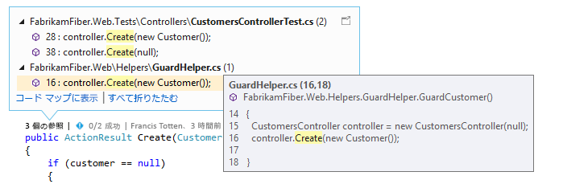  
  
 エディターから離れずに、コードの変更についてチームに問い合わせることができます。  
  
 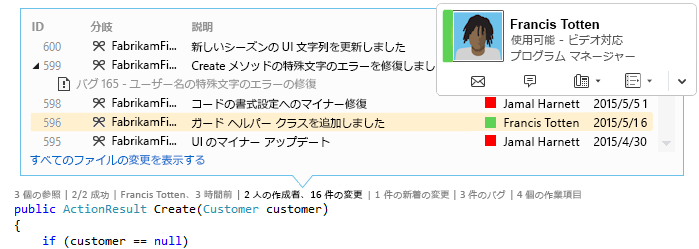  
  
 表示するインジケーターを選択するか、CodeLens のオンとオフを切り替えるには、**\[ツール\]**、**\[オプション\]**、**\[テキスト エディター\]**、**\[すべての言語\]**、**\[CodeLens\]** の順に移動します。  
  
##   コード参照の検索  
 要件:  
  
-   Visual Studio Enterprise または Visual Studio Professional  
  
-   Visual C\# .NET コードまたは Visual Basic .NET コード  
  
 **参照**インジケーターを選択します \(**Alt \+ 2**\)。**参照が 1 つもない**場合は、Visual C\# コードまたは Visual Basic コードからの参照がないということです。 このインジケーターには、XAML ファイル、ASPX ファイルなどの他の項目からの参照は含まれません。  
  
 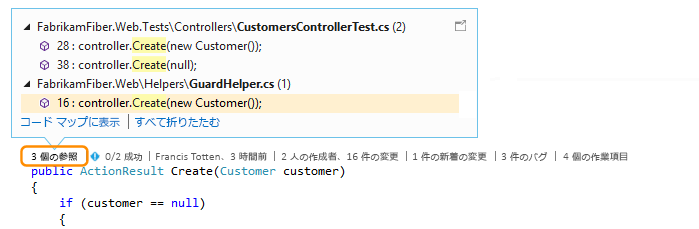  
  
 参照元コードを表示するには、参照の上にマウス ポインターを合わせます。  
  
   
  
 参照を含むファイルを開くには、参照をダブルクリックします。  
  
 このコードと、その参照の間の関係を表示するには、[コード マップを作成](../modeling/map-dependencies-across-your-solutions.md)して、コード マップのショートカット メニューで **\[すべての参照の表示\]** を選択します。  
  
 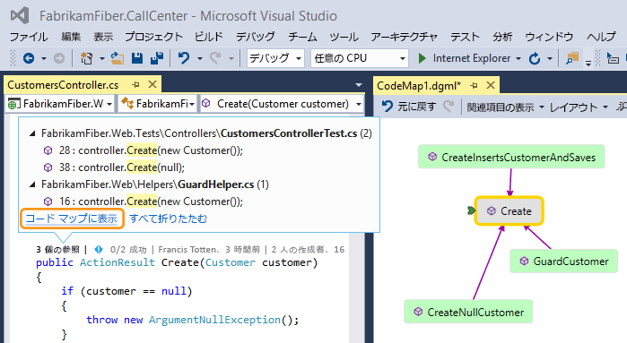  
  
##   コードの履歴およびリンクされた項目の検索  
 コードの変遷をたどるため、コードの履歴を確認します。 または、他の分岐での変更がコードに与える可能性のある影響を理解できるよう、変更をコードにマージする前に、それらの変更を検討します。  
  
 要件:  
  
-   Visual Studio Enterprise または Visual Studio Professional  
  
-   Team Foundation Server 2013 以降、Visual Studio Team Services、または Git  
  
-   [Lync 2010 以降、または Skype for Business](http://technet.microsoft.com/en-us/lync)。これによりコード エディターからチームと通信できます  
  
 Team Foundation バージョン管理 \(TFVC\) または Git で格納されている Visual C\# .NET または Visual Basic .NET コードでは、CodeLens の詳細をクラス レベルまたはメソッド レベルで取得します \(*code\-element\-level* インジケーター\)。 Git リポジトリが TfGit でホストされている場合、TFS 作業項目へのリンクも取得します。  
  
   
  
 Visual Studio エディターで開くことができる他のすべての種類のファイルについては、ウィンドウ下部の 1 個所でファイル全体の CodeLens の詳細を取得します \(*file\-level* インジケーター\)。  
  
   
  
 キーボードを使用してインジケーターを選択するには、**Alt** キーを押した状態を保ち、関連する数値キーを表示します。  
  
   
  
### コードに含まれる変更の検索  
 C\# コードまたは Visual Basic コードを変更したユーザー、およびそのユーザーによって行われた変更を code\-element\-level インジケーターで探します。 これは、Team Foundation Server または Visual Studio Team Services で Team Foundation バージョン管理 \(TFVC\) を使用するときに行います。  
  
   
  
 既定の時間は直近 12 か月です。 Team Foundation Server にコードが格納される場合、[TFSConfig コマンド](http://msdn.microsoft.com/ja-jp/94424190-3b6b-4f33-a6b6-5807f4225b62)および **\/indexHistoryPeriod** フラグを指定した [CodeIndex コマンド](../ide/codeindex-command.md)を実行することにより、この制限を変更できます。  
  
 1 年以上前のものを含む、すべての変更の詳細な履歴を表示するには、**\[すべてのファイルの変更を表示する\]** を選択します。  
  
   
  
 これで、変更セットの \[履歴\] ウィンドウが開きます。  
  
   
  
 ファイルが Git リポジトリにある場合に、code\-element\-level の変更インジケーターを選択すると、このように表示されます。  
  
   
  
 ウィンドウ下部の file\-level インジケーターで、ファイル全体の変更を探します \(C\# ファイルと Visual Basic ファイルは除く\)。  
  
   
  
 変更に関する詳細情報を取得するには、その項目を右クリックします。 TFVC を使用しているか Git を使用しているかに応じて、ファイルのバージョンの比較、詳細の表示と変更セットの追跡、ファイルの選択バージョンの取得、その変更の作成者への電子メール通知のための一連のオプションを取得します。 チーム エクスプローラーに詳細の一部が表示されます。  
  
 一定期間内にコードを変更したユーザーも表示されます。 これは、チームでの変更のパターンを見つけて影響を評価するために役立ちます。  
  
   
  
#### 現在の分岐での変更の検索  
 安定したコードの状態を損なわせるリスクを軽減するために、チームが複数の分岐 \(メイン分岐とその下位の開発分岐\) で作業しているとします。  
  
 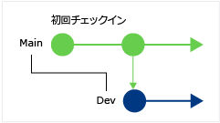  
  
 メイン分岐で、コードを変更したユーザーの数と、変更の数を確認します \(**Alt \+ 6**\)。  
  
 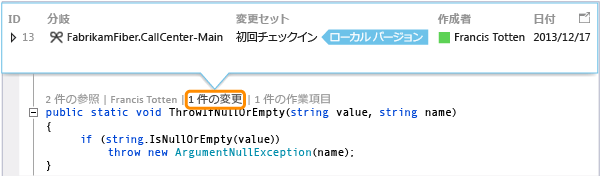  
  
#### コードが分岐された時期の確認  
 子ブランチ \(たとえば、Dev 分岐\) のコードに移動します。 変更インジケーターを選択します \(**Alt \+ 6**\)。  
  
 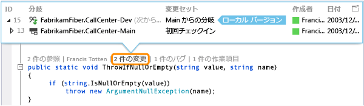  
  
#### 他の分岐から追加される変更の検索  
   
  
 … Dev 分岐でのこのバグ修正を例に用います。  
  
 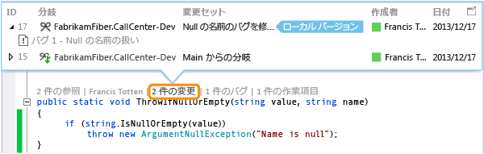  
  
 この変更は、現在の分岐 \(メイン分岐\) を離れることなく検討できます。  
  
 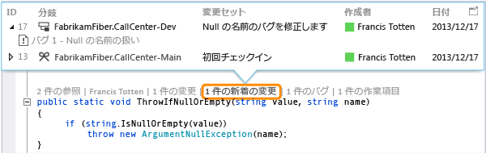  
  
#### 変更がマージされた時期の確認  
 分岐に含まれている変更を確認することができます。  
  
 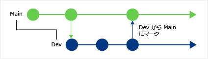  
  
 たとえば、メイン分岐のコードに、Dev 分岐からのバグ修正が適用されるとします。  
  
   
  
#### 追加される変更をローカル バージョンと比較します \(Shift \+ F10\)。  
 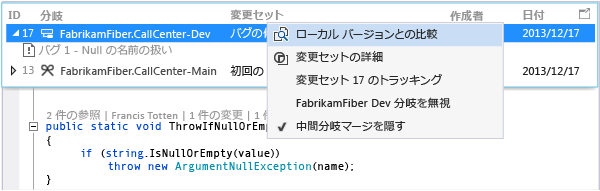  
  
 変更セットをダブルクリックすることもできます。  
  
#### アイコンの意味  
  
|**アイコン**|**変更の作成元**|  
|--------------|----------------|  
||現在の分岐|  
||親分岐|  
||子分岐|  
||ピア分岐|  
||親、子、またはピアより遠い分岐|  
||親分岐から子分岐へのマージ|  
||子分岐から親分岐へのマージ|  
||無関係の分岐からのマージ \(ベースレス マージ\)|  
  
### リンクされた作業項目の検索  
 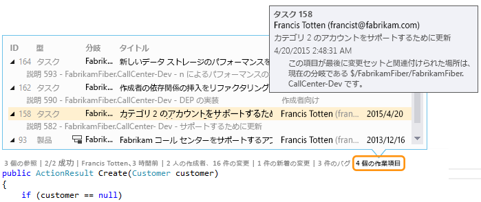  
  
### リンクされたコード レビューの検索  
 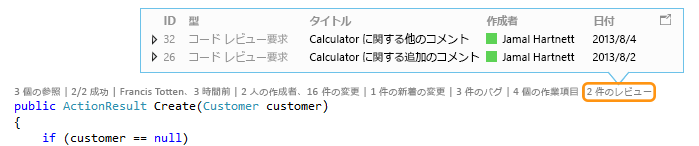  
  
### リンクされたバグの検索  
 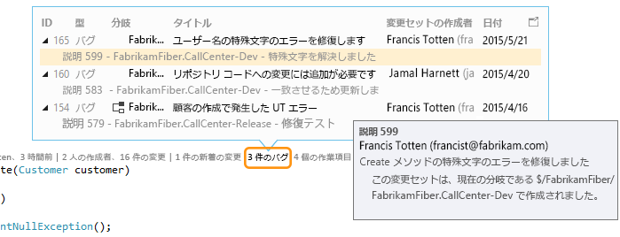  
  
### 項目の所有者に連絡する  
   
  
 連絡先のオプションを表示する項目のショートカット メニューを開きます。 Lync または Skype for Business がインストールされている場合は、次のオプションが表示されます。  
  
   
  
##   コードの単体テストの検索  
 テスト エクスプ ローラーを開くことなく、ご使用のコード向けに存在する単体テストの詳細を確認します。 要件:  
  
-   Visual Studio Enterprise または Visual Studio Professional  
  
-   Visual C\# .NET コードまたは Visual Basic .NET コード  
  
-   アプリケーション コードの単体テストを含む[単体テスト プロジェクト](../test/unit-test-your-code.md)  
  
1.  単体テストのあるアプリケーション コードに移動します。  
  
2.  そのコードのテストをレビューします \(**Alt \+ 3**\)。  
  
     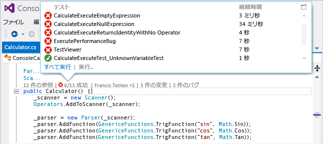  
  
3.  警告アイコン  が表示されたら、テストを実行します。  
  
     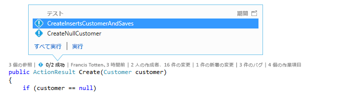  
  
4.  テストの定義を確認するには、CodeLens インジケーターのウィンドウでテスト項目をダブルクリックして、エディターでコード ファイルを開きます。  
  
     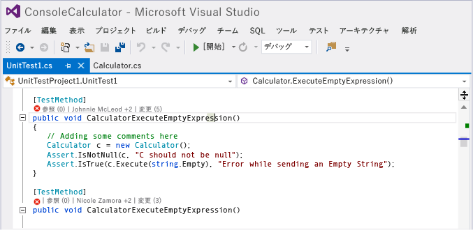  
  
5.  テストの結果を確認します。 テスト状態インジケーター \( または \) を選択するか、**Alt \+ 1** キーを押します。  
  
     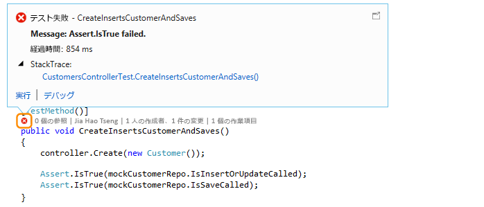  
  
6.  このテストに変更を加えた人数、だれがこのテストを変更したか、またはこのテストに加えられた変更の数を確認するには、[コードの履歴およびリンクされた項目の検索](#FindCodeHistory)を行います。  
  
##   Q & A  
  
###   Q: CodeLens を無効または有効にする方法を教えてください。 表示するインジケーターの選択方法も教えてください。  
 **A:**  参照インジケーター以外のインジケーターは無効にも有効にもできます。**\[ツール\]**、**\[オプション\]**、**\[テキスト エディター\]**、**\[すべての言語\]**、**\[CodeLens\]** の順に移動します。  
  
 インジケーターが有効の場合は、インジケーターから CodeLens のオプションを開くこともできます。  
  
 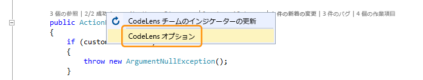  
  
 エディター ウィンドウの下部にあるシェブロン アイコンを使用して、CodeLens のファイル レベル インジケーターのオンとオフを切り替えます。  
  
   
  
###   Q: CodeLens はどこにありますか。  
 **A:** CodeLens は、メソッド、クラス、インデクサー、およびプロパティ レベルの Visual C\# .NET および Visual Basic .NET のコードで表示されます。 それ以外の種類のファイルについては、ファイル レベルで CodeLens が表示されます。  
  
-   CodeLens が有効になっていることを確認します。**\[ツール\]**、**\[オプション\]**、**\[テキスト エディター\]**、**\[すべての言語\]**、**\[CodeLens\]** の順に移動します。  
  
-   コードが TFS に格納されている場合は、[TFS Config コマンド](http://msdn.microsoft.com/ja-jp/94424190-3b6b-4f33-a6b6-5807f4225b62)と共に [CodeIndex コマンド](../ide/codeindex-command.md)を使用することによって、コード インデックス作成が有効になっていることを確認します。  
  
-   TFS 関連のインジケーターは、作業項目がコードにリンクされていて、リンクされた作業項目を開くアクセス許可をユーザーが持っている場合にだけ表示されます。[チーム メンバーのアクセス許可があることを確認してください。](http://msdn.microsoft.com/ja-jp/f58805de-ba61-4d09-8f2d-d3ab9662ecfd)  
  
-   アプリケーション コードに単体テストがない場合は、単体テスト インジケーターが表示されません。 テスト状態インジケーターは、テスト プロジェクトに自動的に表示されます。 アプリケーション コードに単体テストがあることがわかっているのに、テスト インジケーターが表示されない場合は、ソリューションのビルドを試みます \(**Ctrl \+ Shift \+ B**\)。  
  
### コミットの作業項目詳細が表示されないのはなぜですか。  
 **A:** CodeLens が TFS で作業項目を見つけることができない可能性があります。 その作業項目があるチーム プロジェクトに接続していることと、その作業項目を表示するアクセス許可があることを確認してください。 このことは、TFS での作業項目 ID に関する誤った情報がコミットの説明に含まれている場合にも発生することがあります。  
  
###   Q: Lync インジケーターまたは Skype インジケーターが表示されないのはなぜですか。  
 **A:** Lync または Skype for Business にサインインしていない場合、Lync または Skype for Businessがインストールされていない場合、またはサポートされている構成がない場合、Lync インジケーターまたは Skype インジケーターは表示されません。 ただしその場合も、メールは送信できます。  
  
 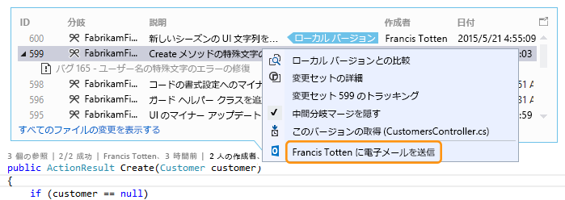  
  
 **サポートされる Lync 構成および Skype 構成**  
  
-   Skype for Business \(32 ビットまたは 64 ビット\)  
  
-   Lync 2010 以降のみ \(32 ビットまたは 64 ビット\)。ただし Windows 8.1 での Lync Basic 2013 は除く  
  
 CodeLens では、異なるバージョン の Lync または Skype はインストールできません。 Visual Studio のローカライズ バージョンに対して、Lync または Skype がローカライズされていないことがあります。  
  
### Q: CodeLens のフォントと色を変更するにはどうすればよいですか。  
 **A: \[ツール\]**、**\[オプション\]**、**\[環境\]**、**\[フォントおよび色\]** の順に選択します。  
  
 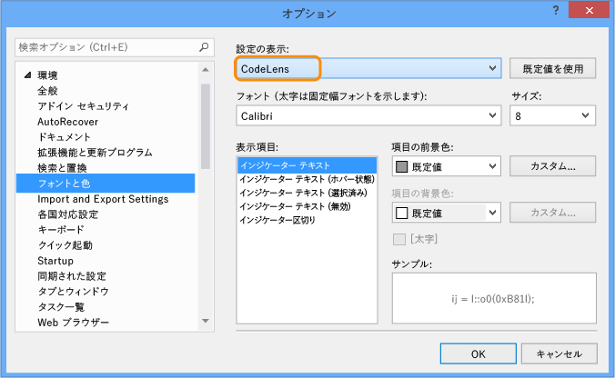  
  
 キーボードを使用するには:  
  
1.  **Alt \+ T \+ O** キーを押して **\[オプション\]** ボックスを開きます。  
  
2.  **上方向**キーまたは**下方向**キーを押して **\[環境\]** ノードに移動するか、**左方向**キーを押してノードを展開します。  
  
3.  **下方向**キーを押して **\[フォントおよび色\]** に移動します。  
  
4.  **Tab** キーを押して **\[設定の表示\]** の一覧に移動し、**下方向**キーを押して **\[CodeLens\]** を選択します。  
  
### Q: CodeLens ヘッドアップ ディスプレイを移動できますか。  
 **A:** はい、できます。 を選択して、CodeLens をウィンドウとしてドッキングします。  
  
   
  
   
  
### Q: インジケーターを更新するにはどうすればよいですか。  
 **A:** 方法は、インジケーターによって異なります。  
  
-   **参照**: このインジケーターは、コードが変更されるときに自動的に更新されます。 インジケーターが独立したウィンドウとしてドッキングされている場合は手動で更新する必要があります。  
  
     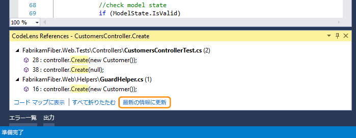  
  
-   **チーム**: これらのインジケーターは手動で更新する必要があります。  
  
     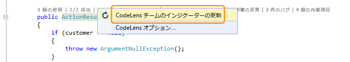  
  
-   **テスト**: このインジケーターを更新するには、[コードの単体テストの検索](#FindRunUnitTests)。  
  
###   Q: "ローカル バージョン" とは何ですか。  
 **A: \[ローカル バージョン\]** 矢印は、このファイルのローカル バージョンの最新の変更セットを指しています。 サーバーにさらに新しい変更セットが含まれる場合、その変更セットは、使用されている並べ替え順序に応じて **\[ローカル バージョン\]** 矢印の上または下に表示されます。  
  
### Q: 履歴やリンク された項目が表示されるように CodeLens によるコードの処理方法を管理することはできますか。  
 **A:** はい、できます。コードが TFS にある場合は、[TFS Config コマンド](http://msdn.microsoft.com/ja-jp/94424190-3b6b-4f33-a6b6-5807f4225b62)と共に [CodeIndex コマンド](../ide/codeindex-command.md)を使用します。