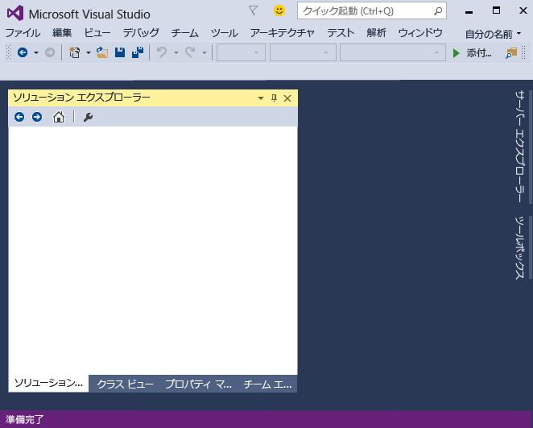
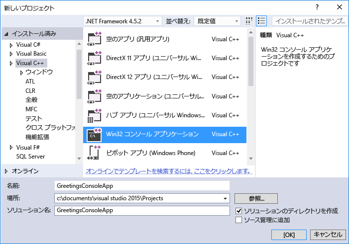
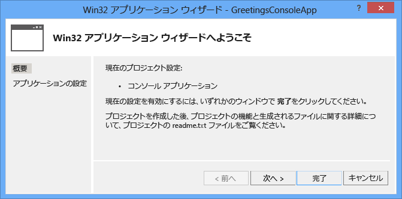
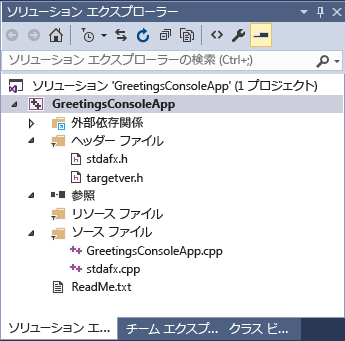
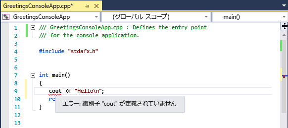
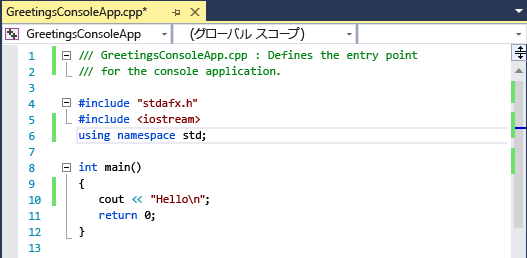
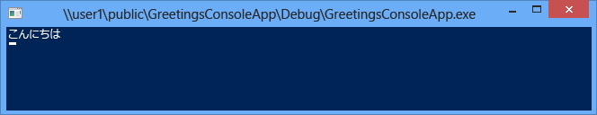

# <a name="getting-started-with-c-in-visual-studio"></a>Visual Studio 内の C++ の概要
このチュートリアルを完了すると、Visual Studio を使用してアプリケーションを開発する際に使用できるさまざまなツールおよびダイアログ ボックスの使用方法を習得できます。 簡単な "Hello, World" スタイルのアプリケーションを作成しながら、統合開発環境 (IDE) での作業方法について学習します。  
  
 このトピックは、次のセクションで構成されています。  
  
 [Visual Studio へのサインイン](../ide/getting-started-with-cpp-in-visual-studio.md#BKMK_Configure)  
  
 [簡単なアプリケーションの作成](../ide/getting-started-with-cpp-in-visual-studio.md#BKMK_CreateApp)  
  
 [アプリケーションへのコードの追加](../ide/getting-started-with-cpp-in-visual-studio.md#BKMK_AddCode)  
  
 [アプリケーションのデバッグとテスト](../ide/getting-started-with-cpp-in-visual-studio.md#BKMK_DebugTest)  
  
 [アプリのリリース バージョンのビルド](../ide/getting-started-with-cpp-in-visual-studio.md#BKMK_BuildRelease)  
  
##  <a name="BKMK_Configure"></a> Visual Studio へのサインイン  
 Visual Studio を初めて起動する際には、Live や Outlook などの Microsoft アカウントを使ってサインインする機会があります。 サインインすると、設定をすべてのデバイス間で同期できます。 詳細については、「 [Signing in to Visual Studio](../ide/signing-in-to-visual-studio.md)」を参照してください。  
  
 図 1: Visual Studio IDE  
  
   
  
 Visual Studio を開くと、IDE の 3 つの基本的なパーツを確認できます。ツール ウィンドウ、メニューとツール バー、およびメイン ウィンドウ領域です。 ツール ウィンドウは、アプリ ウィンドウの左側および右側にドッキングされており、上部には **[クイック起動]**、メニュー バー、および標準ツール バーがあります。 アプリケーション ウィンドウの中央には、 **[スタート ページ]**が表示されます。 ソリューションまたはプロジェクトを開くと、この領域にはエディターとデザイナーが表示されます。 アプリケーションを開発する場合は、ほとんどの時間をこの中央の領域での作業に費やします。  
  
##  <a name="BKMK_CreateApp"></a> 簡単なアプリケーションの作成  
 Visual Studio でアプリを作成するには、最初にプロジェクトおよびソリューションを作成します。 この例では、Windows コンソール アプリケーションを作成します。  
  
#### <a name="to-create-a-console-app"></a>コンソール アプリを作成するには  
  
1.  メニュー バーで **[ファイル]**、 **[新規]**、 **[プロジェクト]**の順にクリックします。  
  
     ![メニュー バーで、[ファイル]、[新規作成]、[プロジェクト] の順に選択します。](../ide/media/exploreide-filenewproject.png "ExploreIDE-FileNewProject")  
  
2.  **[Visual C++]** カテゴリで、**[Win32 コンソール アプリケーション]** テンプレートを選択し、プロジェクトに `GreetingsConsoleApp` という名前を付けます。  
  
       
     ダイアログ ボックスの選択肢は、インストールした内容によって異なる場合があります。 Visual C++ プロジェクト テンプレートが表示されない場合、インストーラーに戻り、C++ ワークロードをインストールする必要があります。
  
3.  Win32 アプリケーション ウィザードが表示されたら、 **[完了]** を選択します。  
  
       
  
 Win32 コンソール アプリの基本的なファイルを含む GreetingsConsoleApp プロジェクトとソリューションが作成され、 **ソリューション エクスプローラー**に自動的に読み込まれます。 GreetingsConsoleApp.cpp ファイルがコード エディターで開きます。 次の項目が **ソリューション エクスプローラー**に表示されます。  
  
 図 4: プロジェクト項目  
  
   
  
##  <a name="BKMK_AddCode"></a> アプリケーションへのコードの追加  
 次に、コンソール ウィンドウに "Hello" と表示するコードを追加します。  
  
#### <a name="to-display-hello-in-the-console-window"></a>コンソール ウィンドウに "Hello" と表示するには  
  
1.  GreetingsConsoleApp.cpp ファイルの `return 0;` という行の前に空白行を挿入し、次のコードを入力します。  
  
    ```  
    cout << "Hello\n";  
    ```  
  
     `cout`の下に赤い波線が表示されます。 その波線をポイントすると、エラー メッセージが表示されます。  
  
       
  
     エラー メッセージは、 **[エラー一覧]** ウィンドウにも表示されます。 そのウィンドウを表示するには、メニュー バーで **[表示]**、**[エラー一覧]** の順に選択します。  
  
     [cout](/cpp/standard-library/iostream) は \<iostream> ヘッダー ファイルに含まれます。  
  
2.  iostream ヘッダーを組み込むには、 `#include "stdafx.h"`の次に、以下のコードを入力します。  
  
    ```  
    #include <iostream>  
    using namespace std;  
    ```  
  
     コードを入力したときにボックスが表示され、入力した文字に対応する候補が提示されたはずです。 このボックスは、C++ の IntelliSense の一部で、コーディングの一連のヒントを提供します。それには、クラスやインターフェイスのメンバーの一覧と、パラメーター情報が含まれます。 定義済みのコード ブロックであるコード スニペットを使用することもできます。 詳細については、 [Using IntelliSense](../ide/using-intellisense.md) および [Code Snippets](../ide/code-snippets.md)を参照してください。  
  
     エラーを修正すると、 `cout` の下の赤い波線が消えます。  
  
3.  変更内容をファイルに保存します。  
  
       
  
##  <a name="BKMK_DebugTest"></a> アプリケーションのデバッグとテスト  
 GreetingsConsoleApp をデバッグして、コンソール ウィンドウに "Hello" という語が表示されるかどうかを確認できます。  
  
#### <a name="to-debug-the-application"></a>アプリケーションをデバッグするには  
  
-   デバッガーを起動します。  
  
     ![[デバッグ] メニューの [デバッグの開始] コマンド](../ide/media/exploreide-startdebugging.png "ExploreIDE-StartDebugging")  
  
     デバッガーが起動し、コードが実行されます。 コンソール ウィンドウ (コマンド プロンプトのように見える別のウィンドウ) が数秒間表示されますが、デバッガーが実行を停止するとすぐに閉じます。 テキストを表示するには、ブレークポイントを設定してプログラムの実行を停止する必要があります。  
  
#### <a name="to-add-a-breakpoint"></a>ブレークポイントを追加するには  
  
1.  メニュー バーからブレークポイントを `return 0;`の行に追加します。 左側の余白内でクリックするだけでも、ブレークポイントを設定できます。  
  
     ![[デバッグ] メニューの [ブレークポイントの設定/解除] コマンド](../ide/media/exploreide-togglebreakpoint.png "ExploreIDE-ToggleBreakpoint")  
  
     コード行の横の、エディター ウィンドウの左端の余白部分に、赤い円が表示されます。  
  
2.  F5 キーを押してデバッグを開始します。  
  
     デバッガーが起動し、コンソール ウィンドウが表示されて **Hello**という語が示されます。  
  
       
  
3.  SHIFT + F5 キーを押してデバッグを停止します。  
  
 詳細については、[コンソール プロジェクト](../debugger/debugging-preparation-console-projects.md)に関する記事を参照してください。  
  
##  <a name="BKMK_BuildRelease"></a> アプリのリリース バージョンのビルド  
 すべてが機能することを確認したら、アプリケーションのリリース ビルドを準備できます。  
  
#### <a name="to-clean-the-solution-files-and-build-a-release-version"></a>ソリューション ファイルをクリーンアップし、リリース バージョンをビルドするには  
  
1.  メニュー バーで、前のビルドで作成された中間ファイルと出力ファイルを削除します。  
  
     ![[ビルド] メニューの [ソリューションのクリーン] コマンド](../ide/media/exploreide-cleansolution.png "ExploreIDE-CleanSolution")  
  
2.  GreetingsConsoleApp のビルド構成を **[デバッグ]** から **[リリース]**に変更します。  
  
       
  
3.  ソリューションをビルドします。  
  
     ![[ビルド] メニューの [ソリューションのビルド] コマンド](../ide/media/exploreide-buildsolution.png "ExploreIDE-BuildSolution")  
  
 このチュートリアルは完了しました。 その他の例については、「[Visual Studio Samples](../ide/visual-studio-samples.md)」を参照してください。  
  
## <a name="see-also"></a>関連項目  
 [C++ デスクトップ開発のための Visual Studio IDE の使用](/cpp/ide/using-the-visual-studio-ide-for-cpp-desktop-development)   
 [チュートリアル : Visual C# または Visual Basic による簡単なアプリケーションの作成](../ide/walkthrough-create-a-simple-application-with-visual-csharp-or-visual-basic.md)   
 [Visual Studio の生産性に関するヒント](../ide/productivity-tips-for-visual-studio.md)   
 [Visual Studio Samples](../ide/visual-studio-samples.md)   
 [Get Started Developing with Visual Studio](../ide/get-started-developing-with-visual-studio.md)