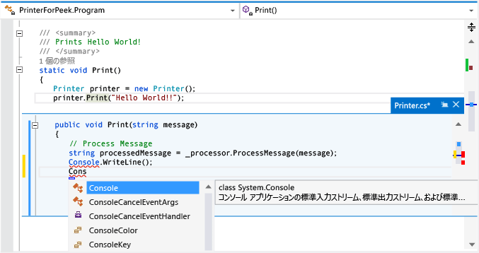

# 方法: [定義をここに表示] を使用してコードを表示および編集する (Alt + F12)
[!INCLUDE[vs2017banner](../code-quality/includes/vs2017banner.md)]

**\[定義をここに表示\]** を使用すると、記述中のコードから切り替えずにコードを表示および編集できます。  **\[定義をここに表示\]** と **\[定義へ移動\]** では同じ情報が表示されますが、**\[定義をここに表示\]** ではコードがポップアップ ウィンドウに表示され、**\[定義へ移動\]** では別のコード ウィンドウに表示されます。  **\[定義へ移動\]** を実行すると、コンテキスト \(アクティブなコード ウィンドウ、現在の行、およびカーソルの位置\) が定義コード ウィンドウに切り替わります。  **\[定義をここに表示\]** を使用すると、元のコード ファイル内での位置を保ちながら、定義を表示および編集したり、定義ファイル内を移動したりできます。  
  
 **\[定義をここに表示\]** は、C\#、Visual Basic、および C\+\+ のコードで使用できます。  Visual Basic では **\[定義をここに表示\]** に、定義メタデータのないシンボル \(.NET Framework の組み込み型など\) の**オブジェクト ブラウザー**へのリンクが表示されます。  
  
> [!IMPORTANT]
>  このコマンドは、Visual Studio 2013 の Express Edition では使用できません。  
  
## \[定義をここに表示\] の操作  
  
#### \[定義をここに表示\] ウィンドウを開くには  
  
1.  **\[定義をここに表示\]** は、調査対象のメソッドのショートカット メニューを開くと見つかります。\(キーボード: Alt \+ F12\)。  
  
     次の図に、`Print()` という名前のメソッドの **\[定義をここに表示\]** ウィンドウを示します。  
  
       
  
     定義ウィンドウは、元のファイルの `printer.Print(“Hello World!”)` 行の下に表示されます。  このウィンドウにより、元のファイル内のどのコードも隠れて見えなくなることはありません。  `printer.Print(“Hello World!”)` 呼び出しに続く行は定義ウィンドウの下に表示されます。  
  
2.  コード定義ウィンドウ内のさまざまな位置にカーソルを移動できます。  定義ウィンドウの上または下の元のコード ウィンドウ内でも、今までどおりカーソルを移動できます。  
  
3.  定義ウィンドウから文字列をコピーし、元のコード内で貼り付けることができます。  定義ウィンドウから元のコードに文字列をドラッグ アンド ドロップすることもできますが、定義ウィンドウからその文字列は削除されません。  
  
4.  Esc キーを押すか、定義ウィンドウ タブの **\[閉じる\]** ボタンをクリックすることで、定義ウィンドウを閉じることができます。  
  
#### \[定義をここに表示\] ウィンドウ内から \[定義をここに表示\] を開くには  
  
-   既に **\[定義をここに表示\]** ウィンドウを開いている場合、そのウィンドウ内のコードで **\[定義をここに表示\]** を再度呼び出すことができます。  もう 1 つの定義ウィンドウが開きます。  定義ウィンドウ タブの横に一連の階層リンクの点が表示されます。これらの点を使用して定義ウィンドウ間を移動できます。  各点のツールヒントには、それぞれの点が表す定義ファイルの名前とパスが表示されます。  
  
       
  
#### 複数の結果で \[定義をここに表示\] を使用するには  
  
-   複数の定義 \(部分クラスなど\) があるコードで **\[定義をここに表示\]** を使用すると、結果の一覧がコード定義ビューの右側に表示されます。  一覧内の結果を選択してその定義を表示できます。  
  
       
  
#### \[定義をここに表示\] ウィンドウ内で編集するには  
  
-   **\[定義をここに表示\]** ウィンドウ内で編集を始めると、変更中のファイルがコード エディターの別のタブで自動的に開き、既に行った変更が反映されます。  **\[定義をここに表示\]** ウィンドウで続けて変更を加えたり、元に戻したり、保存したりすることができ、タブにはそれらの変更が反映され続けます。  変更を保存せずにウィンドウを閉じた場合でも、タブ内で変更を加えたり、元に戻したり、保存したりすることができ、ウィンドウで作業をやめた箇所から再開することができます。  
  
       
  
#### \[定義をここに表示\] のキーボード ショートカットを使用するには  
  
-   **\[定義をここに表示\]** ウィンドウでは次のキーボード ショートカットを使用できます。  
  
    |機能|キーボード ショートカット|  
    |--------|-------------------|  
    |定義ウィンドウを開く|Alt \+ F12|  
    |定義ウィンドウを閉じる|Esc|  
    |定義ウィンドウを通常のドキュメント タブに昇格する|Shift \+ Alt \+ Home|  
    |定義ウィンドウ間を移動する|Ctrl \+ Alt \+ マイナス記号 \(\-\) と Ctrl \+ Alt \+ 等号 \(\=\)|  
    |複数の結果の間を移動する|F8 と Shift \+ F8|  
    |コード エディター ウィンドウと定義ウィンドウの間で切り替える|Shift \+ Esc|  
  
    > [!NOTE]
    >  Visual Studio の他の場所でも、同じキーボード ショートカットを使用して **\[定義をここに表示\]** ウィンドウでコードを編集できます。  
  
## 参照  
 [生産性に関するヒント](../ide/productivity-tips-for-visual-studio.md)