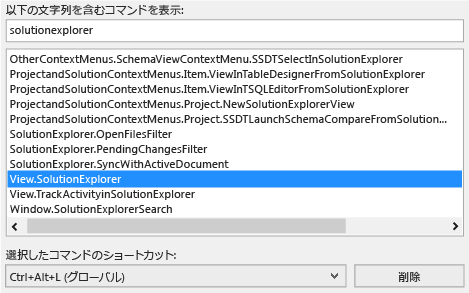
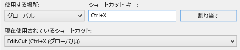
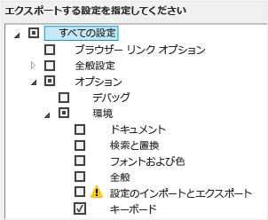
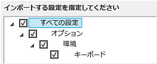

# Visual Studio でのキーボード ショートカットの識別とカスタマイズ

Visual Studio のコマンドのショートカット キーを確認し、カスタマイズしたら、他の人が使用できるようにエクスポートできます。 多くのショートカット キーは常に同じコマンドを起動しますが、その動作は次の条件によって異なることがあります。

- Visual Studio を初めて実行したときに選択した既定の環境設定 ([全般的な開発設定] または [Visual C#] など)。

- ショートカット キーの動作をカスタマイズしたかどうか。

- ショートカット キーを選択するときのコンテキスト。 たとえば、F2 ショートカット キーでは、設定デザイナーを使用している場合は Edit.EditCell コマンドが呼び出され、チーム エクスプローラーを使用している場合は File.Rename コマンドが呼び出されます。

設定、カスタマイズ、コンテキストにかかわらず、**[オプション]** ダイアログ ボックスでいつでもショートカット キーを変更できます。 数十のコマンドの既定のキーボード ショートカットについては、「[Visual Studio で頻繁に使用するコマンドに対応する既定のキーボード ショートカット](../ide/default-keyboard-shortcuts-for-frequently-used-commands-in-visual-studio.md)」でも確認できます。また、既定のショートカット キー ([全般的な開発設定] に基づく) の完全な一覧については、「[Visual Studio の既定のキーボード ショートカット](../ide/default-keyboard-shortcuts-in-visual-studio.md)」で確認できます。

ショートカット キーを [全体] コンテキストに割り当て、他のコンテキストに割り当てていない場合、そのショートカット キーによって常にそのコマンドが呼び出されます。 しかし、ショートカット キーは [全体] コンテキストの 1 つのコマンドに割り当て、特定のコンテキストの別のコマンドに割り当てることができます。 そのようなショートカット キーを特定のコンテキストで使用すると、ショートカット キーによって [全体] コンテキストではなく特定のコンテキストのコマンドが呼び出されます。

> [!NOTE]
> 使用している Visual Studio の設定とエディションによって、メニューに表示されるコマンドやダイアログ ボックスに表示されるオプションの名前や位置が異なる場合があります。 このトピックは **[全般的な開発設定]** に基づいています。

## ショートカット キーの確認

1. メニュー バーの **[ツール]**、 **[オプション]** の順にクリックします。

2. **[環境]** を展開し、**[キーボード]** を選択します。

   ![[オプション] ダイアログ ボックスにキーボード ショートカットを表示](../ide/media/optionskeyboard.png "OptionsKeyboard")

3. **[以下の文字列を含むコマンドを表示]** ボックスに、コマンド名の全体または一部を、空白を含めずに入力し始めます。

   たとえば、`solutionexplorer` のコマンドを検索できます。

4. 一覧から該当するコマンドを選択します。

    たとえば、**View.SolutionExplorer** を選択できます。

5. コマンドにショートカット キーが既に割り当てられている場合は、**[選択したコマンドへのショートカット]** ボックスの一覧に表示されます。

   

## ショートカット キーのカスタマイズ

1. メニュー バーの **[ツール]**、 **[オプション]** の順にクリックします。

2. **[環境]** フォルダーを展開し、**[キーボード]** を選択します。

3. 省略可能: コマンドのリストをフィルター処理するには、**[以下の文字列を含むコマンドを表示]** ボックスに、コマンド名の全体または一部を、空白を含めずに入力し始めます。

4. ショートカット キーを割り当てるコマンドを一覧から選択します。

**[ショートカットの使用場所]** ボックスの一覧で、ショートカット キーを使用する機能領域を選択します。

    For example, you can choose **Global** if you want the shortcut to work in all contexts. You can use any shortcut that isn't mapped (as Global) in another editor. Otherwise, the editor overrides the shortcut.

    > [!NOTE]
    > You can't assign the following keys as part of a keyboard shortcut in **Global**: Print Scrn/Sys Rq, Scroll Lock, Pause/Break, Tab, Caps Lock, Insert, Home, End, Page Up, Page Down, the Windows logo key, the Application key, any of the Arrow keys, or Enter; Num Lock, Delete, or Clear on the numeric keypad; the Ctrl+Alt+Delete key combination.

6. **[ショートカット キー]** ボックスで、使用するショートカット キーを入力します。

    > [!NOTE]
    > 文字と Alt キー、Ctrl キー、またはその両方を組み合わせたショートカット キーを作成できます。 Shift キーおよび文字と Alt キー、Ctrl キー、またはその両方を組み合わせたショートカット キーを作成することもできます。

     ショートカット キーが別のコマンドに既に割り当てられている場合は、**[現在使用されているショートカット]** ボックスに表示されます。 その場合は、Backspace キーを押してそのショートカット キーを削除してから、別のショートカット キーを試します。

    

7. **[割り当て]** ボタンをクリックします。

    > [!NOTE]
    > コマンドに別のショートカット キーを指定し、**[割り当て]** ボタンをクリックした後に、**[キャンセル]** ボタンをクリックしても、ダイアログ ボックスは閉じますが、変更は元に戻りません。

## カスタム ショートカット キーの共有

カスタム ショートカット キーを他のユーザーと共有できます。そのためには、ショートカット キーの情報をファイルにエクスポートし、そのファイルを他のユーザーに渡して、インポートしてもらう必要があります。

### ショートカット キーのみをエクスポートするには

1. メニュー バーで、**[ツール]**、**[設定のインポートとエクスポート]** の順にクリックします。

2. **[選択された環境設定をエクスポート]** をクリックし、**[次へ]** ボタンをクリックします。

3. **[エクスポートする設定を指定してください]** で、**[すべての設定]** チェック ボックスをオフにし、**[オプション]**、**[環境]** の順に展開します。

4. **[キーボード]** チェック ボックスをオンにして、**[次へ]** ボタンをクリックします。

    

5. **[設定ファイルの名前を指定してください]** と **[設定を次のディレクトリに格納する]** ボックスで、既定値のままにするか別の値を指定し、**[完了]** ボタンをクリックします。

    既定では、ショートカット キーは %USERPROFILE%\Documents\Visual Studio 2017\Settings フォルダーに保存されます。 ファイルの名前には設定のエクスポート時の日付が反映され、拡張子は .vssettings になります。

### ショートカット キーのみをインポートするには

1. メニュー バーで、**[ツール]**、**[設定のインポートとエクスポート]** の順にクリックします。

2. **[選択された環境設定をインポート]** オプションをクリックし、**[次へ]** ボタンをクリックします。

3. **[いいえ、現在の設定を上書きして新しい設定をインポートします]** オプション ボタンをクリックし、**[次へ]** ボタンをクリックします。

4. **[ユーザーの設定]** で、インポートするショートカット キーを含む設定ファイルを選択するか、**[参照]** ボタンをクリックして適切な設定ファイルを見つけます。

5. **[次へ]** ボタンをクリックします。

6.  **[インポートする設定を指定してください]** で、**[すべての設定]** チェック ボックスをオフにし、**[オプション]**、**[環境]** の順に展開します。

7. **[キーボード]** チェック ボックスをオンにして、**[完了]** ボタンをクリックします。

    

## 関連項目

[Visual Studio のユーザー補助機能](../ide/reference/accessibility-features-of-visual-studio.md)