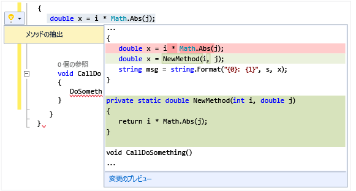

# 電球を使ってクイック操作をする
電球マークは、生産性を向上させる Visual Studio の機能です。 これらは Visual Studio エディターに表示されるアイコンであり、クリックすると、リファクタリングやエラーの修正などのクイック操作を実行できます。 電球マークは、エラーの修正およびリファクタリングをサポートする機能を&1; か所で集中的に提供するもので、多くは入力中の行に表示されます。  

   

 C# や Visual Basic では、赤い波線が表示され、Visual Studio が問題の修正候補を提供できる場合に、電球マークが表示されます。 たとえば、赤い波線で示されるエラーがある場合、そのエラーの修正が可能な場合に電球マークが表示されます。 C++ では、ヘッダー ファイルに新しい機能を追加すると、その機能のスタブ実装の作成を提案する電球マークが表示されます。 いずれの言語でも、サードパーティは、たとえば SDK の一部として、カスタマイズした診断や提案を表示できます。Visual Studio はそれらの規則に基づいて電球マークを表示します。  

## 電球マークを表示するには  

1.  多くの場合、電球マークはマウスをエラーの地点に移動すると自動的に表示されます。あるいは、カレットをエラーのある行に移動すると、エディターの左端に表示されます。 赤い波線が表示されている場合にマウス ポインターを重ねると電球マークを表示させることができます。 問題が発生した行のどこかに、マウスやキーボードを使用して移動することで電球マークを表示させることもできます。  

2.  行の任意の場所で **Ctrl キーを押しながら . キー**を押すと、 電球マークの表示を呼び出して修正候補のリストを直接表示できます。  

   

## 修正候補を表示するには  
 下矢印をクリックするか、修正候補を表示するリンクをクリックすると、電球マークで実行可能なクイック操作のリストが表示されます。  

   

## リファクタリングを実行するには  
 リファクタリングは、右クリックしてコンテキスト メニューを呼び出して実行することもできますが、Ctrl + . を押して リファクタリングのオプションを表示することもできます。 次の図では、 `Math.Abs` 呼び出しを含む行のどこかで Ctrl + . を押した後に、Extract Method のリファクタリングが表示されています。  

 

