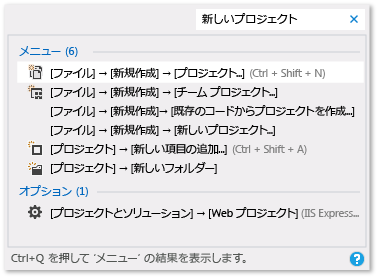

# Visual Studio の生産性に関するヒント

このトピックには、コードの記述、移動、およびデバッグを迅速かつ効率的にするのに役立つさまざまなヒントが含まれています。

一般的なキーボード ショートカットの詳細については、[キーボードに関するヒント](../ide/tips-and-tricks-for-visual-studio.md)についての記事をご覧ください。 または、キーボード ショートカットの詳細な一覧については、[キーボード ショートカットの識別とカスタマイズ](../ide/identifying-and-customizing-keyboard-shortcuts-in-visual-studio.md)と[既定のキーボード ショートカット](../ide/default-keyboard-shortcuts-in-visual-studio.md)に関する記事をご覧ください。

## コードの記述

コードをすばやく記述するには、次の機能を使用します。

- **便利なコマンドを使用する**。 Visual Studio は、一般的な編集タスクを迅速に実行できるさまざまなコマンドを備えています。 たとえば、**Visual Studio 2017 バージョン 15.6** 以降では、コマンドを選択するだけで簡単にコード行を複製できます。コード行をコピーし、カーソルの位置を移動させてから貼り付ける必要はありません。 **[編集]** > **[複製]** の順に選択するか、または **Ctrl** + **E** キー、**V** キーの順に押します。 **[編集]** > **[詳細設定]** > **[選択範囲の展開]** または **[編集]** > **[詳細設定]** > **[選択範囲の縮小]** を選択すると、選択範囲のテキストをすばやく拡張したり縮小したりできます。**Shift** + **Alt** + **=** キーまたは **Shift** + **Alt** + **-** キーを押しても実行できます (**Visual Studio 2017 バージョン 15.5** 以降で使用できます)。

- **IntelliSense を使用する**。 エディターにコードを入力すると、メンバーの一覧、パラメーター ヒント、クイック ヒント、シグネチャ ヘルプ、入力候補などの IntelliSense 情報が表示されます。 これらの機能では、テキストのあいまい一致をサポートしています。そのため、たとえば、メンバーの一覧の結果一覧には、入力した文字から始まるエントリだけでなく、その文字の組み合わせが名前に含まれているエントリも含まれます。 詳細については、[IntelliSense の使用](../ide/using-intellisense.md)に関するページを参照してください。

- **コード入力時の IntelliSense オプションの自動挿入を変更する**。 IntelliSense を候補提示モードに切り替えることで、明示的に選択した場合にのみ IntelliSense オプションが挿入されるように指定できます。

     候補提示モードを有効にするには、**Ctrl** + **Alt** + **Space** キーを選択するか、メニュー バーで **[編集]** > **[IntelliSense]** > **[完了モードの切り替え]** の順に選択します。

- **コード スニペットを使用する**。 組み込みのスニペットを使用するか、独自のスニペットを作成できます。

     スニペットを挿入するには、メニュー バーで **[編集]** > **[IntelliSense]** > **[スニペットの挿入]** もしくは **[ブロックの挿入]** の順に選択するか、またはファイルのショートカット メニューを開き、**[スニペット]** > **[スニペットの挿入]** もしくは **[ブロックの挿入]** を選択します。 詳細については、「[Code Snippets](../ide/code-snippets.md)」を参照してください。

- **コード エラーをインラインで修正する**。 クイック アクションを使うと、コードのリファクタリング、生成、その他の変更を、1 つの操作で簡単に行うことができます。 これらのアクションは、ねじ回し  アイコンまたは電球  アイコンを使うか、適切なコード行にカーソルを置いて **Alt**+**Enter** キーまたは **Ctrl**+**.** キーを押すことで 適用できます。 詳細については、「[クイック アクション](quick-actions.md)」を参照してください。

- **コード要素の定義を表示および編集する**。 メンバー、変数、ローカルなどのコード要素が定義されているモジュールをすばやく表示および編集できます。

    ポップアップ ウィンドウで定義を開くには、要素を強調表示して **Alt** + **F12** キーを押すか、要素のショートカット メニューを開いて **[定義をここに表示]** を選択します。 定義を別のコード ウィンドウで開くには、コード要素のショートカット メニューを開き、**[定義へ移動]** をクリックします。

- **サンプル アプリケーションを使用する**。 [Microsoft Developer Network](https://code.msdn.microsoft.com/) からサンプル アプリケーションをダウンロードしてインストールすると、アプリケーションの開発時間を短縮できます。 また、その分野のサンプル パックをダウンロードして調べることで、特定のテクノロジやプログラミング概念を学習することもできます。

## コード内での移動

 さまざまな方法を使用して、コード内の特定の場所をすばやく探して移動できます。

- **コード行にブックマークを設定する**。 ブックマークを使用すると、ファイル内の特定のコード行にすばやく移動できます。

    ブックマークを設定するには、メニュー バーで **[編集]** > **[ブックマーク]** > **[ブックマークの設定/解除]** の順に選択します。 **[ブックマーク]** ウィンドウでは、ソリューションのすべてのブックマークを表示できます。 詳細については、「[コードへのブックマークの設定](../ide/setting-bookmarks-in-code.md)」を参照してください。

- **ファイル内のシンボル定義を検索する**。 ソリューション内で検索して、シンボル定義およびファイル名を見つけることはできますが、検索結果に名前空間およびローカル変数は含まれません。

   この機能にアクセスするには、メニュー バーで **[編集]**  >  **[移動]** の順に選択します。

- **コードの構造全体を参照する**。 **ソリューション エクスプローラー**では、プロジェクト内のクラスとその型およびメンバーを検索および参照できます。 また、シンボルの検索、メソッドの呼び出し階層の表示、シンボル参照の検索などのタスクを実行することもできます。 **ソリューション エクスプローラー**でコード要素を選択すると、関連ファイルが **[プレビュー]** タブに表示され、ファイル内でカーソルがその要素に移動します。 詳細については、「[コードの構造の表示](../ide/viewing-the-structure-of-code.md)」を参照してください。

## 項目の検索の高速化

ツール ウィンドウの内容をフィルター処理して、現在のタスクに関連する情報のみを表示するだけでなく、IDE 全体でコマンド、ファイル、およびオプションを検索することもできます。

- **ツール ウィンドウの内容をフィルター処理する**。 **[ツールボックス]**、**[プロパティ]** ウィンドウ、**ソリューション エクスプローラー**など、さまざまなツール ウィンドウの内容を検索し、指定した文字が名前に含まれる項目のみを表示できます。

- **対処する必要があるエラーのみを表示する**。 **[エラー一覧]** ツール バーの **[フィルター]** を選択すると、**[エラー一覧]** ウィンドウに表示されるエラーの数を減らすことができます。 エディターで開いているファイルのエラーのみ、現在のファイルのエラーのみ、または現在のプロジェクトのエラーのみを表示できます。 また、**[エラー一覧]** ウィンドウ内で検索して、特定のエラーを見つけることもできます。

- **ダイアログ ボックス、メニュー コマンド、およびオプションを検索する**。 [[クイック起動]](../ide/reference/quick-launch-environment-options-dialog-box.md) ボックスに、検索対象の項目のキーワードまたは語句を入力します。 たとえば、「`new project`」と入力すると、次のオプションが表示されます。

    

    **クイック起動**には、**[新しいプロジェクト]** ダイアログ ボックス、**[新しい項目の追加]** ダイアログ ボックス、**[オプション]** ダイアログ ボックスの **[プロジェクトおよびソリューション]** ページなどへのリンクが表示されます。 また、クイック起動の結果には、プロジェクト ファイルおよびツール ウィンドウも含まれます。

## コードのデバッグ

デバッグには時間がかかる場合がありますが、次のヒントはその処理時間を短縮するのに役立ちます。

- **さまざまなブラウザーで同じページ、アプリケーション、またはサイトをテストする**。 コードをデバッグする際に、**[ブラウザーの選択]** ダイアログ ボックスを開かなくても、[Page Inspector (Visual Studio)](https://msdn.microsoft.com/Library/65880969-1ad2-47be-85b9-bb12c81bf209) など、インストールされている Web ブラウザーを簡単に切り替えることができます。 **[標準]** ツール バーの **[デバッグ開始]** ボタンの横にある **[デバッグ ターゲット]** ボックスを使用すると、ページをデバッグまたは表示する際に使用しているブラウザーを即座に確認できます。

    

- **一時的なブレークポイントを設定する**。 現在のコード行に一時的なブレークポイントを作成し、同時にデバッガーを起動できます。 そのコード行に到達すると、デバッガーは中断モードになります。 詳細については、「[デバッガーでのコード間の移動](../debugger/navigating-through-code-with-the-debugger.md)」を参照してください。

    この機能を使用するには、**Ctrl**+**F10** キーを選択するか、中断するコード行でショートカット メニューを開き、**[カーソル行の前まで実行]** を選択します。

- **デバッグ中に実行ポイントを移動する**。 現在の実行ポイントを別のコード セクションに移動し、そのポイントからデバッグを再開できます。 この方法は、そのセクションに到達するために必要な手順をすべて再作成せずに、コード セクションをデバッグする場合に便利です。 詳細については、「[デバッガーでのコード間の移動](../debugger/navigating-through-code-with-the-debugger.md)」を参照してください。

     実行ポイントを移動するには、同じソース ファイル内の次のステートメントを設定する場所に黄色の矢印をドラッグし、**F5** キーを選択して、デバッグを続行します。

- **変数の値の情報をキャプチャする**。 コード内の変数にデータヒントを追加して固定すると、デバッグが完了した後に変数の最後の既知の値にアクセスできます。 詳細については、「[データ ヒントでのデータ値の表示](../debugger/view-data-values-in-data-tips-in-the-code-editor.md)」を参照してください。

     データヒントを追加するには、デバッガーが中断モードである必要があります。 変数にカーソルを移動し、表示されたデータヒントのピン ボタンを選択します。 デバッグが停止すると、ソース ファイル内の変数を含むコード行の横に青いピン アイコンが表示されます。 青いピンをポイントすると、最新のデバッグ セッションでの変数の値が表示されます。

- **[イミディエイト]** ウィンドウをクリアする。 デザイン時に `>cls` または `>Edit.ClearAll` を入力すると、[[イミディエイト ウィンドウ]](../ide/reference/immediate-window.md) の内容を消去できます。

     その他のコマンドの詳細については、[Visual Studio コマンドのエイリアス](../ide/reference/visual-studio-command-aliases.md)に関するページを参照してください。

## Visual Studio ツールにアクセスする

スタート メニューまたはタスク バーに固定すると、開発者コマンド プロンプトまたは別の Visual Studio のツールにすぐにアクセスできます。

1. Windows エクスプローラーで、`%ProgramData%\Microsoft\Windows\Start Menu\Programs\Visual Studio 2017\Visual Studio Tools` を参照します。

1. **[開発者コマンド プロンプト]** を右クリックするかコンテキスト メニューを開いて、**[スタートにピン留めする]** または **[タスク バーにピン留めする]** を選びます。

## ファイル、ツール バー、ウィンドウの管理

アプリケーションを開発する際には、ほとんどの場合、複数のコード ファイルを操作し、さまざまなツール ウィンドウを行き来しながら作業します。 次のヒントに従うと、作業効率を上げることができます。

- **よく使用するファイルをエディターに表示したままにする**。 ファイルをタブの左側に固定すると、エディターで開いているファイルの数に関係なく、ファイルを表示したままにできます。

     ファイルを固定するには、ファイルのタブを選択し、**[ピン ステータスを切り替える]** ボタンを選択します。

- **ドキュメントやウィンドウを他のモニターに移動する**。 アプリケーションを開発する際にマルチモニターを使用する場合は、エディターで開いているファイルを別のモニターに移動すると、アプリケーションの特定の部分の作業がより簡単になります。 デバッガー ウィンドウなどのツール ウィンドウを別のモニターに移動することや、タブによりドキュメントとツール ウィンドウをまとめてドッキングして、"ラフティング" を作成することもできます。 詳細については、「[Visual Studio のウィンドウ レイアウトをカスタマイズする](../ide/customizing-window-layouts-in-visual-studio.md)」を参照してください。

     また、**ソリューション エクスプローラー**のインスタンスをもう 1 つ作成し、それを別のモニターに移動すると、ファイルをより簡単に管理できます。 **ソリューション エクスプローラー**のインスタンスをもう 1 つ作成するには、**ソリューション エクスプローラー**のショートカット メニューを開き、**[新しいソリューション エクスプローラー ビュー]** を選択します。

- **Visual Studio に表示されるフォントをカスタマイズする**。 IDE のテキストに使用されるフォント フェイス、サイズ、および色を変更できます。 たとえば、エディター内の特定のコード要素の色や、ツール ウィンドウまたは IDE 全体のフォント フェイスをカスタマイズできます。 詳細については、「[方法 :フォントと色を変更する](../ide/how-to-change-fonts-and-colors-in-visual-studio.md)」と「[How to: Change fonts and colors in the editor](../ide/reference/how-to-change-fonts-and-colors-in-the-editor.md)」(方法: エディターのフォントと色を変更する) を参照してください。

## 関連項目

- [頻繁に使用するコマンドに対応する既定のキーボード ショートカット](../ide/default-keyboard-shortcuts-for-frequently-used-commands-in-visual-studio.md)
- [方法: メニューおよびツール バーをカスタマイズする](../ide/how-to-customize-menus-and-toolbars-in-visual-studio.md)
- [チュートリアル: シンプルなアプリケーションの作成](../ide/walkthrough-create-a-simple-application-with-visual-csharp-or-visual-basic.md)
- [アクセシビリティのヒントとテクニック](../ide/reference/accessibility-tips-and-tricks.md)