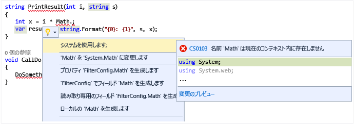

# <a name="quick-actions"></a>クイック アクション

[クイック アクション](refactoring-code-generation-quick-actions.md#quick-actions)を使うと、コードのリファクタリング、生成、その他の変更を、1 つの操作で簡単に行うことができます。  多くのクイック アクションは C# または Visual Basic の一方だけに適用されますが、C# と Visual Basic 両方のプロジェクトに適用されるクイック アクションもいくつかあります。  これらのアクションは、電球アイコン  を使うか、または適切なコード行にカーソルを置いて **Ctrl + .** キーを押すと 適用できます。

赤い波線が表示され、Visual Studio が問題の修正候補を提供できる場合に、電球アイコンが表示されます。 たとえば、赤い波線で示されるエラーがある場合、そのエラーの修正が可能な場合に電球マークが表示されます。 いずれの言語でも、サードパーティは、たとえば SDK の一部として、カスタマイズした診断や提案を表示できます。Visual Studio はそれらの規則に基づいて電球マークを表示します。  

### <a name="to-see-a-light-bulb"></a>電球マークを表示するには  

1. 多くの場合、電球マークはマウスをエラーの地点に移動すると自動的に表示されます。あるいは、カレットをエラーのある行に移動すると、エディターの左端に表示されます。 赤い波線が表示されている場合にマウス ポインターを重ねると電球マークを表示させることができます。 問題が発生した行のどこかに、マウスやキーボードを使用して移動することで電球マークを表示させることもできます。  

2. 行の任意の場所で **Ctrl キーを押しながら . キー**を押すと、 電球マークの表示を呼び出して修正候補のリストを直接表示できます。  

     

### <a name="to-see-potential-fixes"></a>修正候補を表示するには  
下矢印をクリックするか、修正候補を表示するリンクをクリックすると、電球マークで実行可能なクイック操作のリストが表示されます。  



## <a name="common-quick-actions"></a>共通のクイック アクション
ここでは、C# と Visual Basic 両方のコードに共通に適用されるクイック アクションを示します。

### <a name="add-missing-casesdefault-caseboth"></a>足りないケース、既定のケース、または両方を追加する
`switch` ステートメント (C#) または `Select Case` ステートメント (Visual Basic) を作成するときは、コード アクションを使って、足りないケース項目、既定のケースのステートメント、または両方を自動的に追加できます。  空のステートメントは次のようになります。

```CSharp
enum MyEnum
{
    Item1,
    Item2,
    Item3
}

...

MyEnum myEnum = MyEnum.Item1;

switch(myEnum)
{
}
```

```VB
Enum MyEnum
    Item1
    Item2
    Item3
End Enum

...

Dim myEnum as MyEnum = MyEnum.Item1

Select Case myEnum
End Select
```

**[両方を追加する]** クイック アクションを使って足りないケースと既定のケースの両方を追加すると、次のようなコードが作成されます。

```CSharp
switch(myEnum)
{
    case MyEnum.Item1:
        break;
    case MyEnum.Item2:
        break;
    case MyEnum.Item3:
        break;
    default:
        break;    
}
```

```VB
Select Case myEnum
    Case MyEnum.Item1
        Exit Select
    Case MyEnum.Item2
        Exit Select
    Case Else
        Exit Select
End Select
```

### <a name="correct-misspelled-type"></a>スペルが正しくない型を修正する
Visual Studio で型のスペルを誤って入力した場合、このクイック アクションは自動的にそれを修正します。  電球メニューでは **['*スペルが正しくない型*' を '*スペルが正しい型*' に変更]** と表示されます。  例:

```CSharp
// Before
private viod MyMethod()
{
}

// Change 'viod' to 'void'

// After
private void MyMethod()
{
}
```

```VB
' Before
Function MyFunction as Intger
End Function

' Change 'Intger' to 'Integer'

' After
Function MyFunction as Integer
End Function
```

### <a name="remove-unnecessary-cast"></a>不要なキャストを削除する
ある型をキャストが不要な別の型にキャストしている場合、**[不要なキャストの削除]** クイック アクション項目はキャストをコードから削除します。

```CSharp
// before
int number = (int)3;

// Remove Unnecessary Cast

// after
int number = 3;
```

```VB
' Before
Dim number as Integer = CType(3, Integer)

' Remove Unnecessary Cast

' After
Dim number as Integer = 3
```

### <a name="replace-method-with-property--replace-property-with-method"></a>メソッドをプロパティに置き換える/プロパティをメソッドに置き換える
これらのクイック アクションは、メソッドをプロパティに、またはプロパティをメソッドに変換します。  次の例では、メソッドをプロパティに変更しています。  逆の場合は、単に *Before* セクションと *After* セクションが逆になります。

```CSharp
private int MyValue;

// Before
public int GetMyValue()
{
    return MyValue;
}

// Replace 'GetMyValue' with property

// After
public int MyValue
{
    get { return MyValue; }
}
```

```VB
Dim MyValue As Integer

' Before
Function GetMyValue() As Integer
    Return MyValue
End Function

' Replace 'GetMyValue' with property

' After
ReadOnly Property MyValue As Integer
    Get
        Return MyValue
    End Get
End Property
```

### <a name="make-method-synchronous"></a>メソッドを同期させる
`async`/`Async` キーワードをメソッドで使う場合は、そのメソッド内のどこかで `await`/`Await` キーワードも使われることが予想されます。  ただし、そうではない場合は、クイック アクションが表示され、`async`/`Async` キーワードを削除して戻り値の型を変更することにより、同期メソッドにすることができます。  [クイック アクション] メニューの **[メソッドを同期させます]** オプションを選びます。

```CSharp
// Before
async Task<int> MyAsyncMethod()
{
    return 3;
}

// Make method synchronous

// After
int MyAsyncMethod()
{
    return 3;
}
```

```VB
' Before
Async Function MyAsyncMethod() As Task(Of Integer)
    Return 3
End Function

' Make method synchronous

' After
Function MyAsyncMethod() As Integer
    Return 3
End Function
```

### <a name="make-method-asynchronous"></a>メソッドを非同期にする
メソッド内で `await`/`Await` キーワードを使うときは、メソッド自体に `async`/`Async` キーワードが指定されていることが想定されます。  ただし、そうではない場合は、クイック アクションが表示され、非同期メソッドにすることができます。  [クイック アクション] メニューの **[Make method/Function asynchronous (メソッド/関数を非同期にします)]** オプションを使います。

```CSharp
// Before
int MyAsyncMethod()
{
    return await Task.Run(...);
}

// Make method synchronous

// After
async Task<int> MyAsyncMethod()
{
    return await Task.Run(...);
}
```

```VB
' Before
Function MyAsyncMethod() as Integer
    Return  Await Task.Run(...)
End Function

' Make method synchronous

' After
Async Function MyAsyncMethod() As Task(Of Integer)
    Return Await Task.Run(...)
End Function
```

### <a name="remove-unnecesary-usingsimports"></a>不必要な using/Import を削除する
**[不要な using の削除] / [不要なインポートの削除]** クイック アクションは、現在のファイルで使われていない `using` および `Import` ステートメントを削除します。  この項目を選ぶと、使われていない名前空間のインポートがすぐに削除されます。

### <a name="add-usingsimports-for-types-in-reference-assemblies-nuget-packages-or-other-types-in-your-solution"></a>参照アセンブリの型、NuGet パッケージの型、またはソリューション内の他の型に using/Import を追加する
ソリューション内の他のプロジェクトにある型を使うとクイック アクションが自動的に表示されますが、それ以外の場合は **[ツール] > [オプション] > [C#]** または **[Basic] > [詳細設定]** タブで有効にする必要があります。  

* 参照アセンブリの型に using/import を提案する
* NuGet パッケージの型に using/import を提案する

有効にした場合、現在はインポートされていなくても参照アセンブリまたは NuGet パッケージには存在する名前空間の型を使うと、using/import ステートメントが作成されます。

```CSharp
// Before
Debug.WriteLine("Hello");

// using System.Diagnostics;

// After
using System.Diagnostics;

Debug.WriteLine("Hello");
```

```VB
' Before
Debug.WriteLine("Hello")

' Imports System.Diagnostics

// After
Imports System.Diagnostics

Debug.WriteLine("Hello")
```

### <a name="convert-to-interpolated-string"></a>挿入文字列に変換する
[挿入文字列](/dotnet/articles/csharp/language-reference/keywords/interpolated-strings)は、埋め込み変数を含む文字列を表現する簡単な方法であり、**[String.Format](https://msdn.microsoft.com/library/system.string.format(v=vs.110).aspx)** メソッドに似ています。  このクイック アクションは、文字列が連結されている場合、または **String.Format** が使われている場合を認識し、それを挿入文字列に変更します。

```CSharp
// Before
int num = 3;
string s = string.Format("My string with {0} in the middle", num);

// Convert to interpolated string

// After
int num = 3;
string s = $"My string with {num} in the middle";
```

```VB
' Before
Dim num as Integer = 3
Dim s as String = String.Format("My string with {0} in the middle", num)

' Convert to interpolated string

' After
Dim num as Integer = 3
Dim s As String = $"My string with {num} in the middle"
```

# <a name="see-also"></a>関連項目
* [コード スタイルとクイック アクション](code-styles-and-quick-actions.md)
