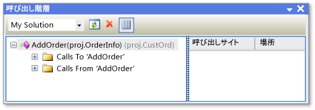
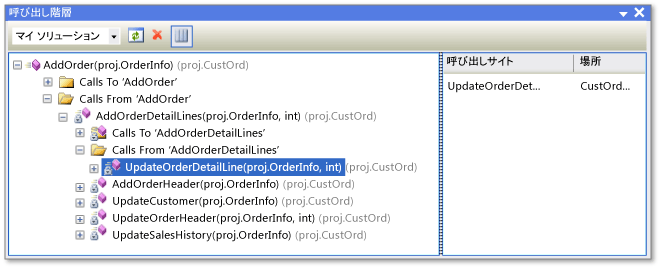

# 呼び出し階層
[!INCLUDE[vs2017banner](../../code-quality/includes/vs2017banner.md)]

呼び出し階層は、選択されたメソッド、プロパティ、またはコンストラクターに対するすべての呼び出しを表示することで、コード内を移動できるようにします。  これにより、コードの流れが理解しやすくなり、コードの変更の影響を評価できます。  コードを複数のレベルで調べて、コード内のメソッド呼び出しやその他のエントリ ポイントの複雑なチェーンを確認し、可能なすべての実行パスを検討できます。  
  
 呼び出し階層は、デバッガーによって表示される呼び出し履歴とは異なり、デザイン時に使用できます。  
  
## 呼び出し階層の使用  
 **\[呼び出し階層\]** ウィンドウを表示するには、メソッド、プロパティ、またはコンストラクターの呼び出しの名前を右クリックし、**\[呼び出し階層の表示\]** をクリックします。  
  
 **\[呼び出し階層\]** ウィンドウのツリー ビュー ペインに、メンバー名が表示されます。  メンバー ノードを展開すると、**\[呼び出し先 \<メンバー名\>\]** と **\[呼び出し元 \<メンバー名\>\]** の各サブノードが表示されます。  次の図は、**\[呼び出し階層\]** ウィンドウに表示されたこれらのノードを示しています。  
  
   
\[呼び出し階層\] ウィンドウ  
  
-   **\[呼び出し先\]** ノードを展開すると、選択したメンバーを呼び出す、すべてのメンバーが表示されます。  
  
-   **\[呼び出し元\]** ノードを展開すると、選択したメンバーによって呼び出されるすべてのメンバーが表示されます。  
  
 さらに各サブノード メンバーを **\[呼び出し先\]** ノードおよび **\[呼び出し元\]** ノードに展開できます。  これにより、次の図のように、呼び出し元のスタック内に移動できます。  
  
   
\[呼び出し階層\] ウィンドウ  
  
 仮想メンバーまたは抽象メンバーとして定義されているメンバーの場合は、**\[\<メンバー名\> をオーバーライドします\]** ノードが表示されます。  インターフェイス メンバーの場合は、**\[\<メンバー名\> を実装します\]** ノードが表示されます。  これらの展開可能なノードは、**\[呼び出し先\]** ノードおよび **\[呼び出し元\]** ノードと同じレベルに表示されます。  
  
 ツール バーの **\[検索スコープ\]** ボックスには、**\[マイ ソリューション\]**、**\[現在のプロジェクト\]**、および **\[現在のドキュメント\]** の選択肢が含まれます。  
  
 **\[呼び出し階層\]** のツリー ビュー ペインで、子メンバーを選択すると、以下が表示されます。  
  
-   **\[呼び出し階層\]** の詳細ペインに、選択した子メンバーが親メンバーから呼び出されているコード行がすべて表示されます。  
  
-   **コード定義ウィンドウ**は、を開き、選択したメンバーのコードが表示されます。  このウィンドウは、 C\# および C\+\+ で使用できます。  このウィンドウの詳細については、「[コードの構造の表示](../../ide/viewing-the-structure-of-code.md)」を参照してください。  
  
> [!NOTE]
>  呼び出し階層は、メソッドがイベント ハンドラーとして追加された場所、またはメソッドがデリゲートに割り当てられた場所が含まれたメソッド グループの参照を検出しません。  メソッドへのすべての参照を検索するには、**すべての参照の検索**コマンドを実行します。  
  
## ショートカット メニュー項目  
 ツリー ビュー ペインでノードを右クリックしたときに使用できるショートカット メニュー オプションを、次の表に示します。  
  
|コンテキスト メニュー項目|Description|  
|-------------------|-----------------|  
|**\[新規ルートとして追加\]**|選択されたノードを新しいルート ノードとしてツリー ビュー ペインに追加します。  これにより、特定のサブツリーに重点を置くことができます。|  
|**\[ルートの削除\]**|選択されたルート ノードをツリー ビュー ペインから削除します。  このオプションは、ルート ノードでのみ使用できます。   また、**\[ルートの削除\]** ツール バー ボタンを使用して、選択したルート ノードを削除することもできます。|  
|**\[定義へ移動\]**|選択したノードに対して、定義へ移動コマンドを実行します。  これにより、メンバー呼び出しまたは変数定義の元の定義に移動します。   定義へ移動コマンドの実行は、選択したノードをダブルクリックするか、選択したノードで F12 キーを押して行うこともできます。|  
|**\[すべての参照の検索\]**|選択したノードに対して、すべての参照の検索コマンドを実行します。  これにより、プロジェクト内で、クラスまたはメンバーを参照しているすべてのコードが検索されます。   Shift キーを押しながら F12 キーを押しても、選択したノードに対して、すべての参照の検索コマンドを実行できます。|  
|**コピー**|選択したノードの内容 \(ただし、サブノードは除く\) をコピーします。|  
|**最新の情報に更新**|選択したノードを折りたたんでから再び展開し、現在の情報を表示します。|