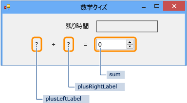
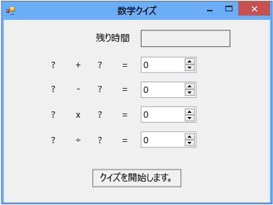

# 手順 1: プロジェクトの作成とフォームへのラベルの追加
このクイズを開発する最初のステップとして、プロジェクトを作成し、ラベル、ボタン、およびその他のコントロールをフォームに追加します。 また、追加する各コントロールのプロパティを設定します。 プロジェクトには、フォーム、コントロール、およびコード (チュートリアルで後ほど説明) が含まれます。 ボタンはクイズを開始し、ラベルはクイズ問題を表示し、その他のコントロールはクイズの解答とクイズを完了するために残っている時間を示します。  

> [!NOTE]
>  このトピックは、コーディングの基本概念に関するチュートリアル シリーズの一部です。 チュートリアルの概要については、「[チュートリアル 2: 制限時間ありの計算クイズの作成](../ide/tutorial-2-create-a-timed-math-quiz.md)」を参照してください。  
  
## プロジェクトを作成し、フォームのプロパティを設定するには  
  
1.  メニュー バーで、**[ファイル]**  >  **[新規作成]**  >  **[プロジェクト]** を選択します。  
  
2.  **[インストールされたテンプレート]** の一覧で **[C#]** または **[Visual Basic]** を選択します。  

3.  テンプレートの一覧で **[Windows フォーム アプリケーション]** テンプレートを選択し、「**Math Quiz**」という名前を付けて、**[OK]** をクリックします。  
  
     選択したプログラミング言語に応じて、*Form1.cs* または *Form1.vb* という名前のフォームが表示されます。  
  
4.  フォームを選択し、**Text** プロパティを **Math Quiz** に変更します。  

     **[プロパティ]** ウィンドウには、フォームのプロパティが含まれます。  

5.  フォームのサイズを幅が 500 ピクセル、高さが 400 ピクセルに変更します。  

     適切なサイズが統合開発環境 (IDE) の左下隅に表示されるまでフォームの端をドラッグしてフォームのサイズ変更ができます。 代わりに、**Size** プロパティの値を変更することもできます。  

6.  **FormBorderStyle** プロパティの値を **Fixed3D** に変更し、**MaximizeBox** プロパティを **False** に設定します。  

     これらの値によって、クイズの受け手はフォームのサイズを変更できなくなります。  
  
## 残り時間ボックスを作成するには  
  
1.  **ツールボックス**から <xref:System.Windows.Forms.Label> コントロールを追加し、その **[(名前)]** プロパティの値を「**timeLabel**」に設定します。  
  
     このラベルは、クイズの残り時間の秒数を表示するボックスとして、右上隅に表示されます。  

2.  **AutoSize** プロパティを **False** に変更して、ボックスのサイズを変更できるようにします。  

3.  **BorderStyle** プロパティを **FixedSingle** に変更して、ボックスの枠線を描画します。  

4.  **Size** プロパティを **200, 30** に設定します。  

5.  青いスペーサーの線が表示されるまで、ラベルをフォームの右上隅に移動します。  

     これらの行によって、フォーム上にコントロールを配置できます。  
  
6.  **[プロパティ]** ウィンドウで、**Text** プロパティをクリックし、**Backspace** キーを押してその値をクリアします。  
  
7.  **Font** プロパティの横にある正符号 (**+**) をクリックし、**Size** プロパティの値を **15.75** に変更します。  
  
     次の画像に示すように、複数のフォント プロパティを変更できます。  

     ![フォント サイズを示す [プロパティ] ウィンドウ](../ide/media/express_setfontsize.png "Express_setFontSize")  
フォント サイズを示す **[プロパティ]** ウィンドウ  
  
8.  **ツールボックス**から別の Label コントロールを追加し、フォント サイズを **15.75** に設定します。  
  
9. **Text** プロパティを **Time Left** に設定します。  

10. **[timeLabel]** ラベルのすぐ左側に並ぶようにラベルを移動します。  

### 加算問題にコントロールを追加するには  
  
1.  **ツールボックス**から Label コントロールを追加し、その **Text** プロパティを **?** (疑問符) に設定します。  
  
2.  **AutoSize** プロパティを **False** に設定します。  

3.  **Size** プロパティを **60, 50** に設定します。  

4.  フォント サイズを **18** に設定します。  

5.  **TextAlign** プロパティを **MiddleCenter** に設定します。  

6.  **Location** プロパティを **50, 75** に設定して、コントロールをフォーム上に配置します。  

7.  **(Name)** プロパティを **plusLeftLabel** に設定します。  
  
8.  **[plusLeftLabel]** ラベルをクリックし、**Ctrl** + **C** キーを押すか、**[編集]** メニューの **[コピー]** をクリックします。  
  
9. **Ctrl** + **V** キーを押すか、**[編集]** メニューの **[貼り付け]** をクリックして、ラベルを 3 回貼り付けます。  
  
10. **[plusLeftLabel]** ラベルの右側に並ぶように、3 つの新しいラベルを配置します。  

     スペーサーの線を使用して、間隔を調整し、まっすぐになるように配置します。  

11. 2 番目のラベルの **Text** プロパティの値を **+** (加算記号) に設定します。  

12. 3 番目のラベルの **(Name)** プロパティの値を **plusRightLabel** に設定します。  

13. 4 番目のラベルの **Text** プロパティの値を **=** (等号) に設定します。  
  
14. **ツールボックス**から <xref:System.Windows.Forms.NumericUpDown> コントロールを追加し、フォント サイズを **18** に設定して、幅を **100** に設定します。  
  
     この種類のコントロールについては、後ほど詳しく説明します。  
  
15. 加算問題のラベル コントロールに合わせて、NumericUpDown コントロールを並べます。  
  
16. NumericUpDown コントロールの **(Name)** プロパティの値を **sum** に変更します。  
  
     次の画像に示すように、最初の行が作成されました。  

       
計算クイズの最初の行  

## 減算、乗算、除算問題のコントロールを追加するには  
  
1.  加算問題の 5 つのコントロール (4 つの Label コントロールと NumericUpDown コントロール) すべてをコピーして、貼り付けます。  
  
     フォームにはまだ選択されている 5 つの新しいコントロールが含まれています。  

2.  追加のコントロールの下に整列するようにすべてのコントロールを適切な位置に移動します。  

     スペーサーの線を利用して、2 つの行の間隔を十分に確保できます。  

3.  2 番目のラベルの **Text** プロパティの値を **-** (マイナス記号) に変更します。  

4.  最初の疑問符のラベルに **minusLeftLabel** という名前を付けます。  

5.  2 番目の疑問符のラベルに **minusRightLabel** という名前を付けます。  
  
6.  NumericUpDown コントロールに **difference** という名前を付けます。  
  
7.  5 つのコントロールをさらに 2 回貼り付けます。  

8.  3 番目の行については、最初のラベルに **timesLeftLabel** という名前を付け、2 番目のラベルの **Text** プロパティを **×** (乗算記号) に変更し、3 番目のラベルに **timesRightLabel** という名前を付け、NumericUpDown コントロールに **product** という名前を付けます。  

9. 4 番目の行については、最初のラベルに **dividedLeftLabel** という名前を付け、2 番目のラベルの **Text** プロパティを **÷** (除算記号) に変更し、3 番目のラベルに **dividedRightLabel** という名前を付け、NumericUpDown コントロールに **quotient** という名前を付けます。  

    > [!NOTE]
    >  乗算記号 × と除算記号 ÷ は、このチュートリアルからコピーしてフォームに貼り付けることができます。  

## [Start] ボタンを追加し、タブ インデックスの順序を設定するには  
  
1.  **ツールボックス**から <xref:System.Windows.Forms.Button> コントロールを追加し、その **(Name)** プロパティを **startButton** に設定します。  
  
2.  **Text** プロパティを **Start the quiz** に設定します。  

3.  フォント サイズを **14** に設定します。  

4.  **AutoSize** プロパティを **True** に設定します。ボタンのサイズがテキストに合わせて自動的に変更されます。  

5.  フォームの下部付近にボタンを中央揃えで配置します。  

6.  **startButton** コントロールの **TabIndex** プロパティの値を **1** に設定します。  

    > [!NOTE]
    >  クイズの受け手が **Tab** キーを押すと、**TabIndex** プロパティはコントロールの順序を設定します。 この動作を確認するには、ダイアログ ボックス (たとえば、メニュー バーで、**[ファイル]** > **[開く]** をクリックします) を開き、**Tab** キーを数回押します。 **Tab** キーを押すたびに、カーソルが次のコントロールへと切り替わっていくのがわかります。 この順序は、そのフォームが設計されたときにプログラマによって決められています。  
  
7.  NumericUpDown sum コントロールの **TabIndex** プロパティの値を **2** に設定し、difference コントロールは **3** に設定し、product コントロールは **4** に設定し、quotient コントロールは **5** に設定します。  

     フォームは次の図のようになります。  

       
計算クイズの初期フォーム  
  
8.  予測どおりに **TabIndex** プロパティが動作するかどうかを確認するには、**F5** キーを押してプログラムを保存して実行するか、またはメニュー バーの **[デバッグ]** > **[デバッグの開始]** をクリックし、**Tab** キーを数回押します。  
  
## 続行または確認するには  
  
-   チュートリアルの次の手順に進むには、「[手順 2: ランダムな加算問題の作成](../ide/step-2-create-a-random-addition-problem.md)」をご覧ください。  
  
-   概要のトピックに戻るには、「[チュートリアル 2: 制限時間ありの計算クイズの作成](../ide/tutorial-2-create-a-timed-math-quiz.md)」をご覧ください。
