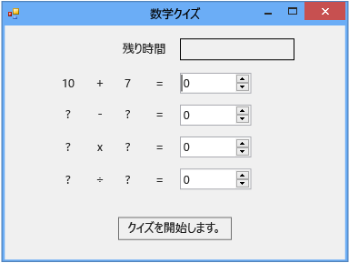

# 手順 2: ランダムな加算問題の作成
このチュートリアルの第 2 部では、乱数に基づく計算問題を追加して、クイズに挑みます。 また、`StartTheQuiz()` という名前の、問題に記入して、カウントダウン タイマーを開始するメソッドを作成します。 このチュートリアルの後半では、減算、乗算、除算問題を追加します。

> [!NOTE]
>  このトピックは、コーディングの基本概念に関するチュートリアル シリーズの一部です。 チュートリアルの概要については、「[チュートリアル 2: 制限時間ありの計算クイズの作成](../ide/tutorial-2-create-a-timed-math-quiz.md)」を参照してください。

### ランダムな加算問題を作成するには

1.  フォーム デザイナーで、フォーム (Form1) を選択します。

2.  メニュー バーで **[表示]**、 **[コード]** の順に選択します。

     使用しているプログラミング言語によって Form1.cs または Form1.vb が表示されるため、フォームの分離コードを表示できます。

3.  次のように、コードの先頭付近に `Random` ステートメントを追加して `new` オブジェクトを作成します。

     [!code-csharp[VbExpressTutorial3Step2#1](../ide/codesnippet/CSharp/step-2-create-a-random-addition-problem_1.cs)]
     [!code-vb[VbExpressTutorial3Step2#1](../ide/codesnippet/VisualBasic/step-2-create-a-random-addition-problem_1.vb)]

     `Random` オブジェクトをフォームに追加し、オブジェクトに **randomizer** という名前を付けました。

     `Random` はオブジェクトと呼ばれます。 この言葉は聞いたことがあるでしょう。次のチュートリアルでプログラミングでのその意味について説明していきます。 ここでは、ボタン、ラベル、パネル、OpenFileDialogs、ColorDialogs、SoundPlayers、Randoms、およびフォームの作成に `new` ステートメントを使用することができ、これらの項目はオブジェクトと呼ばれることを覚えておいてください。 プログラムを実行すると、フォームが開始され、その分離コードは `Random` オブジェクトを作成し、**randomizer** と名付けます。

     すぐにメソッドをビルドして解答を確認するため、クイズは変数を使用して各問題に生成する乱数を格納する必要があります。 [変数](/dotnet/visual-basic/programming-guide/language-features/variables/index)または[型](/dotnet/csharp/programming-guide/types/index)に関するページを参照してください。 変数を適切に使用するためには、変数を宣言する必要があります。これは名前およびデータ型を一覧表示することを意味します。

4.  2 つの整数変数をフォームに追加し、**addend1** と **addend2** という名前を付けます。

    > [!NOTE]
    >  整数変数は、C# では int、Visual Basic では Integer と呼ばれます。 この種類の変数は、-2147483648 から 2147483647 の正または負の数を格納し、整数のみを格納することができ、小数は格納できません。

     次のコードに示すように、`Random` オブジェクトを追加するために使用したものと同様の構文を使用して整数変数を追加します。

     [!code-csharp[VbExpressTutorial3Step2#2](../ide/codesnippet/CSharp/step-2-create-a-random-addition-problem_2.cs)]
     [!code-vb[VbExpressTutorial3Step2#2](../ide/codesnippet/VisualBasic/step-2-create-a-random-addition-problem_2.vb)]

5.  `StartTheQuiz()` と名付けられたメソッドを追加しますが、このメソッドは `Random` オブジェクトの `Next()` メソッドを使用してラベルの乱数を表示します。 `StartTheQuiz()` は最終的にすべての問題に入力し、タイマーを開始するので、コメントを追加します。 関数は次のようになります。

     [!code-csharp[VbExpressTutorial3Step2#3](../ide/codesnippet/CSharp/step-2-create-a-random-addition-problem_3.cs)]
     [!code-vb[VbExpressTutorial3Step2#3](../ide/codesnippet/VisualBasic/step-2-create-a-random-addition-problem_3.vb)]

     コードで **randomizer** の後にドット (.) を入力すると、IntelliSense ウィンドウが開き、呼び出すことができる `Random` オブジェクトのすべてのメソッドが表示されることに注意してください。 たとえば、IntelliSense は `Next()` メソッドを次のように一覧表示します。

      Next メソッド

     オブジェクトの後にドットを入力すると、IntelliSense はプロパティ、メソッド、イベントなどのオブジェクトのメンバーの一覧を表示します。

    > [!NOTE]
    >  `Next()` を呼び出す場合など、`Random` オブジェクトで `randomizer.Next(50)` メソッドを使用するときは、50 未満の乱数を取得します (0 ～ 49)。 この例では、`randomizer.Next(51)` を呼び出します。 2 つの乱数を合計した答えが 0 ～ 100 になるようにするため、50 ではなく 51 を使用しました。 `Next()` メソッドに 50 を渡した場合、0 ～ 49 の数値が選択されるため、答えの最大値が 100 ではなく 98 になります。 メソッドの最初の 2 つのステートメントが実行された後、`addend1` と `addend2` の 2 つの整数変数は、それぞれ 0 ～ 50 の乱数を保持します。 このスクリーンショットは Visual C# コードを表示していますが、IntelliSense は Visual Basic の場合でも同様に動作します。

     次のステートメントについて詳しく見てみましょう。

     [!code-csharp[VbExpressTutorial3Step2#18](../ide/codesnippet/CSharp/step-2-create-a-random-addition-problem_4.cs)]
     [!code-vb[VbExpressTutorial3Step2#18](../ide/codesnippet/VisualBasic/step-2-create-a-random-addition-problem_4.vb)]

     これらのステートメントでは、**plusLeftLabel** および **plusRightLabel** の **Text** プロパティを設定し、2 つの乱数が表示されるようになっています。 数値をテキストに変換するには、整数の `ToString()` メソッドを使用する必要があります。 (プログラミングでは、文字列はテキストを意味します。 ラベル コントロールには、数ではなく、テキストのみが表示されます。

6.  デザイン ウィンドウで、**[Start]** ボタンをダブルクリックするか、または [Start] ボタンをクリックして、Enter キーを押します。

     クイズの受け手がこのボタンをクリックすると、クイズが開始され、その動作を実装する Click イベント ハンドラーが追加されました。

7.  次の 2 つのステートメントを追加します。

     [!code-csharp[VbExpressTutorial3Step2#4](../ide/codesnippet/CSharp/step-2-create-a-random-addition-problem_5.cs)]
     [!code-vb[VbExpressTutorial3Step2#4](../ide/codesnippet/VisualBasic/step-2-create-a-random-addition-problem_5.vb)]

     最初のステートメントは新しい `StartTheQuiz()` メソッドを呼び出します。 2 番目のステートメントは **startButton** コントロールの **Enabled** プロパティを **False** に設定するため、クイズの受け手はクイズ中にこのボタンをクリックできません。

8.  コードを保存し、実行して、**[Start]** ボタンをクリックします。

     次の図に示すように、ランダムな加算問題が表示されます。

      ランダムな加算の問題

     チュートリアルの次の手順では、合計を追加します。

### 続行または確認するには

-   チュートリアルの次の手順に進むには、「[手順 3: カウントダウン タイマーの追加](../ide/step-3-add-a-countdown-timer.md)」を参照してください。

-   チュートリアルの前の手順に戻るには、「[手順 1: プロジェクトの作成とフォームへのラベルの追加](../ide/step-1-create-a-project-and-add-labels-to-your-form.md)」を参照してください。
