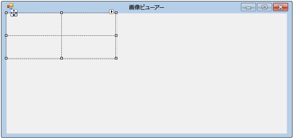
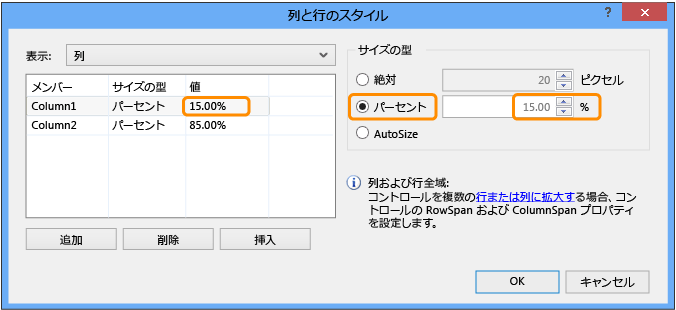
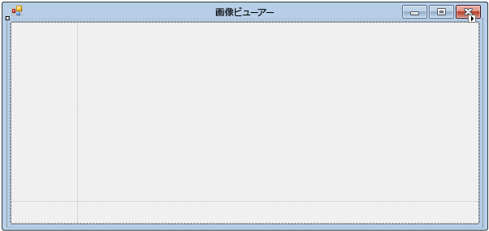

# 手順 4: TableLayoutPanel コントロールを使用したフォームのレイアウトの設定
この手順では、フォームに `TableLayoutPanel` コントロールを追加します。 TableLayoutPanel は、後で追加するフォームのコントロールを適切にアラインするために役立ちます。  
  
 このトピックのビデオ版については、「[チュートリアル 1: Visual Basic によるピクチャ ビューアーの作成 - ビデオ 2](http://go.microsoft.com/fwlink/?LinkId=205211)」または「[チュートリアル 1: C# によるピクチャ ビューアーの作成 - ビデオ 2](http://go.microsoft.com/fwlink/?LinkId=205200)」を参照してください。 これらのビデオでは、旧バージョンの Visual Studio を使用しているため、一部のメニュー コマンドやその他のユーザー インターフェイス要素が若干異なります。 ただし、概念および手順は、現在のバージョンの Visual Studio でも同様です。  
  
### TableLayoutPanel コントロールを使用してフォームのレイアウトを設定するには  
  
1.  Visual Studio IDE の左側で、**[ツールボックス]** タブを探します。 **[ツールボックス]** のタブをクリックすると、ツールボックスが表示されます。 (メニュー バーで **[表示]**、**[ツールボックス]** の順にクリックします。)  
  
2.  次の図に示すように、**[コンテナー]** グループの横にある小さな三角形をクリックして、このグループを開きます。  
  
     ![[コンテナー] グループ](../ide/media/express_toolbox.png "Express_Toolbox")  
[コンテナー] グループ  
  
3.  ボタン、チェック ボックス、ラベルなどのコントロールをフォームに追加できます。 ツールボックスの `TableLayoutPanel` コントロールをダブルクリックします。 (または、ツールボックスからフォームへ、コントロールをドラッグできます。)次の図に示すように、この操作を行うと、IDE で `TableLayoutPanel` コントロールがフォームに追加されます。  
  
       
TableLayoutPanel コントロール  
  
    > [!NOTE]
    >  TableLayoutPanel を追加した後、**[TableLayoutPanel タスク]** というタイトルのウィンドウがフォーム内に表示された場合は、フォーム内の任意の場所をクリックしてそのウィンドウを閉じます。 このウィンドウについては、このチュートリアルで後ほど詳しく説明します。  
  
     ツールボックスは、タブをクリックするとフォームの前面に展開され、ツールボックスの外部の任意の場所をクリックすると閉じます。 これは、IDE の自動非表示機能です。 ウィンドウの右上隅にあるプッシュピン アイコンをクリックすると、すべてのウィンドウについてこの機能のオンとオフを切り替えることができます。このアイコンをクリックするたびに、自動非表示になるか位置が固定されるかが切り替わります。 プッシュピン アイコンは次のように表示されます。  
  
       
プッシュピン アイコン  
  
4.  **TableLayoutPanel** をクリックして選択します。 どのコントロールが選択されているかを確認するには、次の図のような、**[プロパティ]** ウィンドウの上部にあるドロップダウン リストを確認します。  
  
     ![TableLayoutPanel コントロールを示す [プロパティ] ウィンドウ](../ide/media/express_controlspropwin.png "Express_ControlsPropWin")  
TableLayoutPanel コントロールを示す [プロパティ] ウィンドウ  
  
5.  **[プロパティ]** ウィンドウのツール バーにある **[アルファベット順]** をクリックします。 これにより、**[プロパティ]** ウィンドウのプロパティの一覧がアルファベット順に表示され、このチュートリアルのプロパティが探しやすくなります。  
  
6.  コントロール セレクターは、**[プロパティ]** ウィンドウの上部にあるドロップダウン リストです。 この例では、`tableLayoutPanel1` というコントロールが選択されています。 コントロールを選択するには、Windows フォーム デザイナーの領域をクリックするか、コントロール セレクターから選択します。 `TableLayoutPanel` が選択されているので、**Dock** プロパティを探し、**[Dock]** をクリックします (**None** に設定されています)。 値の横にドロップダウン矢印が表示されます。 次の図に示すように、矢印をクリックし、**[Fill]** ボタン (中央にある大きいボタン) をクリックします。  
  
     ![[塗りつぶし] が選択された [プロパティ] ウィンドウ](../ide/media/express_docktable.png "Express_DockTable")  
[塗りつぶし] が選択された [プロパティ] ウィンドウ  
  
     ウィンドウが別のウィンドウまたは IDE の領域にアタッチされている場合、Visual Studio の*ドッキング*が参照します。 たとえば、[プロパティ] ウィンドウはドッキング解除できます。つまり、Visual Studio 内でアタッチされておらず、フローティング状態であるか、または**ソリューション エクスプローラー**に対してドッキングできます。  
  
7.  TableLayoutPanel の **Dock** プロパティを **Fill** に設定すると、パネルがフォーム全体に表示されます。 この後にフォームのサイズを変更した場合、TableLayoutPanel はドッキングされたまま、フォームに合わせてサイズが変更されます。  
  
    > [!NOTE]
    >  TableLayoutPanel は、Microsoft Office Word の表に似ています。行と列があり、個々のセルは複数の行および列にまたがることができます。 各セルでは、1 つのコントロール (ボタン、チェック ボックス、ラベルなど) を保持できます。 ここでは、TableLayoutPanel の上の行に行全体にまたがる `PictureBox` コントロールを配置し、左下のセルに `CheckBox` コントロールを配置し、右下のセルに 4 つの `Button` コントロールを配置します。  
  
8.  現在、TableLayoutPanel には 2 つの行と 2 つの列がありますが、いずれもサイズは同じになっています。 上の行と右の列のサイズがそれぞれ他方よりもかなり大きくなるように変更する必要があります。 Windows フォーム デザイナーで、TableLayoutPanel を選択します。 右上隅に、次のような小さな黒い三角形のボタンが表示されます。  
  
       
三角形のボタン  
  
     このボタンは、コントロールのプロパティを自動的に設定するのに役立つタスクがあることを示しています。  
  
9. 三角形をクリックします。次の図に示すように、コントロールのタスク一覧が表示されます。  
  
       
TableLayoutPanel タスク  
  
10. **[行および列の編集]** タスクをクリックして、**[列と行のスタイル]** ウィンドウを表示します。 **[Column1]** をクリックし、サイズを 15% に設定します。設定するには、**[パーセント]** ボタンが選択されていることを確認し、**[パーセント]** ボックスに「`15`」と入力します。 (これは、この後の別のチュートリアルで使用する `NumericUpDown` コントロールです)。**[Column2]** をクリックし、85% に設定します。 クリックするとウィンドウが閉じるため、まだ **[OK]** はクリックしないでください (クリックした場合は、タスク一覧を使用して再度開くことができます)。  
  
       
TableLayoutPanel の列と行のスタイル  
  
11. ウィンドウの上部にある **[表示]** ドロップダウン リストの **[行]** をクリックします。 **Row1** を 90% に、**Row2** を 10% に設定します。  
  
12. **[OK]** を選択します。 これで、TableLayoutPanel の上の行が大きくなり、下の行が小さくなります。また、左の列が小さくなり、右の列が大きくなります。 フォームで tableLayoutPanel1 をクリックし、その行と列の境界線をドラッグして、TableLayoutPanel の行と列のサイズ変更できます。  
  
       
TableLayoutPanel がサイズ変更された Form1  
  
### 続行または確認するには  
  
-   チュートリアルの次の手順に進むには、「[手順 5: フォームへのコントロールの追加](../ide/step-5-add-controls-to-your-form.md)」を参照してください。  
  
-   チュートリアルの前の手順に戻るには、「[手順 3: フォームのプロパティの設定](../ide/step-3-set-your-form-properties.md)」を参照してください。
