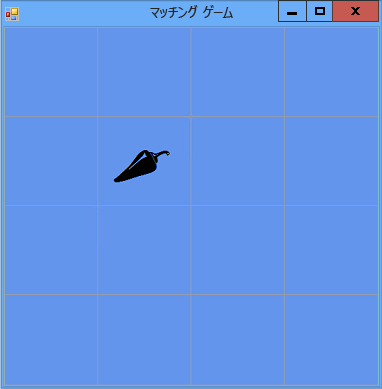

# 手順 5: ラベルの参照の追加
[!INCLUDE[vs2017banner](../code-quality/includes/vs2017banner.md)]

プログラムでは、プレーヤーがどのラベル コントロールをクリックしたかを追跡する必要があります。  現在のところ、プレーヤーが選択したすべてのラベルが表示されます。  しかし、次のように変更します。  1 つ目のラベルがクリックされると、プログラムではラベルのアイコンを表示します。  2 つ目のラベルがクリックされると、一時的に両方のアイコンを表示した後に、再びアイコンを非表示にします。  *参照変数*を使用して、1 回目および 2 回目にどのラベル コントロールがクリックされたかを追跡します。  
  
### ラベルの参照を追加するには  
  
1.  次のコードを使用して、フォームにラベルの参照を追加します。  
  
     [!CODE [VbExpressTutorial4Step5#5](../CodeSnippet/VS_Snippets_VBCSharp/vbexpresstutorial4step5#5)]  
  
     これらの参照変数は、フォームにオブジェクト \(`Timer` オブジェクト、`List` オブジェクト、`Random` オブジェクトなど\) を追加するために前に使用したステートメントに似ているように見えます。  ただし、これらのステートメントでは、フォームに追加の 2 つのラベル コントロールは表示されません。これは、2 つのステートメントのいずれにも `new` を使用していないためです。  `new` キーワードを使用しないと、オブジェクトは作成されません。  `firstClicked` および `secondClicked` が参照変数と呼ばれるのはこのためです。これらは、単に `Label` オブジェクトを追跡 \(参照\) するだけです。  
  
     変数は、オブジェクトを追跡していない間は、特殊な予約値 `null` \(Visual C\# の場合\) および `Nothing` \(Visual Basic の場合\) に設定されます。  そのため、プログラムが起動されると、`firstClicked` および `secondClicked` の両方が `null` または `Nothing` に設定されます。これは、変数が何も追跡していないことを意味しています。  
  
2.  新しい `firstClicked` 参照変数を使用するように Click イベント ハンドラーを変更します。  `label_Click()` イベント ハンドラー メソッドの最後のステートメント \(`clickedLabel.ForeColor = Color.Black;`\) を削除し、次に示す `if` ステートメントに置き換えます \(必ずコメントと `if` ステートメント全体を含めてください\)。  
  
     [!CODE [VbExpressTutorial4Step5#6](../CodeSnippet/VS_Snippets_VBCSharp/vbexpresstutorial4step5#6)]  
  
3.  プログラムを保存し、実行します。  いずれかのラベル コントロールをクリックすると、そのアイコンが表示されます。  
  
4.  次のラベル コントロールをクリックすると、何も起こらないことに気付きます。  プログラムでは、プレーヤーがクリックした 1 つ目のラベルが既に追跡されているため、`firstClicked` は `null` \(Visual C\# の場合\) または `Nothing` \(Visual Basic の場合\) ではありません。  `if` ステートメントは、`firstClicked` が `null` または `Nothing` かどうかをチェックし、そうでないことがわかった場合は、`if` ステートメント内のステートメントを実行しません。  そのため、次の図に示すように、クリックされた 1 つ目のアイコンのみが黒になり、他のアイコンは非表示になります。  
  
       
1 つのアイコンが表示された絵合わせゲーム  
  
     この状況は、チュートリアルの次のステップで **Timer** コントロールを追加することで修正します。  
  
### 続行または確認するには  
  
-   チュートリアルの次の手順に進むには、「[手順 6: タイマーの追加](../Topic/Step%206:%20Add%20a%20Timer.md)」を参照してください。  
  
-   チュートリアルの前の手順に戻るには、「[手順 4: 各ラベルへの Click イベント ハンドラーの追加](../Topic/Step%204:%20Add%20a%20Click%20Event%20Handler%20to%20Each%20Label.md)」を参照してください。