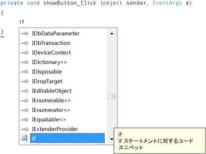

# 手順 8: [Show a Picture] ボタンのイベント ハンドラーのコードの記述
この手順では、**[Show a picture]** ボタンの機能を次のように設定します。  
  
-   ユーザーがボタンをクリックすると **[ファイルを開く]** ダイアログ ボックスが開く。  
  
-   ユーザーがピクチャ ファイルを開くとそのピクチャが PictureBox に表示される。  
  
 IDE には、コードの記述に役立つ IntelliSense と呼ばれる強力なツールが備わっています。 コードを入力する際に単語の一部を入力すると、入力に合わせてボックスが開き、入力候補が提示されます。 このツールは、ユーザーの次の操作を予測し、ユーザーが一覧から選択した最後の項目に自動的にジャンプします。 ユーザーは、上方向キーまたは下方向キーを使用して一覧内を移動したり、文字の入力を続けて選択肢を絞り込んだりすることができます。 目的の選択肢が見つかったら、Tab キーを押して選択します。 入力候補が不要な場合は無視してもかまいません。  
  
 このトピックのビデオ版については、「[チュートリアル 1: Visual Basic によるピクチャ ビューアーの作成 - ビデオ 4](http://go.microsoft.com/fwlink/?LinkId=205215)」または「[チュートリアル 1: C# によるピクチャ ビューアーの作成 - ビデオ 4](http://go.microsoft.com/fwlink/?LinkId=205203)」を参照してください。 これらのビデオでは、旧バージョンの Visual Studio を使用しているため、一部のメニュー コマンドやその他のユーザー インターフェイス要素が若干異なります。 ただし、概念および手順は、現在のバージョンの Visual Studio でも同様です。  
  
### [Show a picture] ボタンのイベント ハンドラーのコードを記述するには  
  
1.  Windows フォーム デザイナーに移動し、**[Show a picture]** ボタンをダブルクリックします。 IDE がすぐにコード デザイナーに切り替わり、前に追加した `showButton_Click()` メソッド内にカーソルが移動します。  
  
2.  2 つの中かっこ { } の間の空の行に「`i`」と入力します  (Visual Basic の場合は、Private Sub… と End Sub の間の空の行に入力します)。次の図に示すように、**IntelliSense** ウィンドウが開きます。  
  
       
Visual C# コードの IntelliSense  
  
3.  **IntelliSense** ウィンドウで、**if** という単語が強調表示されます  (強調表示されない場合は、小文字で「`f`」と入力すると強調表示されます)。**IntelliSense** ウィンドウの横にある小さな *[ツールヒント]* ボックスに "**if ステートメントに対するコード スニペット**" と表示されます。 (Visual Basic の場合も、メッセージは若干異なりますが、ツールヒントにスニペットであることが示されます)。そのスニペットを使用するには、Tab キーを押して "**if**" をコードに挿入します。 次にもう一度 Tab キーを押して **if** スニペットを使用します。 (別の場所をクリックして **[IntelliSense]** ウィンドウが非表示になった場合は、BackSpace キーで **i** を削除してから再度入力すると、もう一度 **[IntelliSense]** ウィンドウが開きます)。  
  
       
Visual C# のコード  
  
4.  次に、IntelliSense を使用して、**[ファイルを開く]** ダイアログ ボックスを開くためのコードを入力します。 ユーザーが **[OK]** をクリックすると、ユーザーが選択したファイルが PictureBox に読み込まれます。 コードを入力する手順を次に示します。手順は多くなっていますが、少ないキーストロークで完了できます。  
  
    1.  スニペットで選択されている **true** というテキストから開始します。 「`op`」と入力してそのテキストを上書きします  (Visual Basic の場合は、先頭文字が大文字のため、「`Op`」と入力します)。  
  
    2.  **IntelliSense** ウィンドウが開き、**openFileDialog1** が表示されます。 Tab キーを押して選択します。 (Visual Basic の場合は、先頭文字が大文字のため、**OpenFileDialog1** が表示されます。 **OpenFileDialog1** が選択されていることを確認してください)。  
  
         `OpenFileDialog` の詳細については、「[OpenFileDialog クラス](http://msdn.microsoft.com/library/system.windows.forms.openfiledialog.aspx)」を参照してください。  
  
    3.  ピリオド (`.`) を入力します (多くのプログラマはこれをドットと呼んでいます)。**openFileDialog1** のすぐ後にドットを入力したため、**IntelliSense** ウィンドウが開き、**OpenFileDialog** コンポーネントのプロパティとメソッドがすべて表示されます。 これらは、Windows フォーム デザイナーでクリックした場合に **[プロパティ]** ウィンドウに表示されるプロパティと同じです。 また、コンポーネントで実行する処理 (ダイアログ ボックスを開くなど) を指定するメソッドも選択できます。  
  
        > [!NOTE]
        >  **IntelliSense** ウィンドウには、プロパティとメソッドの両方が表示されます。 表示される内容を判断するには、**[IntelliSense]** ウィンドウの各項目の左側のアイコンを参照してください。 各メソッドの横にはブロックの画像が表示され、各プロパティの横にはレンチ (スパナ) の画像が表示されます。 また、各イベントの横には稲妻のアイコンが表示されます。 これらの画像は次のとおりです。  
  
         ![[メソッド] アイコン](~/ide/media/express_iconmethod.png "Express_IconMethod")  
[メソッド] アイコン  
  
           
プロパティ アイコン  
  
         ![[イベント] アイコン](~/ide/media/express_iconevent.png "Express_IconEvent")  
[イベント] アイコン  
  
    4.  「`ShowDialog`」の入力を開始します (IntelliSense では大文字と小文字の区別は重要ではありません)。 **[ファイルを開く]** ダイアログ ボックスを表示するメソッドは `ShowDialog()` です。 ウィンドウで "**ShowDialog**" が強調表示されたら、Tab キーを押します。 また、"ShowDialog" を強調表示し、F1 キーを押して、それに関するヘルプを表示することもできます。  
  
         `ShowDialog()` メソッドの詳細については、「[ShowDialog メソッド](http://msdn.microsoft.com/library/c7ykbedk.aspx)」を参照してください。  
  
    5.  コントロールまたはコンポーネントでメソッドを使用する ("*メソッドを呼び出す*" といいます) ときは、かっこを追加する必要があります。 そこで、`ShowDialog` で "g" の直後に左かっこと右かっこを入力します: `()`。つまり、"openFileDialog1.ShowDialog()" となります。  
  
        > [!NOTE]
        >  メソッドはプログラムの重要な要素であり、このチュートリアルでもメソッドの使用方法を既にいくつか示しました。 **OpenFileDialog** コンポーネントの `ShowDialog()` メソッドを呼び出したのと同じように、コンポーネントのメソッドを呼び出すと、コンポーネントで実行する処理を指定することができます。 また、独自のメソッドを作成してプログラムの処理を指定することもできます。たとえば、現在作成している `showButton_Click()` というメソッドは、ユーザーがボタンをクリックしたときにダイアログ ボックスとピクチャを開くメソッドです。  
  
    6.  Visual C# の場合は、空白文字を追加し、2 つの等号 (`==`) を追加します。 Visual Basic の場合は、空白文字を追加し、1 つの等号 (`=`) を使用します  (Visual C# と Visual Basic で、使用する等値演算子が異なります)。  
  
    7.  空白文字をもう 1 つ追加します。 追加すると別の **IntelliSense** ウィンドウが開きます。 「`DialogResult`」の入力を開始し、Tab キーを押して追加します。  
  
        > [!NOTE]
        >  コードを記述してメソッドを呼び出すと、値が返される場合があります。 ここでは、**OpenFileDialog** コンポーネントの `ShowDialog()` メソッドから DialogResult の値が返されます。 DialogResult は、ダイアログ ボックスでの処理を示す特殊な値です。 **OpenFileDialog** コンポーネントではユーザーが **[OK]** をクリックする場合と **[キャンセル]** をクリックする場合があるため、`ShowDialog()` メソッドから DialogResult.OK または DialogResult.Cancel が返されます。  
  
    8.  ドットを入力します。DialogResult の値の **IntelliSense** ウィンドウが開きます。 「`O`」と入力し、Tab キーを押して **OK** を挿入します。  
  
         `DialogResult` の詳細については、「[DialogResult 列挙体](http://msdn.microsoft.com/library/system.windows.forms.dialogresult.aspx)」を参照してください。  
  
        > [!NOTE]
        >  コードの 1 行目はこれで完了です。 Visual C# の場合は、次のようになります。  
        >   
        >  `if (openFileDialog1.ShowDialog() == DialogResult.OK)`  
        >   
        >  Visual Basic の場合は、次のようになります。  
        >   
        >  `If OpenFileDialog1.ShowDialog() = DialogResult.OK Then`  
  
    9. 次に、コードをもう 1 行追加します。 コードを入力する (またはコピーして貼り付ける) こともできますが、IntelliSense を使用して追加することもできます。 IntelliSense の使用に慣れてくると、よりすばやく独自のコードを記述できるようになります。 最終的な `showButton_Click()` メソッドは、次のようになります。 (コードの Visual Basic バージョンを表示するために **[VB]** タブをクリックします)。  
  
         [!code-cs[VbExpressTutorial1Step8#1](../ide/codesnippet/CSharp/step-8-write-code-for-the-show-a-picture-button-event-handler_1.cs)]   [!code-vb[VbExpressTutorial1Step8#1](../ide/codesnippet/VisualBasic/step-8-write-code-for-the-show-a-picture-button-event-handler_1.vb)]  
  
### 続行または確認するには  
  
-   チュートリアルの次の手順に進むには、「[手順 9: 確認、コメントの追加、およびコードのテスト](../ide/step-9-review-comment-and-test-your-code.md)」を参照してください。  
  
-   チュートリアルの前の手順に戻るには、「[手順 7: フォームへのダイアログ コンポーネントの追加](../ide/step-7-add-dialog-components-to-your-form.md)」を参照してください。
