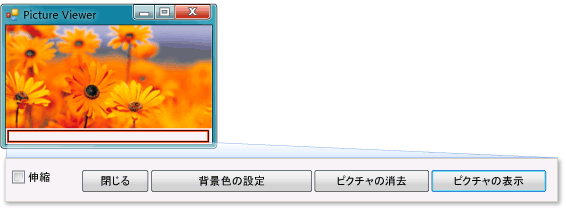

# チュートリアル 1: ピクチャ ビューアーの作成
このチュートリアルでは、ピクチャをファイルから読み込んでウィンドウに表示するプログラムを作成します。 ボタンやピクチャ ボックスなどのコントロールをフォームにドラッグする方法、それらのプロパティを設定する方法、およびコンテナーを使用してフォームのサイズを滑らかに変更する方法を習得できます。 また、コードの記述の基本事項についても学習します。 以下の方法について説明します。  
  
-   新しいプロジェクトを作成します。  
  
-   アプリケーションをテスト (デバッグ) します。  
  
-   チェック ボックスやボタンなどの基本的なコントロールをフォームに追加します。  
  
-   レイアウトを使用してフォーム上のコントロールの位置を設定します。  
  
-   **[ファイルを開く]** ダイアログ ボックスと **[色]** ダイアログ ボックスをフォームに追加します。  
  
-   IntelliSense とコード スニペットを使用してコードを記述します。  
  
-   イベント ハンドラー メソッドを記述します。  
  
 完成すると、プログラムは次の図のようになります。  
  
   
このチュートリアルで作成する画像  
  
 サンプルの完全バージョンをダウンロードするには、「[Complete Picture Viewer tutorial sample](http://code.msdn.microsoft.com/Complete-Picture-Viewer-7d91d3a8)」 (画像ビューアーのチュートリアルの完全なサンプル) を参照してください。  
  
 このトピックのビデオ版については、「[How Do I: Create a Picture Viewer in Visual Basic?](http://go.microsoft.com/fwlink/?LinkId=205207)」(操作方法: Visual Basic によるピクチャ ビューアーの作成) または「[How Do I: Create a Picture Viewer in C#?](http://go.microsoft.com/fwlink/?LinkId=205198)」(操作方法: C# によるピクチャ ビューアーの作成) を参照してください。  
  
> [!NOTE]
>  これらのビデオでは、旧バージョンの Visual Studio を使用しているため、一部のメニュー コマンドやその他のユーザー インターフェイス要素が若干異なります。 ただし、概念および手順は、現在のバージョンの Visual Studio でも同様です。 このチュートリアルでは、Visual C# と Visual Basic の両方が取り上げられているため、使用しているプログラミング言語固有の情報に注意してください。  
>   
>  Visual Basic のコードを確認するには、コード ブロックの上部にある **[VB]** タブをクリックし、Visual C# のコードについては、**[C#]** タブをクリックします。 Visual C++ の学習に関心がある場合は、「[Visual Studio 内の C++ の概要](../ide/getting-started-with-cpp-in-visual-studio.md)」および「[C++ Language Tutorial](http://www.cplusplus.com/doc/tutorial/)」(C++ 言語のチュートリアル) を参照してください。  
>   
>  Windows ストア用の Visual C# アプリまたは Visual Basic アプリの記述方法の学習に関心がある場合は、「[C# または Visual Basic を使った初めての Windows ランタイム アプリの作成](http://msdn.microsoft.com/library/windows/apps/hh974581.aspx)」を参照してください。 Windows ストア用の JavaScript アプリの作成の詳細については、「[JavaScript を使った初めての Windows ランタイム アプリの作成](http://msdn.microsoft.com/library/windows/apps/br211385.aspx)」を参照してください。  
  
## 関連トピック  
  
|タイトル|説明|  
|-----------|-----------------|  
|[手順 1: Windows フォーム アプリケーション プロジェクトの作成](../ide/step-1-create-a-windows-forms-application-project.md)|最初に Windows フォーム アプリケーション プロジェクトを作成します。|  
|[手順 2: プログラムの実行](../ide/step-2-run-your-program.md)|前の手順で作成した Windows フォーム アプリケーション プログラムを実行します。|  
|[手順 3: フォームのプロパティの設定](../ide/step-3-set-your-form-properties.md)|**[プロパティ]** ウィンドウを使用してフォームの外観を変更します。|  
|[手順 4: TableLayoutPanel コントロールを使用したフォームのレイアウトの設定](../ide/step-4-lay-out-your-form-with-a-tablelayoutpanel-control.md)|フォームに `TableLayoutPanel` コントロールを追加します。|  
|[手順 5: フォームへのコントロールの追加](../ide/step-5-add-controls-to-your-form.md)|`PictureBox` コントロールや `CheckBox` コントロールなどのコントロールをフォームに追加します。 また、ボタンも追加します。|  
|[手順 6: ボタン コントロールの名前の設定](../ide/step-6-name-your-button-controls.md)|ボタンの名前をわかりやすい名前に変更します。|  
|[手順 7: フォームへのダイアログ コンポーネントの追加](../ide/step-7-add-dialog-components-to-your-form.md)|**OpenFileDialog** コンポーネントと **ColorDialog** コンポーネントをフォームに追加します。|  
|[手順 8: [Show a Picture] ボタンのイベント ハンドラーのコードの記述](../ide/step-8-write-code-for-the-show-a-picture-button-event-handler.md)|IntelliSense ツールを使用してコードを記述します。|  
|[手順 9: レビュー、コメントの追加、およびコードのテスト](../ide/step-9-review-comment-and-test-your-code.md)|コードのレビューとテストを行います。 必要に応じてコメントを追加します。|  
|[手順 10: その他のボタンおよびチェック ボックスに対するコードの記述](../ide/step-10-write-code-for-additional-buttons-and-a-check-box.md)|他のボタンやチェック ボックスを使用できるようにするために、IntelliSense を使用してコードを記述します。|  
|[手順 11: プログラムの実行とその他の機能の使用](../ide/step-11-run-your-program-and-try-other-features.md)|プログラムを実行して背景色を設定します。 色、フォント、および境界線の変更など、その他の機能を試します。|
