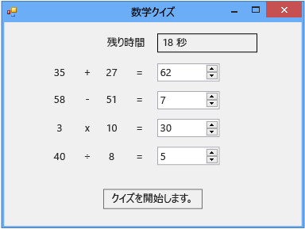

# チュートリアル 2: 制限時間ありの計算クイズの作成

このチュートリアルでは、クイズの受け手が制限時間内にランダムに表示される 4 つの計算問題に答えるクイズを作成します。 以下の方法について説明します。

-   <xref:System.Random> クラスを使用して乱数を生成します。

-   <xref:System.Windows.Forms.Timer> コントロールを使用して特定の時点で発生するようにイベントをトリガーします。

-   `if else` ステートメントを使用してプログラム フローを制御します。

-   コードで基本的な算術演算を実行します。

完了すると、クイズは数値が異なることを除いて次の図のようになります。

## チュートリアルのリンク

クイズの完全バージョンをダウンロードするには、「[Complete Math Quiz tutorial sample](https://code.msdn.microsoft.com/Complete-Math-Quiz-8581813c)」(計算クイズのチュートリアルの完全なサンプル) を参照してください。

> [!NOTE]
> このチュートリアルでは、Visual C# と Visual Basic の両方が取り上げられているため、使用しているプログラミング言語固有の情報に注意してください。

## 関連トピック

|Title|説明|
|-----------|-----------------|
|[手順 1: プロジェクトの作成とフォームへのラベルの追加](../ide/step-1-create-a-project-and-add-labels-to-your-form.md)|最初にプロジェクトを作成し、プロパティを変更し、`Label` コントロールを追加します。|
|[手順 2: ランダムな加算問題の作成](../ide/step-2-create-a-random-addition-problem.md)|加算問題を作成し、`Random` クラスを使用して乱数を生成します。|
|[手順 3: カウントダウン タイマーの追加](../ide/step-3-add-a-countdown-timer.md)|クイズに制限時間を設定できるようにカウントダウン タイマーを追加します。|
|[手順 4: CheckTheAnswer() メソッドの追加](../ide/step-4-add-the-checktheanswer-parens-method.md)|クイズの受け手が問題の正しい解答を入力したかどうかを確認するメソッドを追加します。|
|[手順 5: NumericUpDown コントロールの Enter イベント ハンドラーの追加](../ide/step-5-add-enter-event-handlers-for-the-numericupdown-controls.md)|クイズを受けやすくするイベント ハンドラーを追加します。|
|[手順 6: 減算問題の追加](../ide/step-6-add-a-subtraction-problem.md)|乱数を生成し、タイマーを使用し、正しい解答を確認する減算問題を追加します。|
|[手順 7: 乗算問題と除算問題の追加](../ide/step-7-add-multiplication-and-division-problems.md)|乱数を生成し、タイマーを使用し、正しい解答を確認する乗算問題および除算問題を追加します。|
|[手順 8: クイズのカスタマイズ](../ide/step-8-customize-the-quiz.md)|色の変更、ヒントの追加など、その他の機能を試します。|
