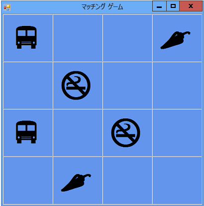

# チュートリアル 3: 絵合わせゲームの作成
[!INCLUDE[vs2017banner](../code-quality/includes/vs2017banner.md)]

このチュートリアルでは、プレーヤーが隠されたアイコンのペアを見つける絵合わせゲームを作成します。  以下の方法について説明します。  
  
-   アイコンなどのオブジェクトを `List` オブジェクトに格納する。  
  
-   `foreach` ループ \(Visual C\# の場合\) または `For Each` ループ \(Visual Basic の場合\) を使用してリスト内の項目を反復処理する。  
  
-   参照変数を使用してフォームの状態を追跡する。  
  
-   複数のオブジェクトでイベントへの応答に使用できるイベント ハンドラーを作成する。  
  
-   開始されるとカウント ダウンを行い一度だけイベントを発生させるタイマーを作成する。  
  
 このチュートリアルを完了すると、プログラムは次の図のようになります。  
  
   
このチュートリアルで作成するゲーム  
  
 サンプルの完全バージョンをダウンロードするには、「[絵合わせゲームのチュートリアルの完全なサンプル](http://code.msdn.microsoft.com/Complete-Matching-Game-4cffddba)」を参照してください。  
  
> [!NOTE]
>  このチュートリアルでは、Visual C\# と Visual Basic の両方が取り上げられているため、使用しているプログラミング言語固有の情報に注意してください。  
  
 プログラミングに行き詰まった場合や疑問がある場合は、MSDN フォーラムのいずれかに質問を投稿してみてください。  [Visual Basic フォーラム](http://social.msdn.microsoft.com/Forums/home?forum=vbgeneral)、および [Visual C\# フォーラム](http://social.msdn.microsoft.com/Forums/home?forum=csharpgeneral)を参照してください。  無料で利用できる便利なビデオ学習リソースもあります。  Visual Basic でのプログラミングの詳細については、「[Visual Basic の基礎: 入門者向けの開発](http://channel9.msdn.com/Series/Visual-Basic-Development-for-Absolute-Beginners)」を参照してください。  Visual C\# でのプログラミングの詳細については、「[C\# の基礎: 入門者向けの開発](http://channel9.msdn.com/Series/C-Sharp-Fundamentals-Development-for-Absolute-Beginners)」を参照してください。  
  
## 関連トピック  
  
|タイトル|説明|  
|----------|--------|  
|[手順 1: プロジェクトの作成とフォームへのテーブルの追加](../ide/step-1-create-a-project-and-add-a-table-to-your-form.md)|プロジェクトを作成し、コントロール配置用の `TableLayoutPanel` コントロールを追加することから始めます。|  
|[手順 2: Random オブジェクトおよびアイコンのリストの追加](../ide/step-2-add-a-random-object-and-a-list-of-icons.md)|`Random` オブジェクトおよび `List` オブジェクトを追加し、アイコンのリストを作成します。|  
|[手順 3: 各ラベルへのランダムなアイコンの割り当て](../Topic/Step%203:%20Assign%20a%20Random%20Icon%20to%20Each%20Label.md)|`Label` コントロールにアイコンをランダムに割り当てて、各ゲームでそれらの配置が同じにならないようにします。|  
|[手順 4: 各ラベルへの Click イベント ハンドラーの追加](../Topic/Step%204:%20Add%20a%20Click%20Event%20Handler%20to%20Each%20Label.md)|クリックされたラベルの色を変更させる Click イベント ハンドラーを追加します。|  
|[手順 5: ラベルの参照の追加](../ide/step-5-add-label-references.md)|参照変数を追加して、どのラベルがクリックされたかを追跡します。|  
|[手順 6: タイマーの追加](../Topic/Step%206:%20Add%20a%20Timer.md)|ゲームの実行中に経過した時間を追跡するためのタイマーをフォームに追加します。|  
|[手順 7: ペアの表示の維持](../Topic/Step%207:%20Keep%20Pairs%20Visible.md)|一致するペアが選択された場合に、アイコンのペアが表示されたままになるようにします。|  
|[手順 8: プレーヤーが勝利したかどうかを確認するメソッドの追加](../ide/step-8-add-a-method-to-verify-whether-the-player-won.md)|プレーヤーが勝利したかどうかを確認する `CheckForWinner()` メソッドを追加します。|  
|[手順 9: その他の機能を試す](../ide/step-9-try-other-features.md)|アイコンおよび色の変更、グリッドの追加、サウンドの追加などの、その他の機能を試します。  また、ボードの拡大およびタイマーの調整を試します。|