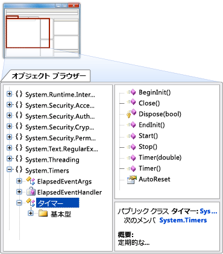

# Visual Studio IDE の概要

Visual Studio 統合開発環境 (IDE) は、ほぼすべての種類のコードを表示および編集可能で、Android、iOS、Windows、Web、およびクラウド用のアプリをデバッグ、ビルド、および発行するために使用できるクリエイティブなランチパッドです。 Mac 版と Windows 版が用意されています。 このトピックでは、Visual Studio IDE の機能を紹介します。 ここでは、Visual Studio で行うことができる作業の一部とインストールおよび使用方法、簡単なプロジェクトの作成方法、コードのデバッグと配置についての指針、各種ツール ウィンドウを紹介します。

## Visual Studio IDE でできること

Android スマートフォン用のアプリを 作成したり、 C++ を使用して最先端のゲームを 作成したり、それ以上のことも可能です。 Visual Studio には Web サイト、ゲーム、デスクトップ アプリ、モバイル アプリ、Office 用のアプリなどの作成をサポートするテンプレートが用意されています。

ほぼどこからでも入手できるコードをいくつか開いて操作することもできます。 GitHub にお好みのプロジェクトがある場合は、 そのリポジトリを複製して Visual Studio で開くだけでコーディングを開始できます。

### モバイル アプリの作成

Visual C# や Xamarin (Visual C++) を使用して異なるプラットフォームのネイティブ モバイル アプリを作成したり、Apache Cordova で JavaScript を使用してハイブリッド アプリを作成したりできます。 Unity、Unreal、DirectX、Cocos 用のモバイル ゲームを作成できます。 Visual Studio には Android エミュレーターが搭載されているため、Android アプリの実行してデバッグできます。

Azure App Services を作成して、モバイル アプリにクラウドの機能を活用できます。 Azure App Services を活用すると、アプリのデータをクラウドに保存したり、ユーザーを安全に認証したり、アプリやビジネスのニーズに合わせてリソースを調整したりできます。 詳しくは、「[モバイル アプリ開発](https://www.visualstudio.com/vs/mobile-app-development/)」をご覧ください。

### Azure 用のクラウド アプリの作成

Visual Studio には、Microsoft Azure を使用するクラウド ファーストのアプリケーションを簡単に作成できるツールのスイートが用意されています。 これにより、IDE から直接 Microsoft Azure でアプリケーションとサービスを簡単に構成、ビルド、デバッグ、パッケージ化、およびデプロイできます。 接続済みサービスを使用して、アプリに Azure のサービスを活用します。 Azure Tools for .NET を入手するには、Visual Studio をインストールするときに **Azure 開発**ワークロードを選択します。 詳しくは、「[Visual Studio Tools for Azure](https://www.visualstudio.com/vs/azure-tools/)」をご覧ください。

### Web 用のアプリの作成

現在世界を動かしているのは Web であり、Visual Studio は Web 用のアプリの作成をサポートします。 Web アプリは ASP.NET、Node.js、Python、JavaScript、TypeScript を使用して作成できます。 Visual Studio は、Angular、jQuery、Express などの Web フレームワークを理解します。 ASP.NET Core と .NET Core は、Windows、Mac、Linux の各オペレーティング システムで実行できます。 詳しくは、「[最新の Web ツール](https://www.visualstudio.com/vs/modern-web-tooling/)」をご覧ください。

### ワールド クラスの編集環境でのコードの記述

Visual Studio では、構文の色表示、ステートメント入力候補、IntelliSense (選択したコード要素について説明するポップアップ)、コード アウトライン、デバッグ用のブレークポイントの設定などの機能により、コードを簡単かつ迅速に記述できます。

詳しくは、「[コード エディターとテキスト エディターでのコードの作成](https://docs.microsoft.com/visualstudio/ide/writing-code-in-the-code-and-text-editor)」をご覧ください。

Visual Studio は、他にも数多くのことを実行するのに役立ちます。 すべての一覧については、「[Visual Studio IDE](https://www.visualstudio.com/vs/)」をご覧ください。

## Visual Studio IDE のインストール

まず、Visual Studio をダウンロードしてシステムにインストールします。 [Visual Studio 2017](https://www.visualstudio.com/vs/visual-studio-2017/) のページからダウンロードできます。

Visual Studio はかつてないほど軽量になりました。 モジュラー インストーラーでは、*ワークロード* (好みのプログラミング言語やプラットフォームで必要な機能のグループ) を選択してインストールできます。 この方法により、Visual Studio のインストールのフットプリントがかつてないほど小さくなり、インストールと更新に要する時間が短縮されました。

以下のプログラムの作成手順に従う場合は、必ず、**[ユニバーサル Windows プラットフォーム開発]** ワークロードを選択してインストールしてください。

Visual Studio 2017 では、インストール パフォーマンスが強化されただけでなく、IDE の起動時間とソリューションの読み込み時間が短縮されました。

お使いのシステムに Visual Studio をセットアップする方法について詳しくは、「[Visual Studio 2017 のインストール](https://docs.microsoft.com/visualstudio/install/install-visual-studio)」をご覧ください。  

## サインイン

Visual Studio を初めて起動する際には、Microsoft アカウント、仕事用アカウント、または学校用アカウントを使ってサインインすることもできます。 サインインすると、ウィンドウ レイアウトなどの Visual Studio の設定を複数のデバイス間で同期できます。 また、Azure サブスクリプションや Visual Studio Team Services など、必要になる可能性のあるサービスに自動的に接続されます。

## プログラムの作成

あることを学ぶ方法の 1 つは実際に使ってみることです。 簡単なプログラムを新しく作成してみましょう。

1. Visual Studio を開きます。 メニューで、**[ファイル]**、**[新規作成]**、**[プロジェクト]** の順にクリックします。

  

  別の方法として、スタート ページを使用して新しいプロジェクトを作成できます。 詳細については、「[Harness the Power of the Redesigned Start Page (blog)](https://blogs.msdn.microsoft.com/visualstudio/2016/11/29/harness-the-power-of-the-redesigned-start-page/)」(再設計されたスタート ページの機能を最大限に活用する (ブログ)) を参照してください。

1. **[新しいプロジェクト]** ダイアログ ボックスには複数のプロジェクト テンプレートが表示されます。 **[Visual C#]** の下の **[Windows ユニバーサル]** カテゴリで **[空白のアプリ (ユニバーサル Windows)]** テンプレートを選択し、**[OK]** ボタンを選択します。

  

  これにより、Visual C# と XAML をプログラミング言語として使用する新しい空のユニバーサル Windows アプリ プロジェクトが作成されます。 Visual Studio でプロジェクトが設定されるまで少し待ちます。 情報を確認するよう求められた場合、現時点では既定値を使用してください。

1. **[新しいユニバーサル Windows プロジェクト]** ダイアログ ボックスで、**[OK]** を選択して既定値をそのまま使用します。

1. まもなく、次のスクリーンショットのような画面が表示されます。 プロジェクト ファイルは右側のソリューション エクスプローラーと呼ばれるウィンドウに一覧表示されます。

  

1. ソリューション エクスプローラーで、MainPage.xaml ファイルの横にある小さな黒い三角形を選択して展開すると、下に MainPage.xaml.cs ファイルが表示されます。 このファイルを選択して開きます (C# コードが含まれます)。

  MainPage.xaml.cs の C# コードが画面の左側のコード エディターに表示されます。 コードの構文は、ステートメントやコメントなど、コードの種類に応じて自動的に色分けされます。 また、コードの縦の小さな点線は互いに一致する括弧を示し、行番号は後でコードの場所を探すのに役立ちます。 小さな四角で囲まれたマイナス記号を選択するとコードが折りたたまれ、折りたたまれている場合は展開できます。 このコードのアウトライン機能を使用すると、必要のないコードを非表示にして画面を整理できます。

  

  他にもメニューやツール ウィンドウが用意されていますが、今は次に進みましょう。

1. XAML 形式でボタンを追加することで、ユーザーがアプリと対話する手段を提供します。 これを行うには、MainPage.xaml ファイルを開きます。 ビューは分割されています。上のデザイナーは視覚的にコントロールを配置し、下のコード ビューはデザイナーと分離された XAML コードを示します。 後でプログラムを実行すると、デザイナーに表示されている内容がユーザーに表示されるウィンドウである "フォーム" になり、基になる XAML がそのフォームに表示する内容を決定します。

1. 画面の左側で、**[ツールボックス]** タブを選択してツールボックスを開きます。 ツールボックスには、フォームに追加できるビジュアル コントロールが含まれています。 ここでは、ボタン コントロールだけを追加します。

1. **[コモン XAML コントロール]** セクションを展開し、ボタン コントロールをフォームの真ん中辺りにドラッグします。 (正確に配置する必要はありません。)

  

  完了すると、次のように表示されます。

  

  デザイナーにボタンが追加され、基になるコード (ハイライト表示) が自動的にデザイナーの XAML コードに追加されます。

1. XAML コードを少し変更してみましょう。 ボタン コードのテキストの名前を `Button` から `Hello!` に変更します。

  

1. アプリを起動します。 これは、ツールバーの **[スタート]** (![[スタート] ボタン](../ide/media/VSIDE_StartButton.png)) を選択するか、**F5** キーを選択するか、メニューで **[デバッグ]**、**[デバッグの開始]** を選択することで行うことができます。

  

  アプリでビルド プロセスが開始され、出力ウィンドウに状態のメッセージが表示されます。 まもなく、ボタンが追加されたフォームが表示されます。 これで実行中のアプリができました。

  

  もちろん、今すぐに行う必要はありませんが、後で必要に応じて機能を追加できます。

1. プログラムの実行を終了するには、ツールバーの [終了] (![[終了] ボタン](../ide/media/VSIDE_StopButton.png)) を選択して終了します。

ここまでを振り返ってみましょう。Visual Studio で新しい C# Windows ユニバーサル プロジェクトを作成し、そのコードを表示して、デザイナーにコントロールを追加しました。その後、XAML コードの一部を変更し、プロジェクトを実行しました。 この例のプロセスは簡略化されていますが、Visual Studio IDE で独自のアプリを開発するときに使用する共通部分の一部を示します。 この例についてさらに詳しくは、「["Hello, world" アプリを作成する (XAML)](https://docs.microsoft.com/windows/uwp/get-started/create-a-hello-world-app-xaml-universal)」をご覧ください。

## デバッグとテストによるコードの改善

いつもすべてが完璧にうまく行くとは限りません。 コードを記述する際には、バグの存在やパフォーマンスを確認するために実際に実行してテストする必要があります。 Visual Studio の最新のデバッグ システムを使うと、ローカル プロジェクト、リモート デバイス、またはエミュレーター (Android デバイス用や Windows Phone デバイス用など) で実行されるコードをデバッグできます。 一度に 1 つのステートメントのコードをステップスルーでき、変数を調べることができます。マルチスレッド アプリケーションをステップスルーでき、指定された条件が true の場合のみヒットするブレークポイントを設定できます。 コードの実行中に変数の値などを監視できます。 すべてコード エディター自体で管理できるため、コードを離れる必要はありません。

テストについては、Visual Studio には単体テスト、IntelliTest、負荷およびパフォーマンス テストなどが用意されています。 Visual Studio のデバッグ プロセスについて詳しくは、[デバッガーの機能ツアー](../debugger/debugger-feature-tour.md)に関するページをご覧ください。 テストの詳細については、「[開発者用テスト ツール、シナリオ、および機能](../test/developer-testing-scenarios.md)」を参照してください。 アプリのパフォーマンスを改善する方法の詳細については、[「プロファイリング機能ツアー」](../profiling/profiling-feature-tour.md) をご覧ください。

## 完成したアプリケーションを配置する

アプリケーションをユーザーやお客様に配置する用意ができたら、Visual Studio で配置するためのツールが提供されます。Microsoft ストアや SharePoint サイトに配置する場合でも、InstallShield または Windows インストーラー テクノロジを利用する場合でも提供されます。 これはすべて、IDE を使用してアクセスできます。 詳しくは、「[アプリケーション、サービス、およびコンポーネントの配置](../deployment/deploying-applications-services-and-components.md)」をご覧ください。

## IDE のクイック ツアー

Visual Studio の全体像を視覚的に確認できるように、次のイメージには Visual Studio で開かれたプロジェクトと使用する可能性の高いいくつかの主なツール ウィンドウが示されています。

- [ソリューション エクスプローラー](../ide/solutions-and-projects-in-visual-studio.md)では、コード ファイルを表示、移動、および管理できます。 ソリューション エクスプローラーでは、ファイルをソリューションやプロジェクトにまとめ、コードを整理できます。

- 大部分の時間を費やすことになる [[エディター]](../ide/writing-code-in-the-code-and-text-editor.md) ウィンドウではコードが表示され、ソース コードの編集や UI の設計を行うことができます。

- [[出力]](../ide/reference/output-window.md) ウィンドウには、デバッグ メッセージ、エラー メッセージ、コンパイラの警告、公開状態メッセージなど、Visual Studio の通知が出力されます。 メッセージ ソースごとに独自のタブがあります。

- [チーム エクスプローラー](/vsts/user-guide/work-team-explorer)では、[Git](https://git-scm.com/) や [Team Foundation バージョン管理 (TFVC)]  (/vsts/tfvc/overview) などのバージョン管理テクノロジを使用して、作業項目を追跡し、コードを他のユーザーと共有できます。

- [クラウド エクスプローラー](/azure/vs-azure-tools-resources-managing-with-cloud-explorer)では、仮想マシン、テーブル、SQL データベースなどの Azure リソースを表示および管理することができます。 特定の操作で Azure Portal が必要な場合、Cloud Explorer でリンクが提供されます。そのリンクから Azure Portal に移動できます。

Visual Studio には他にも次のような一般的な生産性を高める機能が用意されています。

- [クイック起動](https://docs.microsoft.com/en-us/visualstudio/ide/reference/quick-launch-environment-options-dialog-box)検索ボックスは、Visual Studio で必要な情報を迅速に見つけるに役立ちます。 探している内容を表す名前を入力するだけで、Visual Studio に結果がリストされ、目的の場所に正確に移動できます。 また、クイック起動にはすべてのワークロードまたは個々のコンポーネントに対応する Visual Studio インストーラーを起動するリンクが表示されます。

  

- [リファクタリング](../ide/refactoring-in-visual-studio.md)。これには、変数の名前をインテリジェントに変更する、選んだコード行を別個の関数に移動する、コードを他の場所に移動する、関数パラメーターを並べ替える、などの操作が含まれます。

 

- **IntelliSense** 。コードに関する型情報をエディターに直接表示したり、場合によっては、ちょっとしたコードを自動的に作成したりする、よく使われる機能セットの包括的な用語です。 エディター内のインラインに基本ドキュメントがあるようなもので、これによって、別個のヘルプ ウィンドウで型情報を検索する手間が省けます。 IntelliSense 機能は言語によって異なります。 詳細については、「[Visual C# の IntelliSense](../ide/visual-csharp-intellisense.md)」、「[Visual C++ の Intellisense](../ide/visual-cpp-intellisense.md)」、「[JavaScript IntelliSense](../ide/javascript-intellisense.md)」および「[Visual Basic 固有の IntelliSense](../ide/visual-basic-specific-intellisense.md)」を参照してください。 次の図は、職場でのいくつかの IntelliSense 機能を示しています。

  

- **波線**は波打った赤の下線で、コード入力時にエラーや潜在的な問題をリアルタイムに警告します。 これにより、コンパイル時や実行時にエラーが検出されるのを待たずに即時に修正できます。 破線の上に移動すると、エラーに関する追加情報が表示されます。 電球がエラーの修正方法に関する提案とともに左余白に表示される場合もあります。 詳細については、「 [Perform quick actions with light bulbs](../ide/perform-quick-actions-with-light-bulbs.md)」を参照してください。

 

- [[呼び出し階層]](../ide/reference/call-hierarchy.md) ウィンドウはテキスト エディターのコンテキスト メニューで開き、キャレット (挿入ポイント) の下のメソッドを呼び出す、またはそのメソッドによって呼び出されるメソッドを表示することができます。

 ![[呼び出し階層] ウィンドウ](../ide/media/VSIDE_call_hierarchy.png)

- [CodeLens](../ide/find-code-changes-and-other-history-with-codelens.md)。コードへの参照および変更、リンクされたバグ、作業項目、コード レビュー、単体テストをすべて、エディターを離れずに検索できます。

 

- [ [ピークの定義](../ide/how-to-view-and-edit-code-by-using-peek-definition-alt-plus-f12.md) ] ウィンドウ。現在のコンテキストから移動せずに、メソッドまたは型の定義インラインが表示されます。

 

- **[定義に移動]** コンテキスト メニュー オプション。関数またはオブジェクトが定義されている場所に直接移動します。 エディターを右クリックすることで、その他のナビゲーション コマンドも使用できます。

 

- [オブジェクト ブラウザー](http://msdn.microsoft.com/f89acfc5-1152-413d-9f56-3dc16e3f0470) (関連ツール)。システム上の .NET アセンブリまたは Windows ランタイム アセンブリを調べ、アセンブリにどの型が含まれているか、またそれらの型にどのメンバー (プロパティ、メソッド、イベントなど) が含まれているかを確認できます。

  

## ソース コードの管理および他のユーザーとの共同作業

GitHub などの任意のプロバイダーがホストしている Git リポジトリにあるソース コードを管理できます。 また、[Visual Studio Team Services (VSTS)](/vsts/index) を使用して、プロジェクト全体でコードをバグおよび作業項目と共に管理することもできます。 Visual Studio でチーム エクスプローラーを使用して Git リポジトリを管理する方法の詳細については、「[Get Started with Git and Team Services](/vsts/git/gitquickstart?tabs=visual-studio)」(Git およびチーム サービスの概要) を参照してください。 Visual Studio には、その他の組み込みのソース管理機能もあります。 それらの機能について詳しくは、ブログ「[New Git Features in Visual Studio 2017](https://blogs.msdn.microsoft.com/visualstudioalm/2017/03/06/new-git-features-in-visual-studio-2017/)」(Visual Studio 2017 の新しい Git 機能) をご覧ください。

Visual Studio Team Services は、ソフトウェア プロジェクトをホストし、チームでのコラボレーションを有効にするためのクラウド ベースのサービスです。 VSTS は、Git ソース管理システムと Team Foundation ソース管理システムの両方をサポートしています。また、Scrum、CMMI、アジャイル開発方法もサポートしています。 Team Foundation バージョン管理 (TFVC) は、単一の集中サーバー リポジトリを使用して、ファイルを追跡してバージョン管理します。 ローカルの変更は常に集中サーバーにチェックインされます。他の開発者はそこで、最新の変更を取得できます。

Team Foundation Server (TFS) は、Visual Studio のアプリケーション ライフサイクル管理のハブです。 これにより、開発プロセスに関わるすべてのユーザーが 1 つのソリューションを使用して参加できるようになります。 TFS は、異種混合のチームやプロジェクトを管理するのにも役立ちます。

Visual Studio Team Services のアカウントまたは Team Foundation Server がネットワーク上にある場合、Visual Studio の [チーム エクスプローラー] ウィンドウから接続することができます。 このウィンドウからソース管理にコードをチェックインしたりソース管理からコードをチェックアウトできます。また、作業項目を管理したり、ビルドを開始したり、チームのルームやワークスペースにアクセスできます。 チーム エクスプローラーは、**[クイック起動]** ボックスから、**[ビュー]、[チーム エクスプローラー]** と選択してメイン メニューから、または **[チーム]、[接続の管理]** と選択して開くことができます。

次の図は、VSTS でホストされているソリューションの [チーム エクスプローラー] ウィンドウを示しています。

Visual Studio Team Services と Team Foundation Server に関するドキュメントについては、[Visual Studio Team Services](/vsts/index) に関するページを参照してください。

## サービス、データベース、クラウドベースのリソースへの接続

クラウドは現在のオンラインで繋がった世界では必須であり、Visual Studio はそれを活用する方法を提供します。 たとえば、接続済みサービス機能により、お使いのアプリをサービスに接続できます。 お使いのアプリでそのサービスを使用してデータを Azure ストレージなどに保存できます。

**[接続済みサービス]** ページでサービスを選択すると、接続済みサービス ウィザードが起動します。このウィザードでは、プロジェクトを構成し、必要な NuGet パッケージをダウンロードして、サービスに対してコーディングを開始できます。

[Cloud Explorer](/azure/vs-azure-tools-resources-managing-with-cloud-explorer) を使用して、Visual Studio 内の Azure ベースのクラウド リソースを表示および管理できます。 Cloud Explorer には、ユーザーがログインしている Azure サブスクリプションで管理されているすべてのアカウントに含まれる Azure リソースが表示されます。 Cloud Explorer は、Visual Studio インストーラーで **Azure 開発**ワークロードを選択することで入手できます。

**サーバー エクスプローラー**は、ローカル、リモートで、また Azure、Salesforce.com、Office 365、および Web サイトで SQL Server インスタンスとアセットを参照および管理するのに役立ちます。 サーバー エクスプローラーを開くには、メイン メニューで **[ビュー]**、**[サーバー エクスプローラー]** と選択します。 サーバー エクスプローラーの使用方法について詳しくは、「[Add new connections](https://docs.microsoft.com/visualstudio/data-tools/add-new-connections)」 (新しい接続の追加) をご覧ください。

[SQL Server Data Tools (SSDT)](https://docs.microsoft.com/sql/ssdt/download-sql-server-data-tools-ssdt) は、SQL Server、Azure SQL Database、Azure SQL Data Warehouse 用の強力な開発環境です。 データベースを構築、デバッグ、管理、およびリファクターできます。 データベース プロジェクトを操作したり、オンプレミスまたはオフプレミスで接続されたデータベース インスタンスを直接操作したりすることができます。

Visual Studio の **SQL Server オブジェクト エクスプローラー**では、SQL Server Management Studio と同様のデータベース オブジェクトのビューを提供します。 SQL Server オブジェクト エクスプローラーを使用すると、軽いデータベース管理と設計作業を実行できます。これには、SQL Server オブジェクト エクスプローラーのコンテキスト メニューを使用したテーブル データの編集、スキーマの比較、クエリの実行などが含まれます。

## Visual Studio を拡張する

Visual Studio に必要な機能がない場合は、機能を追加できます。 ワークフローとスタイルに基づいて IDE をカスタマイズしたり、Visual Studio にまだ統合されていない外部ツールのサポートを追加したり、既存の機能を変更して生産性の向上を図ることができます。 Visual Studio には、マイクロソフト、マイクロソフトのパートナー、およびコミュニティからのツール、コントロール、およびテンプレートが用意されています。 Visual Studio の拡張について詳しくは、「[Visual Studio IDE を機能拡張する](https://www.visualstudio.com/vs/extend/)」をご覧ください。

## 詳細と新機能

Visual Studio を使用したことがない場合は、「[Visual Studio を使用した開発の開始](../ide/get-started-developing-with-visual-studio.md)」を参照するか、[Microsoft Virtual Academy](https://mva.microsoft.com/product-training/visual-studio-courses#!index=2&lang=1033) で利用できる無料の Visual Studio コースを確認してください。 Visual Studio 2017 の新機能については、「[Visual Studio 2017 の新機能](../ide/whats-new-in-visual-studio.md)」をご覧ください。

これで Visual Studio IDE のツアーを終わります。 主な機能について便利なヒントを得るのに役立ててください。

## 関連項目

* [Visual Studio IDE](https://www.visualstudio.com/vs/)
* [Visual Studio のダウンロード](https://www.visualstudio.com/downloads/)
* [Visual Studio ブログ](https://blogs.msdn.microsoft.com/visualstudio/)
* [Visual Studio フォーラム](https://social.msdn.microsoft.com/Forums/vstudio/en-US/home?category=visualstudio%2Cvsarch%2Cvsdbg%2Cvstest%2Cvstfs%2Cvsdata%2Cvsappdev%2Cvisualbasic%2Cvisualcsharp%2Cvisualc)
* [Microsoft Virtual Academy](https://mva.microsoft.com/)
* [Channel 9](https://channel9.msdn.com/)
