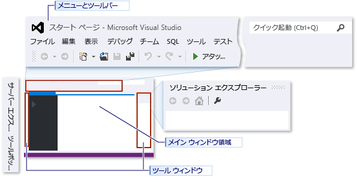
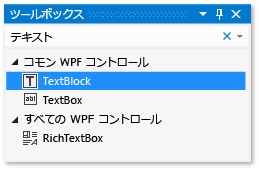
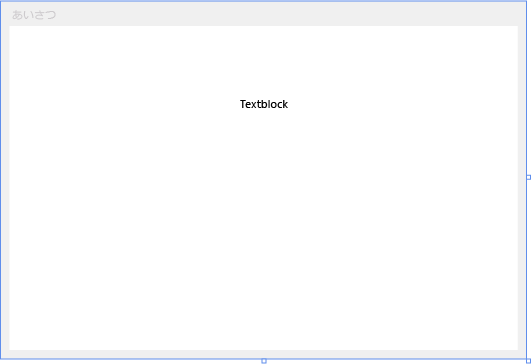
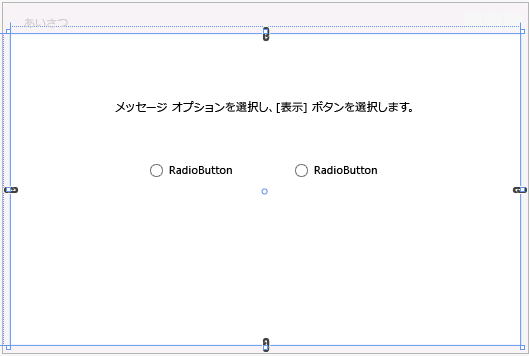
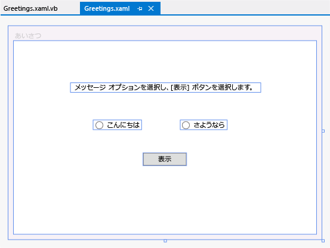

# <a name="walkthrough-create-a-simple-application-with-c-or-visual-basic"></a>チュートリアル: C# または Visual Basic による簡単なアプリケーションの作成

このチュートリアルを完了すると、Visual Studio を使用してアプリケーションを開発する際に使用できるさまざまなツール、ダイアログ ボックス、およびデザイナーの使用方法を習得できます。 簡単な "Hello, World" アプリケーションの作成、UI の設計、コードの追加、エラーのデバッグを行いながら、統合開発環境 (IDE) での作業方法について学習します。

## <a name="configure-the-ide"></a>IDE の構成

Visual Studio を初めて起動すると、サインインが求められます。 このチュートリアルでは、この手順は任意です。 次に、開発設定と色テーマの選択を求めるダイアログ ボックスが表示される場合があります。 既定値のままにして **[Visual Studio の開始]** を選択します。


Visual Studio を起動すると、ツール ウィンドウ、メニューとツール バー、メイン ウィンドウ領域が表示されます。 ツール ウィンドウは、アプリケーション ウィンドウの左側および右側にドッキングされており、上部には **クイック起動**、メニュー バー、および標準ツール バーがあります。 アプリケーション ウィンドウの中央には、 **スタート ページ**が表示されます。 ソリューションかプロジェクトが読み込まれると、 **[スタート ページ]** がある領域にエディターとデザイナーが表示されます。 アプリケーションを開発する場合は、ほとんどの時間をこの中央の領域での作業に費やします。



## <a name="create-the-project"></a>プロジェクトの作成

Visual Studio でアプリケーションを作成するには、最初にプロジェクトおよびソリューションを作成します。 この例では、Windows Presentation Foundation (WPF) プロジェクトを作成します。

1. 新しいプロジェクトを作成します。 メニュー バーで **[ファイル]** > **[新規作成]** > **[プロジェクト]** を選択します。

     ![メニュー バーで [ファイル]、[新規作成]、[プロジェクト] を順にクリックします。](../ide/media/exploreide-filenewproject.png)

1. **[新しいプロジェクト]** ダイアログで、**[インストール済み]** > **[Visual C#]** (または **[Visual Basic]**) > **[Windows デスクトップ]** カテゴリを選択して、**[WPF アプリ (.NET Framework)]** テンプレートを選択します。 プロジェクトに **HelloWPFApp** という名前を付けます。

     ![Visual Studio の [新しいプロジェクト] ダイアログの WPF アプリ テンプレート](../ide/media/exploreide-newprojectcsharp.png)

1. **[OK]** を選択します。

Visual Studio は HelloWPFApp というプロジェクトとソリューションを作成し、**ソリューション エクスプローラー**は各種ファイルを表示します。 **WPF デザイナー**には、*MainWindow.xaml* のデザイン ビューと XAML ビューが分割ビューで表示されます。 分割線をスライドして、それぞれのビューの表示範囲を増減できます。 ビジュアル ビューか XAML ビューの一方のみを表示することも選択できます。 次の項目が **ソリューション エクスプローラー**に表示されます。


プロジェクトは、作成後にカスタマイズできます。 **[プロパティ]** ウィンドウ ( **[表示]** メニュー上) を使って、プロジェクト項目、コントロール、およびアプリケーション内のその他の項目に関するオプションを表示して変更できます。

### <a name="change-the-name-of-mainwindowxaml"></a>MainWindow.xaml の名前を変更する

それでは、MainWindow に具体的な名前を付けましょう。

1. **ソリューション エクスプローラー**で、*MainWindow.xaml* を選択します。 **[プロパティ]** ウィンドウが表示されるはずですが、表示されない場合は、**[表示]** メニューを選択し、**[プロパティ ウィンドウ]** 項目を選択します。

1. **[File Name]** プロパティを `Greetings.xaml`に変更します。

     

     **ソリューション エクスプローラー**に表示されているこのファイルの名前が *Greetings.xaml* になり、入れ子になっているコード ファイルの名前が *Greetings.xaml.vb* または *Greetings.xaml.cs* になります。 このコード ファイルは、*.xaml* ファイル ノードの下に入れ子になっており、相互に密接に関連していることが示されます。

## <a name="design-the-user-interface-ui"></a>ユーザー インターフェイス (UI) のデザイン

このアプリケーションに 3 種類のコントロール (<xref:System.Windows.Controls.TextBlock> コントロール、2 つの <xref:System.Windows.Controls.RadioButton> コントロール、および <xref:System.Windows.Controls.Button> コントロール) を追加します。

### <a name="add-a-textblock-control"></a>TextBlock コントロールを追加する

1. **[表示]** メニュー、 **[ツールボックス]** 項目の順に選択し、 **[ツールボックス]** ウィンドウを開きます。

2. **[ツールボックス]** で、**[コモン WPF コントロール]** ノードを展開し、TextBlock コントロールを表示します。

     

3. **TextBlock** 項目を選択してデザイン サーフェイス上のウィンドウにドラッグし、TextBlock コントロールをデザイン サーフェイスに追加します。 ウィンドウの上部付近の中央にコントロールを配置します。

ウィンドウは次の図のようになります。



XAML マークアップは、次のようになります。

```xaml
<TextBlock HorizontalAlignment="Center" TextWrapping="Wrap" VerticalAlignment="Center" RenderTransformOrigin="4.08,2.312" Margin="237,57,221,238"><Run Text="TextBlock"/><InlineUIContainer><TextBlock TextWrapping="Wrap" Text="TextBlock"/>
```

### <a name="customize-the-text-in-the-text-block"></a>テキスト ブロックのテキストをカスタマイズする

1. XAML ビューで、TextBlock のマークアップを探し、Text 属性を

   ```xaml
   Text="Select a message option and then choose the Display button."
   ```

2. 必要に応じて、TextBlock をもう一度中央揃えし、**Ctrl**+**S** キーを押すか **[ファイル]** メニュー項目を使って変更を保存します。

次に、2 つの [RadioButton](/dotnet/framework/wpf/controls/radiobutton) コントロールをフォームに追加します。

### <a name="add-radio-buttons"></a>オプション ボタンを追加する

1. **[ツールボックス]** で、**RadioButton** コントロールを探します。

     ![RadioButton コントロールをオンにした [ツールボックス] ウィンドウ](../ide/media/exploreide-radiobuttontoolbox.png)

2. **RadioButton** 項目を選択してデザイン サーフェイス上のウィンドウにドラッグし、RadioButto コントロールを 2 つデザイン サーフェイスに追加します。 TextBlock コントロールの下にボタンが並んで表示されるように、ボタンを移動します (ボタンを選択し、方向キーを使います)。

     ウィンドウは、次のようになります。

     

3. 左側の RadioButton コントロールの **[プロパティ]** ウィンドウで、 **[Name]** プロパティ ( **[プロパティ]** ウィンドウの一番上のプロパティ) を `HelloButton`に変更します。

     

4. 右側の RadioButton コントロールの **[プロパティ]** ウィンドウで、**[Name]** プロパティを `GoodbyeButton` に変更し、変更を保存します。

これで、各 RadioButton コントロールの表示テキストを追加できます。 次の手順では、RadioButton コントロールの **[Content]** プロパティを更新します。

### <a name="add-display-text-for-each-radio-button"></a>各オプション ボタンの表示テキストを追加する

1. デザイン サーフェイスで、HelloButton のショートカット メニューを開きます。HelloButton の右マウス ボタンを押し、**[テキストの編集]** を選択し、「`Hello`」と入力します。

2. GoodbyeButton のショートカット メニューを開きます。GoodbyeButton の右マウス ボタンを押し、**[テキストの編集]** を選択し、「`Goodbye`」と入力します。

### <a name="set-a-radio-button-to-be-checked-by-default"></a>チェックマークが既定で付けられるようにラジオ ボタンを設定する

この手順では、2 つのラジオ ボタンのいずれかが常に選択されるように、HelloButton に既定でチェックマークが付けられるように設定します。

XAML ビューで、HelloButton のマークアップを見つけ、**IsChecked** 属性を追加します。

```xaml
IsChecked="True"
```

最後に追加する UI 要素は、[Button](/dotnet/framework/wpf/controls/button) コントロールです。

### <a name="add-the-button-control"></a>Button コントロールを追加する

1. **[ツールボックス]** で、 **Button** コントロールを探し、デザイン サーフェイスの RadioButton コントロールの下に追加します。デザイン ビュー内のフォームにドラッグすると追加されます。

2. XAML ビューで、Button コントロールの **[Content]** の値を `Content="Button"` から `Content="Display"`に変更し、変更を保存します。

     マークアップは、次の例のようになります: `<Button Content="Display" HorizontalAlignment="Left" VerticalAlignment="Top" Width="75" Margin="215,204,0,0"/>`

     ウィンドウは次の図のようになります。

     

### <a name="add-code-to-the-display-button"></a>Display ボタンにコードを追加する

このアプリケーションを実行すると、ユーザーがラジオ ボタンを選択した後で **[Display]** ボタンを選択したときに、メッセージ ボックスが表示されます。 1 つのメッセージ ボックスには "Hello" と表示され、もう 1 つメッセージ ボックスには "Goodbye" と表示されます。 この動作を作成するために、*Greetings.xaml.vb* または *Greetings.xaml.cs* の `Button_Click` イベントにコードを追加します。

1. デザイン サーフェイスで、 **[Display]** ボタンをダブルクリックします。

     *Greetings.xaml.vb* または *Greetings.xaml.cs* が開き、`Button_Click` イベントにカーソルが表示されます。

    ```vb
    Private Sub Button_Click_1(sender As Object, e As RoutedEventArgs)

    End Sub
    ```

    ```csharp
    private void Button_Click_1(object sender, RoutedEventArgs e)
    {

    }
    ```

2. 次のコードを入力します。

    ```vb
    If HelloButton.IsChecked = True Then
        MessageBox.Show("Hello.")
    ElseIf GoodbyeButton.IsChecked = True Then
        MessageBox.Show("Goodbye.")
    End If
    ```

    ```csharp
    if (HelloButton.IsChecked == true)
    {
         MessageBox.Show("Hello.");
    }
    else if (GoodbyeButton.IsChecked == true)
    {
        MessageBox.Show("Goodbye.");
    }
    ```

3. アプリケーションを保存します。

## <a name="debug-and-test-the-application"></a>アプリケーションのデバッグとテスト

次に、アプリケーションをデバッグしてエラーを探し、両方のメッセージ ボックスが正しく表示されることをテストします。 以下の指示にデバッガーをビルドして起動する方法が示されていますが、詳細については、後で「[WPF アプリケーション (WPF) のビルド](/dotnet/framework/wpf/app-development/building-a-wpf-application-wpf)」および「[WPF のデバッグ](../debugger/debugging-wpf.md)」を参照することもできます。

### <a name="find-and-fix-errors"></a>エラーの検出と修正

この手順では、前に *MainWindow.xaml* ファイルの名前を変更することで引き起こしたエラーを見つけます。

#### <a name="start-debugging-and-find-the-error"></a>デバッグを開始し、エラーを見つける

1. **[デバッグ]**、 **[デバッグの開始]** の順に選択して、デバッガーを起動します。

     ![[デバッグ] メニューの [デバッグの開始] コマンド](../ide/media/exploreide-startdebugging.png)

     **[ブレーク モード]** ウィンドウが表示されます。**[出力]** ウィンドウに、IOException が発生し、リソース 'mainwindow.xaml' が見つけられないことが示されます。

2. **[デバッグ]** > **[デバッグの停止]** の順に選択し、デバッガーを停止します。

     ![[デバッグ] メニューの [デバッグの停止] コマンド](../ide/media/exploreide-stopdebugging.png)

このチュートリアルの最初で *MainWindow.xaml* の名前を *Greetings.xaml* に変更しましたが、このコードではアプリケーションのスタートアップ URI として *MainWindow.xaml* が指定されたままになっているため、プロジェクトを起動できません。

#### <a name="specify-greetingsxaml-as-the-startup-uri"></a>スタートアップ URI として Greetings.xaml を指定する

1. **ソリューション エクスプローラー**で、*App.xaml* ファイル (C# プロジェクトの場合) または *Application.xaml* ファイル (Visual Basic プロジェクトの場合) を開きます。

2. `StartupUri="MainWindow.xaml"` を `StartupUri="Greetings.xaml"` に変更し、変更を保存します。

デバッガーを再度起動します (**F5** を押します)。 アプリケーションの **Greetings** ウィンドウが表示されます。 アプリケーション ウィンドウを閉じ、デバッグを停止します。

### <a name="debug-with-breakpoints"></a>ブレークポイントを使用してデバッグする

ブレークポイントをいくつか追加することで、デバッグ中にコードをテストできます。 ブレークポイントを追加するには、**[デバッグ]** > **[ブレークポイントの設定/解除]** の順に選択するか、中断するコード行の横のエディター ウィンドウの左端の余白をクリックするか、**F9** キーを押します。

#### <a name="add-breakpoints"></a>ブレークポイントを追加する

1. *Greetings.xaml.vb* または *Greetings.xaml.cs* を開き、`MessageBox.Show("Hello.")` という行を選択します。

2. **[デバッグ]**、 **[ブレークポイントの設定/解除]** の順に選択して、メニューからブレークポイントを追加します。

     ![[デバッグ] メニューの [ブレークポイントの設定/解除] コマンド](../ide/media/exploreide-togglebreakpoint.png)

     コード行の横の、エディター ウィンドウの左端の余白部分に、赤い円が表示されます。

3. `MessageBox.Show("Goodbye.")`という行を選択します。

4. **F9** キーを押してブレークポイントを追加し、**F5** キーを押してデバッグを開始します。

5. **[Greetings]** ウィンドウで、 **[Hello]** オプション ボタンを選択してから、 **[Display]** ボタンを選択します。

     `MessageBox.Show("Hello.")` という行が黄色で強調表示されます。 IDE の下部では、[自動変数]、[ローカル]、 [ウォッチ] の各ウィンドウが左側にまとめてドッキングされ、[呼び出し履歴]、[ブレークポイント]、[コマンド]、[イミディエイト]、 [出力] の各ウィンドウが右側にまとめてドッキングされます。

6. メニュー バーで **[デバッグ]** > **[ステップ アウト]** の順に選択します。

     アプリケーションの実行が再開され、メッセージ ボックスに "Hello" と表示されます。

7. メッセージ ボックスの **[OK]** を選択して閉じます。

8. **[Greetings]** ウィンドウで、 **[Goodbye]** オプション ボタンを選択し、 **[Display]** ボタンを選択します。

     `MessageBox.Show("Goodbye.")` という行が黄色で強調表示されます。

9. **F5** キーを押してデバッグを続行します。 メッセージ ボックスが表示されたら、メッセージ ボックスの **[OK]** を選択して、閉じます。

10. アプリケーション ウィンドウを閉じ、デバッグを停止します。

11. メニュー バーで、**[デバッグ]** > **[すべてのブレークポイントを無効にする]** の順に選択します。

### <a name="build-a-release-version-of-the-application"></a>アプリケーションのリリース バージョンのビルド

すべてが機能することを確認したら、アプリケーションのリリース ビルドを準備できます。

1. メイン メニューで、**[ビルド]** > **[ソリューションのクリーン]** の順に選択して、前のビルドで作成された中間ファイルと出力ファイルを削除します。 この作業は必須ではありませんが、デバッグ ビルドの出力がクリーンアップされます。

     ![[ビルド] メニューの [ソリューションのクリーン] コマンド](../ide/media/exploreide-cleansolution.png)

2. ツールバー上のドロップダウン コントロール (現時点で [デバッグ] になっている) を使って、HelloWPFApp のビルド構成を **[デバッグ]** から **[リリース]** に変更します。

     ![[解放] を選択した標準ツール バー](../ide/media/exploreide-releaseversion.png)

3. **[ビルド]** > **[ソリューションのビルド]** を選択して、ソリューションをビルドします。

     ![[ビルド] メニューの [ソリューションのビルド] コマンド](../ide/media/exploreide-buildsolution.png)

このチュートリアルは完了しました。 ビルドした *.exe* は、ソリューションとプロジェクトのディレクトリ (*...\HelloWPFApp\HelloWPFApp\bin\Release*) の下にあります。

## <a name="see-also"></a>関連項目

- [Visual Studio 2017 の新機能](../ide/whats-new-in-visual-studio.md)
- [生産性に関するヒント](../ide/productivity-tips-for-visual-studio.md)