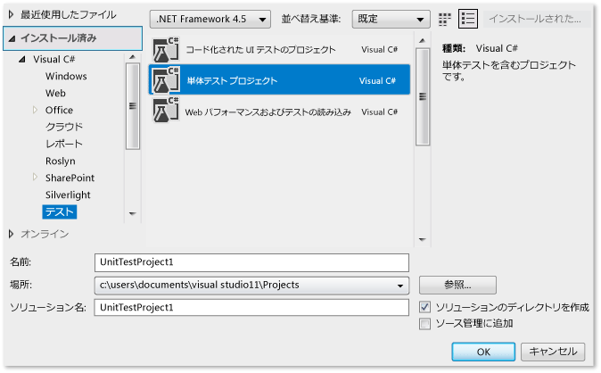
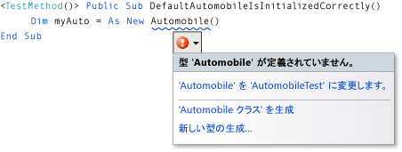
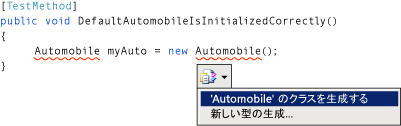
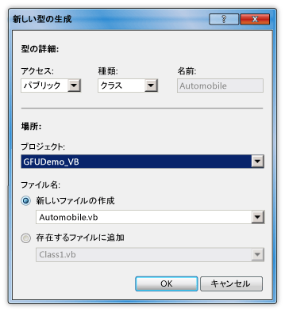
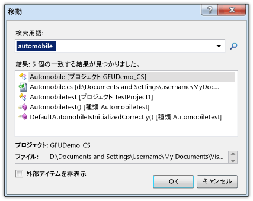

# チュートリアル: 使用法から生成機能のテスト ファーストのサポート
[!INCLUDE[vs2017banner](../code-quality/includes/vs2017banner.md)]

このトピックでは、テスト ファースト開発をサポートする [使用法から生成](/visual-cpp/misc/generate-from-usage) 機能の使用方法について説明します。  
  
 *テスト ファースト開発*は、最初に製品仕様に基づいて単体テストを記述してから、テストが成功するために必要なソース コードを記述するソフトウェア設計の方法です。[!INCLUDE[vsprvs](../code-quality/includes/vsprvs_md.md)] では、新しい型とメンバーを定義する前に、テスト ケースで最初にこれらを参照するときにソース コードに生成することで、テスト ファースト開発をサポートします。  
  
 [!INCLUDE[vsprvs](../code-quality/includes/vsprvs_md.md)] では、ワークフローの中断を最小限にして新しい型とメンバーを生成します。 現在のコード位置から離れずに、型、メソッド、プロパティ、フィールド、またはコンストラクターのスタブを作成できます。 ダイアログ ボックスを開いて型生成のオプションを指定すると、ダイアログ ボックスを閉じたときに、現在開いているファイルにフォーカスがすぐに戻ります。  
  
 "使用法から生成" 機能は、[!INCLUDE[vsprvs](../code-quality/includes/vsprvs_md.md)] と統合されるテスト フレームワークで使用できます。 このトピックでは、Microsoft 単体テスト フレームワークについて説明します。  
  
 [!INCLUDE[note_settings_general](../data-tools/includes/note_settings_general_md.md)]  
  
### Windows クラス ライブラリ プロジェクトとテスト プロジェクトを作成するには  
  
1.  [!INCLUDE[csprcs](../data-tools/includes/csprcs_md.md)] または [!INCLUDE[vbprvb](../code-quality/includes/vbprvb_md.md)] で、新しい Windows クラス ライブラリ プロジェクトを作成します。 使用している言語に応じて `GFUDemo_VB` または `GFUDemo_CS` という名前を付けます。  
  
2.  **ソリューション エクスプローラー**の上部にあるソリューション アイコンを右クリックし、**\[追加\]** をポイントして **\[新しいプロジェクト\]** をクリックします。**\[新しいプロジェクト\]** ダイアログ ボックスの左側にある **\[プロジェクトの種類\]** ペインで、**\[テスト\]** をクリックします。  
  
3.  **\[テンプレート\]** ペインで、**\[単体テスト プロジェクト\]** をクリックして UnitTestProject1 の既定の名前をそのまま使用します。[!INCLUDE[csprcs](../data-tools/includes/csprcs_md.md)] で表示されるダイアログ ボックスを次の図に示します。[!INCLUDE[vbprvb](../code-quality/includes/vbprvb_md.md)] のダイアログ ボックスも同様です。  
  
       
\[新しいプロジェクト\] ダイアログ ボックス  
  
4.  **\[OK\]** をクリックして、**\[新しいプロジェクト\]** ダイアログ ボックスを閉じます。 これで、テストの記述を開始できるようになりました  
  
### 単体テストから新しいクラスを生成するには  
  
1.  テスト プロジェクトには、UnitTest1 という名前のファイルが含まれています。**ソリューション エクスプローラー**でこのファイルをダブルクリックして、コード エディターで開きます。 テスト クラスとテスト メソッドが生成されています。  
  
2.  クラス `UnitTest1` の宣言を検索して、この名前を `AutomobileTest` に変更します。 C\# では、`UnitTest1()` コンストラクターが存在する場合は、その名前を `AutomobileTest()` に変更します。  
  
    > [!NOTE]
    >  現在、IntelliSense では、IntelliSense のステートメント入力候補に対して、*完了モード*と*提案モード*の 2 つの方法を提供しています。 まだ定義していないクラスやメンバーを使用する場合は、提案モードを使用します。 \[IntelliSense\] ウィンドウが開いているときに、Ctrl キーと Alt キーを押しながら Space キーを押すと完了モードと提案モードを切り替えることができます。 詳細については、「[IntelliSense の使用方法](../ide/using-intellisense.md)」を参照してください。 提案モードは、次の手順で「`Automobile`」と入力する際に役立ちます。  
  
3.  `TestMethod1()` メソッドを検索して、この名前を `DefaultAutomobileIsInitializedCorrectly()` に変更します。 次の図に示すように、このメソッド内に、`Automobile` というクラスの新しいインスタンスを作成します。 コンパイル時のエラーを示す波下線が表示され、型名の下にスマート タグが表示されます。 スマート タグの正確な場所は、[!INCLUDE[vbprvb](../code-quality/includes/vbprvb_md.md)] または [!INCLUDE[csprcs](../data-tools/includes/csprcs_md.md)] のどちらを使用しているかによって異なります。  
  
       
Visual Basic  
  
       
Visual C\#  
  
4.  スマート タグの上にマウス ポインターを置くと、`Automobile` という名前の型がまだ定義されていないことを示すエラー メッセージが表示されます。 スマート タグをクリックするか、Ctrl キーを押しながら . キー  \(Ctrl \+ ピリオド\) を押して、次の図に示す \[使用法から生成\] ショートカット メニューを開きます。  
  
       
Visual Basic  
  
       
Visual C\#  
  
5.  ここで、2 つの選択肢があります。**\['Automobile' のクラスを生成する\]** をクリックしてテスト プロジェクトに新しいファイルを作成し、これに `Automobile` という名前の空のクラスを追加できます。 この方法では、現在のプロジェクト内の新しいファイルに既定のアクセス修飾子を持つ新しいクラスをすぐに作成できます。**\[新しい型の生成\]** をクリックして **\[新しい型の生成\]** ダイアログ ボックスを開くこともできます。 これには、既存のファイルにクラスを配置し、このファイルを別のプロジェクトに追加するなどのオプションがあります。  
  
     **\[新しい型の生成\]** をクリックして、次の図に示す **\[新しい型の生成\]** ダイアログ ボックスを開きます。**\[プロジェクト\]** 一覧で、**\[GFUDemo\_VB\]** または **\[GFUDemo\_CS\]** をクリックして、テスト プロジェクトではなくソース コード プロジェクトにファイルを追加するように [!INCLUDE[vsprvs](../code-quality/includes/vsprvs_md.md)] に指示します。  
  
       
\[新しい型の生成\] ダイアログ ボックス  
  
6.  **\[OK\]** をクリックしてダイアログ ボックスを閉じ、新しいファイルを作成します。  
  
7.  **ソリューション エクスプローラー**で、GFUDemo\_VB または GFUDemo\_CS プロジェクト ノードの下に新しい Automobile.vb または Automobile.cs ファイルが存在することを確認します。 コード エディターでは、フォーカスがまだ `AutomobileTest.DefaultAutomobileIsInitializedCorrectly` にあります。 中断を最小限に抑えて、テストの記述を続行できます。  
  
### プロパティ スタブを生成するには  
  
1.  `Automobile` クラスに `Model` と `TopSpeed` という 2 つのパブリック プロパティがあることを示す製品仕様があるとします。 これらのプロパティは、既定のコンストラクターによって、`"Not specified"` と `-1` の既定値で初期化されている必要があります。 次の単体テストでは、既定のコンストラクターが適切な既定値にプロパティを設定することを検証します。  
  
     `DefaultAutomobileIsInitializedCorrectly` に次のコード行を追加します。  
  
     [!CODE [VbTDDWalkthrough#1](../CodeSnippet/VS_Snippets_VBCSharp/vbtddwalkthrough#1)]  
  
     コードは `Automobile` の 2 つの未定義プロパティを参照するため、スマート タグが表示されます。`Model` のスマート タグをクリックし、**\[プロパティ スタブの生成\]** をクリックします。`TopSpeed` プロパティのプロパティ スタブも生成します。  
  
     `Automobile` クラスでは、新しいプロパティの型はコンテキストから正しく推定されます。  
  
     スマート タグのショートカット メニューを次の図に示します。  
  
       
Visual Basic  
  
       
Visual C\#  
  
### ソース コードを検索するには  
  
1.  **\[移動\]** 機能を使用して、Automobile.cs または Automobile.vb ソース コード ファイルに移動して新しいプロパティが生成されていることを確認できます。  
  
     **\[移動\]** 機能を使用すると、簡単に型名または名前の一部などのテキスト文字列を入力し、結果の一覧の要素をクリックして目的の場所に移動することができます。  
  
     **\[移動\]** ダイアログ ボックスを開くには、コード エディター内をクリックし、Ctrl キーを押しながら , キー \(Ctrl \+ コンマ\) を押します。 テキスト ボックスに「`automobile`」と入力します。 一覧で **\[Automobile\]** クラスをクリックし、**\[OK\]** をクリックします。  
  
     次の図に **\[移動\]** ウィンドウを示します。  
  
       
\[移動\] ウィンドウ  
  
### 新しいコンストラクターのスタブを生成するには  
  
1.  このテスト メソッドでは、指定した値を持つように `Model` および `TopSpeed` プロパティを初期化するコンストラクター スタブが生成されます。 後でコードを追加してテストを完成させます。 次の追加のテスト メソッドを `AutomobileTest` クラスに追加します。  
  
     [!CODE [VbTDDWalkthrough#2](../CodeSnippet/VS_Snippets_VBCSharp/vbtddwalkthrough#2)]  
  
2.  新しいクラス コンストラクターの下にあるスマート タグをクリックし、**\[コンストラクター スタブを生成する\]** をクリックします。`Automobile` クラス ファイルで、新しいコンストラクターがコンストラクター呼び出しで使用されているローカル変数の名前を調べ、`Automobile` クラスで同じ名前のプロパティを見つけ、`Model` および `TopSpeed` プロパティに引数値を格納するためのコードをコンストラクター本体に指定したことがわかります \([!INCLUDE[vbprvb](../code-quality/includes/vbprvb_md.md)] では、新しいコンストラクターの `_model` および `_topSpeed` フィールドが、`Model` および `TopSpeed` プロパティのバッキング フィールドに暗黙的に定義されます\)。  
  
3.  新しいコンストラクターを生成すると、`DefaultAutomobileIsInitializedCorrectly` の既定のコンストラクター呼び出しの下に波線が表示されます。`Automobile` クラスには、0 個の引数を受け取るコンストラクターがないことを示すエラー メッセージが表示されます。 パラメーターを持たない明示的な既定のコンストラクターを生成するには、スマート タグをクリックし、**\[コンストラクター スタブを生成する\]** をクリックします。  
  
### メソッドのスタブを生成するには  
  
1.  仕様で、`Model` および `TopSpeed` プロパティが既定値以外に設定されている場合は、新しい `Automobile` を実行状態にできることが示されているとします。 次の行を `AutomobileWithModelNameCanStart` メソッドに追加します。  
  
     [!CODE [VbTDDWalkthrough#3](../CodeSnippet/VS_Snippets_VBCSharp/vbtddwalkthrough#3)]  
  
2.  `myAuto.Start` メソッド呼び出しのスマート タグをクリックし、**\[メソッド スタブの生成\]** をクリックします。  
  
3.  `IsRunning` プロパティのスマート タグをクリックし、**\[プロパティ スタブの生成\]** をクリックします。`Automobile` クラスには、次のコードが含まれています。  
  
     [!CODE [VbTDDWalkthrough#4](../CodeSnippet/VS_Snippets_VBCSharp/vbtddwalkthrough#4)]  
  
### テストを実行するには  
  
1.  **\[単体テスト\]** メニューで、**\[単体テストの実行\]** をポイントし、**\[すべてのテスト\]** をクリックします。 このコマンドは、現在のソリューション用に作成されたすべてのテスト フレームワークですべてのテストを実行します。  
  
     この場合、2 つのテストがありますが、どちらも失敗することが予想されます。`DefaultAutomobileIsInitializedCorrectly` テストは、`Assert.IsTrue` 条件が `False`を返すため失敗します。`AutomobileWithModelNameCanStart` テストは、`Automobile` クラスの `Start` メソッドが例外をスローするため失敗します。  
  
     次の図に **\[テスト結果\]** ウィンドウを示します。  
  
       
\[テスト結果\] ウィンドウ  
  
2.  **\[テスト結果\]** ウィンドウで、各テスト結果の行をダブルクリックして、各テストのエラーの発生場所に移動します。  
  
### ソース コードを実装するには  
  
1.  次のコードを既定のコンストラクターに追加して、`Model`、`TopSpeed` および `IsRunning` のプロパティがすべて `"Not specified"`、`-1` および `True` \(`true`\) の適切な既定値に初期化されるようにします。  
  
     [!CODE [VbTDDWalkthrough#5](../CodeSnippet/VS_Snippets_VBCSharp/vbtddwalkthrough#5)]  
  
2.  `Start` メソッドが呼び出されたときに、`Model` または `TopSpeed` プロパティが既定値以外に設定されている場合にのみ `IsRunning` フラグを true に設定する必要があります。 メソッド本体から `NotImplementedException` を削除して次のコードを追加します。  
  
     [!CODE [VbTDDWalkthrough#6](../CodeSnippet/VS_Snippets_VBCSharp/vbtddwalkthrough#6)]  
  
### テストをもう一度実行するには  
  
1.  **\[テスト\]** メニューの **\[実行\]** をポイントし、**\[ソリューションのすべてのテスト\]** をクリックします。 今回はテストに合格します。 次の図に **\[テスト結果\]** ウィンドウを示します。  
  
       
\[テスト結果\] ウィンドウ  
  
## 参照  
 [使用法から生成](/visual-cpp/misc/generate-from-usage)   
 [コードの作成](../ide/writing-code-in-the-code-and-text-editor.md)   
 [IntelliSense の使用方法](../ide/using-intellisense.md)   
 [コードの単体テスト](../test/unit-test-your-code.md)