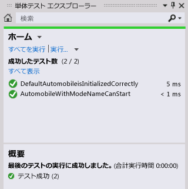

# チュートリアル: 使用法から生成機能のテスト ファースト開発
このトピックでは、テスト ファースト開発をサポートする[使用法から生成](../ide/visual-csharp-intellisense.md#generate-from-usage)機能の使用方法について説明します。  
  
 *テスト ファースト開発* は、最初に製品仕様に基づいて単体テストを記述してから、テストが成功するために必要なソース コードを記述するソフトウェア設計の方法です。 Visual Studio は、新しい型とメンバーを定義する前に、テスト ケースで最初にこれらを参照するときにソース コードに生成することで、テスト ファースト開発をサポートします。  
  
 Visual Studio では、新しい型とメンバーを生成する際、ワークフローへの割り込みは最小限に抑えられます。 現在のコード位置から離れずに、型、メソッド、プロパティ、フィールド、またはコンストラクターのスタブを作成できます。 ダイアログ ボックスを開いて型生成のオプションを指定すると、ダイアログ ボックスを閉じたときに、現在開いているファイルにフォーカスがすぐに戻ります。  
  
 使用法から生成機能は、Visual Studio と統合されるテスト フレームワークで使用することができます。 このトピックでは、Microsoft 単体テスト フレームワークについて説明します。  
  
[!INCLUDE[note_settings_general](../data-tools/includes/note_settings_general_md.md)]  
  
### Windows クラス ライブラリ プロジェクトとテスト プロジェクトを作成するには  
  
1.  [!INCLUDE[csprcs](../data-tools/includes/csprcs_md.md)] または [!INCLUDE[vbprvb](../code-quality/includes/vbprvb_md.md)] で、新しい **Windows クラス ライブラリ** プロジェクトを作成します。 使用している言語に応じて `GFUDemo_VB` または `GFUDemo_CS`という名前を付けます。  
  
2.  **ソリューション エクスプローラー**の上部にあるソリューション アイコンを右クリックし、**[追加]** を選択してから **[新しいプロジェクト]** を選択します。 **[新しいプロジェクト]** ダイアログ ボックスの左ペインで、**[テスト]** を選択します。  
  
3.  中央のペインで、**[単体テスト プロジェクト]** を選択し、UnitTestProject1 の既定の名前をそのまま使用します。 [!INCLUDE[csprcs](../data-tools/includes/csprcs_md.md)] で表示されるダイアログ ボックスを次の図に示します。 [!INCLUDE[vbprvb](../code-quality/includes/vbprvb_md.md)] のダイアログ ボックスも同様です。  
  
     ![[新しいテスト プロジェクト] ダイアログ](../ide/media/newproject_test.png "NewProject_Test")  
  
4.  **[OK]** を選択して、**[新しいプロジェクト]** ダイアログ ボックスを閉じます。  

### クラス ライブラリ プロジェクトへの参照を追加するには

1.  **ソリューション エクスプローラー**で、単体クラス プロジェクトの **[参照]** エントリを右クリックし、**[参照の追加]** を選択します。

2.  **[参照マネージャー]** ダイアログ ボックスで、**[プロジェクト]** を選択してからクラス ライブラリ プロジェクトを選択します。

3.  **[OK]** を選択して **[参照マネージャー]** ダイアログ ボックスを閉じます。  
    
4.  ソリューションを保存します。 これで、テストの記述を開始できるようになりました。  
  
### 単体テストから新しいクラスを生成するには  
  
1.  テスト プロジェクトには、UnitTest1 という名前のファイルが含まれています。 **ソリューション エクスプローラー** でこのファイルをダブルクリックして、コード エディターで開きます。 テスト クラスとテスト メソッドが生成されています。  
  
2.  クラス `UnitTest1` の宣言を検索して、この名前を `AutomobileTest`に変更します。  
  
 > [!NOTE]
 >  現在、IntelliSense では、IntelliSense のステートメント入力候補に対して、 *完了モード* と *提案モード*の 2 つの方法を提供しています。 まだ定義していないクラスやメンバーを使用する場合は、提案モードを使用します。 IntelliSense ウィンドウが開いているときに、**Ctrl キーと Alt キーを押しながら Space キー**を押すと完了モードと提案モードを切り替えることができます。 詳しくは、「[IntelliSense の使用](../ide/using-intellisense.md)」をご覧ください。 提案モードは、次の手順で「 `Automobile` 」と入力する際に役立ちます。  
  
3.  `TestMethod1()` メソッドを検索して、この名前を `DefaultAutomobileIsInitializedCorrectly()`に変更します。 次のスクリーンショットに示されているように、このメソッド内に `Automobile` というクラスの新しいインスタンスを作成します。 コンパイル時のエラーを示す波下線が表示され、[クイック アクション](../ide/quick-actions.md) (電球) が左の余白に表示される (C# のみ) か、カーソルを移動すると波線の下に直接表示されます。  
  
       

       
  
4.  クイック アクション (電球) を選択するかクリックします。 `Automobile` 型が定義されていないことを示すエラー メッセージが表示されます。 ソリューションもいくつか表示されます。  
  
5. **[新しい型の生成]** をクリックして **[型の生成]** ダイアログ ボックスを開きます。 このダイアログ ボックスでは、別のプロジェクトでの型の生成を含むオプションが提供されます。  

6. **[プロジェクト]** の一覧で、**[GFUDemo\_VB]** または **[GFUDemo_CS]** をクリックして、テスト プロジェクトではなくクラス ライブラリ プロジェクトにファイルを追加するように Visual Studio に指示します。 **[新しいファイルの作成]** がまだ選択されていない場合は選択し、**Automobile.cs** または **Automobile.vb** という名前を付けます。  
  
     ![[新しい型の生成] ダイアログ ボックス](../ide/media/genotherdialog.png "GenOtherDialog")  
  
6.  **[OK]** をクリックしてダイアログ ボックスを閉じ、新しいファイルを作成します。  
  
7.  **ソリューション エクスプローラー**で、GFUDemo_VB または GFUDemo_CS プロジェクト ノードの下に新しい Automobile.vb または Automobile.cs ファイルが存在することを確認します。 コード エディターでは、まだ `AutomobileTest.DefaultAutomobileIsInitializedCorrectly` にフォーカスがあり、中断を最小限に抑えて、テストの記述を続行できます。  
  
### プロパティ スタブを生成するには  
`Automobile` クラスに `Model` と `TopSpeed`という 2 つのパブリック プロパティがあることを示す製品仕様があるとします。 これらのプロパティは、既定のコンストラクターによって、 `"Not specified"` と `-1` の既定値で初期化されている必要があります。 次の単体テストでは、既定のコンストラクターが適切な既定値にプロパティを設定することを検証します。  
  
1. `DefaultAutomobileIsInitializedCorrectly` テスト メソッドに次のコード行を追加します。  
  
     [!code-csharp[VbTDDWalkthrough#1](../ide/codesnippet/CSharp/walkthrough-test-first-support-with-the-generate-from-usage-feature_1.cs)]
     [!code-vb[VbTDDWalkthrough#1](../ide/codesnippet/VisualBasic/walkthrough-test-first-support-with-the-generate-from-usage-feature_1.vb)]  
  
2. コードは `Automobile` の 2 つの未定義プロパティを参照するため、`Model` と `TopSpeed` の下に波下線が表示されます。 `Model` にカーソルを移動し、クイック アクション (電球) を選択してから、**[プロパティ 'Automobile.Model' を生成します]** を選択します。  

3. `TopSpeed` プロパティのプロパティ スタブも同様に生成します。  
  
     `Automobile` クラスでは、新しいプロパティの型はコンテキストから正しく推定されます。  
  
### 新しいコンストラクターのスタブを生成するには  
ここでは、`Model` および `TopSpeed` プロパティを初期化するコンストラクター スタブを生成するテスト メソッドを作成します。 後でコードを追加してテストを完成させます。  

1. 次の追加のテスト メソッドを `AutomobileTest` クラスに追加します。  
  
     [!code-csharp[VbTDDWalkthrough#2](../ide/codesnippet/CSharp/walkthrough-test-first-support-with-the-generate-from-usage-feature_2.cs)]
     [!code-vb[VbTDDWalkthrough#2](../ide/codesnippet/VisualBasic/walkthrough-test-first-support-with-the-generate-from-usage-feature_2.vb)]  
  
2.  赤い波線の下にあるクイック アクション (電球) をクリックしてから、**['Automobile' にコンストラクターを生成します]** をクリックします。  

     `Automobile` クラス ファイルで、新しいコンストラクターがコンストラクター呼び出しで使用されているローカル変数の名前を調べ、 `Automobile` クラスで同じ名前のプロパティを見つけ、 `Model` および `TopSpeed` プロパティに引数値を格納するためのコードをコンストラクター本体に指定に指定したことがわかります
  

3.  新しいコンストラクターを生成すると、 `DefaultAutomobileIsInitializedCorrectly`の既定のコンストラクター呼び出しの下に波線が表示されます。 `Automobile` クラスには、0 個の引数を受け取るコンストラクターがないことを示すエラー メッセージが表示されます。 パラメーターを持たない明示的な既定のコンストラクターを生成するには、クイック アクション (電球) をクリックし、**['Automobile' にコンストラクターを生成します]** をクリックします。  
  
### メソッドのスタブを生成するには  
仕様で、 `Automobile` および `Model` プロパティが既定値以外に設定されている場合は、新しい `TopSpeed` を実行状態にできることが示されているとします。  

1. 次の行を `AutomobileWithModelNameCanStart` メソッドに追加します。
  
     [!code-csharp[VbTDDWalkthrough#3](../ide/codesnippet/CSharp/walkthrough-test-first-support-with-the-generate-from-usage-feature_3.cs)]
     [!code-vb[VbTDDWalkthrough#3](../ide/codesnippet/VisualBasic/walkthrough-test-first-support-with-the-generate-from-usage-feature_3.vb)]  
  
2.  `myAuto.Start` メソッド呼び出しのクイック アクション (電球) をクリックしてから、**[メソッド 'Automobile.Start' を生成します]** をクリックします。  
  
3.  `IsRunning` プロパティのクイック アクション (電球) をクリックしてから、**[プロパティ 'Automobile.IsRunning' を生成します]** をクリックします。  

     これで、`Automobile` クラスに `Start()` という名前のメソッドと `IsRunning` という名前のプロパティが含まれるようになりました。  
  
### テストを実行するには  
  
1.  **[テスト]** メニューで **[実行]**、**[すべてのテスト]** の順に選択します。  

     **[実行]**、**[すべてのテスト]** コマンドは、現在のソリューション用に作成されたテスト フレームワークですべてのテストを実行します。 この場合、2 つのテストがありますが、どちらも失敗することが予想されます。 `DefaultAutomobileIsInitializedCorrectly` テストは、 `Assert.IsTrue` 条件が `False`を返すため失敗します。 `AutomobileWithModelNameCanStart` テストは、 `Start` クラスの `Automobile` メソッドが例外をスローするため失敗します。  
  
     次の図に **[テスト結果]** ウィンドウを示します。  
  
       
  
2.  **[テスト結果]** ウィンドウで、各テスト結果の行をダブルクリックして、各テストの場所に移動します。  
  
### ソース コードを実装するには  
  
1.  次のコードを既定のコンストラクターに追加して、`Model`、`TopSpeed` および `IsRunning` のプロパティがすべて `"Not specified"`、`-1` および `False` (C# の場合は `false`) の適切な既定値に初期化されるようにします。  
  
     [!code-csharp[VbTDDWalkthrough#5](../ide/codesnippet/CSharp/walkthrough-test-first-support-with-the-generate-from-usage-feature_5.cs)]
     [!code-vb[VbTDDWalkthrough#5](../ide/codesnippet/VisualBasic/walkthrough-test-first-support-with-the-generate-from-usage-feature_5.vb)]  
  
2.  `Start` メソッドが呼び出されたときに、 `IsRunning` または `Model` プロパティが既定値以外に設定されている場合にのみ `TopSpeed` フラグを true に設定する必要があります。 メソッド本体から `NotImplementedException` を削除して次のコードを追加します。  
  
     [!code-csharp[VbTDDWalkthrough#6](../ide/codesnippet/CSharp/walkthrough-test-first-support-with-the-generate-from-usage-feature_6.cs)]
     [!code-vb[VbTDDWalkthrough#6](../ide/codesnippet/VisualBasic/walkthrough-test-first-support-with-the-generate-from-usage-feature_6.vb)]  
  
### テストをもう一度実行するには  
  
- **[テスト]** メニューの **[実行]** をポイントし、**[すべてのテスト]** をクリックします。  

     今回はテストに合格します。 次の図に **[テスト結果]** ウィンドウを示します。  
  
     
  
## 関連項目  
 [使用法から生成](../ide/visual-csharp-intellisense.md#generate-from-usage)   
 [コードの作成](../ide/writing-code-in-the-code-and-text-editor.md)   
 [IntelliSense の使用](../ide/using-intellisense.md)   
 [コードの単体テスト](../test/unit-test-your-code.md)  
 [クイック アクション](../ide/quick-actions.md)  