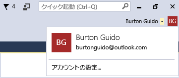

# 複数のユーザー アカウントを使って作業する

複数の Microsoft アカウントや職場または学校のアカウントを所有している場合、そのすべてを Visual Studio に追加すると、個別にサインインしなくても、すべてのアカウントのリソースにアクセスできます。 現在、Azure、Application Insights、Team Foundation Server、Office 365 サービスが、簡素化されたサインイン エクスペリエンスをサポートしています。 今後、他のサービスが使用可能になる可能性があります。

1 台のコンピューターで複数のアカウントを追加した後、別のコンピューターで Visual Studio にサインインすると、そのアカウント セットがユーザーと共に移動します。 アカウント名は移動しますが資格情報は移動しないことに注意することが重要です。 したがって、新しいコンピューターでそのリソースを初めて使用しようとすると、他のアカウントの資格情報の入力を求められます。

このチュートリアルは複数のアカウントを Visual Studio に追加する方法について説明しており、それらのアカウントからアクセス可能なリソースを表示する方法については、 **[接続済みサービスの追加]** ダイアログ、 **サーバー エクスプローラー**、および **チーム エクスプローラー**などに反映されています。

## Visual Studio にサインイン

- Microsoft アカウントまたは組織アカウントで、Visual Studio にサインインします。 ウィンドウの右上隅に、次のようにユーザー名が表示されます。

     

### サーバー エクスプローラーで Azure アカウントにアクセス

**Ctrl**+**Alt**+**S** キーを押して**サーバー エクスプローラー**を開きます。 **Azure** アイコンを選択して展開すると、Visual Studio にログインするときに使用した ID に関連付けられた Azure アカウントで利用可能なリソースが表示されます。 次のような内容が表示されます (自分のリソースを表示する場合を除く)。

特定のデバイスで初めて Visual Studio を使用するときは、IDE へのサインインに使用した ID で登録されているサブスクリプションだけがダイアログに表示されます。 **サーバー エクスプローラー**で **Azure** ノードを右クリックして **[サブスクリプションの管理とフィルター]** を選択し、アカウントの選択コントロールからアカウントを追加することにより、他のアカウントのリソースに直接アクセスできます。 その後は、必要に応じて、下矢印をクリックしてアカウントの一覧から選択することにより、別のアカウントを選択できます。 アカウントを選択した後は、そのアカウントから**サーバー エクスプローラー**に表示するサブスクリプションを選択できます。

![[Azure サブスクリプションの管理] ダイアログ](../ide/media/vs2015_manage_subs.png)

次に**サーバー エクスプローラー**を開いたときは、そのサブスクリプションのリソースが表示されます。

### [接続済みサービスの追加] ダイアログを通して Azure アカウントにアクセスします。

1. C# で UWP アプリ プロジェクトを作成します。

1. **ソリューション エクスプローラー**でプロジェクト ノードを選択し、**[追加]** > **[接続済みサービス]** の順に選択します。 **[接続済みサービスの追加]** ウィザードが表示され、Visual Studio ログイン ID に関連付けられた Azure アカウントのサービスの一覧が表示されます。 なお、Azure には個別にサインインする必要はありません。 ただし、特定のコンピューターから他のアカウントのリソースへのアクセスを初めて試みるときは、そのアカウントにサインインする必要があります。

    > [!WARNING]
    > 特定のコンピューターの Visual Studio で UWP アプリを初めて作成する場合は、コンピューターの **[設定]** > **[更新とセキュリティ]** > **[開発者向け]** にアクセスして、デバイスを開発モード用に有効にするようにメッセージが表示されます。 詳細については、「[デバイスを開発用に有効にする](/windows/uwp/get-started/enable-your-device-for-development)」を参照してください。

###  Web プロジェクトで Azure Active Directory にアクセス

Azure AD では、ASP.NET MVC の Web アプリケーションでのエンド ユーザー シングル サインオンや、Web API サービスでの AD 認証をサポートしています。 ドメイン認証は個々のユーザー アカウント認証とは異なります。Active Directory ドメインにアクセスできるユーザーは、既存の Azure AD アカウントを使用して、Web アプリケーションに接続できます。 Office 365 アプリでは、ドメイン認証も使用できます。 これを実際に見るには、Web アプリケーションを作成します (**[ファイル]** > **[新しいプロジェクト]** > **[C#]** > **[クラウド]** > **[ASP.NET Web アプリケーション]**)。 **新しい ASP.NET プロジェクト**のダイアログで、**[認証の変更]** を選択します。 認証ウィザードが表示され、アプリケーションで使用する認証の種類を選択できます。

ASP.NET でのさまざまな種類の認証については、[Visual Studio 2013 での ASP.NET Web プロジェクトの作成](http://www.asp.net/visual-studio/overview/2013/creating-web-projects-in-visual-studio#orgauth)に関するセクションを参照してください (認証に関する情報は Visual Studio の現在のバージョンにも引き続き該当します)。

### Visual Studio Team Services のアカウントへのアクセス

メイン メニューから、**[チーム]** > **[Team Foundation Server への接続]** を選択して、**チーム エクスプローラー** ウィンドウを開きます。 **[チーム プロジェクトの選択]** をクリックすると、 **[Team Foundation Server の選択]** にあるリスト ボックスに Visual Studio Team Services アカウントの URL が表示されます。 URL を選択すると、資格情報を再入力しなくてもログインできます。

## Visual Studio に 2 つ目にユーザー アカウントを追加

Visual Studio の上隅にあるユーザー名の横の矢印をクリックします。 その後、 **[アカウントの設定]** メニュー項目を選択します。 **[アカウント マネージャー]** ダイアログが表示され、サインインしたアカウントが表示されます。 ダイアログの下隅にある **[アカウントの追加]** リンクを選択して、新しい Microsoft アカウントまたは新しい仕事や学校のアカウントを追加します。

プロンプトに応じて新しいアカウントの資格情報を入力します。 次の図は、ユーザーが自分の *Contoso.com* の仕事用アカウントを追加した後の**アカウント マネージャー**を示しています。

![[アカウント マネージャー]](../ide/media/vs2015_accountmanager.gif)

## [接続済みサービスの追加] ウィザードおよびサーバー エクスプローラーを再表示します。

**サーバー エクスプローラー**に再び移動し、**Azure** ノードを右クリックして、**[サブスクリプションの管理とフィルター]** を選択します。 現在のアカウントの横にあるドロップダウン矢印をクリックして新しいアカウントを選択し、**サーバー エクスプローラー**に表示するサブスクリプションを選択します。 指定したサブスクリプションに関連付けられているすべてのサービスが表示されます。 現在 2 番目のアカウントで Visual Studio IDE にサインインしてはいませんが、そのアカウントのサービスとリソースにサインインします。 同じことが **[プロジェクト]** > **[接続済みサービスの追加]** および **[チーム]** > **[Team Foundation Server への接続]** にも当てはまります。

## 関連項目

- [Visual Studio へのサインイン](signing-in-to-visual-studio.md)
