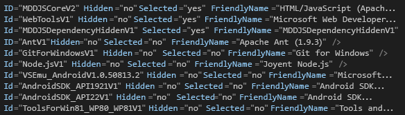

# 方法: Visual Studio の無人インストールを作成して実行する
[!INCLUDE[vs2017banner](../code-quality/includes/vs2017banner.md)]

[!INCLUDE[vsprvs](../code-quality/includes/vsprvs_md.md)] のインストール アプリケーションは、DVD などのメディアの代わりに、イントラネット経由での無人インストール \(つまり、カスタマイズしたサイレント インストール\) として実行できます。 ここでは、ネットワーク共有から [!INCLUDE[vsprvs](../code-quality/includes/vsprvs_md.md)] のこの種のインストールを実行する場合の準備方法について説明します。  
  
## ネットワーク イメージの作成  
 最初に、[!INCLUDE[vsprvs](../code-quality/includes/vsprvs_md.md)] メディアのネットワーク イメージを作成します。  
  
#### ネットワーク イメージを作成するには  
  
1.  サーバー上にフォルダー \(*Drive*:\\IDEinstall\\ など\) を作成します。  
  
2.  次のいずれかの操作を実行します。  
  
    -   Web ブートストラップをダウンロードし、*Product*.exe \/Layout *Drive*:\\IDEinstall\\ を実行します。  
  
         OR  
  
    -   IDEinstall フォルダーに Visual Studio のメディアの中身をコピーします。 内容をコピーした後に、インストールするサード パーティのソフトウェアをダウンロードする必要があります。  
  
3.  ネットワークで IDEinstall フォルダーを共有し、適切なセキュリティ設定を行います。  
  
     インストール アプリケーションのネットワーク パスは、[!INCLUDE[vsprvs](../code-quality/includes/vsprvs_md.md)] resembles \\\\*ServerName*\\IDEinstall\\*Product*.exe のようになります。  
  
    > [!NOTE]
    >  パスとファイル名の組み合わせが 260 文字を超えると、インストールに失敗する場合があります。[!INCLUDE[vsprvs](../code-quality/includes/vsprvs_md.md)] のパスの最大長は 221 文字です。  ローカル パス名は 70 文字、ネットワーク パス名は 39 文字を超えないようにしてください。  
  
     また、空白文字を含むフォルダー名をパスに指定した場合も、インストールに失敗する可能性があります。"\\\\*ServerName*\\IDE install" や \\\\*ServerName*\\Visual Studio\\ などがその例です。  
  
## 無人モードでの Visual Studio の配置  
 無人モードで [!INCLUDE[vsprvs](../code-quality/includes/vsprvs_md.md)] を配置するには、AdminDeployment.xml ファイルを変更する必要があります。 そのためには、まず、`/CreateAdminFile <file location>` コマンド ライン パラメーターを使用して、AdminDeployment.xml ファイルを作成する必要があります。 次に、このファイルを *Drive*:\\IDEinstall\\packages ディレクトリに配置した場合は、そのファイルを使用して、Visual Studio 配置をネットワークにプッシュするか、インストール環境にプルすることができます。 AdminDeployment.xml ファイルは、オペレーティング システム、アーキテクチャ、Visual Studio のエディション、またはオペレーティング システムの言語に固有のものではありません。  
  
> [!CAUTION]
>  場合によっては、AdminDeployment.xml ファイルで選択済みとして表示されている項目はインストールされません。 この問題を解決するには、"Selected\="yes"" とマークされている項目を AdminDeployment.xml ファイルの**最後**に配置します。  
>   
>  項目のオプションの依存関係をインストールしない場合は、以下のスクリーン ショットに示されているように、最初に親を選択し、次に親の後ろのオプションの依存関係を選択解除します。  
>   
>    
>   
>  これを実行する別の方法は、親のオプションの子を単に省略する方法です。つまり、"Selected\="no"" の項目を一切含めません。ただし、やはり、"Selected\="yes"" の項目はすべて AdminDeployment.xml ファイルの最後に配置する必要があります。  
  
> [!IMPORTANT]
>  インストール中に、コンピューターが自動的に 1 回以上再起動する場合があります。 再起動した後は、コンピューターが再起動する前にインストールを行うためにログインしていたのと同じユーザー アカウントを使用して再度ログインする必要があります。 無人インストールを実行する前に必須コンポーネントをインストールしておくと、自動再起動を回避できます。 詳細については、[Visual Studio 管理者ガイド](../install/visual-studio-administrator-guide.md) の「セットアップ中の再起動の回避」セクションを参照してください。  
  
 AdminDeployment ファイル スキーマには、次の要素が含まれています。  
  
|要素|属性|値|説明|  
|--------|--------|-------|--------|  
|BundleCustomizations|TargetDir|*パス*|インストール アプリケーションのユーザー インターフェイスでパスを上書きした場合と同じように動作します。 Visual Studio が既にインストールされている場合、この要素は無視されます。|  
|BundleCustomizations|NoWeb|yes&#124;default|この要素の値が yes の場合は、セットアップ中にインストール アプリケーションが Web にアクセスすることはありません。|  
|SelectableItemCustomization|非表示|Yes&#124;No|この要素の値が Yes の場合は、カスタマイズ ツリーの選択可能な項目が非表示になります。|  
|SelectableItemCustomization|選択済み|Yes&#124;No|カスタマイズ ツリーの選択可能な項目を選択または選択解除します。|  
|BundleCustomizations|フィード|パス|ユーザーが使用するフィードの場所。  これ以降のこのコンピューターに対する変更操作では、このフィードが使用されます \(既定では "Default"\) 。|  
|BundleCustomizations|SuppressRefreshPrompt|yes&#124;default|使用可能な新しいバージョンがある場合に、ユーザーにセットアップを更新するように要求しなくなります。|  
|BundleCustomizations|NoRefresh|yes&#124;default|使用可能な新しいバージョンがある場合に、セットアップを更新しません。|  
|BundleCustomizations|NoCacheOnlyMode|yes&#124;default|パッケージ キャッシュの事前設定を防ぎます。|  
  
> [!WARNING]
>  インストール アプリケーションでは、選択可能な項目が非表示になっている場合でも、その Selected の状態が反映されます。 たとえば、ある選択可能な項目を常にインストールする場合は、その項目を非表示で選択済みとしてマークできます。  
  
#### Visual Studio の無人インストールを作成するには  
  
1.  *Drive*:\\IDEinstall\\AdminDeployment.xml ファイルで、次の例に示すように、BundleCustomizations 要素の NoWeb の属性の値を "default" から "yes" に変更します。  
  
     `<BundleCustomizations TargetDir="default" NoWeb="default"/>` を `<BundleCustomizations TargetDir="default" NoWeb="yes"/>` に変更します  
  
2.  必要に応じてオプションのコンポーネントの SelectableItemCustomization 属性を変更し、ファイルを保存します。  
  
## 無人セットアップの実行  
 無人セットアップを実行するには、クライアント コンピューターで Visual Studio のインストール アプリケーションを自動的に実行するか、定義した設定を使用してユーザーが自分でアプリケーションを実行できるようにします。  
  
#### クライアント コンピューターで無人インストールを実行するには  
  
-   **\[スタート\]** メニューを開き、**\[ファイル名を指定して実行\]** をクリックして、「`\\ServerName\IDEinstall\vs_Product.exe /adminfile PathOfTheAdmindeployment.xmlFile`*AdditionalParametersAsNeeded*」と入力します。  
  
     たとえば、`\\server1\IDEinstall\vs_ultimate.exe /adminfile \\server1\ IDEinstall\AdminDeployment.xml /quiet /norestart` というコマンド ラインを指定できます。  
  
#### クライアントで、定義済みの設定を使用して Visual Studio を手動でインストールできるようにするには  
  
1.  カスタマイズした AdminDeployment.xml ファイルを読み取り専用のネットワーク共有 \(\\\\*ServerName*\\IDEinstall\\packages\\AdminDeployment.xml など\) にコピーします。  
  
2.  ユーザーがその共有からインストールできるようにします。  
  
## インストールの保守  
 **コントロール パネル**を開き、インストール アプリケーションを再実行すると、Visual Studio の機能の変更、プログラミング言語のアンインストール、および Visual Studio の修復またはアンインストールを実行できます。  
  
> [!NOTE]
>  メンテナンス モードを使用するには、ローカル コンピューターの管理者の資格情報を持っている必要があります。  
  
#### クライアント コンピューターでインストールの保守を行うには  
  
-   **コントロール パネル**を開き、**\[プログラムと機能\]** を選択します。  
  
-   \[[!INCLUDE[vsprvs](../code-quality/includes/vsprvs_md.md)]\] を選択し、**\[変更\]** を選択します。  
  
#### Visual Studio をインストールした後にクライアント コンピューターで AdminDeployment の設定を変更するには  
  
1.  必要に応じて、AdminDeployment.xml を更新します。  
  
2.  **\[スタート\]** メニューを開き、**\[ファイル名を指定して実行\]** を選択します。  
  
3.  次のテキストを入力します。  
  
     `\\ServerName\IDEinstall\vs_Product.exe /AdminFile PathToAdmindeployment.xmlFile` AdditionalParametersAsNeeded  
  
     たとえば、`\\server1\IDEinstall\vs_ultimate.exe /adminfile \\server1\IDEinstall\AdminDeployment.xml /quiet /norestart` というコマンド ラインを指定できます。  
  
 修復は、Visual Studio をインストールした後の既定のパラメーターです。 更新した \/AdminFile を使用して Visual Studio を修復すると、現在の管理者モード配置設定が、更新した AdminDeployment.xml によって呼び出される設定でオーバーライドされます。  
  
## 製品を登録する  
 インストールが完了したら、[!INCLUDE[vsprvs](../code-quality/includes/vsprvs_md.md)] 内から [!INCLUDE[vsprvs](../code-quality/includes/vsprvs_md.md)] のコピーを登録できます。  
  
#### 登録するには  
  
1.  **\[ヘルプ\]** メニューを開き、**\[製品の登録\]** をクリックします。  
  
2.  プロダクト キーを入力します。  
  
## 参照  
 [Visual Studio のインストール](../Topic/Installing%20Visual%20Studio%202015.md)