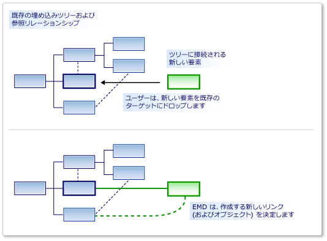

# <a name="customizing-element-creation-and-movement"></a>要素作成処理および要素移動処理のカスタマイズ
要素にドラッグすること、ツールボックスから、または貼り付けの操作または移動を許可できます。 指定したリレーションシップを使用して移動された要素をターゲット要素にリンクされていることができます。

 要素のマージ ディレクティブ (チーム EMD) は、1 つのモデル要素が場合の動作を指定します*マージ*別のモデル要素にします。 これは、ような場合。

-   ユーザーは、ツールボックスから、図や図形にドラッグします。

-   ユーザーは、エクスプ ローラーまたはコンパートメントの図形で、[追加] メニューを使用して要素を作成します。

-   ユーザーは、1 つのレーンから項目を移動します。

-   ユーザーは、要素を貼り付けます。

-   プログラム コードでは、element マージ ディレクティブを呼び出します。

 作成操作は、コピー操作は異なる場合に見える可能性があります、動作は同じ方法でが実際に表示します。 要素が追加されると、たとえばツールボックスから、そのプロトタイプはレプリケートされます。 プロトタイプは、モデルの別の部分からコピーされた要素と同じ方法で、モデルにマージされます。

 EMD の責任では、どのオブジェクトまたはオブジェクトのグループにマージするモデルの特定の場所を決定します。 具体的には、マージされたグループをモデルにリンクするどのようなリレーションシップをインスタンス化する必要がありますを決定します。 プロパティを設定して、その他のオブジェクトを作成することをカスタマイズすることもできます。

  Element マージのディレクティブの役割

 埋め込みリレーションシップを定義するとき、EMD が自動的に生成されます。 この既定 EMD は、ユーザーが親に子の新しいインスタンスを追加するときに、リレーションシップのインスタンスを作成します。 カスタム コードを追加することによってたとえば既定入力例: でこれらを変更できます。

 ユーザーがドラッグするか、マージされた側と受信側のクラスのさまざまな組み合わせを貼り付けできるように、DSL 定義で、独自の入力例: を追加することもできます。

## <a name="defining-an-element-merge-directive"></a>要素のマージ ディレクティブを定義します。
 ドメイン クラス、ドメインの関係、図形、コネクタ、およびダイアグラムには、要素マージ ディレクティブを追加できます。 追加したり、受信側のドメイン クラスは、DSL のエクスプ ローラーで確認できます。 受信側のクラスは、モデルでは、新規またはコピーした要素をマージするのには、既に要素のドメイン クラス。

 

 **インデックス クラス**を受け取るクラスのメンバーにマージできる要素のドメイン クラスです。 インデックス作成クラスのサブクラスのインスタンスもマージされますこの EMD で設定する場合を除き、**サブクラスに適用されます**を False にします。

 マージ ディレクティブの 2 種類あります。

-   A**プロセス マージ**ディレクティブがツリーに新しい要素をリンクする必要がありますのリレーションシップを指定します。

-   A**フォワード マージ**ディレクティブが別の受信側要素、親では一般に、新しい要素をリダイレクトします。

 ディレクティブを結合するカスタム コードを追加することができます。

-   設定**使用してカスタム受け入れる**インデックスの要素の特定のインスタンスを対象となる要素にマージするかどうかを決定するコードを追加します。 ユーザーは、ツールボックスからドラッグした、ときに、コードが禁止されるマージ「無効」ポインターを示しています。

     たとえば、受信側の要素が特定の状態の場合にのみ、マージを許可できます。

-   設定**使用してカスタムのマージ**を追加する、マージを実行すると、モデルに加えられた変更を定義する独自のコードを提供します。

     たとえば、モデル内の新しい場所からデータを使用して、マージされた要素でプロパティを設定する可能性があります。

> [!NOTE]
>  カスタムのマージのコードを記述する場合は、この EMD を使用して実行される唯一の結合に影響します。 他の入力の例: 同じ種類のオブジェクトをマージする場合、または、EMD を使用せずにこれらのオブジェクトを作成するその他のカスタム コードがある場合は、し、それらが受けません、カスタムのマージのコード。
>
>  新しい要素または新しいリレーションシップが、カスタム コードで処理が常にことを確認する場合は、定義することを検討してください、`AddRule`埋め込みリレーションシップと`DeleteRule`要素のドメイン クラスにします。 詳細については、次を参照してください。[ルール反映されるまで変更内で、モデル](../modeling/rules-propagate-changes-within-the-model.md)です。

## <a name="example-defining-an-emd-without-custom-code"></a>例: 定義のカスタム コードを使用せず、EMD
 次の例では、既存の図形には、ツールボックスからドラッグして、同時に、要素とコネクタを作成できます。 この例では、DSL 定義に、EMD を追加します。 この変更の前に既存図形上にありませんが、図では、上に、ユーザーはツールをドラッグすることができます。

 ユーザーでは、その他の要素の上に要素を貼り付けることもできます。

#### <a name="to-let-users-create-an-element-and-a-connector-at-the-same-time"></a>ユーザーが同時に、要素とコネクタを作成できるようにするには

1.  使用して新しい DSL を作成、**最小限言語**ソリューション テンプレート。

     この DSL を実行すると、図形と図形間のコネクタを作成することができます。 新しいをドラッグすることはできません**ExampleElement**既存の図形には、ツールボックスから図形です。

2.  ユーザーが上に要素をマージできるように`ExampleElement`図形に新しい EMD の作成、`ExampleElement`ドメイン クラス。

    1.  **DSL のエクスプ ローラー**、展開**ドメイン クラス**です。 右クリック`ExampleElement` をクリックし、**新しい要素をマージ ディレクティブの追加**です。

    2.  確認して、 **DSL 詳細**新しい EMD の詳細を表示できるように、ウィンドウが開いています。 (メニュー:**ビュー**、**他の Windows**、 **DSL 詳細**)。

3.  設定、**クラスをインデックス**DSL 詳細 ウィンドウの上にマージできる要素のクラスを定義する`ExampleElement`オブジェクト。

     この例では、選択`ExampleElements`ユーザーが新しい要素を既存の要素にドラッグできるようにします。

     インデックス作成クラスになる EMD DSL のエクスプ ローラーでの名前に注意してください。

4.  **へのリンクを作成することでプロセス マージ**、2 つのパスを追加します。

    1.  1 つのパスは、新しい要素を親モデルにリンクします。 パス式を入力する必要のある既存の要素からを埋め込みリレーションシップを介してに移動親モデルします。 最後に、新しい要素の割り当てられた新しいリンクで、ロールを指定します。 パスは次のとおりです。

         `ExampleModelHasElements.ExampleModel/!ExampleModel/.Elements`

    2.  もう一方のパスは、新しい要素を既存の要素にリンクします。 パス式では、参照リレーションシップと、新しい要素の割り当てられたロールを指定します。 このパスは次のとおりです。

         `ExampleElementReferencesTargets.Sources`

     パスのナビゲーション ツールを使用して、それぞれのパスを作成することができます。

    1.  [**パスにあるリンクを作成することでプロセス マージ**、] をクリックして**\<のパスを追加 >**です。

    2.  リスト アイテムの右側にドロップダウン矢印をクリックします。 ツリー ビューが表示されます。

    3.  指定するパスを形成するツリーのノードを展開します。

5.  DSL をテストします。

    1.  F5 キーを押してを再構築し、ソリューションを実行します。

         再構築する長くかかります通常よりも新しい DSL 定義に準拠するようにテキスト テンプレートから生成されたコードが更新されるためです。

    2.  ときに、実験用インスタンスの[!INCLUDE[vsprvs](../code-quality/includes/vsprvs_md.md)]が、DSL のモデル ファイルを開く、開始します。 いくつかの例の要素を作成します。

    3.  ドラッグして、**例要素**既存の図形にツールです。

         新しい図形が表示されたら、およびコネクタで既存の図形にリンクされています。

    4.  既存の図形をコピーします。 別の図形を選択し、貼り付けます。

         最初の図形のコピーが作成されます。  新しい名前があり、コネクタで 2 番目の図形にリンクされています。

 このプロシージャから、次の点に注意してください。

-   要素をマージ ディレクティブを作成すると、任意のクラスを受け入れるその他の要素を許可できます。 受信側のドメイン クラスで、EMD が作成され、承認済みドメイン クラスがで指定された、 **Index クラス**フィールドです。

-   パスを定義すると、どのようなリンクにする必要がありますを指定できます、既存のモデルに新しい要素の接続に使用します。

     指定したリンクは、埋め込みリレーションシップは 1 つを含める必要があります。

-   ツールボックス ペインとも貼り付けの操作で両方の作成を EMD に影響します。

     使用して、EMD を明示的に呼び出す新しい要素を作成するカスタム コードを記述する場合、`ElementOperations.Merge`メソッドです。 これにより、コードが、その他の操作と同じ方法で、モデルに新しい要素をリンクすることを確認します。 詳細については、次を参照してください。[コピー動作のカスタマイズ](../modeling/customizing-copy-behavior.md)です。

## <a name="example-adding-custom-accept-code-to-an-emd"></a>例: EMD へのユーザー設定を受け入れるコードの追加
 に、EMD をカスタム コードを追加するには、より複雑な結合の動作を定義できます。 この簡単な例では、ユーザーが、ダイアグラムに固定要素数よりも多く追加することを防ぎます。 この例では、EMD 埋め込みリレーションシップに付属する既定値を変更します。

#### <a name="to-write-custom-accept-code-to-restrict-what-the-user-can-add"></a>追加できるユーザーを制限するユーザー設定を受け入れるコードを記述するには

1.  DSL を使用して、作成、**最小限言語**ソリューション テンプレート。 DSL 定義ダイアグラムを開きます。

2.  DSL のエクスプ ローラーで展開**ドメイン クラス**、 `ExampleModel`、**要素マージ ディレクティブ**です。 という名前の要素のマージ ディレクティブを選択`ExampleElement`です。

     この EMD がユーザーを新規作成方法を制御`ExampleElement`ツールボックスからドラッグして、たとえば、モデル内のオブジェクト。

3.  **DSL 詳細**ウィンドウで、**使用してカスタム受け入れる**です。

4.  ソリューションをリビルドします。 生成されたコードは、モデルから更新されるためが通常よりも長くかかります。

     報告された場合と同様に、ビルド エラーが表示されます:「Company.ElementMergeSample.ExampleElement は定義を含んでいない CanMergeExampleElement の...」

     メソッドを実装する必要があります`CanMergeExampleElement`です。

5.  新しいコード ファイルを作成、 **Dsl**プロジェクト。 次のコードでそのコンテンツを置き換え、プロジェクトの名前空間を名前空間を変更します。

    ```csharp
    using Microsoft.VisualStudio.Modeling;

    namespace Company.ElementMergeSample // EDIT.
    {
      partial class ExampleModel
      {
        /// <summary>
        /// Called whenever an ExampleElement is to be merged into this ExampleModel.
        /// This happens when the user pastes an ExampleElement
        /// or drags from the toolbox.
        /// Determines whether the merge is allowed.
        /// </summary>
        /// <param name="rootElement">The root element in the merging EGP.</param>
        /// <param name="elementGroupPrototype">The EGP that the user wants to merge.</param>
        /// <returns>True if the merge is allowed</returns>
        private bool CanMergeExampleElement(ProtoElementBase rootElement, ElementGroupPrototype elementGroupPrototype)
        {
          // Allow no more than 4 elements to be added:
          return this.Elements.Count < 4;
        }
      }
    }

    ```

     この簡単な例では、親モデルに結合できる要素の数を制限します。 メソッドより有益な条件については、任意のプロパティと受信側のオブジェクトのリンクを検査できます。 結合の要素が実行されます。 でのプロパティを調べることができますも、<xref:Microsoft.VisualStudio.Modeling.ElementGroupPrototype>です。 詳細については`ElementGroupPrototypes`を参照してください[コピー動作のカスタマイズ](../modeling/customizing-copy-behavior.md)です。 モデルを読み取っているコードを記述する方法の詳細については、次を参照してください。[を移動すると、プログラム コードでモデルを更新する](../modeling/navigating-and-updating-a-model-in-program-code.md)です。

6.  DSL をテストします。

    1.  F5 キーを押して、ソリューションをリビルドします。 ときに、実験用インスタンスの[!INCLUDE[vsprvs](../code-quality/includes/vsprvs_md.md)]が開き、DSL のインスタンスを開きます。

    2.  いくつかの方法では、新しい要素を作成します。

        1.  ドラッグして、**例要素**ダイアグラムにツールです。

        2.  **例モデル エクスプ ローラー**ルート ノードを右クリックし、クリックして**新しい例要素の追加**です。

        3.  コピーし、図の要素を貼り付けます。

    3.  モデルに複数の 4 つの要素を追加する方法はこれらのいずれかの使用できないことを確認します。 これは Element マージ ディレクティブを使用するためです。

## <a name="example-adding-custom-merge-code-to-an-emd"></a>例: EMD にカスタムのマージのコードを追加します。
 カスタムのマージのコードでは、ユーザーがツールをドラッグまたは要素に貼り付けますときの動作を定義できます。 カスタムのマージを定義する 2 つの方法があります。

1.  設定**を使用してカスタム マージ**し、必要なコードを指定します。 コードでは、生成されたマージのコードを置き換えます。 マージの実行内容を完全に再定義する場合は、このオプションを使用します。

2.  上書き、`MergeRelate`メソッド、および必要に応じて、`MergeDisconnect`メソッドです。 これを行うには、設定する必要があります、 **double 型の派生を生成**ドメイン クラスのプロパティです。 コードは、基底クラスで生成されたマージのコードを呼び出すことができます。 マージが実行された後、追加の操作を実行する場合は、このオプションを使用します。

 これらのアプローチには、この EMD を使用して実行されるマージのみに影響します。 定義する代わりには、マージされた要素を作成できますのすべての方法に影響する場合は、`AddRule`埋め込みリレーションシップと`DeleteRule`マージされたドメイン クラスにします。 詳細については、次を参照してください。[ルール反映されるまで変更内で、モデル](../modeling/rules-propagate-changes-within-the-model.md)です。

#### <a name="to-override-mergerelate"></a>MergeRelate を上書きするには

1.  DSL 定義では、コードを追加する EMD が定義されていることを確認します。 する場合は、パスを追加して定義ユーザー設定は、前のセクションで説明されているようにコードを受け入れるようにします。

2.  DslDefinition 図では、マージの受信側のクラスを選択します。 通常は埋め込みリレーションシップのソース end クラスです。

     たとえば、最小限の言語のソリューションから生成された DSL で次のように選択します。`ExampleModel`です。

3.  **プロパティ**ウィンドウで、設定**double 型の派生を生成**に**true**です。

4.  ソリューションをリビルドします。

5.  内容を調べる**Dsl\Generated Files\DomainClasses.cs**です。 という名前のメソッドの検索`MergeRelate`し、その内容を確認します。 これからは、独自のバージョンを記述できます。

6.  新しいコード ファイルで、受信側のクラスの部分クラスを記述し、上書き、`MergeRelate`メソッドです。 基本メソッドを呼び出すことに注意してください。 例えば:

    ```csharp
    partial class ExampleModel
    {
      /// <summary>
      /// Called when the user drags or pastes an ExampleElement onto the diagram.
      /// Sets the time of day as the name.
      /// </summary>
      /// <param name="sourceElement">Element to be added</param>
      /// <param name="elementGroup">Elements to be merged</param>
      protected override void MergeRelate(ModelElement sourceElement, ElementGroup elementGroup)
      {
        // Connect the element according to the EMD:
        base.MergeRelate(sourceElement, elementGroup);

        // Custom actions:
        ExampleElement mergingElement = sourceElement as ExampleElement;
        if (mergingElement != null)
        {
          mergingElement.Name = DateTime.Now.ToLongTimeString();
        }
      }
    }

    ```

#### <a name="to-write-custom-merge-code"></a>カスタムのマージのコードを記述するには

1.  **Dsl\Generated Code\DomainClasses.cs**、という名前のメソッドを検査`MergeRelate`です。 これらのメソッドは、新しい要素と、既存のモデル間のリンクを作成します。

     また、という名前のメソッドを検査`MergeDisconnect`です。 これらのメソッドには、それを削除するときに、モデルの要素がリンクを解除します。

2.  **DSL のエクスプ ローラー**を選択するかをカスタマイズする要素をマージ ディレクティブを作成します。 **DSL 詳細**ウィンドウで、設定**を使用してカスタム マージ**です。

     このオプションを設定すると、**プロセス マージ**と**フォワード マージ**オプションは無視されます。 コードが使用されます。

3.  ソリューションをリビルドします。 モデルから生成されたコード ファイルが更新されますので通常よりも長くかかります。

     エラー メッセージが表示されます。 生成されたコード内の指示を参照するエラー メッセージをダブルクリックします。 これらの手順では、次の 2 つの方法を提供するよう求められます`MergeRelate` *YourDomainClass*と`MergeDisconnect` *YourDomainClass*

4.  個別のコード ファイルの部分クラス定義で、メソッドを記述します。 例では、前に検査する必要がありますおくべきことをお勧めします。

 カスタムのマージのコードでは、直接オブジェクトとリレーションシップを作成するコードには影響はおよびその他の入力例: には影響しません。 要素を作成する方法に関係なく、追加の変更が実装されていることを確認するには、書き込みを検討してください。、`AddRule`と`DeleteRule`代わりにします。 詳細については、次を参照してください。[ルール反映されるまで変更内で、モデル](../modeling/rules-propagate-changes-within-the-model.md)です。

## <a name="redirecting-a-merge-operation"></a>マージ操作をリダイレクトします。
 前方マージ ディレクティブは、マージ操作の対象をリダイレクトします。 通常、新しいターゲットは、初期のターゲットの埋め込みの親です。

 たとえば、コンポーネント図 テンプレートで作成された DSL では、ポートはコンポーネントに埋め込まれます。 ポートは、コンポーネント図形の端に小さい図形として表示されます。 ユーザーは、コンポーネント図形にポート ツールをドラッグしてポートを作成します。 場合によっては、誤ってをユーザーがドラッグ ポート ツール、コンポーネントではなく、既存のポートと、操作は失敗します。 これは、いくつかの既存のポートがある場合の簡単なミスです。 ユーザーがこの妨害を回避するために、既存のポートにドラッグすることが、親コンポーネントにリダイレクトするアクションがないためにポートを許可できます。 操作は、対象となる要素が、コンポーネントであるかのように動作します。

 前方マージ ディレクティブは、コンポーネント モデル ソリューションに作成できます。 コンパイルして、元のソリューションを実行するはずのユーザーが任意の数をドラッグできます**入力ポート**または**出力ポート**からの要素、**ツールボックス**に**コンポーネント**要素。 ただし、既存のポートにポートをドラッグすることはできません。 利用不可ポインターは、この移動は無効になっていることを警告します。 ポートを意図しないように、前方マージ ディレクティブを作成するただし、既存の上にドロップ**入力ポート**に転送、**コンポーネント**要素。

#### <a name="to-create-a-forward-merge-directive"></a>前方マージ ディレクティブを作成するには

1.  作成、[!INCLUDE[dsl](../modeling/includes/dsl_md.md)]コンポーネント モデル テンプレートを使用してソリューションです。

2.  表示、 **DSL のエクスプ ローラー** DslDefinition.dsl を開くことによってです。

3.  **DSL のエクスプ ローラー**、展開**ドメイン クラス**です。

4.  **ComponentPort**抽象ドメイン クラスは両方の基本クラス**InPort**と**OutPort**です。 右クリック**ComponentPort**  をクリックし、**新しい要素をマージ ディレクティブの追加**です。

     新しい**Element マージ ディレクティブ**ノードが表示されます、**要素マージ ディレクティブ**ノード。

5.  選択、 **Element マージ ディレクティブ**ノード開き、 **DSL 詳細**ウィンドウです。

6.  インデックス作成クラスの一覧で選択**ComponentPort**です。

7.  選択**別のドメイン クラスへのマージを転送**です。

8.  パスの選択] 一覧で、展開**ComponentPort**、展開**ComponentHasPorts**、し、[**コンポーネント**です。

     新しいパスには、この 1 つがようになります。

     **ComponentHasPorts.Component/!Component**

9. ソリューションを保存し、右端にあるボタンをクリックして、テンプレートを変換、**ソリューション エクスプ ローラー**ツールバー。

10. ソリューションをビルドして実行します。 新しいインスタンスを[!INCLUDE[vsprvs](../code-quality/includes/vsprvs_md.md)]が表示されます。

11. **ソリューション エクスプ ローラー**Sample.mydsl を開きます。 図は、および**ComponentLanguage ツールボックス**が表示されます。

12. ドラッグ、**入力ポート**から、**ツールボックス**別**入力ポートです。** 次に、ドラッグ、 **OutputPort**を**InputPort**にもう**OutputPort**です。

     利用不可のポインターは表示されませんし、新しいを削除することができます**入力ポート**既存のものにします。 新しい選択**入力ポート**の別のポイントにドラッグして、**コンポーネント**です。

## <a name="see-also"></a>関連項目

- [プログラム コードにおけるモデル内の移動およびモデルの更新](../modeling/navigating-and-updating-a-model-in-program-code.md)
- [ツールおよびツールボックスのカスタマイズ](../modeling/customizing-tools-and-the-toolbox.md)
- [回路図サンプル DSL](http://code.msdn.microsoft.com/Visualization-Modeling-SDK-763778e8)