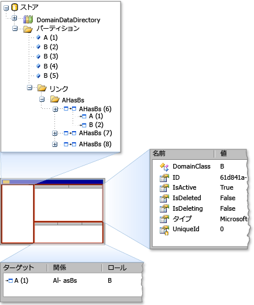

# <a name="debugging-by-using-the-store-viewer"></a>ストア ビューアーを使用したデバッグ
ストア ビューアーでの状態を調べることができます、*格納*で使用される[!INCLUDE[dsl](../modeling/includes/dsl_md.md)]します。 ストア ビューアーでは、すべての要素のプロパティと要素間のリンクと共に、特定のストア内にあるドメイン モデル要素が表示されます。

## <a name="opening-store-viewer"></a>開くストア ビューアー
 は、[!INCLUDE[vsprvs](../code-quality/includes/vsprvs_md.md)]実験用ビルドは、ブレークポイントでコードを停止するには、ストアのインスタンスにモデルの情報が含まれています。 次に、次のコマンドを入力してストア ビューアーを開きます、**イミディ エイト**ウィンドウ。

```csharp
Microsoft.VisualStudio.Modeling.Diagnostics.StoreViewer.Show(mystore);
```

> [!NOTE]
>  置き換える必要があります`mystore`ストア インスタンスの名前に置き換えます。 また、コードに、名前空間を追加する場合は、完全修飾名前空間を持たないストア ビューアーを表示するためのコマンドを入力できます。
>
>  `using Microsoft.VisualStudio.Modeling.Diagnostics;`
>
>  `...`
>
>  `StoreViewer.Show(mystore);`

 `Show`メソッドが複数のオーバー ロードします。 ストアまたはパーティションのインスタンスは、パラメーターとして指定できます。

 ストア ビューアーを任意の場所、コード内に表示するコード行を配置する代わりに、場所に渡すパラメーター、`Show`メソッドのスコープ内に示します。 このアクションは、コードの行をストアの内容のスナップショットとして実行するときに、格納ビューアーを表示します。

### <a name="using-store-viewer"></a>ストア ビューアーを使用します。
 ストア ビューアーが開き、Windows フォームのモードレス ウィンドウが表示されます、として、次の図に示します。

  ストア ビューアー

 ストア ビューアーが 3 つのペイン: 左側のペイン、右上のペイン、および右下のペインです。 左側のウィンドウは、型のツリー ビュー、`DomainDataDirectory`ストアのメンバー。 パーティションのノードを展開し、要素をクリックした場合は、右上のペインで、要素のプロパティが表示されます。 要素が他の要素にリンクされている場合は、右下のペインに追加の要素が表示されます。 右下のペイン内の要素をダブルクリックする場合は、左側のウィンドウで、要素が強調表示されます。

## <a name="see-also"></a>関連項目

- [プログラム コードにおけるモデル内の移動およびモデルの更新](../modeling/navigating-and-updating-a-model-in-program-code.md)