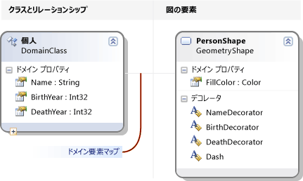
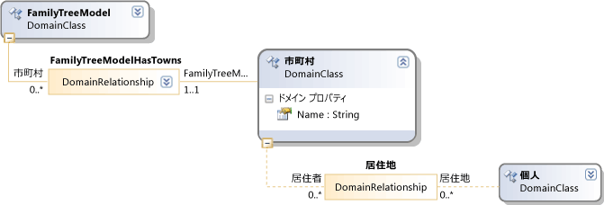
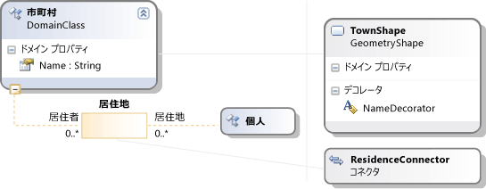

# <a name="getting-started-with-domain-specific-languages"></a>ドメイン固有言語の概要
このトピックを定義すると、Visual Studio for Modeling SDK で作成したドメイン固有言語 (DSL) を使用して基本的な概念について説明します。

> [!NOTE]
> Visual Studio 2017 で、テキスト テンプレート変換 SDK と Visual Studio のモデリング SDK 自動的にインストールされます Visual Studio の特定の機能をインストールするときにします。 詳細については、次を参照してください。[このブログの投稿](https://blogs.msdn.microsoft.com/visualstudioalm/2016/12/12/the-visual-studio-modeling-sdk-is-now-available-with-visual-studio-2017/)です。

作業することをお勧め Dsl に慣れていない場合、 **DSL ツールのラボ**、見つけることができます、このサイト内: [Visualizaton and Modeling SDK](http://go.microsoft.com/fwlink/?LinkID=186128)  
  
## <a name="what-can-you-do-with-a-domain-specific-language"></a>何を実行できるドメイン固有言語を使用しますか。  
 ドメイン固有言語は、表記法、通常、グラフィック、特定の目的に使用するよう設計されています。 これに対し、UML などの言語は、汎用的なです。 DSL では、モデル要素とそれらの関係と、画面上の表示方法の種類を定義できます。  
  
 DSL を設計するときに、Visual Studio Integration Extension (VSIX) パッケージの一部として配布できます。 ユーザーは、Visual Studio での DSL を使用します。  
  
   
  
 表記は、DSL の一部のみです。 表記法、と共に、VSIX パッケージには、ユーザーを編集し、そのモデルから情報の生成のために適用可能なツールが含まれています。  
  
 Dsl のプリンシパルのアプリケーションの 1 つは、プログラム コード、構成ファイル、およびその他の成果物を生成します。 大規模なプロジェクトおよび製品ライン、製品のいくつかのバリエーションを作成する場所で特に Dsl から生成する、変数の側面の多くを提供できますが大幅に増加信頼性と要件の変更を非常に迅速な応答。  
  
 この概要の残りの部分は、Visual Studio で作成およびドメイン固有言語の基本操作について説明するチュートリアルです。  
  
## <a name="prerequisites"></a>必須コンポーネント  
 DSL を定義するには、以下のコンポーネントをインストールしておく必要があります。  
  
|||  
|-|-|  
|Visual Studio|[http://go.microsoft.com/fwlink/?LinkId=185579](http://go.microsoft.com/fwlink/?LinkId=185579)|  
|[!INCLUDE[vssdk_current_short](../modeling/includes/vssdk_current_short_md.md)]|[http://go.microsoft.com/fwlink/?LinkId=185580](http://go.microsoft.com/fwlink/?LinkId=185580)|  
|Visual Studio のモデリング SDK||  


[!INCLUDE[modeling_sdk_info](includes/modeling_sdk_info.md)]

  
## <a name="creating-a-dsl-solution"></a>DSL ソリューションを作成します。  
 新しいドメイン固有言語を作成するには、ドメイン固有言語のプロジェクト テンプレートを使用して、新しい Visual Studio ソリューションを作成します。  
  
#### <a name="to-create-a-dsl-solution"></a>DSL ソリューションを作成するには  
  
1.  **[ファイル]** メニューの **[新規作成]**をポイントし、 **[プロジェクト]**をクリックします。  
  
2.  [**プロジェクトの種類**、展開、**その他のプロジェクトの種類**] ノードをクリック**Extensibility**です。  
  
3.  をクリックして**ドメイン固有言語デザイナー**です。  
  
       
  
4.  **名前**ボックスに、入力**FamilyTree**です。 **[OK]**をクリックします。  
  
     **ドメイン固有言語ウィザード**開き、テンプレート DSL ソリューションの一覧が表示されます。  
  
     各テンプレート、説明を表示する をクリックします。  
  
     テンプレートは役立ちます開始点です。 それぞれは、完全な作業、ニーズに合わせて編集することができます、DSL を提供します。 通常、作成する最も近いテンプレートを選択します。  
  
5.  このチュートリアルでは、選択、**最小限言語**テンプレート。  
  
6.  該当するウィザード ページに DSL のファイル名拡張子を入力します。 これは、DSL インスタンスを含むファイルに使用される拡張子です。  
  
    -   自分のコンピューターでまたは DSL をインストールするすべてのコンピューターでは、どのアプリケーションに関連付けられていない拡張機能を選択します。 たとえば、 **docx**と**htm**なります許容できないファイル名拡張子。  
  
    -   入力した拡張子が DSL として使用されている場合は、ウィザードから警告が出されます。 別のファイル名拡張子の使用を検討してください。 また、古い実験デザイナーをクリアするために Visual Studio SDK 実験用インスタンスをリセットできます。 をクリックして**開始**、 をクリックして**すべてのプログラム**、 **Microsoft Visual Studio 2010 SDK**、**ツール**、し**Microsoft のリセットVisual Studio 2010 の実験用インスタンス**です。  
  
7.  他のページを検査し、をクリックして**完了**です。  
  
     2 つのプロジェクトを含むソリューションが生成されます。 Dsl および DslPackage という名前です。 ダイアグラム ファイルを名前付き DslDefinition.dsl が開きます。  
  
    > [!NOTE]
    >  2 つのプロジェクト内のフォルダーに表示されるコードのほとんどは、DslDefinition.dsl から生成されます。 このため、このファイルに、DSL をほとんど変更が行われます。  
  
 ユーザー インターフェイスは次の図のようになります。  
  
   
  
 このソリューションはドメイン固有言語を定義します。 詳細については、次を参照してください。[ドメイン固有言語ツールのユーザー インターフェイスの概要](../modeling/overview-of-the-domain-specific-language-tools-user-interface.md)です。  
  
## <a name="the-important-parts-of-the-dsl-solution"></a>DSL ソリューションの重要な部分  
 新しいソリューションの次の点に注意してください。  
  
-   **Dsl\DslDefinition.dsl** DSL ソリューションを作成する場合に表示されるファイルです。 このファイルから、ソリューション内のほとんどすべてのコードが生成され、DSL 定義に対して行った変更のほとんどがここで行われます。 詳細については、操作を参照してください、 [DSL 定義ダイアグラムの操作](../modeling/working-with-the-dsl-definition-diagram.md)です。  
  
-   **Dsl プロジェクト**このプロジェクトには、ドメイン固有言語を定義するコードが含まれています。  
  
-   **DslPackage プロジェクト**このプロジェクトには開いて Visual Studio で編集したり、DSL のインスタンスをできるようにするコードが含まれています。  
  
##  <a name="Debugging"></a> DSL を実行しています。  
 作成するとすぐに、DSL ソリューションを実行することができます。 後で、定義を変更できます、DSL 徐々 に、各変更後にもう一度ソリューションを実行します。  
  
#### <a name="to-experiment-with-the-dsl"></a>DSL をテストするには  
  
1.  をクリックして**すべてのテンプレートの変換**ソリューション エクスプ ローラーのツールバー。 これには、ほとんどの DslDefinition.dsl からソース コードが再生成します。  
  
    > [!NOTE]
    >  クリックする必要があります DslDefinition.dsl を変更するたびに**すべてのテンプレートの変換**ソリューションを再構築する前にします。 このステップは自動化できます。 詳細については、次を参照してください。[すべてのテンプレートの変換を自動化する方法](http://msdn.microsoft.com/b63cfe20-fe5e-47cc-9506-59b29bca768a)です。
  
2.  F5 キーを押すか、**デバッグ** メニューのをクリックして**デバッグの開始**です。  
  
     DSL がビルドされ、Visual Studio の実験用インスタンスをインストールします。
  
     Visual Studio の実験用インスタンスを開始します。 実験用インスタンスは、デバッグのために Visual Studio 拡張機能が登録されているレジストリの別個のサブツリーからその設定を取得します。 Visual Studio の通常のインスタンスには、登録されている拡張機能へのアクセスはありません。  
  
3.  Visual Studio の実験用インスタンスのという名前のモデル ファイルを開く**テスト**から**ソリューション エクスプ ローラー**です。  
  
     \- または -  
  
     デバッグ プロジェクトを右クリックし、**追加**、クリックして**項目**です。 **項目の追加**ダイアログ ボックスで、ファイルが、DSL の種類を選択します。  
  
     空の図とモデル ファイルが開きます。  
  
     ツールボックスが開き、ダイアグラムの種類に適したツールを表示します。  
  
4.  ツールを使用すると、ダイアグラムで図形とコネクタを作成できます。  
  
    1.  図形を作成するには、ダイアグラムに図形の使用例ツールからドラッグします。  
  
    2.  2 つの図形を接続するには、例コネクタ ツールをクリックして、最初の図形をクリックし、2 つ目の図形をクリックします。  
  
5.  それらを変更する図形のラベルをクリックします。  
  
 実験用の Visual Studio は次の例のようになります。  
  
   
  
### <a name="the-content-of-a-model"></a>モデルのコンテンツ  
 DSL のインスタンスであるファイルの内容と呼ばれる、*モデル*です。 モデルに含まれる*モデル * * 要素*と*リンク*要素の間です。 DSL 定義は、どのような種類のモデル要素を指定しへのリンクがモデルに存在できます。 たとえば、最小限の言語のテンプレートから作成された DSL では 1 種類のモデル要素とリンクの 1 つの型。  
  
 DSL 定義では、モデルのダイアグラムの表示方法を指定できます。 さまざまな図形とコネクタのスタイルから選択することができます。 一部の図形が他の図形の内側に表示されることを指定することができます。  
  
 ツリーにモデルを表示することができます、**エクスプ ローラー**モデルを編集するときに表示します。 ダイアグラムに図形を追加すると、モデル要素も、エクスプ ローラーに表示されます。 Diagram がない場合でも、エクスプ ローラーを使用できます。  
  
 Visual Studio でのデバッグのインスタンスで、エクスプ ローラーが表示されない場合、**ビュー**メニュー をポイント**その他のウィンドウ**、順にクリック *\<Your 言語 >***エクスプ ローラー**です。  
  
### <a name="the-api-of-your-dsl"></a>DSL の API  
 DSL は、読み取りし、DSL のインスタンスであるモデルを更新することを可能にする API を生成します。 API の 1 つのアプリケーションでは、モデルからテキスト ファイルを生成します。 詳細については、次を参照してください。 [T4 テキスト テンプレートを使用して、デザイン時コード生成](../modeling/design-time-code-generation-by-using-t4-text-templates.md)です。  
  
 デバッグのソリューションでは、拡張子が".tt"テンプレート ファイルを開きます。 これらのサンプルでは、方法、モデルからテキストを生成して、DSL の API をテストすることを示します。 記述された、サンプルの 1 つ[!INCLUDE[vbprvb](../code-quality/includes/vbprvb_md.md)]でその他の[!INCLUDE[csprcs](../data-tools/includes/csprcs_md.md)]します。  
  
 [テンプレート] で各ファイルは、生成されたファイルです。 ソリューション エクスプ ローラーで、テンプレート ファイルを展開し、生成されたファイルを開きます。  
  
 テンプレート ファイルには、モデル内のすべての要素を一覧表示するコードの短いセグメントが含まれています。  
  
 生成されたファイルには、結果が含まれています。  
  
 モデル ファイルを変更するときに、ファイルを再生成した後は、生成されたファイルに対応する変更が表示されます。  
  
##### <a name="to-regenerate-text-files-after-you-change-the-model-file"></a>モデル ファイルを変更した後、テキスト ファイルを再生成するには  
  
1.  Visual Studio の実験用インスタンスのモデル ファイルを保存します。  
  
2.  .Tt ファイルごとにファイル名のパラメーターを実験に使用してモデル ファイルを指すことを確認します。 .Tt ファイルを保存します。  
  
3.  をクリックして**すべてのテンプレートの変換**のツールバーに**ソリューション エクスプ ローラー**です。  
  
     \- または -  
  
     再生成し、をクリックするテンプレートを右クリックして**カスタム ツールの実行**です。  
  
 テキスト テンプレート ファイルの任意の数は、プロジェクトに追加できます。 各テンプレートは、1 つの結果ファイルを生成します。  
  
> [!NOTE]
>  DSL 定義を変更するときに、サンプル テキスト テンプレートのコードは機能しません、更新する場合を除き、します。  
  
 詳細については、次を参照してください。[ドメイン固有言語から、コードの生成](../modeling/generating-code-from-a-domain-specific-language.md)と[ドメイン固有言語をカスタマイズするコードの記述](../modeling/writing-code-to-customise-a-domain-specific-language.md)です。  
  
## <a name="customizing-the-dsl"></a>DSL のカスタマイズ  
 DSL 定義を変更するには、実験用インスタンスを閉じて、メインの Visual Studio インスタンスで定義を更新します。  
  
> [!NOTE]
>  DSL 定義を変更した後は、以前のバージョンを使用して作成したテスト モデル内の情報を失う可能性があります。  たとえば、デバッグのソリューションには、サンプルでは、いくつかの図形とコネクタを含むというファイルが含まれています。 DSL 定義を開発する開始した後は、表示ができなくなり、失われたときになるファイルを保存します。  
  
 DSL をさまざまな拡張を行うことができます。 次の例では、可能性のような印象を提供します。  
  
 各変更後に、DSL 定義を保存 をクリックして**すべてのテンプレートの変換**で**ソリューション エクスプ ローラー**、キーを押します**f5 キーを押して**変更 DSL をテストします。  
  
### <a name="rename-the-types-and-tools"></a>種類とツールの名前を変更します。  
 既存のドメイン クラスとリレーションシップの名前を変更します。 たとえば、最小限言語テンプレートから作成された Dsl 定義から開始する可能性がありますを行うファミリ ツリーを表す DSL を行うには、次の名前変更操作、します。  
  
##### <a name="to-rename-domain-classes-relationships-and-tools"></a>ドメイン クラス、リレーションシップ、およびツールの名前を変更するには  
  
1.  DslDefinition 図では、名前を変更する**ExampleModel**に**FamilyTreeModel**、 **ExampleElement**に**Person**、 **ターゲット**に**親**、および**ソース**に**子**です。 これを変更するには、各ラベルをクリックすることができます。  
  
       
  
2.  要素とコネクタ ツールの名前を変更します。  
  
    1.  DSL のエクスプ ローラー ウィンドウを開くには、ソリューション エクスプ ローラーで、タブをクリックします。 表示されない場合、**ビュー**メニュー をポイント**その他のウィンドウ** をクリックし、 **DSL のエクスプ ローラー**です。 DSL のエクスプ ローラーは、DSL 定義ダイアグラムがアクティブ ウィンドウである場合にのみ表示されます。  
  
    2.  [プロパティ] ウィンドウを開き、配置できるようにして、同時に、DSL のエクスプ ローラーおよびプロパティを参照することができます。  
  
    3.  DSL のエクスプ ローラーで展開**エディター**、**ツールボックス タブ**、  *\<DSL >*、し**ツール**です。  
  
    4.  をクリックして**ExampleElement**です。 これは、ツールボックス項目要素を作成するために使用します。  
  
    5.  [プロパティ] ウィンドウで変更、**名前**プロパティを**Person**です。  
  
         注意して、**キャプション**プロパティも変更します。  
  
    6.  同様での名前変更、 **ExampleConnector**ツールを**ParentLink**です。 Alter、**キャプション**プロパティのでことは、Name プロパティのコピーではありません。 たとえば、入力**親リンク**です。  
  
3.  DSL を再構築します。  
  
    1.  DSL 定義ファイルを保存します。  
  
    2.  をクリックして**すべてのテンプレートの変換**ソリューション エクスプ ローラーのツールバー  
  
    3.  F5 キーを押します。 Visual Studio の実験用インスタンスが表示されるまで待機します。  
  
4.  Visual Studio の実験用インスタンスでデバッグのソリューションでは、モデルのテスト ファイルを開きます。 ツールボックスから、そこに要素をドラッグします。 ツールのキャプションと DSL のエクスプ ローラーで、型名が変更されたことに注意してください。  
  
5.  モデル ファイルを保存します。  
  
6.  .Tt ファイルを開き、新しい名前に、古い型名とプロパティ名の一致する文字列を置換します。  
  
7.  .Tt ファイルで指定されているファイル名が、モデルのテストを指定することを確認します。  
  
8.  .Tt ファイルを保存します。 生成されたファイルを開いて、.tt ファイルで、コードの実行の結果を参照してください。 正しいことを確認します。  
  
### <a name="add-domain-properties-to-classes"></a>ドメインのプロパティをクラスに追加します。  
 生まれた年と個人の死亡を表す例については、ドメインのクラスにプロパティを追加します。  
  
 新しいプロパティを表示する図に、追加する必要があります*デコレーター*図形に、モデル要素を表示します。 プロパティは、デコレーターをマップすることも必要があります。  
  
##### <a name="to-add-properties-and-display-them"></a>プロパティを追加し、それらを表示するには  
  
1.  プロパティを追加します。  
  
    1.  DSL 定義ダイアグラム内を右クリックし、 **Person**ドメイン クラス、順にポイント**追加**、順にクリック**ドメイン プロパティ**です。  
  
    2.  新しいプロパティ名の一覧を入力します。**生年月日**と**死亡**です。 キーを押して**Enter**ごとにします。  
  
2.  図形のプロパティを表示するデコレータを追加します。  
  
    1.  ダイアグラムの相手側に人物のドメイン クラスから拡張する灰色の線に従います。 これは、図の要素のマップです。 ドメイン クラスは、図形のクラスにリンクします。  
  
    2.  この図形クラスを右クリックし、**追加**、クリックして**テキスト デコレータ**です。  
  
    3.  名前を持つ 2 つのデコレータなどの追加**BirthDecorator**と**DeathDecorator**です。  
  
    4.  各新しいデコレータを選択し、[プロパティ] ウィンドウで、設定、**位置**フィールドです。 これは、図形のドメイン プロパティの値の表示場所を決定します。 たとえば、設定**InnerBottomLeft**と**InnerBottomRight**です。  
  
           
  
3.  デコレーター プロパティにマップします。  
  
    1.  [DSL 詳細] ウィンドウを開きます。 これは、通常の出力 ウィンドウの横にあるタブです。 表示されない場合、**ビュー**  メニューのをポイント**その他のウィンドウ**、クリックして**DSL 詳細**です。  
  
    2.  DSL 定義ダイアグラムで、接続している行をクリックして、 **Person**図形クラスへのドメイン クラスです。  
  
    3.  **DSL 詳細**の**デコレータ マップ** タブで、マップされていないデコレータにあるチェック ボックスをクリックします。 **表示プロパティ**、するマッピング、ドメインのプロパティを選択します。 たとえば、マップ**BirthDecorator**に**生年月日**です。  
  
4.  DSL の保存、すべてのテンプレートの変換をクリックし、f5 キーを押してください。  
  
5.  サンプル モデルの図では、ことを確認できます今すぐ選択した位置 をクリックしての値を入力します。 さらに、選択、 **Person**図形、[プロパティ] ウィンドウには、生年月日、死亡の新しいプロパティが表示されます。  
  
6.  .Tt ファイルでは、各ユーザーのプロパティを取得するコードを追加できます。  
  
   
  
### <a name="define-new-classes"></a>新しいクラスを定義します。  
 モデルには、ドメイン クラスとリレーションシップを追加できます。 たとえば、町、および、町に人が続かないことを表す新しいリレーションシップを表す新しいクラスを作成できます。  
  
 さまざまな種類の図形、または別の geometry と色を使用して図形をするのには、さまざまな種類個別モデル ダイアグラムで、ドメイン クラスをマップできます。  
  
##### <a name="to-add-and-display-a-new-domain-class"></a>追加し、新しいドメイン クラスを表示するには  
  
1.  ドメイン クラスを追加し、モデル ルートの子に設定します。  
  
    1.  DSL 定義ダイアグラムをクリックして、**埋め込みリレーションシップ**ツールで、ルート クラスを  **FamilyTreeModel**、図の空白部分をクリックします。  
  
         新しいドメイン クラスが表示されたら、埋め込みの関係を持つ FamilyTreeModel に接続されています。  
  
         たとえば、名前を設定**町**です。  
  
        > [!NOTE]
        >  モデルのルートを除くすべてのドメイン クラスは、少なくとも 1 つの埋め込みリレーションシップのターゲットである必要がありますか、埋め込みの対象となっているクラスから継承する必要があります。 このため、埋め込みリレーションシップ ツールを使用してドメイン クラスを作成する多くの場合に便利です。  
  
    2.  たとえば、新しいクラスにドメインのプロパティを追加**名前**です。  
  
2.  Person テーブルと町間に参照リレーションシップを追加します。  
  
    1.  クリックして、**参照リレーションシップ**ツールを人 をクリックし、町 をクリックします。  
  
           
  
        > [!NOTE]
        >  参照リレーションシップは、別にモデル ツリーの 1 つの部分からの相互参照を表します。  
  
3.  モデル図の町を表す図形を追加します。  
  
    1.  ドラッグ、 **Geometry 図形**ダイアグラム、ツールボックスから名前を変更、たとえば**TownShape**です。  
  
    2.  [プロパティ] ウィンドウで、塗りつぶしの色や Geometry など、新しい図形の外観のフィールドを設定します。  
  
    3.  町の名前を表示するデコレータを追加し、NameDecorator 名前を変更します。 位置プロパティを設定します。  
  
4.  町ドメイン クラスを TownShape にマップします。  
  
    1.  クリックして、**ダイアグラム要素のマップ**ツール、し、町ドメイン クラスと、TownShape 図形クラス をクリックします。  
  
    2.  **デコレータ マップ**のタブ、 **DSL 詳細**マップ コネクタを含むウィンドウが選択されている、NameDecorator を確認および設定**表示プロパティ**名にします。  
  
5.  ユーザーと町間のリレーションシップを表示するためのコネクタを作成します。  
  
    1.  ダイアグラム、ツールボックスから、コネクタをドラッグします。 名前を変更し、その外観のプロパティを設定します。  
  
    2.  使用して、**ダイアグラム要素のマップ**人と町間のリレーションシップに、新しいコネクタをリンクするツールです。  
  
           
  
6.  新規町を行うため、要素のツールを作成します。  
  
    1.  **DSL のエクスプ ローラー**、展開**エディター**し**ツールボックス タブ**です。  
  
    2.  右クリック *\<DSL >*  をクリックし、**新しい要素の追加ツール**です。  
  
    3.  設定、**名前**プロパティの新しいツールと設定、**クラス**町へのプロパティです。  
  
    4.  設定、**ツールボックス アイコン**プロパティです。 をクリックして**[...]**し、、**ファイル名**フィールドで、アイコン ファイルを選択します。  
  
7.  町とユーザー間のリンクを行うためのコネクタ ツールを作成します。  
  
    1.  右クリック *\<DSL >*  をクリックし、**新しいコネクタ ツールを追加**です。  
  
    2.  新しいツールの [名前] プロパティを設定します。  
  
    3.  **ConnectionBuilder**プロパティ、Person 町リレーションシップの名前を格納するビルダーを選択します。  
  
    4.  設定、**ツールボックス アイコン**です。  
  
8.  DSL 定義を保存 をクリックして**すべてのテンプレートの変換**、キーを押します**f5 キーを押して**です。  
  
9. Visual Studio の実験用インスタンスのモデルのテスト ファイルを開きます。 町および町および担当者の間のリンクを作成するのにには、新しいツールを使用します。 正しい種類要素の間のリンクを作成することのみできますに注意してください。  
  
10. 各ユーザーが住んでいる町を一覧表示するコードを作成します。 テキスト テンプレートは、このようなコードを実行する場所の 1 つです。 たとえば、次のコードが含まれるようにデバッグ ソリューション内の既存 Sample.tt ファイルを変更する可能性があります。  
  
    ```  
    <#@ template inherits="Microsoft.VisualStudio.TextTemplating.VSHost.ModelingTextTransformation" debug="true" #>  
    <#@ output extension=".txt" #>  
    <#@ FamilyTree processor="FamilyTreeDirectiveProcessor" requires="fileName='Sample.ftree'" #>  
  
    <#  
      foreach (Person person in this.FamilyTreeModel.People)  
      {  
    #>  
        <#= person.Name #><#if (person.Town != null) {#> of <#= person.Town.Name #> <#}#>  
  
    <#  
          foreach (Person child in person.Children)  
      {  
    #>  
                <#= child.Name #>  
    <#  
      }  
      }  
    #>  
  
    ```  
  
     *.Tt ファイルを保存するときにユーザーと、ほとんどの一覧を含む従属ファイルが作成されます。 詳細については、次を参照してください。[ドメイン固有言語から、コードの生成](../modeling/generating-code-from-a-domain-specific-language.md)です。  
  
## <a name="validation-and-commands"></a>検証とコマンド  
 検証制約を追加することで、さらにこの DSL を開発する可能性があります。 これらの制約では、モデルが正しい状態であるかどうかを確認するメソッドを定義します。 たとえば、でした制約を定義する、ことを確認するにお子様の生年月日はその親の場合よりも後です。 検証機能では、DSL ユーザーは、制約のいずれかに違反するモデルを保存しようとした場合に警告が表示されます。 詳細については、次を参照してください。[ドメイン固有言語で検証](../modeling/validation-in-a-domain-specific-language.md)です。  
  
 ユーザーが呼び出すことのできるメニュー コマンドを定義することもできます。 コマンドは、モデルを変更できます。 Visual Studio での他のモデルと外部リソースし合うことができますもありません。 詳細については、次を参照してください。[する方法: 標準メニュー コマンドを変更](../modeling/how-to-modify-a-standard-menu-command-in-a-domain-specific-language.md)です。  
  
## <a name="deploying-the-dsl"></a>DSL を展開します。  
 ドメイン固有言語を使用するには、他のユーザーを許可するのには、Visual Studio Extension (VSIX) ファイルを配布します。 DSL ソリューションをビルドするときに作成されます。  
  
 ソリューションの bin フォルダーで探し、.vsix ファイルを見つけます。 インストールするコンピューターにコピーします。 そのコンピューターで VSIX ファイルをダブルクリックします。 DSL は、そのコンピューター上の Visual Studio のすべてのインスタンスで使用できます。  
  
 同じ手順を使用すると、DSL を自分のコンピューターにインストールし、Visual Studio の実験用インスタンスを使用するのに必要はありませんできるようにします。  
  
 詳細については、次を参照してください。[ドメイン固有言語ソリューションの配置](../modeling/deploying-domain-specific-language-solutions.md)です。  
  
##  <a name="Reset"></a> 古い実験的な Dsl を削除します。  
 必要がなくなった実験用の Dsl を作成した場合は Visual Studio 実験用インスタンスをリセットすることにより、コンピューターから削除にできます。  
  
 これは、すべての実験用 Dsl およびその他の実験用の Visual Studio 拡張機能、お使いのコンピューターから削除されます。 これらは、デバッグ モードで実行されている拡張機能です。  
  
 この手順では、Dsl または VSIX ファイルを実行することによって完全にインストールされている他の Visual Studio 拡張機能は削除されません。  
  
#### <a name="to-reset-the-visual-studio-experimental-instance"></a>Visual Studio 実験用インスタンスをリセットするには  
  
1.  をクリックして**開始**、 をクリックして**すべてのプログラム**、 **Microsoft Visual Studio 2010 SDK**、**ツール**、し**Microsoft のリセットVisual Studio 2010 の実験用インスタンス**です。  
  
2.  実験的な Dsl または他の実験的なものを使用する Visual Studio 拡張機能を再構築します。  
  
## <a name="see-also"></a>関連項目

[Understanding モデル、クラスとリレーションシップ](../modeling/understanding-models-classes-and-relationships.md)   
[方法: ドメイン固有言語を定義する](../modeling/how-to-define-a-domain-specific-language.md)

