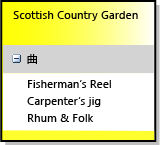

# 方法: ドメイン固有言語を定義する
ドメイン固有言語 (DSL) を定義するには、テンプレートから Visual Studio ソリューションを作成します。 ソリューションの主要な機能は DSL 定義図です。これは DslDefinition.dsl に保存されています。 DSL 定義は、DSL のクラスとシェイプを定義します。 これらの要素を変更および追加した後で、プログラム コードを追加して DSL を詳細にカスタマイズできます。

作業することをお勧めの Dsl に慣れていない場合、 **DSL ツール ラボ**、このサイトで入手できます: [Visualizaton and Modeling SDK](http://go.microsoft.com/fwlink/?LinkID=186128)

##  テンプレート ソリューションを選択します。
 DSL を定義するには、以下のコンポーネントをインストールしておく必要があります。

| | |
|-|-|
| Visual Studio | [http://go.microsoft.com/fwlink/?LinkId=185579](http://go.microsoft.com/fwlink/?LinkId=185579) |
| [!INCLUDE[vssdk_current_short](../modeling/includes/vssdk_current_short_md.md)] | [http://go.microsoft.com/fwlink/?LinkId=185580](http://go.microsoft.com/fwlink/?LinkId=185580) |
| Visual Studio Visualization and Modeling SDK | |

[!INCLUDE[modeling_sdk_info](includes/modeling_sdk_info.md)]

 新しいドメイン固有言語を作成するには、ドメイン固有言語のプロジェクト テンプレートを使用して、新しい Visual Studio ソリューションを作成します。

#### DSL ソリューションを作成するには

1. ソリューションを作成、**ドメイン固有言語**テンプレートで、下にあります**その他のプロジェクトの種類/機能拡張**で、**新しいプロジェクト** ダイアログ ボックス。

    

    クリックすると**OK**、**ドメイン固有言語ウィザード**開きテンプレート DSL ソリューションの一覧が表示されます。

2. 各テンプレートをクリックして説明を参照します。 作成したい内容に最も近いソリューションを選択します。

    各 DSL テンプレートは、機能する基本的な DSL を定義します。 この DSL を編集して、各自の要件に合わせて調整します。

    詳細については、各サンプルをクリックしてください。

   -   選択**Task Flow**スイムレーンを持つ DSL を作成します。 スイムレーンとは、図上の垂直方向または水平方向のパーティションです。

   -   選択**コンポーネント モデル**ポートを含む DSL を作成します。 ポートとは、大きなシェイプの境界上にある小さなシェイプです。

   -   選択**クラス ダイアグラム**コンパートメント シェイプを含む DSL を定義します。 コンパートメント シェイプには、項目のリストが含まれています。

   -   選択**最小言語**それ以外の場合、または不明な場合。

   -   選択**最小 WinForm デザイナー**または**最小 WPF デザイナー** Windows Forms または WPF サーフェイスに表示されている DSL を作成します。 エディターを定義するコードを記述する必要があります。 詳細については、次のトピックを参照してください。

        [Windows フォームに基づくドメイン固有言語の作成](../modeling/creating-a-windows-forms-based-domain-specific-language.md)

        [WPF に基づくドメイン固有言語の作成](../modeling/creating-a-wpf-based-domain-specific-language.md)

3. 該当するウィザード ページに DSL のファイル名拡張子を入力します。 これは、DSL インスタンスを含むファイルに使用される拡張子です。

   -   ご使用のコンピューター、または DSL をインストールするコンピューター上のどのアプリケーションにも関連付けられていないファイル名拡張子を選択してください。 たとえば、 **docx**と**htm**ファイ名拡張子になります。

   -   入力した拡張子が DSL として使用されている場合は、ウィザードから警告が出されます。 別のファイル名拡張子の使用を検討してください。 また、古い実験デザイナーをクリアするために Visual Studio SDK 実験用インスタンスをリセットできます。 クリックして**開始**、 をクリックして**すべてのプログラム**、 **Microsoft Visual Studio 2010 SDK**、**ツール**、し**Microsoft のリセットVisual Studio 2010 実験用インスタンス**します。

4. 他のページの設定を調整するか、または既定値のままにしておくことができます。

5. **[完了]** をクリックします。

    ウィザードにより、2 つまたは 3 つのプロジェクトを含むソリューションが作成され、DSL 定義からコードが生成されます。

   ユーザー インターフェイスは次の図のようになります。

   

   このソリューションはドメイン固有言語を定義します。 詳細については、次を参照してください。[ドメイン固有言語ツールのユーザー インターフェイスの概要](../modeling/overview-of-the-domain-specific-language-tools-user-interface.md)します。

### ソリューションのテスト
 テンプレート ソリューションは、機能する DSL を提供します。この DSL を変更するか、またはそのまま使用できます。

 ソリューションをテストするには、F5 キーを押すか、または Ctrl キーを押しながら F5 キーを押します。 Visual Studio の新しいインスタンスが実験モードで開きます。

 ソリューション エクスプ ローラーで、Visual Studio の新しいインスタンスでは、サンプル ファイルを開きます。 このファイルは図として開き、ツールボックスが表示されます。

 作成したソリューションを実行する場合、**最小言語**テンプレート、Visual Studio の実験的な例を次のようになります。

 

 ツールを試してみます。 要素を作成して接続します。

 Visual Studio の実験用インスタンスを終了します。

> [!NOTE]
>  DSL を変更した場合は、Sample テスト ファイルにシェイプが表示されなくなります。 ただし、新しい要素を作成できます。

### テンプレート DSL の変更
 テンプレート DSL 定義のすべてまたは一部のドメイン クラスとシェイプ クラスの名前を変更して保持します。 新しいクラス名として、スペースと句読点のない有効な CLR 名を使用してください。

 これは特に次のクラスを保持するときに役立ちます。

- ルート クラスを DSL 定義図の左上に表示**クラスとリレーションシップ**します。 その名前を変更し、DSL とは異なる名前を付けてください。 たとえば、という名前の DSL **MusicLibrary**という名前のルート クラスがあります。**音楽**します。

- DSL 定義図の右下に図のクラスが表示されます、**ダイアグラム要素**列。 この列を表示するために、右へスクロールしなければならない場合があります。 という名前が通常_YourDsl_**ダイアグラム**します。

- 使用した場合、 **Task Flow**スイムレーンを含むダイアグラムを作成して、Actor ドメイン クラスと ActorSwimlane シェイプの名前を変更するテンプレートが必要です。

  その他のクラスは、実際の要件に合わせて削除または名前変更します。

##  DSL 定義パターン
 DSL を開発するときには、一度に 1 ～ 2 つの機能を追加または調整することをお勧めします。 機能を追加し、DSL を実行してテストしてから、1 つまたは 2 つの機能を追加します。 DSL の一般的な機能は次のようになります。

- ドメイン クラス、要素をモデルに接続する埋め込みリレーションシップ、ドメイン クラスの要素を図に表示するために必要なシェイプ、およびユーザーが要素を作成するための要素ツール。

- ドメイン クラスのドメイン プロパティと、シェイプにそれらを表示するデコレータ。

- 参照リレーションシップ、図に参照リレーションシップを表示するコネクタ、ユーザーがリンクを作成するためのコネクタ ツール。

- プログラム コードを必要とするカスタマイズ (検証制約やメニュー コマンドなど)。

  以降のセクションでは、最も有用な DSL 機能の作成方法について説明します。 DSL を作成できるパターンは他にもありますが、これらは最もよく使用されるパターンです。

> [!NOTE]
>  機能を追加した後に必ずクリックして**すべてのテンプレートの変換**を構築する前に、ソリューション エクスプ ローラーのツールバーで、DSL を実行しています。

 次の図に、このトピックで例として使用する DSL のクラスとリレーションシップの部分を示します。

 

 次の図は、この DSL のモデル例です。

 

> [!NOTE]
>  "モデル" は、ユーザーが作成する DSL のインスタンスを指し、通常は図として表示されます。 このトピックでは、DSL を使用するときに表示される DSL 定義図とモデル図の両方について説明します。

##  ドメイン クラスを定義します。
 ドメイン クラスは DSL の概念を表します。 インスタンスが*モデル要素*します。 たとえば、 **MusicLibrary** DSL という名前のドメイン クラスにあります**アルバム**と**曲**します。

 ドメイン クラスを作成するにはからドラッグすることができます、**という名前のドメイン クラス**ダイアグラムをツールし、クラスの名前を変更します。

 詳細については、次を参照してください。[ドメイン クラスのプロパティの](../modeling/properties-of-domain-classes.md)します。

### ドメイン クラスごとに埋め込みリレーションシップを作成します。
 ルート クラス以外のすべてのドメイン クラスは、1 つ以上の埋め込みリレーションシップのターゲットであるか、または埋め込みリレーションシップのターゲットであるクラスから継承しているクラスである必要があります。

 モデルのすべてのモデル要素は、埋め込みリレーションシップの単一ツリー内のノードです。 埋め込みリレーションシップのソースとターゲットは、親と子と呼ばれることがよくあります。

 ドメイン クラスの親の選択は、要素の有効期間を他の要素にどのように依存させるかによります。 ツリーのノードが削除されると、そのサブツリーも通常削除されます。 したがって独立した要素のクラスは、ルート クラスの直下に埋め込まれます。

 通常、表示する要素が別の要素内部に含まれている場合は、所有者リレーションシップを示すことがあります。 この場合、最も適切な親クラスはコンテナーのクラスです。 例外として、コンテナー内部に含まれている項目が、実際には独立要素への参照リンクである場合があります。 この場合、コンテナーを削除すると参照も削除されますが、参照のターゲットは削除されません。

 このトピックで説明する DSL 定義パターンでは、コンテナーが削除されるとコンテナー内部に表示される要素も削除されることを前提としています。 より複雑な構成も可能です。そのためには規則を定義します。

|要素の表示方法|親 (埋め込み) クラス|DSL ソリューション テンプレートの例|
|-|-|-|
|図のシェイプ。   スイムレーン。|DSL のルート クラス。|最小言語。   タスク フロー: Actor クラス。|
|スイムレーンのシェイプ。|スイムレーンとして表示される要素のドメイン クラス。|タスク フロー: Task クラス。|
|シェイプ内のリストの項目。コンテナーが削除されると、項目も削除されます。   シェイプの境界上のポート。|コンテナー シェイプにマップされるドメイン クラス。|クラス図: Attribute クラス。   コンポーネント図: Port クラス。|
|リストの項目。コンテナーが削除されても、項目は削除されません。|DSL のルート クラス。   リストには参照リンクが表示されます。||
|直接表示されません。|パーツを構成するクラス。||

 Music Library の例では、Album は四角形として表示され、この四角形の中に Song のタイトルがリストされます。 したがって Album の親がルート クラス Music であり、Song の親が Album です。

 ドメイン クラスとその埋め込みを同時に作成するには、クリックして、**埋め込みリレーションシップ**ツールをし、親クラス をクリックし、図の空白部分をクリックします。

 埋め込みリレーションシップの名前とそのロールは、クラス名を自動的に追跡するため、通常はこれらの名前とロールを調整する必要はありません。

 詳細については、次を参照してください。[ドメイン リレーションシップのプロパティ](../modeling/properties-of-domain-relationships.md)と[ドメイン ロールのプロパティの](../modeling/properties-of-domain-roles.md)します。

> [!NOTE]
>  埋め込みは継承とは異なります。 埋め込みリレーションシップの子は、親の機能を継承しません。

### 各ドメイン クラスへのドメイン プロパティの追加
 ドメイン プロパティには値が格納されます。 例えば、Name、Title、Publication Date などです。

 クリックして**ドメイン プロパティ**クラスで、ENTER キーを押すし、プロパティの名前を入力します。 ドメイン プロパティの既定の型は String です。 ドメイン プロパティを選択し、設定の種類を変更する場合、**型**で、**プロパティ**ウィンドウ。 必要な型がドロップダウン リストにない場合を参照してください。[プロパティの型を追加する](#addTypes)します。

 **Element Name プロパティを設定します。** 言語エクスプ ローラー内の要素を識別するために使用できるドメイン プロパティを選択します。 たとえば Song ドメイン クラスでは Title ドメイン プロパティを選択できます。 **プロパティ**ウィンドウで、設定**は要素名**に`true`します。

### 派生ドメイン クラスの作成
 ドメイン クラスに、そのプロパティとリレーションシップを継承するバリアントを作成するには、そのドメイン クラスから派生するクラスを作成します。 たとえば Album には WMA、MP3 といった派生クラスを作成できます。

 派生クラスを使用して、作成、**ドメイン クラス**ツール。

 をクリックして、**継承**ツールを派生クラスをクリックし、基本クラスをクリックします。

 設定を検討してください、**継承修飾子**に基底クラスの**抽象**します。 基底クラスのインスタンスが必要であると思われる場合は、それらのインスタンスに対して個別の派生クラスを作成することを検討してください。

 派生クラスは基底クラスのプロパティとロールを継承します。

### DSL 定義図の整理
 リレーションシップを追加すると、いくつかのクラスが複数の個所に表示されます。 外観の数を削減し、図を広くを、リレーションシップのターゲット クラスを右クリックし、 **ツリーをここ**します。 反対の効果は、リレーションシップのターゲット クラスを右クリックし**ツリーの分割**します。 メニュー コマンドが表示されない場合は、ドメイン クラスだけが選択されていることを確認してください。

 ドメイン クラスとシェイプ クラスを移動するには、CTRL+Up と CTRL+Down を使用します。

### ドメイン クラスのテスト

##### 新しいドメイン クラスをテストするには

1.  **すべてのテンプレートの変換をクリックします。** DSL デザイナー コードを生成する、ソリューション エクスプ ローラーのツールバー。 このステップは自動化できます。 詳細については、次を参照してください。[すべてのテンプレートの変換を自動化する方法](http://msdn.microsoft.com/b63cfe20-fe5e-47cc-9506-59b29bca768a)します。

2.  **ビルドして、DSL を実行します。** Visual Studio の新しいインスタンスを実験モードで実行するには、f5 キーまたは ctrl キーを押しながら f5 キーを押します。 Visual Studio の実験用インスタンスを開くか、DSL のファイル名拡張子を持つファイルを作成します。

3.  **エクスプ ローラーを開きます。** ダイアグラムの側は、名前は通常、言語エクスプ ローラー ウィンドウ*YourLanguage*エクスプ ローラー。 このウィンドウが表示されない場合は、ソリューション エクスプローラーの下のタブに表示されている可能性があります。 それを見つけられない場合、**ビュー**メニューで、**その他の Windows**、順にクリックします*YourLanguage* **エクスプ ローラー**します。

     エクスプローラーにはモデルのツリー ビューが表示されます。

4.  **新しい要素を作成します。** 上部にあるルート ノードを右クリックし、**新規追加**_YourClass_します。

     クラスの新しいインスタンスが言語エクスプローラーに表示されます。

5.  新しいインスタンスを作成するときに、各インスタンスに異なる名前が付いていることを確認します。 設定した場合にのみ、これが発生、**は要素名**ドメイン プロパティのフラグ。

6.  **ドメイン プロパティを調べます。選択すると、クラスのインスタンスと**プロパティ ウィンドウを検査します。 このドメイン クラスに定義したドメイン プロパティが表示されます。

7.  **ファイルを保存し、それを閉じて、再び開くに**します。 ノードを展開すると、作成したすべてのインスタンスがエクスプローラーに表示されるはずです。

##  ダイアグラムで図形を定義します。
 図に四角形、楕円、またはアイコンとして表示する要素のクラスを定義できます。

#### 図にシェイプとして表示する要素のクラスを定義するには

1. **定義および」の説明に従って、ドメイン クラスをテスト**[ドメイン クラスを定義する](#classes)**します。**

   -   クラスの親はルート クラスである必要があります。 つまり、ルート クラスと新しいドメイン クラスの間に埋め込みリレーションシップが存在している必要があります。

   -   図にスイムレーンがある場合は、スイムレーンにマップされるドメイン クラスを親にすることができます。 この手順を進める前に、次を参照してください。[スイムレーンを持つ DSL を定義する](#swimlanes)します。

2. **シェイプ クラスを追加**モデル図の要素を表します。 次のいずれかのツールから DSL 定義図にドラッグします。

   - **ジオメトリ シェイプ**rectangle または ellipse を提供します。

   - **イメージ シェイプ**指定したイメージを表示します。

   - **コンパートメント シェイプ**は 1 つまたは複数の項目のリストを含む四角形です。

     シェイプ クラスの名前を変更します。シェイプ クラスは DSL 定義図の右側、[Shapes and Connectors]\ (シェイプとコネクタ) の下に表示されます。

3. **イメージ シェイプを作成する場合、イメージを定義**します。

   1.  任意のサイズのイメージ ファイルを作成します。 BMP、JPEG、GIF、および EMF 形式がサポートされています。

   2.  ソリューション エクスプローラーで、Dsl\Resources の下のソリューションにファイルを追加します。

   3.  DSL 定義図に戻り、新しいイメージ シェイプ クラスを選択します。

   4.  [プロパティ] ウィンドウ、**イメージ**プロパティ。

   5.  **イメージの選択**] ダイアログ ボックスで、下にあるドロップダウン メニューの [**ファイル名**イメージを選択します。

4. **図形のドメイン プロパティを表示するのには、テキスト デコレータを追加します。**

    モデル要素の名前またはタイトルを表示するには、少なくとも 1 つのテキスト デコレータを追加する必要があります。

    Shape クラスのヘッダーを右クリックし、[**追加**、] をクリックし、**テキスト デコレータ**します。 デコレータの名前のプロパティ ウィンドウのセット内の設定、**位置**します。

5. **表示するドメイン クラスを図要素マップで各図形を接続**します。

    をクリックして、**図要素マップ**ツール、ドメイン クラスをクリックし、shape クラスをクリックします。

6. **プロパティをテキスト デコレータにマップします。**

   1. ドメイン クラスとシェイプ クラスの間の、図要素マップを表す灰色の線を選択します。

   2. **DSL の詳細**ウィンドウで、をクリックして、**デコレーター マップ**タブ。表示されない場合、 **DSL の詳細**ウィンドウで、**ビュー**メニューで、**その他の Windows**順にクリックします**DSL の詳細**します。 すべての内容を確認するために、頻繁にこのウィンドウの上部を引き上げる必要があります。

   3. デコレータの名前を選択します。 **プロパティの表示**、ドメイン クラスのプロパティの名前を選択します。 デコレータごとにこの手順を繰り返します。

       関連する要素のプロパティを表示する場合は、下のドロップダウン ツリー ナビゲーターをクリックします。**プロパティを表示するパス**します。

   4. 各デコレータ名の横にチェック マークが表示されていることを確認します。

      ![図形のマップと [DSL 詳細] ウィンドウ](../modeling/media/dsldetailswindow.png)

7. **ドメイン クラスの要素を作成するためのツールボックス項目を作成します。**

   1.  **DSL エクスプ ローラー**、展開、**エディター**ノードとそのすべてのサブ ノード。

   2.  下のノードを右クリックして**ツールボックス タブ**たとえば MusicLibrary DSL と同じ名前を持ちます。 クリックして**要素ツールの追加**します。

       > [!NOTE]
       >  右クリックした場合、**ツール**ノードは表示されません**要素ツールの追加**します。 代わりに、その上のノードをクリックします。

   3.  新しい要素ツールを選択した [プロパティ] ウィンドウで次のように設定します。**クラス**最近追加したドメイン クラスにします。

   4.  設定**キャプション**と**ツールヒント**します。

   5.  設定**ツールボックス アイコン**をツールボックスに表示されるアイコン。 別のツールで既に使用されているアイコンまたは新しいアイコンに設定できます。

        新しいアイコンを作成するで dsl/resources を開きます**ソリューション エクスプ ローラー**します。 既存の要素ツールの BMP ファイルのいずれかをコピーして貼り付けます。 貼り付けたコピーの名前を変更して、ダブルクリックして編集します。

        DSL 定義図に戻り、ツールを選択し、[プロパティ] ウィンドウで次のようにクリックします **[...]。** で**ツールボックス アイコン**します。 **ビットマップの選択**ダイアログ ボックスで、します。ドロップダウン メニューから BMP ファイルです。

   詳細については、次を参照してください。[ジオメトリ シェイプのプロパティ](../modeling/properties-of-geometry-shapes.md)と[イメージ シェイプのプロパティの](../modeling/properties-of-image-shapes.md)します。

#### シェイプをテストするには

1. **すべてのテンプレートの変換をクリックします。** DSL デザイナー コードを生成する、ソリューション エクスプ ローラーのツールバー。

2. **ビルドして、DSL を実行します。** Visual Studio の新しいインスタンスを実験モードで実行するには、f5 キーまたは ctrl キーを押しながら f5 キーを押します。 Visual Studio の実験用インスタンスを開くか、DSL のファイル名拡張子を持つファイルを作成します。

3. **要素ツールがツールボックスに表示されることを確認します。**

4. **図形を作成**モデル図に、ツールからをドラッグします。

5. **各テキスト デコレータが表示されることを確認**とします。

   1.  設定していない場合、編集することができます、 **読み取り専用**ドメイン プロパティのフラグ。

   2.  [プロパティ] ウィンドウまたはデコレータでプロパティを編集すると、他のビューが更新される。

   シェイプを初めてテストした後に、シェイプのプロパティをいくつか調整し、拡張機能を追加する必要がある場合があります。 詳細については、次を参照してください。[をカスタマイズすると、ドメイン固有言語を拡張する](../modeling/customizing-and-extending-a-domain-specific-language.md)します。

##  参照リレーションシップの定義
 ソース ドメイン クラスとターゲット ドメイン クラスの間に参照リレーションシップを定義できます。 通常、参照リレーションシップは図ではコネクタ (シェイプ間の線) として表示されます。

 たとえば音楽の Album と Artist が図上にシェイプとして表示される場合、Artist と、そのアーティストが参加した Album を関連付ける ArtistsAppearedOnAlbums というリレーションシップを定義できます。 次の図に示す例を参照してください。

 

 参照リレーションシップは、同じ型の要素をリンクすることもできます。 たとえば家系図を表す DSL で、親とその子の間のリレーションシップは、Person から Person への参照リレーションシップです。

### 参照リレーションシップを定義する
 [Reference Relationship] (参照リレーションシップ) ツール、リレーションシップのソース ドメイン クラス、ターゲット ドメイン クラスの順にクリックします。 ターゲット クラスとソース クラスを同一にできます。

 各リレーションシップには 2 つのロールがあり、各ロールはリレーションシップ ボックスの各側から伸びる線として表現されます。 各ロールを選択し、[プロパティ] ウィンドウでロールのプロパティを設定できます。

 **ロールの名前を変更する**します。 たとえば、Person と Person の間のリレーションシップでは、既定の名前を Parents と Children、Manager と Subordinates、Teacher と Student などに変更することができます。

 **各ロールの多重度を調整**必要がある場合、します。 各 Person に最大で １ つの Manager を設定するには、図の [Manager] ラベルの下に表示される多重度を 0..1 に設定します。

 **関係するドメインのプロパティを追加します。** 図では、Artist-album リレーションシップは、ロールのプロパティを持ちます。

 **リレーションシップの重複により、プロパティを設定**場合は、同じクラスの 1 つ以上のリンクがモデル要素の同じペアの間存在できます。 たとえば、Teacher が同一 Student に複数の Subject を指導できるように設定できます。

 

 詳細については、次を参照してください。[ドメイン リレーションシップのプロパティ](../modeling/properties-of-domain-relationships.md)と[ドメイン ロールのプロパティの](../modeling/properties-of-domain-roles.md)します。

### リレーションシップを表示するコネクタの定義
 コネクタは、モデル図の 2 つのシェイプを結ぶ線を表示します。

 ドラッグ、**コネクタ**DSL 定義図にツール。

 コネクタにラベルを表示する場合は、テキスト デコレータを追加します。 それらの位置を設定します。 ユーザーがテキスト デコレータを移動させるには、次のように設定します。 その**は Moveable**プロパティ。

 使用して、**図要素マップ**参照リレーションシップにコネクタをリンクするためのツール。

 選択したダイアグラム要素マップを開く、 **DSL の詳細**ウィンドウを開き、**デコレーター マップ** タブ。

 各選択**デコレーター**設定と**プロパティの表示**正しいドメイン プロパティにします。

 内の各項目の横にあるチェック マークが表示されることを確認、**デコレーター**一覧。

### 接続ビルダー ツールを定義する
 **DSL エクスプ ローラー**ウィンドウで、展開、**エディター**ノードとそのすべてのサブノードです。

 DSL と同じ名前を持つノードを右クリックし、**新しい接続の追加ツール**します。

 新しいツールが選択されている状態で、[プロパティ] ウィンドウで次の操作を行います。

-   設定、**キャプション**と**ツールヒント**します。

-   クリックして**接続ビルダー**し、新しいリレーションシップの適切なビルダーを選択します。

-   設定**ツールボックス アイコン**ツールボックスに表示する、アイコンをクリックします。 別のツールで既に使用されているアイコンまたは新しいアイコンに設定できます。

     新しいアイコンを作成するで dsl/resources を開きます**ソリューション エクスプ ローラー**します。 既存の要素ツールの BMP ファイルのいずれかをコピーして貼り付けます。 貼り付けたコピーの名前を変更して、ダブルクリックして編集します。

     DSL 定義図に戻り、ツールを選択し、[プロパティ] ウィンドウで次のようにクリックします **[...]。** で**ツールボックス アイコン**します。 **ビットマップの選択**ダイアログ ボックスで、します。ドロップダウン メニューから BMP ファイルです。

##### 参照リレーションシップとコネクタをテストするには

1. **すべてのテンプレートの変換をクリックします。** DSL デザイナー コードを生成する、ソリューション エクスプ ローラーのツールバー。

2. **ビルドして、DSL を実行します。** Visual Studio の新しいインスタンスを実験モードで実行するには、f5 キーまたは ctrl キーを押しながら f5 キーを押します。 Visual Studio の実験用インスタンスを開くか、DSL のファイル名拡張子を持つファイルを作成します。

3. **接続ツールがツールボックスに表示されることを確認します。**

4. **図形を作成**モデル図に、ツールからをドラッグします。

5. **接続を作成**図形の間。 接続ツールをクリックし、シェイプをクリックし、別のシェイプをクリックします。

6. **不適切なクラス間の接続を作成できないことを確認します。** たとえば、Album と Artist の間のリレーションシップがある場合は、アーティストにアーティストをリンクすることはできませんを確認します。

7. **多重度が正しいことを確認します。たとえば、1 つ以上のマネージャーにユーザーを接続できないことを確認します。**

8. **各テキスト デコレータが表示されることを確認**とします。

   1.  設定していない場合、編集することができます、 **読み取り専用**ドメイン プロパティのフラグ。

   2.  [プロパティ] ウィンドウまたはデコレータでプロパティを編集すると、他のビューが更新される。

   コネクタを初めてテストした後に、コネクタのプロパティをいくつか調整し、拡張機能を追加する必要がある場合があります。 詳細については、次を参照してください。[をカスタマイズすると、ドメイン固有言語を拡張する](../modeling/customizing-and-extending-a-domain-specific-language.md)します。

##  定義リストを含むシェイプ: コンパートメント シェイプ
 コンパートメント シェイプには、1 つ以上の項目リストが含まれています。 たとえば Music Library DSL では、コンパートメント シェイプを使用して Album (音楽) を表すことができます。 各 Album には Song のリストがあります。

 

 DSL 定義でこれを実現する最も簡単な方法は、コンテナーのドメイン クラスを １ つ定義し、各リストを表すドメイン クラスを 1 つずつ定義する方法です。 コンテナー クラスはコンパートメント シェイプにマップされます。

 

 詳細については、次を参照してください。[コンパートメント シェイプのプロパティの](../modeling/properties-of-compartment-shapes.md)します。

#### コンパートメント シェイプを定義するには

1.  **コンテナー ドメイン クラスを作成する**します。 をクリックして、**埋め込みリレーションシップ**ツールをモデルのルート クラスをクリックし、DSL 定義図の空白部分をクリックします。 これにより、例の図に示すように Album という名前のドメイン クラスが作成されます。

     あるいはルート クラスに埋め込む代わりに、スイムレーンにマップされるドメイン クラスにコンテナーを埋め込むことができます。

     クラス名などのドメイン プロパティを追加し、設定、**は要素名**プロパティ ウィンドウでフラグ。

2.  **リスト項目ドメイン クラスを作成**です。 をクリックして、**埋め込みリレーションシップ**ツール、コンテナー クラス (Album) をクリックし、図の空白部分をクリックします。 これにより、例の図に示すように Song という名前のドメイン クラスが作成されます。

     クラスに Title などのドメイン プロパティを追加し、設定、**は要素名**フラグ。

     その他のドメイン プロパティを追加します。

     表示するリストごとに、別のリスト項目ドメイン クラスを追加します。

3.  **リスト内の項目のいくつかの種類を混在させる**、list クラスから継承するクラスを作成します。 List クラスを設定して抽象ようにその**継承修飾子**します。

     たとえば、アーティストではなく作曲家に基づいてクラシック音楽をソートする場合は、Song のサブクラスとして ClassicalSong と NonClassicalSong という 2 つのサブクラスを作成します。

4.  **コンパートメント シェイプを作成する**します。 ドラッグして、**コンパートメント シェイプ**DSL 定義図にツール。

     テキスト デコレータを追加し、その名前を設定します。

     コンパートメントを追加し、その名前を設定します。

5.  をポイントすると、ユーザー一覧コンパートメントを非表示、コンパートメント シェイプ クラスを右クリックし、**追加**、 をクリックし、**展開/折りたたみデコレータ**します。 [プロパティ] ウィンドウで、デコレータの位置を設定します。

6.  をクリックして、**図要素マップ**ツールをコンテナー ドメイン クラスをクリックし、コンパートメント シェイプをクリックします。

7.  ドメイン クラスとシェイプの間の図要素マップ リンクを選択します。 **DSL の詳細**ウィンドウ。

    1.  をクリックして、**デコレーター**タブ。デコレータの名前をクリックし、下にある適切な項目を選択**表示プロパティ**します。 デコレータの名前の横にチェック マークが表示されていることを確認します。

    2.  をクリックして、**コンパートメント マップ**タブ。

         コンパートメントの名前をクリックします。

         **表示要素のコレクション パス**、リスト要素クラス (Song) に移動します。 ナビゲーター ツールを使用するにはドロップダウン矢印をクリックします。

         **表示プロパティ**プロパティの一覧で表示するかを選択します。 この例では Title です。

> [!NOTE]
>  [デコレータ マップ] フィールドと [コンパートメント マップ] フィールドの [パス] フィールドを使用して、ドメイン クラスとコンパートメント シェイプ間により複雑なリレーションシップを作成できます。

#### シェイプ作成ツールを定義するには

1.  **ドメイン クラスの要素を作成するためのツールボックス項目を作成します。**

2.  **DSL エクスプ ローラー**、展開、**エディター**ノードとそのすべてのサブ ノード。

3.  下のノードを右クリックして**ツールボックス タブ**たとえば MusicLibrary DSL と同じ名前を持ちます。 クリックして**要素ツールの追加**します。

    > [!NOTE]
    >  右クリックした場合、**ツール**ノードは表示されません**要素ツールの追加**します。 代わりに、その上のノードをクリックします。

4.  新しい要素ツールを選択した [プロパティ] ウィンドウで次のように設定します。**クラス**最近追加したドメイン クラスにします。

5.  設定**キャプション**と**ツールヒント**します。

6.  設定**ツールボックス アイコン**をツールボックスに表示されるアイコン。 別のツールで既に使用されているアイコンまたは新しいアイコンに設定できます。

     新しいアイコンを作成するで dsl/resources を開きます**ソリューション エクスプ ローラー**します。 既存の要素ツールの .BMP ファイルのいずれかをコピーして貼り付けます。 貼り付けたコピーの名前を変更して、ダブルクリックして編集します。

     DSL 定義図に戻り、ツールを選択し、[プロパティ] ウィンドウで次のようにクリックします **[...]。** で**ツールボックス アイコン**します。 **ビットマップの選択** ダイアログ ボックスで、ドロップダウン メニューから BMP ファイルを選択します。

#### コンパートメント シェイプをテストするには

1. **すべてのテンプレートの変換をクリックします。** DSL デザイナー コードを生成する、ソリューション エクスプ ローラーのツールバー。

2. **ビルドして、DSL を実行します。** Visual Studio の新しいインスタンスを実験モードで実行するには、f5 キーまたは ctrl キーを押しながら f5 キーを押します。 Visual Studio の実験用インスタンスを開くか、DSL のファイル名拡張子を持つファイルを作成します。

3. **ツールがツールボックスに表示されることを確認します。**

4. ツールをモデル図にドラッグします。 シェイプが作成されます。

    要素の名前が表示され、既定の値に自動的に設定されることを確認します。

5. 新しい図形のヘッダーを右クリックし、追加*リスト項目。* この例では、このコマンドは [Song の追加] です。

    リストに項目が表示され、その項目に新しい名前が設定されていることを確認します。

6. リスト項目の 1 つをクリックし、[プロパティ] ウィンドウの内容を確認します。 リスト項目のプロパティが表示されます。

7. 言語エクスプローラーを開きます。 リスト項目ノードが含まれているコンテナー ノードが表示されることを確認します。

   

   コンパートメント シェイプを初めてテストした後に、シェイプのプロパティをいくつか調整し、拡張機能を追加したい場合があります。 詳細については、次を参照してください。[をカスタマイズすると、ドメイン固有言語を拡張する](../modeling/customizing-and-extending-a-domain-specific-language.md)します。

### コンパートメント内の参照リンクの表示
 通常、コンパートメントに表示する要素は、コンパートメント シェイプで表される要素の子です。 ただし場合によっては、参照リレーションシップによってリンクされている要素を表示することがあります。

 たとえば、Album にリンクされている Artist のリストを表示する Album Shape に、 2 番目のコンパートメントを追加する場合などです。

 この場合は、コンパートメントに参照要素ではなくリンクを表示する必要があります。 これは、ユーザーがコンパートメント内の項目を選択して DELETE キーを押した場合、参照先要素ではなくリンクを削除するように設定したいからです。

 ただし、コンパートメントには参照要素の名前を表示できます。

 次の手順では、ドメイン クラス、参照リレーションシップ、コンパートメント シェイプ、および図要素マップが、このセクションの前述の説明に従って既に作成されていることを前提としています。

##### コンパートメント内に参照リンクを表示するには

1.  **コンパートメント シェイプにコンパートメントを追加**します。 DSL 定義図でコンパートメント シェイプ クラスを右クリックして**追加**、 をクリックし、**コンパートメント**します。

2.  設定**表示要素のコレクション パス**ターゲット要素ではなく、リンクに移動します。 ドロップダウン メニューをクリックし、ツリー ビューでターゲットではなく参照リレーションシップを選択します。 リレーションシップの例では、 **artistappearedonalbums です**します。

3.  設定**表示プロパティへのパス**リンクからターゲット要素に移動します。 これは例では、**アーティスト**します。

4.  設定**表示プロパティ**例については、ターゲット要素の適切なプロパティに**名前**します。

5.  **すべてのテンプレートの変換**、ビルドし、DSL を実行およびテスト モデルを開きます。

6.  モデル図で、シェイプの適切なクラスを作成し、その名前を設定し、クラス間のリンクを作成します。 コンパートメント シェイプに、リンク要素の名前が表示されます。

7.  コンパートメント シェイプでリンクまたは項目のいずれかを選択します。 リンクも項目も非表示になります。

##  別のシェイプの境界上のポートを定義します。
 ポートは、別のシェイプの境界上に位置するシェイプです。

 ポートを使用して、別のシェイプへの固定接続ポイントを作成することもできます。ユーザーはこの接続ポイントへのコネクタを描画できます。 この場合、ポート シェイプを透明にできます。

 ポートを使用する例を表示する選択、**コンポーネント図**テンプレート、新しい DSL ソリューションを作成するときにします。 この例は、ポートを定義する際に検討する要点を示します。

- ポートのコンテナーを表すドメイン クラス (`Component`) があります。

- ポートを表すドメイン クラスがあります。 この例では `ComponentPort` です。

- コンテナー ドメイン クラスからポート ドメイン クラスへの埋め込みリレーションシップがあります。 詳細については、次を参照してください。[ドメイン クラスを定義する](#classes)します。

- 同一コンテナーに異なる種類のポートを混在させる場合は、ポート ドメイン クラスのサブクラスを作成できます。 この例では、`InPort` と `OutPort` は `ComponentPort` を継承します。

- コンテナー ドメイン クラスは任意の種類のシェイプにマップできます。 この例では `ComponentShape` が該当します。 詳細については、次を参照してください。[シェイプの定義](#shapes)します。

- ポート ドメイン クラスはポート シェイプにマップされます。 派生クラスを個別のポート シェイプ クラスにマップするか、または基底クラスを 1 つのポート シェイプ クラスにマップできます。

  その他の点では、ポート図形の動作」の説明に従って[シェイプの定義](#shapes)します。

  詳細については、次を参照してください。[ポート シェイプのプロパティの](../modeling/properties-of-port-shapes.md)します。

##  スイムレーンを持つ DSL を定義します。
 スイムレーンとは、図の垂直方向または水平方向のパーティションです。 各スイムレーンはモデル要素に対応しています。 DSL 定義では、スイムレーン要素に対して 1つのドメイン クラスが必要です。

 スイムレーンを持つ DSL を作成する最適な方法は、新しい DSL ソリューションを作成し、タスク フローのソリューション テンプレートを選択する方法です。 DSL 定義では、Actor クラスはスイムレーンにマップされているドメイン クラスです。 プロジェクトに合わせて、このクラスと他のクラスの名前を変更します。

 スイムレーン内にシェイプとして表示するクラスを追加するには、スイムレーン クラスと新しいクラスの間に埋め込みリレーションシップを作成します。 ユーザーはスイムレーン間で要素をドラッグできますが、各要素は常に特定のスイムレーン内に位置しています。 タスク フローのソリューション テンプレートでは、FlowElement がスイムレーン クラスの子です。

 スイムレーンとは関係なくシェイプとして表示するクラスを追加するには、ルート クラスと新しいクラスの間に埋め込みリレーションシップを作成します。 ユーザーは図上の任意の位置 （スイムレーンの境界上、スイムレーン外部を含む） に、これらのシェイプを配置できます。 タスク フローのソリューション テンプレートでは、Comment がルート クラスの子です。

 詳細については、次を参照してください。[プロパティのスイムレーン](../modeling/properties-of-swimlanes.md)します。

##  プロパティの型を追加します。

### ドメイン列挙型とリテラル
 ドメイン列挙型は、複数のリテラル値を使用する型です。

 ドメイン列挙型を追加するでモデルのルートを右クリックし、 **DSL エクスプ ローラー**し**新規ドメイン列挙型の追加**します。 要素が表示されます、 **DSL エクスプ ローラー**下、**ドメイン型**ノード。 この要素は図には表示されません。

 ドメイン列挙型には、列挙型リテラルを追加するでドメイン列挙型を右クリックし、 **DSL エクスプ ローラー**順にクリックします**追加新しい列挙リテラル**します。

 既定では、列挙型のプロパティには、列挙値を一度に 1 つだけ設定できます。 「ビット フィールド」- を設定する場合、ユーザーとプログラマーが任意の値の組み合わせを設定できる、 **IsFlags**列挙型のプロパティ。

### 外部型
 する型が見つからない場合、ドメイン プロパティの型を設定すると、**型**ドロップダウン リストでは、外部の型を追加することができます。 たとえば、追加する、 **System.Drawing.Color**型の一覧にします。

 型を追加するには、DSL エクスプ ローラーで、モデルのルートを右クリックし、順にクリックします**外部型の新しい追加**します。 [プロパティ] ウィンドウに名前を設定**色**と名前空間を**System.Drawing**します。 DSL エクスプ ローラーでこの型が表示されます**ドメイン型**します。 ドメイン プロパティの型を設定するときには常にこの型を選択できます。

##  DSL のカスタマイズ
 このトピックで説明する手法を使用すると、図の表記法、読み取り可能な XML フォーム、およびコードやその他の成果物の生成に必要な基本ツールを使用して、DSL を迅速に作成できます。

 DSL 定義は 2 とおりの方法で拡張できます。

1.  DSL 定義のさまざまな機能を使用して DSL を細かく調整する。 たとえば、複数の種類のコネクタを作成できるコネクタ ツールを 1 つ作成し、1 つの要素を削除すると関連要素も削除されるという規則を制御できます。 ほとんどの場合この手法は、DSL 定義で値を設定することで実現しますが、場合によってはプログラム コードを数行記述する必要があります。

     詳細については、次を参照してください。[をカスタマイズすると、ドメイン固有言語を拡張する](../modeling/customizing-and-extending-a-domain-specific-language.md)します。

2.  より高度な効果を実現するプログラム コードを使用して、モデリング ツールを拡張する。 たとえば、モデルを変更できるメニュー コマンドを作成し、2 つ以上の DSL を統合するツールを作成することができます。 VMSDK は特に、DSL 定義から生成されるコードにより、拡張機能を容易に統合できるようにすることを目的としています。  詳細については、次を参照してください。[ドメイン固有言語をカスタマイズするコードの記述](../modeling/writing-code-to-customise-a-domain-specific-language.md)します。

### DSL 定義の変更
 DSL 定義で項目を作成すると、多くの既定値が自動的に設定されます。 設定された既定値は変更できます。 これにより DSL の開発が簡素化され、かつ強力なカスタマイズが可能となります。

 たとえばシェイプを要素にマップすると、ドメイン クラスの埋め込みリレーションシップに基づいて、マッピングの親要素パスが自動的に設定されます。 ただし、埋め込みリレーションシップを後で変更しても、親要素のパスは自動的には変更されません。

 したがって、DSL 定義で一部のリレーションシップを変更するときには、定義の保存時またはすべてのテンプレートの変換時に、エラーが報告されることがよくある点に注意してください。 ほとんどのエラーは容易に修正できます。 エラーの発生場所を確認するには、エラー レポートをダブルクリックします。

 参照してください[方法: ドメイン固有言語の Namespace を変更する](../modeling/how-to-change-the-namespace-of-a-domain-specific-language.md)します。

##  トラブルシューティング
 次の表に、DSL の設計時によく発生する問題を示し、併せて解決策を提示します。 詳細については、[視覚化 Tools Extensibililty Forum](http://go.microsoft.com/fwlink/?LinkId=186074)します。

| 問題 | 提案される解決策 |
|-|-|
| DSL 定義ファイルで行った変更が反映されない。 | クリックして**すべてのテンプレートの変換**ソリューション エクスプ ローラーと、ソリューションをリビルド上にあるツールバーでします。 |
| シェイプにプロパティ値ではなくデコレータ名が表示される。 | デコレータ マッピングを設定します。 DSL 定義図で図要素マップをクリックします。図要素マップは、ドメイン クラスとシェイプ クラスの間に表示される灰色の線です。   開く、 **DSL の詳細**ウィンドウ。 表示 メニュー、表示することはできない場合をポイント**その他の Windows**、 をクリックし、 **DSL の詳細**します。   をクリックして、**デコレーター マップ**タブ。デコレータの名前を選択します。 その横のボックスがオンになっていることを確認します。 **プロパティの表示**、ドメイン プロパティの名前を選択します。   詳細については、次を参照してください。[ダイアグラムの図形](#shapes)します。 |
| DSL Explorer (DSL エクスプローラー) でコレクションに追加できない。 たとえば、［ツール］ を右クリックしてもメニューに ［Add Tool］ (ツールの追加) コマンドが表示されない。   DSL のエクスプローラーで要素をリストに追加できない。 | 追加するノードの上にある項目を右クリックします。 リストに追加する場合、［追加］ コマンドはリスト ノードではなくその所有者に表示されます。 |
| ドメイン クラスを作成したが、言語エクスプローラーでインスタンスを作成できない。 | ルートを除くすべてのドメイン クラスは、埋め込みリレーションシップのターゲットである必要があります。 |
| DSL のエクスプローラーで、要素がその型の名前でのみ表示される。 | DSL 定義でクラスのドメイン プロパティを選択し、プロパティ ウィンドウで、設定**は要素名**を true にします。 |
| DSL が常に XML エディタで開かれる。 | これは、ファイルの読み取り中に発生したエラーが原因で起こります。 ただし、そのエラーを修正した後でも、エディターを DSL デザイナーに明示的にリセットする必要があります。   プロジェクト項目を右クリックし、をクリックして**プログラムから開く**選択 * YourLanguage ***デザイナー (既定値)** します。 |
| アセンブリ名を変更した後に、DSL のツールボックスが表示されない。 | 検査し、更新**DslPackage\GeneratedCode\Package.tt**詳細については、次を参照してください。[方法: ドメイン固有言語の Namespace を変更する](../modeling/how-to-change-the-namespace-of-a-domain-specific-language.md)します。 |
| アセンブリ名を変更していないのに、DSL のツールボックスが表示されない。   あるいは、拡張機能の読み込みに失敗したことを示すメッセージ ボックスが表示される。 | 実験用インスタンスをリセットして、ソリューションをリビルドします。   1.[スタート] メニューの Windows で**すべてのプログラム**、展開[!INCLUDE[vssdk_current_long](../misc/includes/vssdk_current_long_md.md)]、し**ツール**、順にクリックします**Microsoft Visual Studio の実験用インスタンスをリセット**します。 2.**ビルド** メニューのをクリックして**ソリューションのリビルド**します。 |

## 関連項目

- [ドメイン固有言語の概要](../modeling/getting-started-with-domain-specific-languages.md)
- [Windows フォームに基づくドメイン固有言語の作成](../modeling/creating-a-windows-forms-based-domain-specific-language.md)
- [WPF に基づくドメイン固有言語の作成](../modeling/creating-a-wpf-based-domain-specific-language.md)