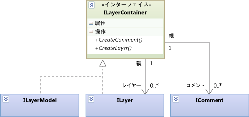
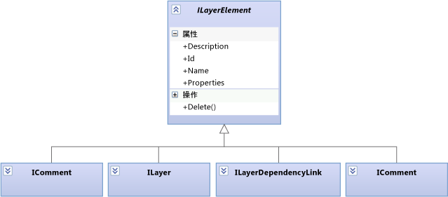

# <a name="navigate-and-update-layer-models-in-program-code"></a>プログラム コードでレイヤー モデル内を移動し、レイヤー モデルを更新する

この記事では、要素と移動し、プログラム コードを使用して更新できるレイヤー モデルの関係について説明します。 ユーザーの観点から依存関係図の詳細については、次を参照してください。[依存関係図。参照](../modeling/layer-diagrams-reference.md)と[依存関係図。ガイドライン](../modeling/layer-diagrams-guidelines.md)します。

<xref:Microsoft.VisualStudio.ArchitectureTools.Extensibility.Layer>このトピックで説明されているモデルがより一般的なファサード<xref:Microsoft.VisualStudio.GraphModel>モデル。 作成する場合、[メニュー コマンドまたはジェスチャ拡張](../modeling/add-commands-and-gestures-to-layer-diagrams.md)を使用して、`Layer`モデル。 作成する場合、[レイヤー検証拡張機能](../modeling/add-custom-architecture-validation-to-layer-diagrams.md)を使用する方が簡単、`GraphModel`します。

## <a name="transactions"></a>トランザクション

モデルを更新するときにでの変更を囲むことを検討してください、`ILinkedUndoTransaction`変更を 1 つのトランザクションにグループ化します。 変更が失敗した場合は、トランザクション全体がロールバックします。 場合は、ユーザーは、変更を元に戻します、すべての変更は取り消されます化。

```csharp
using (ILinkedUndoTransaction t =
        LinkedUndoContext.BeginTransaction("a name"))
{
    // Make changes here ....
    t.Commit(); // Don't forget this!
}
```

## <a name="containment"></a>含有



レイヤー (<xref:Microsoft.VisualStudio.ArchitectureTools.Extensibility.Layer.ILayer>) およびレイヤー モデル (<xref:Microsoft.VisualStudio.ArchitectureTools.Extensibility.Layer.ILayerModel>) には、コメントとレイヤーを含めることができます。

レイヤー (`ILayer`) は、レイヤー モデル (`ILayerModel`) に含めることも、別の `ILayer` に入れ子にすることもできます。

コメントまたはレイヤーを作成するには、適切なコンテナーで作成メソッドを使用します。

## <a name="dependency-links"></a>依存関係リンク

依存関係リンクはオブジェクトによって表されます。 どちらの方向にもナビゲートできます。


依存関係リンクを作成するには、`source.CreateDependencyLink(target)` を呼び出します。

## <a name="comments"></a>コメント

コメントは、レイヤーまたはレイヤー モデルの中に含めることができ、任意のレイヤー要素にリンクすることもできます。


コメントは任意の数の要素 (ゼロ個も可能) にリンクすることができます。

レイヤー要素にアタッチしたコメントを取得するには、次のコードを使用します。

```csharp
ILayerModel model = diagram.GetLayerModel();
IEnumerable<ILayerComment> comments =
   model.Comments.Where(comment =>
      comment.Links.Any(link => link.Target == layerElement));
```

> [!CAUTION]
> `Comments` の `ILayer` プロパティは、`ILayer` に含まれるコメントを取得します。 そこにリンクされているコメントは取得しません。

コメントを呼び出すことによって作成`CreateComment()`で適切なコンテナーです。

コメントで `CreateLink()` を使用してリンクを作成します。

## <a name="layer-elements"></a>レイヤー要素

モデルに含めることのできるタイプの要素はすべてレイヤー要素です。



## <a name="properties"></a>プロパティ

各 `ILayerElement` には `Properties` という名前の文字列の辞書があります。 この辞書を使うと、任意の情報をレイヤー要素にアタッチできます。

## <a name="artifact-references"></a>成果物参照

成果物参照 (<xref:Microsoft.VisualStudio.ArchitectureTools.Extensibility.Layer.ILayerArtifactReference>) は、ファイル、クラス、フォルダーなどのプロジェクト アイテムとレイヤーとの間のリンクを表します。 ユーザーは、レイヤーを作成または依存関係図に、ソリューション エクスプ ローラー、クラス ビュー、またはオブジェクト ブラウザーから項目をドラッグして追加したときに、成果物を作成します。 成果物参照はいくつでもレイヤーにリンクできます。

レイヤー エクスプローラーの各行には成果物参照が表示されます。 詳細については、次を参照してください。[コードから依存関係図を作成する](../modeling/create-layer-diagrams-from-your-code.md)します。

成果物参照に関係する主な型およびメソッドは次のとおりです。

<xref:Microsoft.VisualStudio.ArchitectureTools.Extensibility.Layer.ILayerArtifactReference>。 カテゴリ プロパティは、参照される成果物の種類 (クラス、実行ファイル、アセンブリなど) を示します。 カテゴリ プロパティは、識別子が対象の成果物を識別する方法を決定します。

<xref:Microsoft.VisualStudio.ArchitectureTools.Extensibility.Layer.ArtifactReferenceExtensions.CreateArtifactReferenceAsync%2A> は、<xref:EnvDTE.Project> または <xref:EnvDTE.ProjectItem> から成果物参照を作成します。 これは非同期操作です。 そのため、作成が完了したときに呼び出されるコールバック通常提供します。

レイヤー成果物参照は、ユース ケース図で成果物に異なります。

## <a name="shapes-and-diagrams"></a>図形と図

レイヤー モデルでは各要素を表すために 2 つのオブジェクトが使用されます。<xref:Microsoft.VisualStudio.ArchitectureTools.Extensibility.Layer.ILayerElement> および <xref:Microsoft.VisualStudio.ArchitectureTools.Extensibility.Presentation.IShape> です。 `IShape` は、図の位置と形のサイズを表します。 レイヤー モデルのすべて`ILayerElement`に 1 つ`IShape`、毎回`IShape`依存関係を図に示します。 1 つ`ILayerElement`します。 `IShape` は UML モデルにも使用されます。 そのため、すべての `IShape` にレイヤー要素があるわけではありません。

同様に、<xref:Microsoft.VisualStudio.ArchitectureTools.Extensibility.Layer.ILayerModel> は 1 つの <xref:Microsoft.VisualStudio.ArchitectureTools.Extensibility.Presentation.IDiagram> に表示されます。

カスタム コマンドまたはジェスチャ ハンドラーのコードでは、`DiagramContext` インポートから現在の図や現在の形の選択を取得できます。

```csharp
public class ... {
[Import]
    public IDiagramContext DiagramContext { get; set; }
...
public void ... (...)
{ IDiagram diagram = this.DiagramContext.CurrentDiagram;
  ILayerModel model = diagram.GetLayerModel();
  if (model != null)
  { foreach (ILayer layer in model.Layers) { ... }}
  foreach (IShape selected in diagram.SelectedShapes)
  { ILayerElement element = selected.GetLayerElement();
    if (element != null) ... }}
```


<xref:Microsoft.VisualStudio.ArchitectureTools.Extensibility.Presentation.IShape> および <xref:Microsoft.VisualStudio.ArchitectureTools.Extensibility.Presentation.IDiagram> も UML モデルを表示するのに使用されます。

## <a name="see-also"></a>関連項目

- [依存関係図にコマンドおよびジェスチャを追加する](../modeling/add-commands-and-gestures-to-layer-diagrams.md)
- [カスタム アーキテクチャ検証を依存関係図に追加する](../modeling/add-custom-architecture-validation-to-layer-diagrams.md)
- [依存関係図へのカスタム プロパティの追加](../modeling/add-custom-properties-to-layer-diagrams.md)
- [依存関係図:参照](../modeling/layer-diagrams-reference.md)
- [依存関係図:ガイドライン](../modeling/layer-diagrams-guidelines.md)
