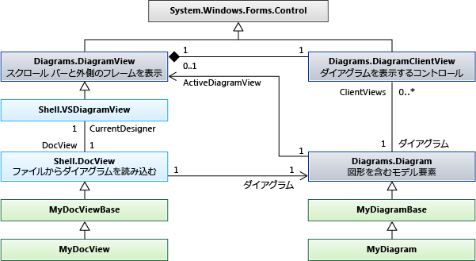

# <a name="navigate-and-update-a-model-in-program-code"></a>プログラム コードのモデル内を移動し、モデルを更新する

作成しモデル要素を削除、プロパティの設定、および作成、要素間のリンクを削除するコードを記述することができます。 すべての変更は、トランザクション内で行われたする必要があります。 要素は、ダイアグラムで表示され場合の図は「修正する」自動的にトランザクションの最後に。

##  <a name="example"></a> DSL 定義の例
 これは、このトピックの例については、DslDefinition.dsl の主要部分です。

 

 このモデルでは、この DSL のインスタンスを示します。

 

### <a name="references-and-namespaces"></a>参照と名前空間
 このトピックのコードを実行するを参照する必要があります。

 `Microsoft.VisualStudio.Modeling.Sdk.11.0.dll`

 コードには、この名前空間で使用します。

 `using Microsoft.VisualStudio.Modeling;`

 さらに、DSL が定義されている 1 つから別のプロジェクトでコードを記述する場合は、Dsl プロジェクトをビルドしたアセンブリをインポートする必要があります。

##  <a name="navigation"></a> モデルの移動

### <a name="properties"></a>プロパティ
 DSL 定義で定義したドメインのプロパティでは、プログラム コードでアクセス可能なプロパティになります。

 `Person henry = ...;`

 `if (henry.BirthDate < 1500) ...`

 `if (henry.Name.EndsWith("VIII")) ...`

 プロパティを設定する場合は、内部でこれを行う必要があります、[トランザクション](#transaction):

 `henry.Name = "Henry VIII";`

 場合は、DSL 定義で、プロパティの**種類**は**Calculated**を設定することはできません。 詳細については、次を参照してください。[計算とストレージのカスタム プロパティ](../modeling/calculated-and-custom-storage-properties.md)します。

### <a name="relationships"></a>リレーションシップ
 DSL 定義で定義したドメイン リレーションシップでは、プロパティ、リレーションシップの両端にあるクラスの 1 つのペアになります。 プロパティの名前は、リレーションシップの両側にあるロールのラベルとして DslDefinition ダイアグラムに表示されます。 によって、ロールの多重度は、プロパティの型は、リレーションシップのもう一方の端にあるクラスまたはそのクラスのコレクションのいずれか。

 `foreach (Person child in henry.Children) { ... }`

 `FamilyTreeModel ftree = henry.FamilyTreeModel;`

 リレーションシップのもう一方の end にあるプロパティは常に逆数。 リンクを作成または削除すると、両方の要素のロールのプロパティが更新されます。 次の式 (の拡張機能を使用する`System.Linq`) は常に、例では、ParentsHaveChildren リレーションシップの true:

 `(Person p) => p.Children.All(child => child.Parents.Contains(p))`

 `&& p.Parents.All(parent => parent.Children.Contains(p));`

 **ElementLinks**します。 リレーションシップと呼ばれるモデル要素によって表されることも、*リンク*、ドメイン リレーションシップの種類のインスタンスであります。 常に、リンクは、1 つのソース要素と 1 つのターゲット要素を持ちます。 ソース要素とターゲット要素を同じにすることができます。

 リンクとそのプロパティにアクセスできます。

 `ParentsHaveChildren link = ParentsHaveChildren.GetLink(henry, edward);`

 `// This is now true:`

 `link == null || link.Parent == henry && link.Child == edward`

 既定では、モデル要素のペアをリンクするリレーションシップの複数のインスタンスが許可されています。 DSL 定義の場合、`Allow Duplicates`フラグは、リレーションシップの場合は true、1 つ以上のリンクがある可能性があり、使用する必要があります`GetLinks`:

 `foreach (ParentsHaveChildren link in ParentsHaveChildren.GetLinks(henry, edward)) { ... }`

 リンクにアクセスするためには、その他の方法もあります。 例えば:

 `foreach (ParentsHaveChildren link in     ParentsHaveChildren.GetLinksToChildren(henry)) { ... }`

 **非表示の役割。** DSL 定義の場合**プロパティが生成**は**false**特定のロールに、プロパティは生成されませんそのロールに対応します。 ただし、引き続きリンクにアクセスおよびスキャン可能リレーションシップのメソッドを使用してリンクします。

 `foreach (Person p in ParentsHaveChildren.GetChildren(henry)) { ... }`

 最もよく使用される例は、<xref:Microsoft.VisualStudio.Modeling.Diagrams.PresentationViewsSubject>リレーションシップ、図に表示される図形からモデル要素へのリンク。

 `PresentationViewsSubject.GetPresentation(henry)[0] as PersonShape`

### <a name="the-element-directory"></a>要素のディレクトリ
 要素のディレクトリを使用して、ストア内のすべての要素にアクセスできます。

 `store.ElementDirectory.AllElements`

 メソッドは、次の要素の検索はもあります。

 `store.ElementDirectory.FindElements(Person.DomainClassId);`

 `store.ElementDirectory.GetElement(elementId);`

##  <a name="metadata"></a> クラス情報にアクセスします。
 クラス、リレーションシップ、および DSL 定義の他の側面についての情報を取得することができます。 例えば:

 `DomainClassInfo personClass = henry.GetDomainClass();`

 `DomainPropertyInfo birthProperty =`

 `personClass.FindDomainProperty("BirthDate")`

 `DomainRelationshipInfo relationship =`

 `link.GetDomainRelationship();`

 `DomainRoleInfo sourceRole = relationship.DomainRole[0];`

 モデル要素の先祖クラスは次のとおりです。

-   ModelElement - すべての要素および関係はモデル要素です。

-   ElementLink - すべてのリレーションシップは ElementLinks

##  <a name="transaction"></a> トランザクション内で変更を実行します。
 プログラム コードが、ストアでは何も変更されるたびに、行う必要があります、トランザクション内で。 これは、すべてのモデル要素、リレーションシップ、図形、図、およびそのプロパティに適用されます。 詳細については、「<xref:Microsoft.VisualStudio.Modeling.Transaction>」を参照してください。

 トランザクションの管理の最も便利な方法は、`using`ステートメントで囲む、`try...catch`ステートメント。

```
Store store; ...
try
{
  using (Transaction transaction =
    store.TransactionManager.BeginTransaction("update model"))
    // Outermost transaction must always have a name.
  {
    // Make several changes in Store:
    Person p = new Person(store);
    p.FamilyTreeModel = familyTree;
    p.Name = "Edward VI";
    // end of changes to Store

    transaction.Commit(); // Don't forget this!
  } // transaction disposed here
}
catch (Exception ex)
{
  // If an exception occurs, the Store will be
  // rolled back to its previous state.
}
```

 任意の数の 1 つのトランザクションの内部で変更を行うことができます。 アクティブなトランザクション内で新しいトランザクションを開くことができます。

 変更を永続的なようにするにする必要があります`Commit`破棄される前に、トランザクション。 トランザクション内でキャッチされない例外が発生した場合、ストアが、変更前に、の状態にリセットされます。

##  <a name="elements"></a> モデル要素を作成します。
 この例では、既存のモデル要素を追加します。

```
FamilyTreeModel familyTree = ...; // The root of the model.
using (Transaction t =
    familyTree.Store.TransactionManager
    .BeginTransaction("update model"))
{
  // Create a new model element
  // in the same partition as the model root:
  Person edward = new Person(familyTree.Partition);
  // Set its embedding relationship:
  edward.FamilyTreeModel = familyTree;
          // same as: familyTree.People.Add(edward);
  // Set its properties:
  edward.Name = "Edward VII";
  t.Commit(); // Don't forget this!
}
```

 この例では、これらの重要なポイント要素を作成する方法を示します。

-   ストアの特定のパーティションでは、新しい要素を作成します。 モデル要素と関係がない図形、これは通常、既定のパーティションです。

-   埋め込みリレーションシップのターゲットになります。 この例の DslDefinition、各ユーザーは埋め込みリレーションシップ FamilyTreeHasPeople のターゲットにする必要があります。 これを実現するには、Person オブジェクトの FamilyTreeModel ロール プロパティを設定しますか、FamilyTreeModel オブジェクトのユーザー ロールのプロパティにユーザーを追加します。

-   対象のプロパティでは特に、新しい要素のプロパティを設定`IsName`DslDefinition に当てはまります。 このフラグは、その所有者内で一意に要素を識別するプロパティをマークします。 この場合、名前プロパティには、そのフラグがあります。

-   この DSL の DSL 定義は、ストアに読み込まれている必要があります。 メニュー コマンドなどの拡張機能を記述する場合は、通常これは既に true です。 その他の場合は、明示的に、ストアに、モデルを読み込むまたはを使用することができます<xref:Microsoft.VisualStudio.Modeling.Integration.ModelBus>を読み込みます。 詳細については、次を参照してください。[方法: プログラム コード内のファイルからモデルを開く](../modeling/how-to-open-a-model-from-file-in-program-code.md)します。

 この方法で要素を作成するときに (DSL に図がある場合)、図形が自動的に作成します。 既定の図形、色、およびその他の機能と、自動的に割り当てられている場所に表示されます。 参照してください、関連付けられた図形が表示される場所と方法を制御する場合[要素とその図形を作成する](#merge)します。

##  <a name="links"></a> リレーションシップ リンクを作成します。
 DSL 定義の例で定義されている 2 つのリレーションシップがあります。 各リレーションシップを定義、*ロール プロパティ*リレーションシップの両端にあるクラス。

 リレーションシップのインスタンスを作成できる 3 つの方法はあります。 これら 3 つのメソッドのそれぞれは、同じ効果があります。

-   ソース ロール プレーヤーのプロパティを設定します。 例えば:

    -   `familyTree.People.Add(edward);`

    -   `edward.Parents.Add(henry);`

-   ターゲット ロール プレーヤーのプロパティを設定します。 例えば:

    -   `edward.familyTreeModel = familyTree;`

         このロールの多重度が`1..1`ので、値を割り当てます。

    -   `henry.Children.Add(edward);`

         このロールの多重度が`0..*`ので、コレクションに追加します。

-   リレーションシップのインスタンスを明示的に作成します。 例えば:

    -   `FamilyTreeHasPeople edwardLink = new FamilyTreeHasPeople(familyTreeModel, edward);`

    -   `ParentsHaveChildren edwardHenryLink = new ParentsHaveChildren(henry, edward);`

 最後のメソッドは、リレーションシップ自体のプロパティを設定する場合に便利です。

 この方法で要素を作成するときに、図上のコネクタが自動的に作成するが既定の図形、色、およびその他の機能があります。 関連するコネクタを作成する方法を制御するを参照してください。[要素とその図形を作成する](#merge)します。

##  <a name="deleteelements"></a> 要素の削除
 呼び出すことによって要素を削除する`Delete()`:

 `henry.Delete();`

 この操作も削除されます。

-   要素との間のリレーションシップ リンク。 たとえば、`edward.Parents`は含まれなく`henry`します。

-   対象のロールにある要素、`PropagatesDelete`フラグが true です。 たとえば、要素を表示する図形も削除されます。

 既定では、すべての埋め込みリレーションシップを持つ`PropagatesDelete`で true でターゲット ロール。 削除する`henry`は削除されません、`familyTree`が`familyTree.Delete()`すべてを削除、`Persons`します。 詳細については、次を参照してください。[削除の動作のカスタマイズ](../modeling/customizing-deletion-behavior.md)します。

 既定では、`PropagatesDelete`参照リレーションシップのロールには当てはまりません。

 オブジェクトを削除するときに、特定の伝達を省略する削除ルールが発生することができます。 これは、別の 1 つの要素を置換する場合に便利です。 1 つ以上のロールを削除する必要があります反映されませんの GUID を指定します。 GUID は、リレーションシップ クラスから取得できます。

 `henry.Delete(ParentsHaveChildren.SourceDomainRoleId);`

 (この例の場合は効果がありません、ため`PropagatesDelete`は`false`の役割、`ParentsHaveChildren`リレーションシップです)。

 場合によっては、ロック、要素または伝達によって削除される要素のいずれかの存在によって削除ができません。 使用することができます`element.CanDelete()`要素を削除できるかどうかを確認します。

##  <a name="deletelinks"></a> リレーションシップ リンクを削除します。
 リレーションシップ リンクを削除するには、ロールのプロパティから要素を削除します。

 `henry.Children.Remove(edward); // or:`

 `edward.Parents.Remove(henry);  // or:`

 リンクを明示的に削除できます。

 `edwardHenryLink.Delete();`

 これら 3 つのメソッドには、同じ効果があります。 のみ、それらのいずれかを使用する必要があります。

 ロールに 0..1 または 1..1 の多重度がある場合に設定できます`null`、または別の値。

 `edward.FamilyTreeModel = null;` または。

 `edward.FamilyTreeModel = anotherFamilyTree;`

##  <a name="reorder"></a> リレーションシップのリンクの順序
 ソースまたは特定のモデル要素を対象とする特定のリレーションシップのリンクでは、特定のシーケンスがあります。 追加された順序で表示されます。 たとえば、このステートメントは常に同じ順序で子を生成します。

 `foreach (Person child in henry.Children) ...`

 リンクの順序を変更できます。

 `ParentsHaveChildren link = GetLink(henry,edward);`

 `ParentsHaveChildren nextLink = GetLink(henry, elizabeth);`

 `DomainRoleInfo role =`

 `link.GetDomainRelationship().DomainRoles[0];`

 `link.MoveBefore(role, nextLink);`

##  <a name="locks"></a> ロック
 ロックによって、変更ができない可能性があります。 個々 の要素、パーティション、およびストアのロックを設定できます。 変更の種類を防止するロックをこれらのレベルのいずれかにある場合、例外がスローされるときに実行しようとします。 要素を使用してロックを設定するかどうかを検出できます。名前空間で定義されている拡張メソッドである、GetLocks()<xref:Microsoft.VisualStudio.Modeling.Immutability>します。

 詳細については、次を参照してください。[読み取り専用セグメントを作成するロックのポリシーを定義する](../modeling/defining-a-locking-policy-to-create-read-only-segments.md)します。

##  <a name="copy"></a> コピーと貼り付け
 要素または要素のグループにコピーすることができます、 <xref:System.Windows.Forms.IDataObject>:

```
Person person = personShape.ModelElement as Person;
Person adopter = adopterShape.ModelElement as Person;
IDataObject data = new DataObject();
personShape.Diagram.ElementOperations
      .Copy(data, person.Children.ToList<ModelElement>());
```

 要素は、シリアル化された要素のグループとして保存されます。

 モデルに、IDataObject から要素をマージすることができます。

```
using (Transaction t = targetDiagram.Store.
        TransactionManager.BeginTransaction("paste"))
{
  adopterShape.Diagram.ElementOperations.Merge(adopter, data);
}
```

 `Merge ()` いずれかを受け入れることができます、`PresentationElement`または`ModelElement`します。 指定した場合、 `PresentationElement`、3 番目のパラメーターとしてターゲット図上の位置を指定することもできます。

##  <a name="diagrams"></a> 移動およびダイアグラムの更新
 DSL、人や音楽などの概念を表すドメイン モデル要素は別のダイアグラムに表示されるものを表す図形要素から。 ドメイン モデル要素には、重要なプロパティと概念の間のリレーションシップが格納されます。 図形要素には、サイズ、位置とダイアグラムで、オブジェクトの表示の色とその構成部分のレイアウトが格納されます。

### <a name="presentation-elements"></a>Presentation 要素
 

 DSL 定義では、指定した各要素は、標準的なクラスを次のいずれかから派生したクラスを作成します。

|要素の種類|基底クラス|
|---------------------|----------------|
|ドメイン クラス|<xref:Microsoft.VisualStudio.Modeling.ModelElement>|
|ドメイン リレーションシップ|<xref:Microsoft.VisualStudio.Modeling.ElementLink>|
|形式|<xref:Microsoft.VisualStudio.Modeling.Diagrams.NodeShape>|
|コネクタ|<xref:Microsoft.VisualStudio.Modeling.Diagrams.BinaryLinkShape>|
|図|<xref:Microsoft.VisualStudio.Modeling.Diagrams.Diagram>|

 図の要素は、通常、モデル要素を表します。 通常 (必ずではありませんが)、 <xref:Microsoft.VisualStudio.Modeling.Diagrams.NodeShape> 、ドメイン クラスのインスタンスを表す、<xref:Microsoft.VisualStudio.Modeling.Diagrams.BinaryLinkShape>ドメイン リレーションシップのインスタンスを表します。 <xref:Microsoft.VisualStudio.Modeling.Diagrams.PresentationViewsSubject>リレーションシップ ノードまたはリンクの図形をそのモデル要素にリンクします。

 すべてのノードまたはリンクの図形は、1 つの図に属しています。 バイナリ リンクのシェイプは、2 つのノード図形を接続します。

 図形は、2 つのセットで子図形を持つことができます。 内の図形、`NestedChildShapes`セットは、親の境界ボックスに限られています。 内の図形、`RelativeChildShapes`一覧が親のラベルやポートなどの境界の外側外側または一部を表示できます。 ダイアグラムを持たない`RelativeChildShapes`および no`Parent`します。

###  <a name="views"></a> 図形と要素間を移動します。
 ドメイン モデル要素と図形要素に関連して、<xref:Microsoft.VisualStudio.Modeling.Diagrams.PresentationViewsSubject>リレーションシップ。

```csharp
// using Microsoft.VisualStudio.Modeling;
// using Microsoft.VisualStudio.Modeling.Diagrams;
// using System.Linq;
Person henry = ...;
PersonShape henryShape =
  PresentationViewsSubject.GetPresentation(henry)
    .FirstOrDefault() as PersonShape;
```

 同じリレーションシップは、図上のコネクタへのリレーションシップをリンクします。

```
Descendants link = Descendants.GetLink(henry, edward);
DescendantConnector dc =
   PresentationViewsSubject.GetPresentation(link)
     .FirstOrDefault() as DescendantConnector;
// dc.FromShape == henryShape && dc.ToShape == edwardShape
```

 この関係を図に、モデルのルートのリンクも。

```
FamilyTreeDiagram diagram =
   PresentationViewsSubject.GetPresentation(familyTree)
      .FirstOrDefault() as FamilyTreeDiagram;
```

 図形により表されるモデル要素を取得するには、次のコマンドを使用します。

 `henryShape.ModelElement as Person`

 `diagram.ModelElement as FamilyTreeModel`

### <a name="navigating-around-the-diagram"></a>ダイアグラム上で移動します。
 一般に図形とコネクタ、図の間を移動することをお勧めはできません。 シェイプとコネクタ間の移動のダイアグラムの外観について作業する必要がある場合にのみ、モデルでリレーションシップをナビゲートすることをお勧めします。 これらのメソッドは、コネクタを両方の end での図形にリンクします。

 `personShape.FromRoleLinkShapes, personShape.ToRoleLinkShapes`

 `connector.FromShape, connector.ToShape`

 多くの図形は、合成します。親シェイプと子の 1 つまたは複数のレイヤーの構成されます。 別の形を基準に配置された図形があると言われますが、*子*します。 親シェイプが移動したときに子がそれに移動します。

 *相対的な子*親シェイプの境界ボックス外に置くことができます。 *入れ子になった*子は厳密に親の境界内に表示されます。

 図で図形の上位セットを取得するには、次のように使用します。

 `Diagram.NestedChildShapes`

 シェイプおよびコネクタの先祖クラスは次のとおりです。

 <xref:Microsoft.VisualStudio.Modeling.ModelElement>

 -- <xref:Microsoft.VisualStudio.Modeling.Diagrams.PresentationElement>

 -- <xref:Microsoft.VisualStudio.Modeling.Diagrams.ShapeElement>

 ----- <xref:Microsoft.VisualStudio.Modeling.Diagrams.NodeShape>

 ------- <xref:Microsoft.VisualStudio.Modeling.Diagrams.Diagram>

 ------- *YourShape*

 ----- <xref:Microsoft.VisualStudio.Modeling.Diagrams.LinkShape>

 ------- <xref:Microsoft.VisualStudio.Modeling.Diagrams.BinaryLinkShape>

 --------- *YourConnector*

###  <a name="shapeProperties"></a> シェイプおよびコネクタのプロパティ
 ほとんどの場合は、図形に明示的な変更を加える必要はありません。 モデル要素を変更したときに、「修正」ルールは、図形とコネクタを更新します。 詳細については、次を参照してください。[への対応および変更の反映](../modeling/responding-to-and-propagating-changes.md)します。

 ただし、図形には、モデル要素に依存しないプロパティを明示的ないくつか変更するのには便利です。 たとえば、これらのプロパティを変更する可能性があります。

-   <xref:Microsoft.VisualStudio.Modeling.Diagrams.NodeShape.Size%2A> -、図形の幅と高さを決定します。

-   <xref:Microsoft.VisualStudio.Modeling.Diagrams.NodeShape.Location%2A> -親図形または図に対する相対位置

-   <xref:Microsoft.VisualStudio.Modeling.Diagrams.ShapeElement.StyleSet%2A> -ペンとシェイプまたはコネクタを描画するために使用されるブラシのセット

-   <xref:Microsoft.VisualStudio.Modeling.Diagrams.ShapeElement.Hide%2A> -図形を非表示にします。

-   <xref:Microsoft.VisualStudio.Modeling.Diagrams.ShapeElement.Show%2A> -図形は、後に表示します。 `Hide()`

###  <a name="merge"></a> 要素とその図形を作成します。

作成する要素の埋め込みリレーションシップ ツリーにリンクすると、図形が自動的に作成され、関連付けられています。 これは、トランザクションの最後に実行するルールを「修正」を実行します。 ただし、図形は、自動的に割り当てられている場所に表示され、形状、色、およびその他の機能は既定値を設定します。 図形を作成する方法を制御するには、マージ関数を使用できます。 まず ElementGroup に追加する要素を追加して、ダイアグラムにグループをマージする必要があります。

このメソッドには:

-   要素名としてのプロパティが割り当てられている場合は、名前を設定します。

-   DSL 定義で指定した要素マージ ディレクティブを監視します。

この例では、ユーザーをダブルクリックすると、図に、マウスの位置にある図形を作成します。 このサンプルでは、DSL 定義で、`FillColor`プロパティの`ExampleShape`が公開されています。

```
using Microsoft.VisualStudio.Modeling;
using Microsoft.VisualStudio.Modeling.Diagrams;
partial class MyDiagram
{
  public override void OnDoubleClick(DiagramPointEventArgs e)
  {
    base.OnDoubleClick(e);

    using (Transaction t = this.Store.TransactionManager
        .BeginTransaction("double click"))
    {
      ExampleElement element = new ExampleElement(this.Store);
      ElementGroup group = new ElementGroup(element);

      { // To use a shape of a default size and color, omit this block.
        ExampleShape shape = new ExampleShape(this.Partition);
        shape.ModelElement = element;
        shape.AbsoluteBounds = new RectangleD(0, 0, 1.5, 1.0);
        shape.FillColor = System.Drawing.Color.Azure;
        group.Add(shape);
      }

      this.ElementOperations.MergeElementGroupPrototype(
        this,
        group.CreatePrototype(),
        PointD.ToPointF(e.MousePosition));
      t.Commit();
    }
  }
}

```

 複数の図形を指定した場合を使用してそれらの相対的位置を設定、`AbsoluteBounds`します。

 色と、このメソッドを使用したコネクタの公開されている他のプロパティを設定することもできます。

### <a name="use-transactions"></a>トランザクションを使用します。
 図形、コネクタと図のサブタイプは<xref:Microsoft.VisualStudio.Modeling.ModelElement>とストアでライブします。 トランザクション内でのみに変更を行う必要がありますので。 詳細については、次を参照してください。[方法: モデルを更新するトランザクションを使用して](../modeling/how-to-use-transactions-to-update-the-model.md)します。

##  <a name="docdata"></a> ドキュメント ビューとドキュメント データ
 

## <a name="store-partitions"></a>パーティションを格納します。
 モデルが読み込まれるときに付随する図が同時に読み込まれます。 通常、Store.DefaultPartition に、モデルが読み込まれ、ダイアグラムの内容が別のパーティションに読み込まれます。 通常、各パーティションのコンテンツが読み込まれ、別のファイルに保存されます。

## <a name="see-also"></a>関連項目

- <xref:Microsoft.VisualStudio.Modeling.ModelElement>
- [ドメイン固有言語における検証](../modeling/validation-in-a-domain-specific-language.md)
- [ドメイン固有言語からのコード生成](../modeling/generating-code-from-a-domain-specific-language.md)
- [方法: トランザクションを使用してモデルを更新する](../modeling/how-to-use-transactions-to-update-the-model.md)
- [Visual Studio Modelbus によるモデルの統合](../modeling/integrating-models-by-using-visual-studio-modelbus.md)
- [変更内容への対応および変更内容の反映](../modeling/responding-to-and-propagating-changes.md)
