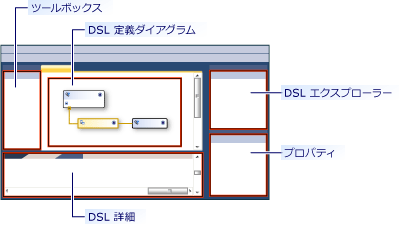
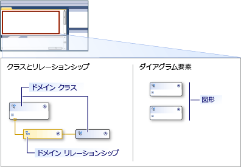

# ドメイン固有言語ツールのユーザー インターフェイスの概要
ドメイン固有言語ツール (DSL ツール) ソリューションに最初に開く[!INCLUDE[vsprvs](../code-quality/includes/vsprvs_md.md)]、ユーザー インターフェイスは、次の図のようにします。  
  
   
  
 次の表では、UI の各部分の使用方法について説明します。  
  
|**要素**|**定義**|  
|-----------------|--------------------|  
|図|ダイアグラムには、ドメイン モデルが表示されます。   ダイアグラムでは、2 つの辺がします。 一方の側では、モデル内の要素の型を定義します。 相手側では、画面で、モデルがどのように表示されるかを定義します。|  
|ツールボックス|ドメイン クラスを追加し、ダイアグラムの種類の図形をツールボックスからツールをドラッグします。 リレーションシップ、コネクタと図形マップを追加するには、ツールをクリックし、ダイアグラムで、ソース ノードとし、ターゲット ノード をクリックします。|  
|DSL エクスプローラー|**DSL のエクスプ ローラー** DSL 定義がアクティブなウィンドウが表示されます。 DSL がツリーとして表示されます。 DSL のエクスプ ローラーでは、モデルのダイアグラムで表示されていない機能を編集できます。 たとえば、ツールボックス アイテムを追加し、スイッチを使用して、検証プロセス、 **DSL のエクスプ ローラー**です。|  
|DSL 詳細 ウィンドウ|**DSL 詳細**ウィンドウに、ドメインのプロパティを要素の表示方法と、要素がコピーされ、削除する方法を制御できるようにモデルの要素が表示されます。   -既定では、 **DSL 詳細**ウィンドウが横に表示されます、**エラー一覧**と**出力**windows です。|  
  
## ドメイン モデル ダイアグラム  
 ドメイン モデルの図は、2 つの部分に分かれています。 ダイアグラムの一方の側は、モデル内の要素および関係を示します。 反対側は、モデルが表示される方法を示しています。 要素とモデル図のプロパティを表示するために使用する図形が含まれています。 次の図は、図の要素を示しています。  
  
   
  
 次の表では、いくつかのドメイン モデル図の要素について説明します。  
  
|**用語**|**定義**|  
|--------------|--------------------|  
|ドメイン クラス|ドメイン クラスは、モデル内の要素の種類です。   ドメイン クラスはことができます、リレーションシップのターゲットの 1 つ以上である場合、図では、2 回以上表示されます。   ドメイン クラスを追加するツールをドラッグして、ドメイン クラスから、**ツールボックス**を**クラスとリレーションシップ**ダイアグラムの側です。|  
|ドメインの関係|ドメインの関係は、モデル内の要素間のリンクの種類です。   *埋め込みリレーションシップ*実線として表示され、対象となる要素が所有しているか、ソース要素に含まれることを示します。 モデル内のすべての要素は、モデル ツリーを形成するように、1 つの埋め込みリレーションシップのターゲットにすることがあります。 A*参照リレーションシップ*破線として表示され、モデル要素の間での一般的なリンクを示します。 いずれかの要素には、任意の数の参照先のリンクを持つことができます。   ツール をクリックしてリレーションシップを作成、**ツールボックス**元のドメイン クラスをクリックし、ターゲット クラスです。|  
|シェイプとコネクタ|図形は、モデル要素を DSL ダイアグラムで表示する方法を指定して、コネクタは、リレーションシップの表示に使用できる DSL ダイアグラムに行を指定します。   図形やコネクタを作成するツールをドラッグして、**ダイアグラム要素**ダイアグラムの側です。|  
|シェイプ マップ|マップのシェイプは、表示されるドメイン クラスに図形をリンク ドメイン モデル ダイアグラム、またはコネクタ、表示されるドメインの関係を行として表示されます。|  
  
## 関連項目  
 [ドメイン固有言語ツールの概要](../modeling/overview-of-domain-specific-language-tools.md)   
 [ドメイン固有言語ツールの用語集](http://msdn.microsoft.com/ca5e84cb-a315-465c-be24-76aa3df276aa)   
 [ドメイン固有言語のカスタマイズおよび拡張](../modeling/customizing-and-extending-a-domain-specific-language.md)