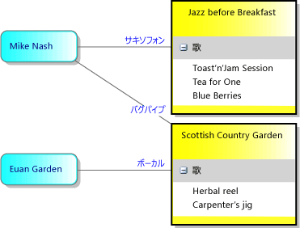
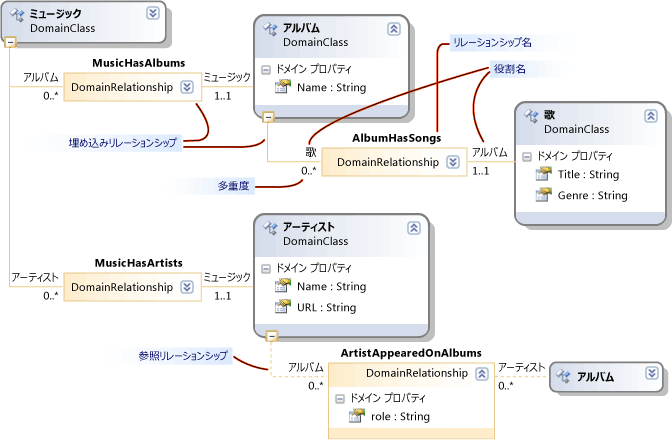

# モデル、クラス、およびリレーションシップについて
ドメイン固有言語 (DSL) は、作成した場合、カスタム プログラム コードと共に、DSL 定義ファイルによって定義されます。 DSL ソリューションのプログラム コードのほとんどは、このファイルから生成されます。

 このトピックでは、DSL 定義の中心的な機能について説明します。

## DSL 定義
 開く`Dsl\DslDefinition.dsl`、Visual Studio のウィンドウが次の図に似ています。

 

 DSL 定義で最も重要な情報は、DSL 定義図に表示されます。 詳細については、これは DslDefinition.dsl の一部は、通常、図の側に表示される DSL エクスプ ローラーに表示されます。 最も一般的なタスクでは、図とより高度なカスタマイズの DSL のエクスプ ローラーを操作します。

 DSL 定義図では、モデル要素、およびモデル要素間のリンクを定義するリレーションシップを定義するドメイン クラスを示します。 シェイプとモデル要素をユーザーに表示に使用されるコネクタも示します。

 

 図または DSL エクスプ ローラーで、DSL 定義で項目を選択すると、[プロパティ] ウィンドウでに関する情報が表示されます。 追加の情報は、DSL の詳細ウィンドウに表示可能性があります。

### モデルは、Dsl のインスタンス
 A*モデル*ユーザーによって作成された DSL のインスタンスです。 モデルには、定義したドメイン クラスと、要素は、定義したドメイン リレーションシップのインスタンス間のリンクのインスタンスのモデル要素が含まれています。 モデルは、図形とコネクタ、図にモデル要素およびリンクを表示することもできます。 DSL 定義には、シェイプ クラス、コネクタ クラス、およびダイアグラムのクラスが含まれています。

 DSL 定義とも呼ばれますが、*ドメイン モデル*します。 DSL 定義またはドメイン モデルでは、モデルは、ドメイン固有言語の実行時インスタンス化は、ドメイン固有言語の設計時の表現です。

## ドメイン クラスは、モデル要素を定義します。
 ドメイン クラスは、ドメイン内のさまざまな要素を作成するために使用して、ドメイン リレーションシップは、要素間のリンクを示します。 これらは、要素とそのモデルを作成するときに、設計に固有の言語のユーザーによってインスタンス化にするリンクのデザイン時の表現。

 この図は、音楽ライブラリ DSL のユーザーによって作成されたモデルを示しています。 音楽の album は、曲の一覧が表示されるボックスで表されます。 アーティストでは、ボックスの角の丸いで表されに関与するアルバムに接続しています。

 

 DSL 定義では、2 つの側面を分離します。 モデル図のモデル要素の外観を定義するには、クラスの図形とコネクタのクラスを使用します。 モデルに含まれる情報は、ドメイン クラスとドメインの関係を使用して定義されます。

 次の図は、音楽ライブラリの DSL 定義で、ドメイン クラスとリレーションシップを示しています。

 

 図は、4 つのドメイン クラスを示しています。音楽、アルバム、アーティスト、曲。 ドメイン クラスは、名前やタイトルなどのドメイン プロパティを定義します。 インスタンス モデルでは、これらのプロパティの一部の値は、ダイアグラムに表示されます。

 クラス間ドメイン リレーションシップには。MusicHasAlbums、MusicHasArtists、AlbumbHasSongs、および artistappearedonalbums です。 リレーションシップがある 1..1 などの多重度 0.. *。 など、すべての曲を AlbumHasSongs リレーションシップにより 1 つだけのアルバムに関連する必要があります。 すべてのアルバムの曲の任意の数を持つことができます。

### DSL 定義図の並べ替え
 この図で同様のアルバムは DSL 定義図に、ドメイン クラスが複数回を表示できることに注意してください。 常に 1 つの主なビューがあるし、いくつかあります*参照*ビュー。

 DSL 定義図を並べ替えるには、次のことができます。

-   メインのスワップし、ビューを使用して、参照、 **ツリーをここ**と**ツリーの分割**コマンド。 これらのコマンドを表示する 1 つのドメイン クラスを右クリックします。

-   再び ctrl キーを押しながら上と ctrl キーを押しながら下方向キーを押してでドメイン クラスとシェイプ クラスを並べ替えます。

-   折りたたむか、各図形の右上にあるアイコンを使用してクラスを拡張します。

-   ドメイン クラスの下部にあるマイナス記号 (-) をクリックして、ツリーの部分を折りたたみます。

## 継承
 ドメイン クラスは、継承を使用して定義することができます。 継承の派生を作成するには、継承ツールをクリックして、派生クラスをクリックしておよび基本クラスを順にクリックします。 モデル要素には、基本クラスから継承されたすべてのプロパティと共に、独自のドメイン クラスで定義されているすべてのプロパティがあります。 また、リレーションシップでは、そのロールを継承します。

 継承は、リレーションシップ、図形、およびコネクタの間も使用できます。 継承は、同じグループ内で保持する必要があります。 図形は、ドメイン クラスから継承できません。

## ドメイン リレーションシップ
 モデル要素は、リレーションシップによってリンクできます。 リンクは、常にバイナリ。これらは、2 つの要素をリンクします。 ただし、任意の要素は、他のオブジェクトへのリンクを持つことができます、要素の同一ペア間の 1 つ以上のリンクにもあります。

 要素のさまざまなクラスを定義できますが、同様のリンクの種類のクラスを定義できます。 リンクのクラスと呼ばれる、*ドメイン リレーションシップ*します。 ドメイン リレーションシップでは、そのインスタンスに接続できる要素のクラスを指定します。 リレーションシップの各 end が呼び出される、*ロール*、ドメイン リレーションシップとリレーションシップ自体の 2 つのロールの名前を定義します。

 ドメイン リレーションシップの 2 種類があります: 埋め込みリレーションシップと参照リレーションシップ。 DSL 定義図では、埋め込みリレーションシップは、ロールごとに実線があり、参照リレーションシップが点線します。

### 埋め込みリレーションシップ
 モデルでは、そのルートを除くすべての要素は、1 つの埋め込みリンクの対象です。 そのため、モデル全体は、埋め込みリンクの 1 つのツリーを形成します。 埋め込みリレーションシップでは、包含または所有権を表します。 この方法で関連する 2 つのモデル要素は、親と子とも呼ばれます。 子が親に埋め込まれると言います。

 埋め込みリンクは、通常は表示されません明示的に図のコネクタとして。 代わりに、包含構造によって表される通常します。 モデルのルートは、ダイアグラムによって表され、そこに埋め込まれた要素は、ダイアグラムの図形として表示されます。

 例では、ルート クラス Music は、アルバム、曲を埋め込み、AlbumHasSongs のある MusicHasAlbums に埋め込みリレーションシップが。 曲は、各アルバム内の一覧で項目として表示されます。 音楽は、アーティスト クラスにあり、そのインスタンスがダイアグラムにシェイプとして表示も埋め込みの MusicHasArtists もあります。

 既定では、埋め込まれた要素は親が削除されたときに自動的に削除されます。

 モデルの保存時を XML 形式でファイルには、埋め込まれた要素は、入れ子、親、シリアル化をカスタマイズしている場合を除き、します。

> [!NOTE]
>  埋め込みは継承とは異なります。 埋め込みリレーションシップの子は、親のプロパティを継承しません。 埋め込みは、モデル要素間のリンクの種類です。 継承、クラス間の関係は、モデル要素間のリンクは作成されません。

### ルールの埋め込み
 インスタンス モデル内のすべての要素は、モデルのルートを除く、1 つだけ埋め込みリンクのターゲットにする必要があります。

 そのため、ルート クラスを除く、すべての非抽象ドメイン クラスが少なくとも 1 つの埋め込みリレーションシップのターゲットにする必要があります。 または基本クラスからの埋め込みを継承する必要があります。 クラスは、2 つ以上の埋め込みのターゲットにすることができますが、そのインスタンスのモデル要素は、一度に 1 つの親をしか。 ターゲットからソースへの多重度が 0..1 または 1..1 あります。

### エクスプ ローラーには、埋め込みのツリーが表示されます。
 DSL 定義では、ユーザーがそのモデル図と共に「エクスプ ローラーも作成します。

 

 エクスプ ローラーでは、モデルでは、すべての図形を定義していないものもすべての要素を示します。 要素と埋め込みの関係を示していますが、リレーションシップを参照していません。

 要素のドメインのプロパティの値を表示するには、は、ユーザーは、モデル図またはモデル エクスプ ローラーで、要素を選択し、[プロパティ] ウィンドウを開きます。 ダイアグラムで表示されていないものも含めのすべてのドメイン プロパティが表示されます。 例では、各曲がタイトルと、ジャンルがタイトルの値だけでは、ダイアグラムに表示されます。

## 参照リレーションシップ
 参照リレーションシップはしない埋め込みリレーションシップの任意の種類を表します。

 参照リレーションシップは、図形間のコネクタとして通常ダイアグラムに表示されます。

 使用して 2 つの要素間の参照リンクを表す、モデルの XML 表現で*モニカー。* つまり、モニカーは、モデル内の各要素を一意に識別する名前です。 各モデル要素の XML ノードには、リレーションシップの名前とその他の要素のモニカーを指定するノードが含まれています。

## 役割
 すべてのドメイン リレーションシップには、2 つのロール、ソース ロールとターゲット ロールがあります。

 次の図は、行の間に、**パブリッシャー**ドメイン クラスと**PublisherCatalog**ドメイン リレーションシップがソース ロール。 ドメイン リレーションシップの間の線と**アルバム**ドメイン クラスがターゲット ロール。

 

 リレーションシップに関連付けられている名前では、モデルを通過するプログラム コードを記述するときに特に重要です。 たとえば、DSL ソリューションをビルドすると、生成されたクラスでは、パブリッシャーには、アルバムのコレクションは、カタログ プロパティがあります。 アルバムのクラスには、パブリッシャー クラスの 1 つのインスタンスは、パブリッシャーのプロパティがあります。

 DSL 定義でリレーションシップを作成するときに、プロパティとリレーションシップの名前には既定値が指定されます。 ただし、それらを変更することができます。

## 多重度
 多重度は、要素の数は、ドメイン リレーションシップで、同じロールを持つことができますを指定します。 例では、0 対多の (0..\*) の多重度の設定、**カタログ**ロールを指定するの任意のインスタンス、**パブリッシャー**ドメイン クラスが多く持つことができます**PublisherCatalog**リレーションシップ リンクを指定するとします。

 ダイアグラムに入力するか、変更することで、ロールの多重度を構成、`Multiplicity`プロパティ、**プロパティ**ウィンドウ。 次の表では、このプロパティの設定について説明します。

|型の多重度|説明|
|-|-|
|0.. * (ゼロ対多)|ドメイン クラスの各インスタンスは、リレーションシップの複数のインスタンスまたはリレーションシップのインスタンスがないことができます。|
|0..1 (0 から 1)|ドメイン クラスの各インスタンスは、リレーションシップの複数のインスタンスまたはリレーションシップのインスタンスがないことができます。|
|1..1 (1 つ)|ドメイン クラスの各インスタンスは、リレーションシップの 1 つのインスタンスを持つことができます。 Role クラスの任意のインスタンスからこのリレーションシップの 1 つ以上のインスタンスを作成することはできません。 検証が有効になっている場合、ロール クラスの任意のインスタンスには、リレーションシップのインスタンスがあるないときに検証エラーが表示されます。|
|1. * (1 対多)|この多重度を持つロールのクラスの各インスタンスは、リレーションシップの複数のインスタンスがあることができ、各インスタンスは、リレーションシップの少なくとも 1 つのインスタンスが必要です。 検証が有効になっている場合、ロール クラスの任意のインスタンスには、リレーションシップのインスタンスがあるないときに検証エラーが表示されます。|

## ドメイン リレーションシップ クラス
 リンクは、LinkElement は ModelElement の派生クラスのインスタンスとしてストアで表されます。 ドメイン リレーションシップにドメイン モデルの図では、これらのプロパティを定義できます。

 ソースまたはその他のリレーションシップのターゲット リレーションシップを作成することもできます。 ドメイン モデル図のドメイン リレーションシップを右クリックし、**クラスとして表示**します。 追加のクラス ボックスが表示されます。 リレーションシップに接続できます。

 ドメイン クラスと同様、継承によって部分的リレーションシップを定義することができます。 派生リレーションシップを選択し、設定**基本リレーションシップ**プロパティ ウィンドウでします。

 派生リレーションシップには、その基本リレーションシップ専門としています。 ドメインのクラスからのリンクを得ることも、同じ基本リレーションシップによってリンクされたクラスにします。 モデルの派生リレーションシップのリンクが作成されると、派生クラスと基本リレーションシップの両方のインスタンスです。 プログラム コードでは、ベース、または、派生クラスによって生成されたプロパティを使用して、リンクの反対側に移動できます。

## 関連項目

- [ドメイン固有言語ツールの用語集](https://msdn.microsoft.com/ca5e84cb-a315-465c-be24-76aa3df276aa)
