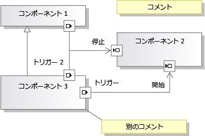

# <a name="understanding-the-dsl-code"></a>DSL コードについて
ドメイン固有言語 (DSL) ソリューションは、[!INCLUDE[vsprvs](../code-quality/includes/vsprvs_md.md)] 内で DSL のインスタンスの読み取りと更新に使用可能な API を生成します。 この API は、DSL 定義から生成されるコード中に定義されます。 このトピックでは生成される API を説明します。  
  
## <a name="the-example-solution-component-diagrams"></a>ソリューション例: コンポーネント図  
 このトピックの例の多くのソースであるソリューションを作成するから DSL を作成、**コンポーネント モデル**ソリューション テンプレート。 これは、新しい DSL ソリューションを作成するときに表示される標準のテンプレートの 1 つです。  
  
> [!NOTE]
>  コンポーネント図 DSL テンプレートは、Visual Studio で、[アーキテクチャ] メニューを使用して作成できる UML コンポーネント図には無関係です。 **新しいプロジェクト** ダイアログ ボックスで、展開**その他のプロジェクト Types\Extensibility**  をクリックし、**ドメイン固有言語デザイナー**です。  
  
 このソリューション テンプレートに習熟していない場合は、F5 キーを押して実験します。 コンポーネントにポート ツールをドラッグすることによりポートが作成されることと、ポートを接続できることに特に注意してください。  
  
   
  
## <a name="the-structure-of-the-dsl-solution"></a>DSL ソリューションの構造  
 **Dsl**プロジェクトは、DSL の API を定義します。 **DslPackage**プロジェクトでは、その統合方法を定義[!INCLUDE[vsprvs](../code-quality/includes/vsprvs_md.md)]です。 独自のプロジェクトを追加することも可能で、それらもモデルから生成されるコードを含みます。  
  
### <a name="the-code-directories"></a>コード ディレクトリ  
 内の各プロジェクトのコードのほとんどはから生成された**Dsl\DslDefinition.dsl**です。 生成されたコードは、**生成されたコード**フォルダーです。 生成されたファイルを表示するクリックして**[+]**生成の横にある**.tt**ファイル。  
  
 DSL を理解するために生成されたコードを調べてみることをお勧めします。 生成されたファイルを表示するには、ソリューション エクスプローラーで *.tt ファイルを展開します。  
  
 \*.Tt ファイルを含むほとんどのコードを生成します。 その代わりに、それらは `<#include>` ディレクティブを使用して共有テンプレート ファイルを含みます。 共有のファイルは含まれて**\Program Files\Microsoft Visual Studio 10.0\Common7\IDE\Extensions\Microsoft\DSL SDK\DSL Designer\11.0\TextTemplates**  
  
 DSL ソリューションに独自のプログラム コードを追加する場合、生成されたコード フォルダーの外の別ファイルに追加します。 作成する場合があります、**カスタム コード**フォルダーです。 (新しいコード ファイルをカスタム フォルダーに追加する場合、必ず初期コード スケルトン内の名前空間を修正してください)  
  
 生成されたコードを直接編集するとソリューションのリビルド時に編集内容が失われるため、そのような編集は実行しないよう強く推奨します。 その代わりに DSL をカスタマイズするには、次の操作を実行します。  
  
-   DSL 定義内の多くのパラメーターを調整します。  
  
-   個別のコード ファイル内に部分クラスを作成し、生成されたクラスにより定義または継承されるメソッドをオーバーライドします。 場合によってには、設定する必要が、 **double 型の派生を生成**できるように生成されたメソッドをオーバーライドするために、DSL 定義内のクラスのオプションです。  
  
-   'フック' 独自のコードを実現するコードが生成された DSL 定義でオプションを設定します。  
  
     例では、設定した場合の**カスタム コンス トラクターを持つ**ドメイン クラスのオプションと、ソリューションをビルドし、エラー メッセージが表示されます。 これらのエラー メッセージのいずれかをダブルクリックすると、カスタム コードが指定する必要のあるものを説明する、生成されたコード内のコメントが表示されます。  
  
-   独自のテキスト テンプレートを作成し、使用するアプリケーションに固有のコードを生成します。 インクルード ファイルを使用して、多くのプロジェクトに共通のテンプレートの一部を共有することができるほか、[!INCLUDE[vsprvs](../code-quality/includes/vsprvs_md.md)] プロジェクト テンプレートを作成して、独自のファイル構造で初期化されるプロジェクトをセットアップできます。  
  
## <a name="generated-files-in-dsl"></a>Dsl 内に生成されるファイル  
 次の生成されたファイルに表示されます、 **Dsl**プロジェクト。  
  
 *YourDsl* `Schema.xsd`  
  
 DSL のインスタンスを含むファイルのスキーマ。 このファイルは、コンパイル時にコピー (**bin**) ディレクトリ。 このファイルをコピーするには、DSL をインストールするときに**\Program Files\Microsoft Visual Studio 11.0\Xml\Schemas**モデル ファイルを検証できるようにします。 詳細については、次を参照してください。[ドメイン固有言語ソリューションの配置](../modeling/deploying-domain-specific-language-solutions.md)です。  
  
 DSL エクスプローラーでオプションを設定することによりシリアル化をカスタマイズする場合、スキーマは適宜変更されます。 ただし、独自のシリアル化コードを作成する場合、このファイルは実際のスキーマを表さなくなる場合があります。 詳細については、次を参照してください。[ファイル記憶域のカスタマイズと XML シリアル化](../modeling/customizing-file-storage-and-xml-serialization.md)です。  
  
 `ConnectionBuilders.cs`  
  
 接続ビルダーはリレーションシップを作成するクラスです。 これは接続ツールの裏にあるコードです。 このファイルは各接続ツールに対するクラスのペアを含みます。 その名前は、ドメイン リレーションシップおよび接続ツールの名前から派生:*リレーションシップ*ビルダー、および*ConnectorTool*ConnectAction です。  
  
 (コンポーネント ソリューションの例で、接続ビルダーの 1 つは ConnectionBuilder という名前ですが、ドメイン リレーションシップは Connection という名前なので、これは偶然の一致です)  
  
 リレーションシップを作成、*リレーションシップ*`Builder.Connect()`メソッドです。 既定のバージョンは、ソースとターゲットのモデル要素が受け入れ可能であることを検証し、リレーションシップをインスタンス化します。 例えば:  
  
 `CommentReferencesSubject(sourceAccepted, targetAccepted);`  
  
 内のノードから各ビルダー クラスが生成された、**接続ビルダー** DSL のエクスプ ローラー セクションです。 1 つの `Connect` メソッドはドメイン クラスの 1 つ以上のペアの間にリレーションシップを作成できます。 各ペアはリンク接続ディレクティブ (DSL エクスプローラーのビルダー ノードの下で確認できます) により定義されます。  
  
 たとえば、1 つの接続ビルダーに、同じ DSL の 3 つのリレーションシップの各型に対するリンク接続ディレクティブを追加できます。 これによりユーザーには単一の接続ツールが提供されます。 インスタンス化されるリレーションシップの型は、ユーザーが選択するソース要素とターゲット要素の型に依存します。  リンク接続ディレクティブを追加するには、DSL エクスプローラーでビルダーを右クリックします。  
  
 ドメイン リレーションシップの特定の型が作成されたときに実行するカスタム コードを作成するには、ビルダー ノードの下の適切なリンク接続ディレクティブを選択します。 [プロパティ] ウィンドウで次のように設定します。**独自の接続を使用して**です。 ソリューションをリビルドし、コードを入力して結果のエラーを修正します。  
  
 ユーザーがこの接続ツールを使用するたびに実行するカスタム コードを記述するには設定、**はカスタム**接続ビルダーのプロパティです。 ソース要素が許可されるかどうか、ソースとターゲットの特定の組み合わせが許可されるかどうか、および接続が確立された時点でモデルに対してどのような更新がなされるかを決定するコードを入力できます。 たとえば、図にループが作成されない場合にのみ接続を許可するということが可能です。 単一のリレーションシップ リンクの代わりに、ソースとターゲット間のいくつかの相互関連要素の複雑なパターンをインスタンス化できます。  
  
 `Connectors.cs`  
  
 コネクタのクラスを含みます。それらは通常、参照リレーションシップを表す図の要素です。 各クラスは DSL 定義内の 1 つのコネクタから生成されます。 すべてのコネクタ クラスは <xref:Microsoft.VisualStudio.Modeling.Diagrams.BinaryLinkShape> から派生します。  
  
 色と他のスタイル機能変数実行時に、DSL 定義ダイアグラムでクラスを右クリックし、順にポイント**公開追加**です。  
  
 実行時に追加のスタイル機能変数を作成するには、例として <xref:Microsoft.VisualStudio.Modeling.Diagrams.TextField> および <xref:Microsoft.VisualStudio.Modeling.Diagrams.ShapeElement> を参照してください。  
  
 `Diagram.cs`  
  
 図を定義するクラスを含みます。 <xref:Microsoft.VisualStudio.Modeling.Diagrams.Diagram> から派生します。  
  
 色と他のスタイル機能変数実行時に、DSL 定義ダイアグラムでクラスを右クリックし、順にポイント**公開追加**です。  
  
 さらに、このファイルは `FixupDiagram` 規則を含みます。これは新しい要素がモデルに追加されると応答します。 この規則は新しい図形を追加し、その図形をモデル要素にリンクします。  
  
 `DirectiveProcessor.cs`  
  
 このディレクティブ プロセッサは、ユーザーが DSL のインスタンスを読み取るテキスト テンプレートを作成するのに役立ちます。 ディレクティブ プロセッサは DSL のアセンブリ (DLL) を読み込み、名前空間の `using` ステートメントを効果的に挿入します。 これにより、テキスト テンプレート内のコードは DSL 内に定義されたクラスとリレーションシップを使用できます。  
  
 詳細については、次を参照してください。[ドメイン固有言語から、コードの生成](../modeling/generating-code-from-a-domain-specific-language.md)と[カスタム T4 テキスト テンプレート ディレクティブ プロセッサの作成](../modeling/creating-custom-t4-text-template-directive-processors.md)です。  
  
 `DomainClasses.cs`  
  
 定義済みのドメイン クラスの実装で、抽象クラスやモデル ルート クラスを含みます。 <xref:Microsoft.VisualStudio.Modeling.ModelElement> から派生します。  
  
 各ドメイン クラスは以下のものを含みます。  
  
-   各ドメイン プロパティのプロパティ定義と入れ子になったハンドラー クラス。 OnValueChanging() および OnValueChanged() をオーバーライドできます。 詳細については、次を参照してください。[ドメイン プロパティ値変更ハンドラー](../modeling/domain-property-value-change-handlers.md)です。  
  
     DSL の例で、`Comment` クラスはプロパティ `Text` とハンドラー クラス `TextPropertyHandler` を含みます。  
  
-   このドメイン クラスが参加するリレーションシップのアクセサー プロパティ。 (ロール プロパティに対して入れ子になったクラスはありません)  
  
     DSL の例で、`Comment` クラスは、埋め込みリレーションシップ `ComponentModelHasComments` を通じて親モデルにアクセスするアクセサーを含みます。  
  
-   コンストラクター。 これらをオーバーライドする場合は、設定**カスタム コンス トラクターを持つ**ドメイン クラスにします。  
  
-   要素グループ プロトタイプ (EGP) ハンドラー メソッド。 これらは、ユーザーができる場合は、必要*マージ*(追加) をこのクラスのインスタンスに別の要素。 通常、ユーザーは、要素ツールや別の図形からのドラッグまたは貼り付けにより、この操作を実行します。  
  
     DSL の例で、入力ポートまたは出力ポートはコンポーネントにマージできます。 また、コンポーネントとコメントはモデルにマージできます。 次に、  
  
     コンポーネント クラス内の EGP ハンドラー メソッドにより、コンポーネントはポートを受け入れることができますが、コメントを受け入れることはできません。 ルート モデル クラス内の EGP ハンドラーはコメントとコンポーネントを受け入れますが、ポートは受け入れません。  
  
 `DomainModel.cs`  
  
 ドメイン モデルを表すクラス。 <xref:Microsoft.VisualStudio.Modeling.DomainModel> から派生します。  
  
> [!NOTE]
>  これはモデルのルート クラスと同じではありません。  
  
 コピー クロージャと削除クロージャは、要素がコピーまたは削除されるときに含まれる必要のある他の要素を定義します。 設定してこの動作を制御することができます、**伝達コピー**と**削除伝達**各リレーションシップの両端のロールのプロパティです。 値を動的に決定する場合は、コードを作成して、クロージャ クラスのメソッドをオーバーライドできます。 
  
 `DomainModelResx.resx`  
  
 これには、ドメイン クラスとプロパティの説明、プロパティ名、ツールボックス ラベル、標準エラー メッセージ、およびユーザーに表示可能な他の文字列などの文字列が含まれます。 また、ツール アイコンおよび画像図形用の画像も含みます。  
  
 このファイルはビルドされたアセンブリにバインドされ、これらのリソースの既定値を提供します。 リソースのローカライズ版を含む	サテライト アセンブリを作成することにより、DSL をローカライズできます。 その版は、DSL がローカライズされたリソースに一致するカルチャにインストールされるときに使用されます。 詳細については、次を参照してください。[ドメイン固有言語ソリューションの配置](../modeling/deploying-domain-specific-language-solutions.md)です。  
  
 `DomainRelationships.cs`  
  
 モデル内の 2 つの要素間の各リンクは、ドメイン リレーションシップ クラスのインスタンスにより表されます。 すべてのリレーションシップ クラスは <xref:Microsoft.VisualStudio.Modeling.ElementLink> から派生し、これは <xref:Microsoft.VisualStudio.Modeling.ModelElement> から発生します。 リレーションシップのインスタンスは ModelElement なので、プロパティを持ち、リレーションシップのソースまたはターゲットになることができます。  
  
 `HelpKeywordHelper.cs`  
  
 ユーザーが F1 キーを押したときに使用される関数を提供します。  
  
 `MultiplicityValidation.cs`  
  
 1..1 または 1..* の多重度を指定するリレーションシップ ロールで、ユーザーにリレーションシップのインスタンスが少なくとも 1 つ必要であることを警告する必要があります。 このファイルはそれらの警告を実装する検証制約を提供します。 埋め込み親への 1..1 リンクは検証されません。  
  
 これらの制約を実行する必要がありますを設定してのいずれか、**を使用しています.**オプション、 **Editor\Validation** DSL のエクスプ ローラーでノード。 詳細については、次を参照してください。[ドメイン固有言語で検証](../modeling/validation-in-a-domain-specific-language.md)です。  
  
 `PropertiesGrid.cs`  
  
 このファイルは、カスタム型記述子をドメイン プロパティにアタッチしている場合にのみ、コードを含みます。 詳細については、次を参照してください。[プロパティ ウィンドウをカスタマイズする](../modeling/customizing-the-properties-window.md)です。  
  
 `SerializationHelper.cs`  
  
-   同じモニカーにより参照される要素は 2 つないことを確認するための検証メソッド。 詳細については、次を参照してください。[ファイル記憶域のカスタマイズと XML シリアル化](../modeling/customizing-file-storage-and-xml-serialization.md)です。  
  
-   SerializationHelper class。シリアル化クラスにより共通で使用される関数を提供します。  
  
 `Serializer.cs`  
  
 ドメイン クラス、リレーションシップ、図形、コネクタ、図、およびモデルのそれぞれに対するシリアライザー クラス。  
  
 これらのクラスの機能の多くは、DSL のエクスプ ローラーでの設定によって制御できます**Xml シリアル化の動作**です。  
  
 `Shapes.cs`  
  
 DSL 定義内のすべての図形クラスに対するクラス。 図形は <xref:Microsoft.VisualStudio.Modeling.Diagrams.NodeShape> から派生します。 詳細については、次を参照してください。[ファイル記憶域のカスタマイズと XML シリアル化](../modeling/customizing-file-storage-and-xml-serialization.md)です。  
  
 部分クラスに、独自のメソッドで生成されたメソッドをオーバーライドするには、次のように設定します。 **double 型の派生を生成**DSL 定義のコネクタです。 コンス トラクターを独自のコードに置き換えて、次のように設定します。**カスタム コンス トラクターを持つ**します。  
  
 色と他のスタイル機能変数実行時に、DSL 定義ダイアグラムでクラスを右クリックし、順にポイント**公開追加**です。  
  
 実行時に追加のスタイル機能変数を作成するには、例として <xref:Microsoft.VisualStudio.Modeling.Diagrams.TextField> および <xref:Microsoft.VisualStudio.Modeling.Diagrams.ShapeElement> を参照してください。  
  
 `ToolboxHelper.cs`  
  
 要素ツールに要素グループ プロトタイプをインストールすることにより、ツールボックスをセットアップします。 ユーザーがツールを実行すると、これらのプロトタイプのコピーがターゲット要素とマージされます。  
  
 `CreateElementPrototype()` をオーバーライドして、いくつかのオブジェクトのグループを作成するツールボックス項目を定義できます。 たとえば、項目を定義して、サブコンポーネントを持つオブジェクトを表すことができます。 コードを変更した後で、[!INCLUDE[vsprvs](../code-quality/includes/vsprvs_md.md)] の実験用インスタンスをリセットし、ツールボックスのキャッシュを消去します。  
  
## <a name="generated-files-in-the-dslpackage-project"></a>DslPackage プロジェクト内に生成されるファイル  
 DslPackage DSL モデルを [!INCLUDE[vsprvs](../code-quality/includes/vsprvs_md.md)] シェルに結合し、ウィンドウ、ツールボックス、およびメニュー コマンドを管理します。 クラスのほとんどは二重に派生するので、それらの任意のメソッドをオーバーライドできます。  
  
 `CommandSet.cs`  
  
 図の上に表示されるコンテキスト メニュー コマンド。 この設定の適用または設定への追加が可能です。 このファイルはコマンドのコードを含みます。 メニュー上のコマンドの場所は Commands.vsct ファイルにより決定されます。 詳細については、次を参照してください。[書き込みユーザー コマンドやアクション](../modeling/writing-user-commands-and-actions.md)です。  
  
 `Constants.cs`  
  
 GUID。  
  
 `DocData.cs`  
  
 *YourDsl* `DocData`の読み込みとモデル ファイルを保存、管理し、ストアのインスタンスを作成します。  
  
 たとえば、ファイルの代わりにデータベースに DSL を保存する場合、`Load` メソッドと `Save` メソッドをオーバーライドできます。  
  
 `DocView.cs`  
  
 *YourDsl* `DocView`ダイアグラムが表示されるウィンドウを管理します。 たとえば、次のように、ウィンドウ フォーム内に図を埋め込むことができます。  
  
 ユーザー制御ファイルを DslPackage プロジェクトに追加します。 図を表示可能なパネルを追加します。 ボタンとその他のコントロールを追加します。 フォームのコード ビューに、次のコードを追加し、名前を使用する DSL に調整します。  
  
```  
using System;  
using System.Collections.Generic;  
using System.ComponentModel;  
using System.Drawing;  
using System.Data;  
using System.Linq;  
using System.Text;  
using System.Windows.Forms;  
using Microsoft.VisualStudio.Modeling;  
using Microsoft.VisualStudio.Modeling.Shell;  
  
namespace Company.EmbedInForm  
{  
  public partial class UserControl1 : UserControl  
  {  
    public UserControl1()  
    {  
      InitializeComponent();  
    }  
  
    private DiagramDocView docView;  
  
    public UserControl1(DiagramDocView docView, Control content)  
      : this()  
    {  
      this.docView = docView;  
      panel1.Controls.Add(content);  
    }  
  
    private void button1_Click(object sender, EventArgs e)  
    {  
      ExampleModel modelRoot = this.docView.CurrentDiagram.ModelElement as ExampleModel;  
      foreach (ExampleElement element in modelRoot.Elements)  
      {  
       listBox1.Items.Add(element.Name);  
      }  
    }  
  }  
  internal partial class EmbedInFormDocView  
  {  
  
    private ContainerControl container;  
  
    /// <summary>  
    /// Return a User Control instead of the DSL window.   
    /// The user control will contain the DSL window.  
    /// </summary>  
  
    public override System.Windows.Forms.IWin32Window Window  
    {  
      get  
      {  
        if (container == null)  
        {  
          // Put the normal DSL Window inside our control  
          container = new UserControl1(this, (Control)base.Window);  
        }  
        return container;  
      }  
    }  
  }  
  
}  
  
```  
  
 `EditorFactory.cs`  
  
 `DocData` および `DocView` をインスタンス化します。 DSL パッケージの開始時に [!INCLUDE[vsprvs](../code-quality/includes/vsprvs_md.md)] がエディターを開くために使用する標準インターフェイスを実現します。 Package.cs 内の `ProvideEditorFactory` 属性で参照されます。  
  
 `GeneratedVSCT.vsct`  
  
 [ダイアグラム] コンテキスト メニューなどのメニュー上の標準のメニュー コマンドが決まり、**編集**メニューのおよびなです。 コマンドのコードは CommandSet.cs にあります。 標準コマンドを再配置または変更して、独自のコマンドを追加できます。 詳細については、次を参照してください。[書き込みユーザー コマンドやアクション](../modeling/writing-user-commands-and-actions.md)です。  
  
 `ModelExplorer.cs`  
  
 DSL のモデル エクスプローラーを定義します。 これは図の横に表示されるモデルのツリー ビューです。  
  
 たとえば、`InsertTreeView()` をオーバーライドし、モデル エクスプローラー内に表示される要素の順序を変更できます。  
  
 モデル エクスプローラー内の選択を図の選択と同期させる場合、次のコードを使用できます。  
  
```  
protected override void OnSelectionChanged(global::System.EventArgs e)  
{  
base.OnSelectionChanged(e);  
// get the selected element  
DslModeling::ModelElement selectedElement =   
this.PrimarySelection as DslModeling::ModelElement;  
// Select in the model explorer  
SelectInModelExplorer<YOURLANGUAGEExplorerToolWindow>(selectedElement);  
}  
private void SelectInModelExplorer<T>(DslModeling::ModelElement modelElement)  
where T : DslShell.ModelExplorerToolWindow  
{  
DslShell::ModelingPackage package =   
this.GetService(typeof(VSShell.Package)) as DslShell::ModelingPackage;  
  
if (package != null)  
{  
// find the model explorer window  
T explorerWindow = package.GetToolWindow(typeof(T), true) as T;  
if (explorerWindow != null)  
{  
// get the tree container  
DslShell.ModelExplorerTreeContainer treeContainer =   
explorerWindow.TreeContainer;  
// find the tree node  
DslShell.ExplorerTreeNode treeNode =   
treeContainer.FindNodeForElement(modelElement);  
// select the node  
explorerWindow.TreeContainer.ObjectModelBrowser.SelectedNode = treeNode;  
}  
}  
}  
  
```  
  
 `ModelExplorerToolWindow.cs`  
  
 モデル エクスプローラーが表示されるウィンドウを定義します。 エクスプローラー内の項目の選択を処理します。  
  
 `Package.cs`  
  
 このファイルは DSL と [!INCLUDE[vsprvs](../code-quality/includes/vsprvs_md.md)] の統合方法を定義します。 パッケージ クラスの属性は、指定したファイル拡張子を持つファイルのハンドラーとして DSL を登録し、ツールボックスを定義し、新しいウィンドウを開く方法を定義します。 Initialize() メソッドは、最初の DSL が [!INCLUDE[vsprvs](../code-quality/includes/vsprvs_md.md)] インスタンスに読み込まれるときに、一度呼び出されます。  
  
 `Source.extension.vsixmanifest`  
  
 このファイルをカスタマイズするには、`.tt` ファイルを編集します。  
  
> [!WARNING]
>  .tt ファイルを編集してアイコンまたは画像などのリソースを含める場合は、リソースが VSIX ビルドに含まれていることを確認してください。 ソリューション エクスプ ローラーでファイルを選択し、ことを確認して、 **VSIX に含める**プロパティは`True`します。  
  
 このファイルは、DSL が Visual Studio Integration Extension (VSIX) にパッケージ化される方法を制御します。 詳細については、次を参照してください。[ドメイン固有言語ソリューションの配置](../modeling/deploying-domain-specific-language-solutions.md)です。  
  
## <a name="see-also"></a>関連項目  
 [ドメイン固有言語を定義する方法](../modeling/how-to-define-a-domain-specific-language.md)   
 [Understanding モデル、クラスとリレーションシップ](../modeling/understanding-models-classes-and-relationships.md)   
 [カスタマイズとドメイン固有言語の拡張](../modeling/customizing-and-extending-a-domain-specific-language.md)   
 [ドメイン固有言語をカスタマイズするコードの記述](../modeling/writing-code-to-customise-a-domain-specific-language.md)
