# コード マップを使用してアプリケーションをデバッグする
[!INCLUDE[vs2017banner](../code-quality/includes/vs2017banner.md)]

コード マップを使用すると、大規模なコード ベース、よく知らないコード、またはレガシ コードでの見失いを回避できます。  たとえば、デバッグの際は、多数のファイルとプロジェクトにわたってコードに注意を払うことが必要になる場合があります。  コード マップを使用すると、これらのコード内を移動して、コード間の関係を確認できます。  これにより、このコードを頭の中で追跡したり、別の図を描画したりする必要はありません。  コード マップがあれば、作業を中断しても作業中のコードを思い出すのに役立ちます。  
  
 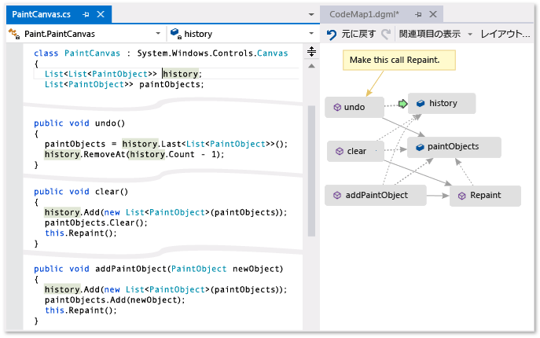  
  
 **緑色の矢印は、エディターでカーソルが表示される場所を示します。**  
  
 コード マップを使用するときに使用できるコマンドやアクションの詳細については、「[コード マップの参照および再配置](../modeling/browse-and-rearrange-code-maps.md)」を参照してください。  
  
## 問題を把握する  
 作業中の描画プログラムにバグがあるとします。  バグを再現するために、Visual Studio でソリューションを開き、**F5** キーを押してデバッグを開始します。  
  
 直線を描画し、**\[Undo my last stroke\]** \(直前のストロークを元に戻す\) を選択しても、次の直線を描画するまで何も起こりません。  
  
 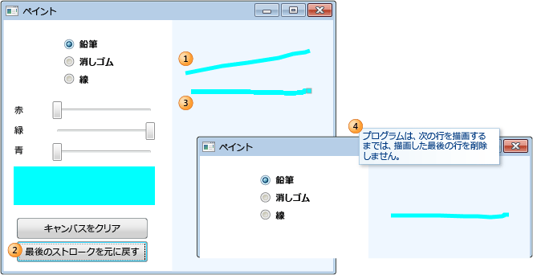  
  
 したがって、`Undo` メソッドを検索して調査を開始します。  `PaintCanvas` クラスでこれが見つかります。  
  
   
  
## コードのマップを開始する  
 ここで、`undo` メソッドとその関係のマップを開始します。  コード エディターで、`undo` メソッドとその参照するフィールドを、新しいコード マップに追加します。  新しいマップを作成するときは、コードにインデックスを付けるのに時間がかかる場合があります。  インデックスを付けることで、後の操作をより速く実行できるようになります。  
  
   
  
> [!TIP]
>  緑色の強調表示は、マップに追加された最後の項目を示します。  緑色の矢印は、コード内でのカーソルの位置を示します。  項目間の矢印は、さまざまな関係を表します。  マップの項目に関する詳細情報は、項目の上にマウスを移動してツールヒントを調べることで確認できます。  
  
 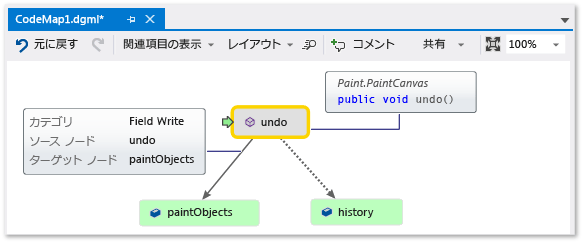  
  
## マップからコードを移動して調査する  
 各フィールドのコード定義を確認するには、マップのフィールドをダブルクリックするか、フィールドを選択して **F12** キーを押します。  緑色の矢印がマップの項目間を移動します。  コード エディターのカーソルも自動的に移動します。  
  
 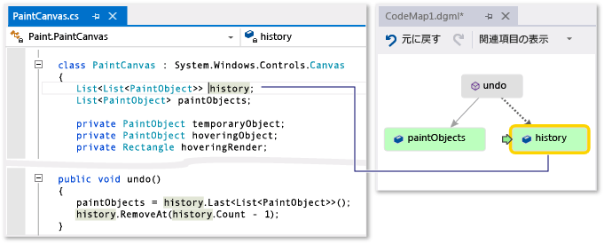  
  
 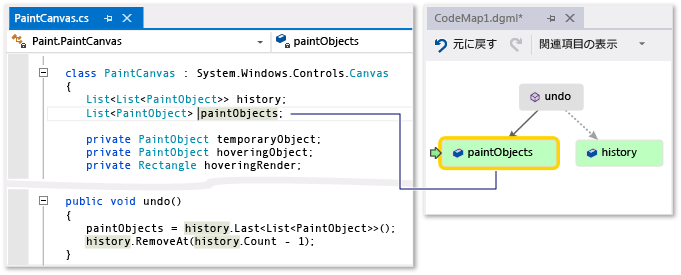  
  
> [!TIP]
>  また、コード エディターでカーソルを動かすと、マップの緑色の矢印を移動できます。  
  
## コード間のリレーションシップを把握する  
 ここで、他のどのコードが `history` フィールドおよび `paintObjects` フィールドとやり取りしているのかを把握する必要があります。  これらのフィールドを参照するすべてのメソッドをマップに追加できます。  この操作は、マップまたはコード エディターから行うことができます。  
  
 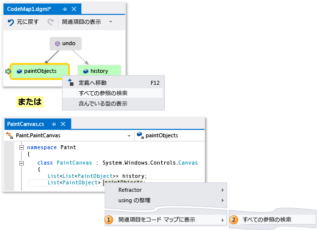  
  
   
  
> [!NOTE]
>  Windows Phone や Windows ストアなどの複数のアプリで共有されるプロジェクトから項目を追加すると、それらの項目は常に、現在アクティブなアプリ プロジェクトと共にマップに表示されます。  そのため、コンテキストを別のアプリ プロジェクトに変更すると、マップ上のコンテキストも、共有プロジェクトから新たに追加した項目に変更されます。  マップ上の項目に実行する操作は、同じコンテキストを共有する項目にのみ適用されます。  
  
 関係のフローを再配置してマップを読みやすくするために、レイアウトを変更します。  項目をドラッグすることにより、マップ上で項目を移動することもできます。  
  
 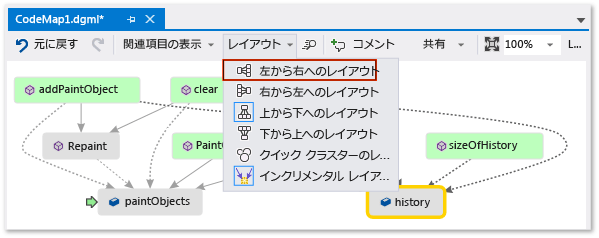  
  
> [!TIP]
>  既定では、**\[インクリメンタル レイアウト\]** が有効になっています。  この設定では、新しい項目の追加時にマップの再配置は最小限に抑えられます。  新しい項目を追加するたびにマップ全体を再配置するには、**\[インクリメンタル レイアウト\]** を無効にします。  
  
 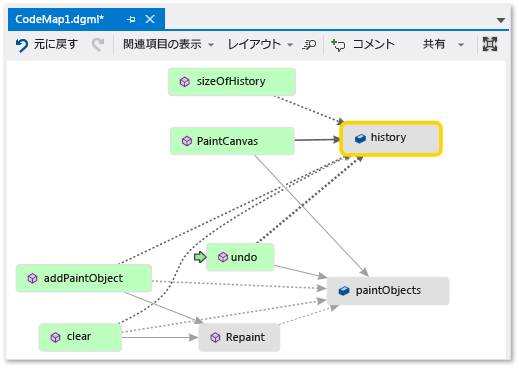  
  
 これらのメソッドを調べます。  マップで、**\[PaintCanvas\]** メソッドをダブルクリックするか、このメソッドを選択して **F12** キーを押します。  このメソッドにより、`history` と `paintObjects` が空のリストとして作成されることがわかります。  
  
 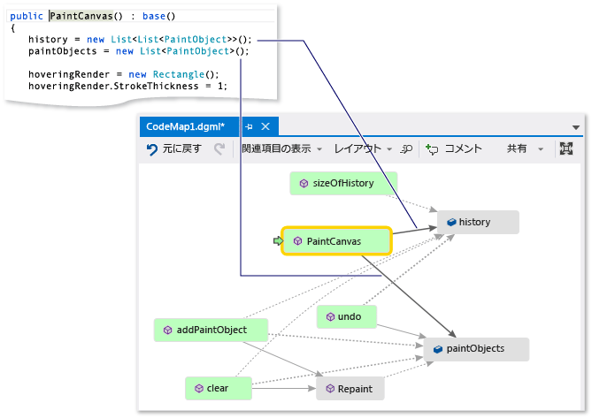  
  
 ここで、同じ手順を繰り返して、`clear` メソッドの定義を調べます。  `clear` が `paintObjects` と `history`を使用して一部のタスクを実行することがわかります。  次に、このメソッドは `Repaint` メソッドを呼び出します。  
  
 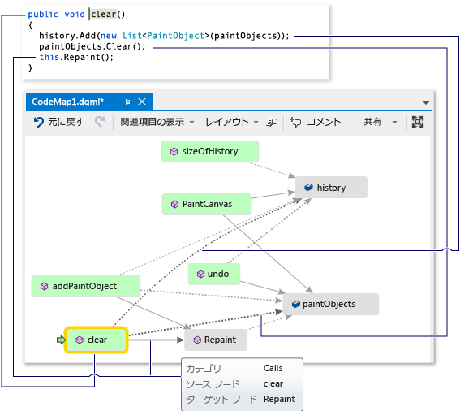  
  
 ここで、`addPaintObject` メソッドの定義を調べます。  このメソッドも、`history` と `paintObjects` を使用して一部のタスクを実行します。  また、このメソッドは `Repaint` を呼び出します。  
  
 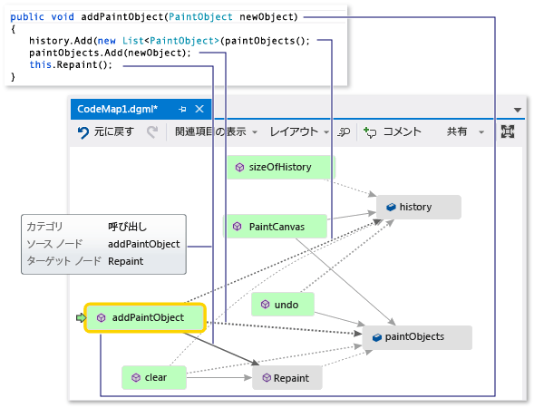  
  
## マップを調べて問題を見つける  
 `history` と `paintObjects` を変更するすべてのメソッドが `Repaint` を呼び出すと考えられます。  ただし、`undo` メソッドは `Repaint` を呼び出しませんが、`undo` メソッドは同じフィールドを変更します。  したがって、`Repaint` で `undo` を呼び出すことにより、この問題を解決できると考えられます。  
  
 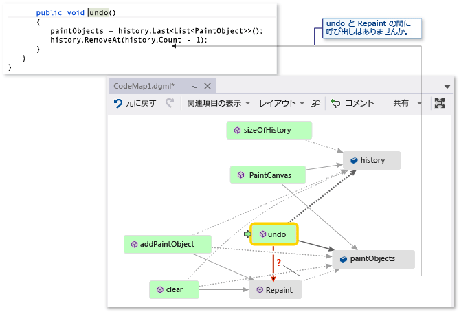  
  
 この失われている呼び出しを示すマップがない場合、特にコードが複雑になると、この問題を見つけることがより困難になる可能性があります。  
  
## 探索と次のステップを共有する  
 自分または他のユーザーがこのバグを修正する前に、問題と問題の解決方法に関するメモをマップに記載できます。  
  
 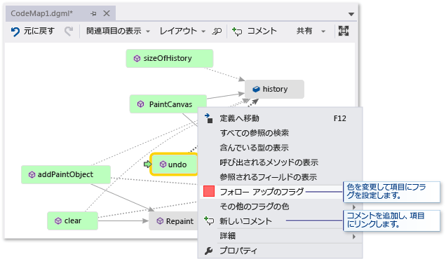  
  
 たとえば、マップにコメントを追加し、色を使用して項目にフラグを設定できます。  
  
 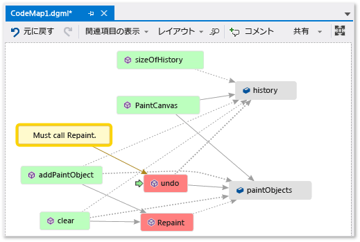  
  
 Microsoft Outlook をインストール済みの場合は、他のユーザーに電子メールでマップを送信できます。  マップをイメージまたはその他の形式でエクスポートすることもできます。  
  
 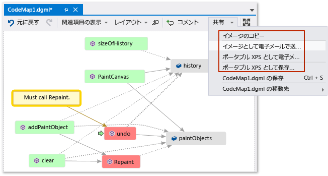  
  
## 問題を修正して操作内容を表示する  
 このバグを修正するには、`Repaint`に `undo` の呼び出しを追加します。  
  
   
  
 修正を確認するには、デバッグ セッションを再開して、バグの再現を試みます。  ここで、**\[Undo my last stroke\]** \(直前のストロークを元に戻す\) を選択すると、期待どおりに機能し、正しい修正を行ったことが確認されます。  
  
 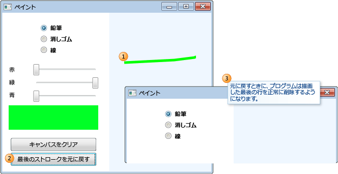  
  
 マップを更新すると、実行した修正を示すことができます。  
  
 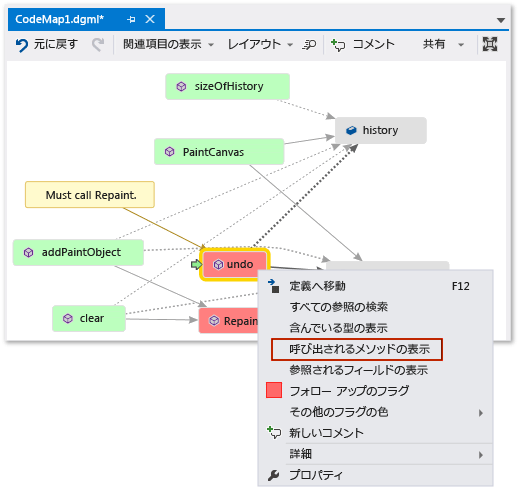  
  
 マップには、**undo** と **Repaint** の間のリンクが示されます。  
  
 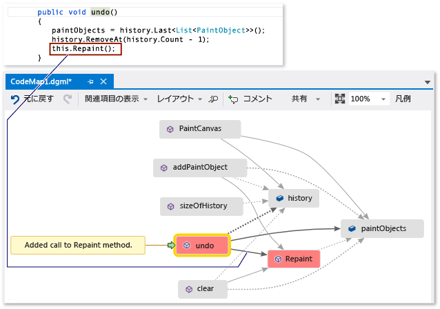  
  
> [!NOTE]
>  マップを更新するときに、マップの作成に使用したコード インデックスが更新されたことを示すメッセージが表示される場合があります。  これは、他のだれかがコードを変更し、マップが現在のコードに一致しなくなっていることを意味します。  このことでマップの更新が停止されることはありませんが、コードとの一致を確認するためにマップを作成し直すことが必要になる場合があります。  
  
 これで調査が終了しました。  コードのマップにより、問題を正常に検出して修正しました。  また、コード内を移動することや確認したことの記憶に役立ち、問題を解決するための手順を示すマップも備わりました。  
  
## 参照  
 [デバッグを行うときの呼び出し履歴に対するメソッドのマップ](../debugger/map-methods-on-the-call-stack-while-debugging-in-visual-studio.md)   
 [コードのビジュアル化](../modeling/visualize-code.md)